# 使用 typora 画流程图

## 什么是 Mermaid

Mermaid 是一种基于 Javascript 的绘图工具，使用类似于 Markdown 的语法，使用户可以方便快捷地通过代码创建图表。[Mermaid项目地址](https://github.com/mermaid-js/mermaid)

## 怎么使用 Mermaid

1. 使用 Mermaid 渲染器
2. 使用集成了 Mermaid 渲染器的编辑器，如 typora。使用时，需要将代码块的语言选择为Mermaid。

## Mermaid 能够画哪些图

- 饼状图：使用 `pie` 关键字，具体用法后文将详细介绍
- 流程图：使用 `graph` 关键字，具体用法后文将详细介绍
- 序列图：使用 `sequenceDiagram` 关键字
- 甘特图：使用 `gantt` 关键字
- 类图：使用 `classDiagram `关键字
- 状态图：使用 `stateDiagram` 关键字
- 用户旅程图：使用 `journey` 关键字

## 饼状图

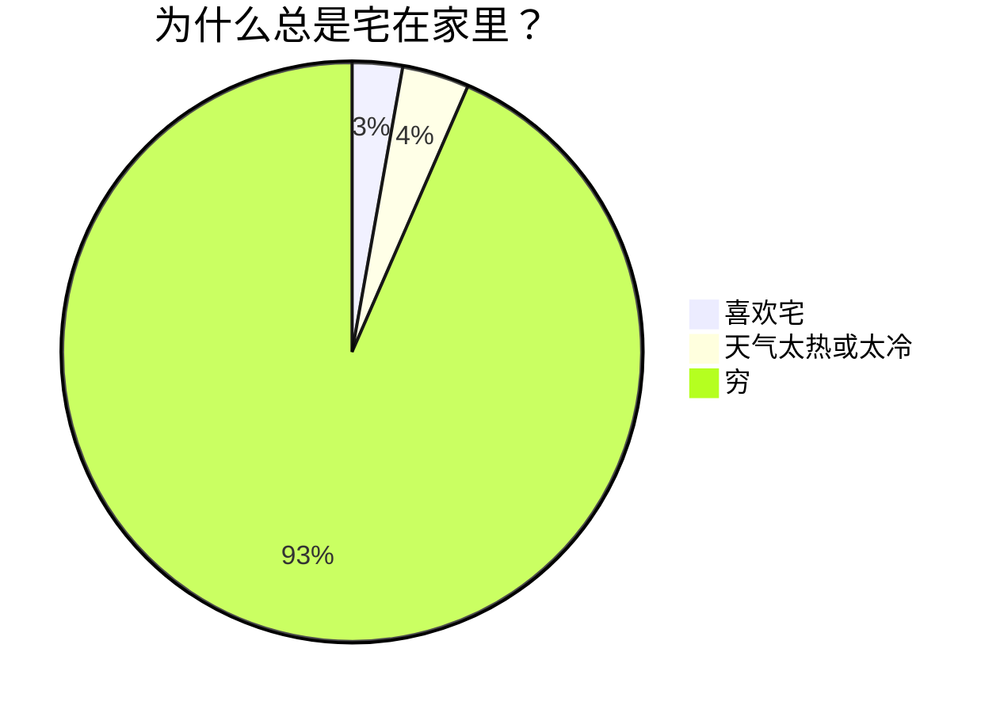

## 流程图

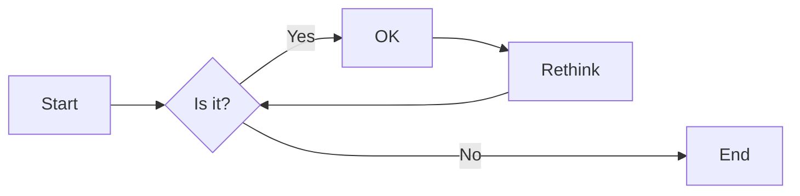

### 流程图方向

用于开头，声明流程图的方向：

- `graph` 或 `graph TB` 或`graph TD`：从上往下
- `graph BT`：从下往上
- `graph LR`：从左往右
- `graph RL`：从右往左

### 流程图图形

### 流程图连线样式

#### 实线箭头

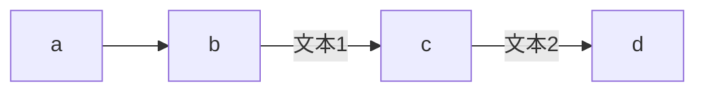

#### 粗实线箭头

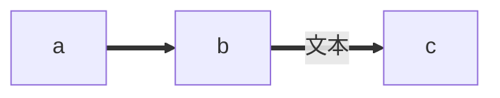

#### 虚线箭头

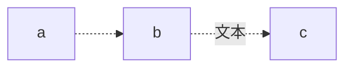

#### 无箭头线

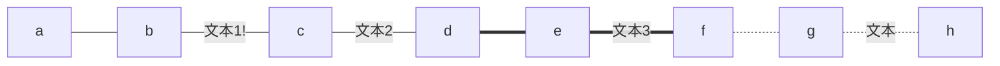

#### 其他箭头

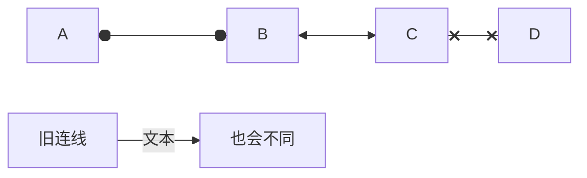

### 连线方式

直连

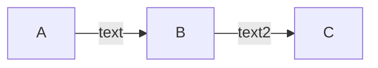

多重链

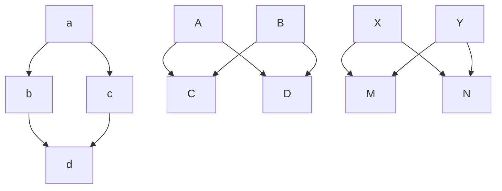

## 其他

子图：需要将 `graph`关键字改为 `flowchart`，在代码段的开始加入 `subgraph`，尾部加入 `end`

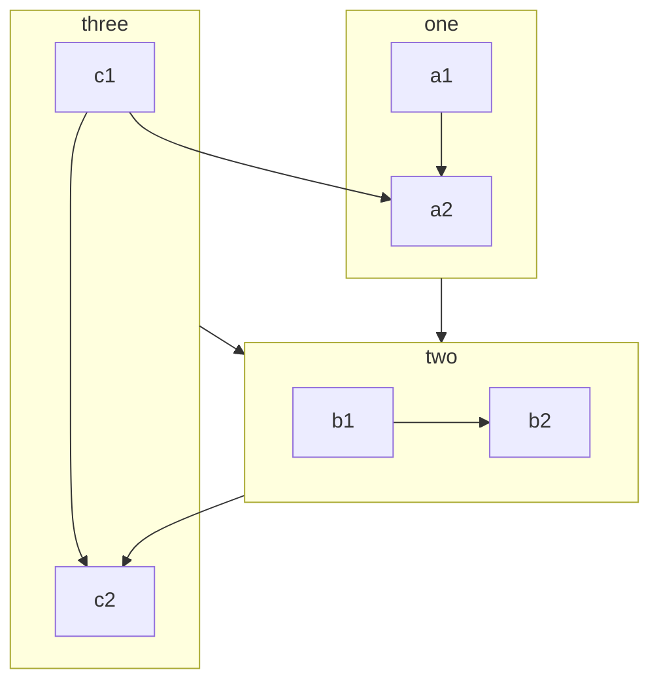

注释：在行首加入`%%`即可。

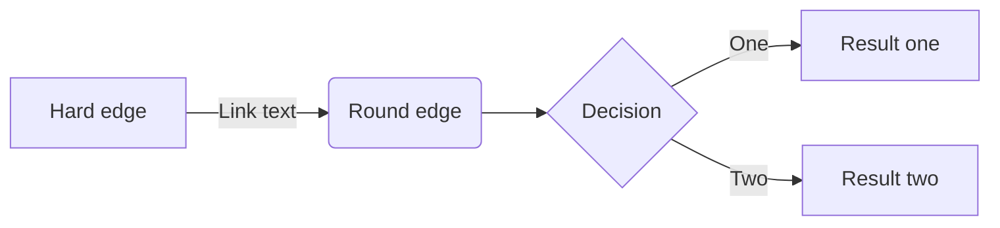

