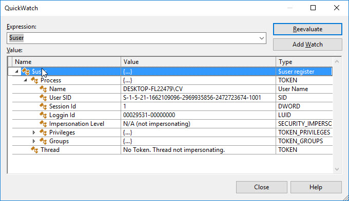

Evaluate an expression with or without side effects

Sometimes, during debugging, we want to evaluate an expression that can change application state when executed. For example, a property’s getter that modifies a static variable. This can corrupt our debugging session. There’s a way however, to evaluate expressions without side effects.

Consider the following class:

```csharp
class MyClass
{
    public int number = 0;
 
    public int Foo(int a)
    {
        number++;
        return a + 1;
    }
}
```

If I evaluate **Foo** in the Immediate Window, **number** will increase and my application state will be changed:


We can see here that `m.number` increased from 1 to 2.

**By adding `, nse` (No Side Effects) to the expression will evaluate without changing the application state.**


Now we can see that the evaluation returned correctly, and `m.number` stayed the same.

Adding `, nse` runs the code in a sandbox environment of sorts and application state will not be changed. Running with *No Side Effects* doesn’t always work. For example, when the evaluated method calls Native code.

## 2. Breaking on Exceptions with or without source code

.NET has 2 types of Exceptions: **Handled Exceptions** that you swallow in a **catch** clause and **Unhandled Exceptions**. Unhandled Exceptions can crash your program or Thread.

While debugging, Visual Studio will always break on Unhandled Exceptions. As for Handled Exceptions, you can control whether to break on them in the Exceptions Settings Tool Window. In Menu, go to Debug -> Windows -> Exception Settings:


Toggling CLR exceptions controls whether to break on managed exceptions. You can even select specific exception types to ignore.


This is a very useful debugging feature to catch problems in the application. Whenever something doesn’t work for an unexplained reason, there’s a good chance an exception was thrown.

### Enable and Disable Just My Code

By default, VS will break only on Exceptions thrown in your code. However, there are often problems that happen due to exceptions in one of your references. You might have used the API wrong or there’s a bug in some NuGet package you are using.

To break on exceptions from all code, go to **Tools -> Options** and in **Debugging**, uncheck “Enable Just My Code”.


Now you’ll break on all exceptions, including in the methods of your references. You probably won’t see the code since you don’t have the symbols of that library, but you will see the Call Stack and Exception type.

There’s a way to debug inside the referenced library with a neat free tool called **DnSpy**.

You’ll probably want to keep **Enable Just My Code** enabled most of the time. Otherwise, Visual Studio will keep loading symbols (which is time-consuming) and you might start breaking on an endless stream of exceptions that you don’t care about.

## 3. Debug your references with DnSpy

Sometimes you’ll encounter problems in your references that you’ll need to investigate. With [DnSpy](https://github.com/0xd4d/dnSpy) you can debug any assembly, even without its source code.

DnSpy will decompile and reveal source code of any .dll or .exe file. You can then place breakpoints in the decompiled source code and debug. Here’s me debugging **Newtonsoft.Json**‘s “SerializeObject” method:


Using DnSpy is pretty straightforward. First, copy the path of the referenced library you want to debug and open it in DnSpy. You will be able to see the decompiled source code. Then, search the method you want to debug and place a breakpoint. Finally, run your program from DnSpy with F5 (you can also Attach to Process). As the breakpoint hits, DnSpy will break and you can debug just like in VS with Step Over and Step Into (F10 and F11).

Another feature is the ability to **edit** the assembly. So you’ll be able to modify your referenced class library.

###### Much like with DnSpy, you can decompile and debug references directly in Visual Studio. There are two convenient ways to do this. One is to [use dotPeek as a symbol server](https://www.jetbrains.com/help/decompiler/Using_product_as_a_Symbol_Server.html) (dotPeek is a free tool by JetBrains). The second way, and I think the most convenient one, is to [use ReSharper](https://cezarypiatek.github.io/post/debug-without-sources-part-one/).

## 4. Edit and Continue

[Edit and Continue](https://docs.microsoft.com/en-gb/visualstudio/debugger/edit-and-continue) has been around for awhile, and if you know it just skip ahead. Since it’s so useful, I wasn’t able to resist including it.

Edit and Continue allows you to make changes to the code while in break mode. This means that if you found a bug, you don’t have to stop debugging and run the program again. You can change the code while in break mode and VS knows how to deal with that.

There are a lot of [limitations](https://docs.microsoft.com/en-gb/visualstudio/debugger/supported-code-changes-csharp) to this. For example, you can’t change inside a lambda function.

### Edit and Continue in XAML

A very useful and relatively recent feature is [XAML Edit and Continue](https://blogs.msdn.microsoft.com/visualstudio/2016/04/06/ui-development-made-easier-with-xaml-edit-continue/). Since VS 2015, Update 2, you can edit XAML code while debugging and see the changes immediately. There’s even no need to be in break mode to edit the XAML.

There are some issues and bugs with this from my experience. Sometimes it doesn’t work, or doesn’t work from first try. Specifically, I had issued with **Styles** and **Triggers**. Nevertheless, a very useful feature.

## 5. Use OzCode

[OzCode](https://www.oz-code.com/) is a unique VS extensions to help debugging. There are a lot of excellent [features](https://oz-code.com/features/) that will help debugging. For example, [Head-Up Display](https://oz-code.com/features/#headUpDisplay);


And [Reveal](https://oz-code.com/features/#reveal):


###### **Disclaimer**: I am currently an OzCode employee. This is however, my personal blog and this post is not a promotion, just a professional recommendation.

## 6. Special $ variables

VS debugger exposes some special variables, all starting with the $ sign.

### $exception

In a catch clause, **$exception** will give the exception instance value. You can see it in **Locals** tool window. You can also evaluate it in **Immediate Window** or any **Watch** tool window.


**$ReturnValue**

You can see a method’s returns value with the special **$ReturnValue** variable. You’ll need to place a breakpoint in the method’s last line, and then press F10 once more. Afterwards, evaluate $ReturnValue in the immediate window or the Watch window. The same value will appear in the **Autos** and **Local** windows.

### Make Object ID – $1, $2, …

A useful feature in VS is to give ID number to a specific object instance. This is available from the hover DataTip:


This will give this instance the ID **$1**. Typing $1 in the immediate window or watch window will evaluate this instance (works globally, in any breakpoint scope). Any variable referencing $1 will show the $1 in the DataTip:


### $user

Holds information on the user that’s running the current process



## 7. Make sense of a complicated scenario with dotTrace Performance Profiler

Sometimes, we have to work on new, unfamiliar projects. Suppose you have to fix a bug in such a new project, where you can reproduce the bug, but have no idea what happened in the code. How do you even know where to place a breakpoint and start debugging?

There are a lot of ways to go about it. You can try to find UI event handlers, guess class names according to functionality or ask someone for help. I’d like to suggest another alternative: Use a performance profiler!

[dotTrace](https://www.jetbrains.com/profiler/) is able to attach to a process and “record” a runtime section. The recording is called a **Snapshot**.

Suppose I record the 10 seconds where my bug reproduces. Now, dotTrace will show a list of all the methods called during the recording.


There’s a bunch of useful information and [features](https://www.jetbrains.com/profiler/features/), much for performance profiling. In particular, you can see how much time was spent on each method. You can also view which methods were called by a specific method and the other way round – which method called the specific method.

So dotTrace is useful not just to solve performance issues. Whenever I’m working on unfamiliar territory, dotTrace will give me a picture of what happens in the code!