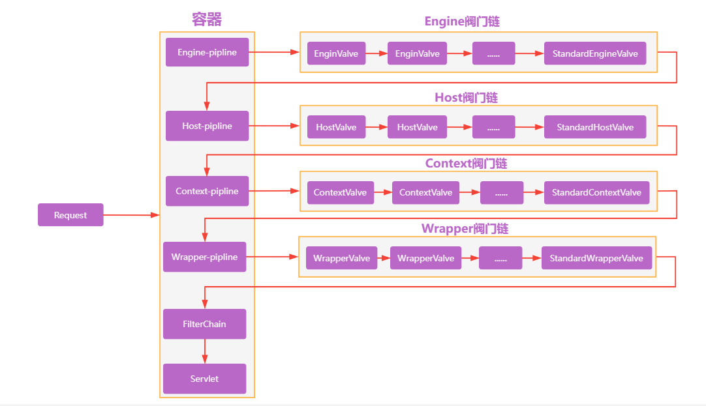

# Tomcat 是什么

Apache Tomcat 是 Java Servlet、JavaServer Pages(JSP)、Java 表达式语言和 Java 的 WebSocket 技术的一个开源实现 ,通常我们将 Tomcat 称为 Web 容器或者 Servlet 容器。

# JavaEE协议

servlet 协议是 JavaEE 协议的一部分。JavaEE 协议即进行 JavaWeb 开发的一套API，除了包含 Servlet 协议外，还包含 JSP 协议，JSTL 协议，JPA 协议等。目前使用较多的版本是 JavaEE5.0.

JavaEE5.0 包含的是 Servlet2.5 协议。JavaEE6.0 包含的是 Servlet3.0 协议。而 Servlet2.5 与 3.0 版本很大的区别就是，Servlet3.0 支持对 Servlet.Filter, Listener 类的注解式开发。

Apache 的 Tomcat,只是 JavaEE 规范中的 Servlet/JSP 规范的实现者，所以其实一个轻量级服务器，它是开源免费的。Tomcat也成为 Web 容器，或 Servlet 容器，但不能称为 JavaEE 容器。

## Tomcat 请求处理流程

