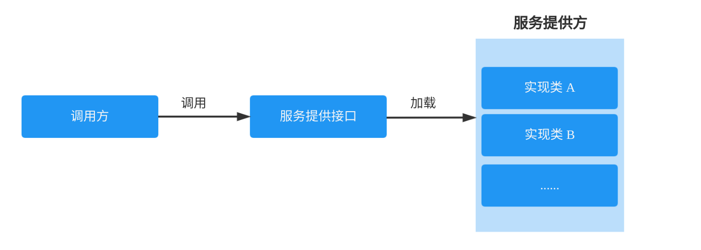

# Tomcat 是什么

Apache Tomcat 是 Java Servlet、JavaServer Pages(JSP)、Java 表达式语言和 Java 的 WebSocket 技术的一个开源实现 ,通常我们将 Tomcat 称为 Web 容器或者 Servlet 容器。

# JavaEE协议

servlet 协议是 JavaEE 协议的一部分。JavaEE 协议即进行 JavaWeb 开发的一套API，除了包含 Servlet 协议外，还包含 JSP 协议，JSTL 协议，JPA 协议等。目前使用较多的版本是 JavaEE5.0.

JavaEE5.0 包含的是 Servlet2.5 协议。JavaEE6.0 包含的是 Servlet3.0 协议。而 Servlet2.5 与 3.0 版本很大的区别就是，Servlet3.0 支持对 Servlet.Filter, Listener 类的注解式开发。

Apache 的 Tomcat,只是 JavaEE 规范中的 Servlet/JSP 规范的实现者，所以其实一个轻量级服务器，它是开源免费的。Tomcat也成为 Web 容器，或 Servlet 容器，但不能称为 JavaEE 容器。

## Tomcat 请求处理流程


## 长连接处理

Tomcat 默认的线程池是核心线程数是10，最大线程数为 100，同时，如果有 75% 的 HTTP 请求都是是长连接(BIO 模型下一个线程对应一个 Socket)，那么超过这个比例的 HTTP 请求都会变成短连接，即使发送的 HTTP 的请求头中希望保持长连接，同样还是会当作短连接来处理

## 浏览器默认的并发数

HTTP 客户端一般对同一个服务器的并发连接个数都是有限制的。实际上，浏览器确实使用并行连接，但它们将并行连接的总数限制为少量,服务器可以自由地关闭来自特定客户端的过多连接。

大部分的浏览器默认的最大可同时向服务器发起请求个数为 4 或者是 6，取决于浏览器的版本，高版本的通常是 6 个并发请求

## Http 分块传输

如果需要使用分块传输,需要设置 Transfer-Encoding: chunked 请求头，对于请求体中的数据格式为：

```text
<length>\r\n # length 表示当前字块的数据长度
<content>\r\n # 当前子块的内容
....
0\r\m # 表示结束分块传输
\r\n
```

使用示例：

```text
2\r\n
hi
0\r\n
\r\n
```

上述示例表示请求中请求体的内容是：hi

## SPI 机制

SPI(Service Provider Interface)， 是 JDK 内置的一种服务提供发现机制，可以用来启用框架扩展和替换组件，主要是被框架的开发人员使用。Java 中 SPI 机制的主要思想是将装配的控制权转移到程序之外，在模块化设计中非常重要，其核心思想就是**解耦**。



### SPI 机制实现原理

该机制的实现原理就是约定大于配置。当服务的提供者提供了一种接口的实现之后，需要在 classpath 下的 `/META-INF/services` 目录下创建一个以接口的权限定类名为文件名的文件，该文件里面存放的内容就是接口对应的实现类，每个实现类占一行。当调用方需要某个服务时，通过 JDK 提供的 ServiceLoader 类的 load 方法进行加载即可, load 方法会搜索 classpath 以及所有 jar 包中 `META-INF/services` 目录下传递给 load 方法的参数对应的文件。在找到对应的实现类之后并不会立即实例化，而是在调用 iterator 的 next 方法时，才会进行实例化。

### SPI 机制的简单示例

先定义好接口liu cheng

```java
public interface Search{
    List<String> searchDoc(String keyword);
}
```

定义两个实现类

```java
public class FileSearch implements Search{
    @override
    public List<String> searchDoc(String keyword) {
        System.out.println("文件搜索"+keyword);
        return null;
    }
}
```

```java
public class DatabaseSearch implements Search{
    @overrride
    public List<String> searchDoc(String keyword) {
        System.out.println("数据库搜索"+keyword);
        return null;
    }
}
```

接下来就需要在 `resources` 文件夹下创建 `/META-INF/services/` 目录，然后在 `services` 目录下创建名为 `com.autmaple.Search` 文件，文件的内容如下:

```text
com.autmaple.FileSearch
com.autmaple.DatabaseSearch
```

测试方法

```java
public class Application{
    public static void main(String[] args) {
        ServiceLoader<Search> searchs = ServiceLoader.load(Search.class);
        Iterator<Search> iterator = searchs.iterator();
        while(iterator.hasNext()) {
            Search search = iterator.next();
            search.searchDoc("Hello World");
        }
    }
}
```

## SpringMVC 整合 Tomcat

之前在 Web 容器中要整合其他的模块都是通过 web.xml 配置文件，但是现在是使用注解驱动开发，并且基本上不会使用 web.xml 配置文件来进行开发了，那么在没有 web.xml 文件的情况下是如何整合的呢？答案就是 Servlet 3.0 带来的一个特别重要的一个类: `ServletContainerInitializer`。该类的作用就是：

> Servlet 容器在启动时，会通过 SPI 机制，扫描当前 classpath 以及每个 jar 中 `META-INf/services` 目录下的 `javax.servlet.ServletContainerInitializer` 文件，获取到里面的实现类之后，实例化对应的类并调用实现类的 onStartup 方法

SpringMVC 对于 `ServletContainerInitializer` 的实现类是：`SpringServletContainerInitializer`：

```java
@HandlesTypes(WebApplicationInitializer.class)
public class SpringServletContainerInitializer implements ServletContainerInitializer {
    /**liu cheng
    * ServletContext 表示一个 Web 应用
    */
	@Override
	public void onStartup(@Nullable Set<Class<?>> webAppInitializerClasses, ServletContext servletContext)
			throws ServletException {

		List<WebApplicationInitializer> initializers = Collections.emptyList();

		if (webAppInitializerClasses != null) {
			initializers = new ArrayList<>(webAppInitializerClasses.size());
			for (Class<?> waiClass : webAppInitializerClasses) {
				// Be defensive: Some servlet containers provide us with invalid classes,
				// no matter what @HandlesTypes says...
				if (!waiClass.isInterface() && !Modifier.isAbstract(waiClass.getModifiers()) &&
						WebApplicationInitializer.class.isAssignableFrom(waiClass)) {
					try {liu cheng
						initializers.add((WebApplicationInitializer)
								ReflectionUtils.accessibleConstructor(waiClass).newInstance());
					}
					catch (Throwable ex) {
						throw new ServletException("Failed to instantiate WebApplicationInitializer class", ex);
					}
				}
			}
		}

		if (initializers.isEmpty()) {
			servletContext.log("No Spring WebApplicationInitializer types detected on classpath");
			return;
		}

		servletContext.log(initializers.size() + " Spring WebApplicationInitializers detected on classpath");
		AnnotationAwareOrderComparator.sort(initializers);
		for (WebApplicationInitializer initializer : initializers) {
			initializer.onStartup(servletContext);
		}
	}
}
```

- `@HandlesTypes(WebApplicationInitializer.class)`: 表示 onStartup 方法第一个参数的类型，Tomcat 在调用该方法时，会将WebApplicationInitializer 的实现类的 class 给传递过来

- WebApplicationInitializer: 这个接口的作用就是用于替代基于 web.xml 配置 Servlet 的开发方式, 在该接口中可以选择注册 Servlet 到 Servlet 容器中

  ```java
  public class MyWebAppInitializer implements WebApplicationInitializer {
   
       @Override
       public void onStartup(ServletContext container) {
         // Create the 'root' Spring application context
         AnnotationConfigWebApplicationContext rootContext =
           new AnnotationConfigWebApplicationContext();
         rootContext.register(AppConfig.class);
   
         // Manage the lifecycle of the root application context
         container.addListener(new ContextLoaderListener(rootContext));
   
         // Create the dispatcher servlet's Spring application context
         AnnotationConfigWebApplicationContext dispatcherContext =
           new AnnotationConfigWebApplicationContext();
         dispatcherContext.register(DispatcherConfig.class);
   
         // Register and map the dispatcher servlet
         ServletRegistration.Dynamic dispatcher =
           container.addServlet("dispatcher", new DispatcherServlet(dispatcherContext));
         dispatcher.setLoadOnStartup(1);
         dispatcher.addMapping("/");
       }
    }
  ```

## 启动流程

1. 由 tomcat 在启动时根据 SPI 机制的 ServiceLoader#load 方法拿到所有 JavaEE 接口（ServletContainerInitializer）注册的实现类。
2. Spring 对该接口的实现类是 SpringServletContainerInitializer，其类上标注了`@HandlesTypes({WebApplicationInitializer.class})`。
3. tomcat 从 classpath 下找到所有的 WebApplicationInitializer 实现类，将所有的实现类传入SpringServletContainerInitializer#onStartup 方法的第一个参数，调用方法。
4. 回到 SpringServletContainerInitializer#onStartup 方法中的逻辑，将所有的 WebApplicationInitializer 实现类的 onStartup 方法一一调用。
5. WebApplicationInitializer 的实现类之一是 AbstractDispatcherServletInitializer，会创建 spring 容器、配置web.xml、注册过滤器。