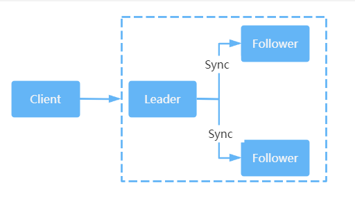

# 容错模式

- Failover Cluster：失败自动切换，当出现失败，自动切换其他服务器。通常用于读操作，但重试会带来更长延迟。可通过 retries="2" 来设置重试次数(不含第一次)。

- Failfast Cluster：快速失败，只发起一次调用，失败立即报错。通常用于非幂等性的写操作，比如新增记录。

- Failsafe Cluster：失败安全，出现异常时，直接忽略。通常用于写入审计日志等操作。

- Failback Cluster：失败自动回复，后台记录失败请求，定时重发。通常用于消息通知操作。

- Forking Cluster：并行调用多个服务器，只要一个成功即返回。通常用于实时性要求较高的读操作，但需要浪费更多服务资源。可通过`forks="2"`来设置最大并行数。

- Broadcast Cluster：广播调用所有提供者，逐个调用，任意一台报错则报错。通常用于通知所有提供者更新缓存或日志等本地资源信息。

## 配置方式

只需要在指定 @DubboSerice 注解上添加一个 cluster 参数即可

```java
@DubboService(cluster = "failfast")
public class HelloServiceImpl implements IHelloService {
    @Value("${dubbo.application.name}")
    private String serviceName;

    @Override
    public String sayHello(String username) {
        return String.format("[%s]: Hello, %s", serviceName, username);
    }
}
```

在实际的应用中查询语句容错策略建议使用默认的 Failover Cluster；而增删改操作建议使用 Failfast Cluster 或者 Failover Cluster(retries=“0”) 策略，防止出现数据重复添加等其他问题！**建议在设计接口的时候把查询接口方法单独做成一个接口提供查询**

# 负载均衡

负载均衡可以分为硬件负载均衡和软件负载均衡，硬件负载均衡比较常见的就是 F5，软件负载均衡目前比较主流的就是 Nginx.

在 Dubbo 中提供了 4 种负载均衡策略，默认的负载均衡策略是 random。

- Random LoadBalance，随机算法。可以针对性能较好的服务器设置较大的权重值，权重值越大，随机的概率也会越大。
- RoundRobin LoadBalance, 轮询。按照公约后的权重设置轮询比例
- LeastActive LoadBalance,最少活跃调用书。处理较慢的节点收到的请求相对于其他的节点会少一些
- ConsistentHash LoadBalance, 一致性 Hash。相同参数的请求总是发送到同一个服务服务提供者

## 配置方式

在 @DobboService 注解上加上 loadBalance 参数

```java
@DubboService(cluster = "failfast", loadbalance = "roundrobin")
public class HelloServiceImpl implements IHelloService {
    @Value("${dubbo.application.name}")
    private String serviceName;

    @Override
    public String sayHello(String username) {
        return String.format("[%s]: Hello, %s", serviceName, username);
    }
}
```

# 服务降级

服务降级是一种系统保护策略，当服务器访问压力较大时，可以根据当前业务情况对不重要的服务进行降级，以保证核心服务的正常运行。所谓的降级，就是把一些非必要的功能在流量较大的时间段暂时关闭，比如在双11大促时，淘宝会把查看历史订单、商品评论等功能关闭，从而释放更多的资源来保障大部分用户能够正常完成交易。

降级有多个层面的分类：

- 按照是否自动化可分为自动降级和人工降级。
- 按照功能可分为读服务降级和写服务降级。

人工降级一般具有一定的前置性，比如在电商大促之前，暂时关闭某些非核心服务，如评价、推荐等。

自动降级更多的来自于系统出现某些异常的时候自动触发“兜底的流畅”，比如：

- 故障降级，调用的远程服务“挂了”，网络故障或者RPC服务返回异常。这类情况在业务允许的情况下可以通过设置*兜底数据*响应给客户端。
- 限流降级，不管是什么类型的系统，它所支撑的流量是有限的，为了保护系统不被压垮，在系统中会针对核心业务进行限流。当请求流量达到阈值时，后续的请求会被拦截，这类请求可以进入排队系统，比如12306。也可以直接返回降级页面，比如返回 “活动太火爆，请稍候再来” 页面。

## 配置方式

Dubbo 通过 Mock 配置来实现服务的降级。也就是说当服务提供方出现网络异常无法访问时，客户端不抛出异常，而是通过降级配置返回兜底数据。

mock 参数需要指定为备用服务的全限定类名

```java
@RestController
public class HelloController {
    @DubboReference(mock = "com.autmaple.consumer.controller.MockHelloService")
    private IHelloService helloService;

    @GetMapping("hello/{username}")
    public String sayHello(@PathVariable String username){
        return helloService.sayHello(username);
    }
}
```

 com.autmaple.consumer.controller.MockHelloService

```java
public class MockHelloService implements IHelloService {
    @Override
    public String sayHello(String name) {
        return "Sorry, 系统繁忙";
    }
}
```

# 主机绑定规则

主机绑定表示的是 Dubbo 服务对外发布的 IP 地址，默认情况下 Dubbo 会按照以下顺序来查找并绑定主机 IP 地址：

1. 查找环境变量中 DUBBO_IP_TO_BIND 属性配置的 IP 地址。

2. 查找 dubbo.protocol.host 属性配置的 IP 地址，默认是空，如果没有配置或者 IP 地址不合法，则继续往下查找。

3. 通过 LocalHost.getHostAddress 方法获取本机 IP 地址，如果获取失败，则继续往下查找。

4. 如果配置了注册中心的地址，则使用 Socket 通信连接到注册中心的地址后，使用 for 循环通过 socket.getLocalAddress().getHostAddress() 扫描各个网卡获取网卡 IP 地址。

上述过程中，任意一个步骤检测到合法的 IP 地址，便会将其返回作为对外暴露的服务 IP 地址。需要注意的是，获取的 IP 地址并不是写入注册中心的地址，默认情况下，写入注册中心的 IP 地址优先选择环境变量中 DUBBO_IP_TO_REGISTRY 属性配置的 IP 地址。在这个属性没有配置的情况下，才会选取前面获得的 IP 地址并写入注册中心。

# Nacos

Nacos 致力于解决微服务中的统一配置、服务注册与发现等问题。它提供了一组简单易用的特性集，帮助开发者快速实现动态服务发现、服务配置、服务元数据及流量管理。

## Nacos 的关键特性

### 服务发现和服务健康监测

Nacos 支持基于 DNS 和基于 RPC 的服务发现。服务提供者使用原生 SDK、OpenAPI 或一个独立的 Agent TODO 注册 Service 后，服务消费者可以使用 DNS 或 HTTP&API 查找和发现服务。

Nacos 提供对服务的实时的健康检查，阻止向不健康的主机或服务实例发送请求。Nacos支持传输层(PING或TCP)和应用层（如HTTP、MySQL、用户自定义）的健康检查。对于复杂的云环境和网络拓扑环境中（如VPC、边缘网络等）服务的健康检查，Nacos 提供了 agent 上报和服务端主动检测两种健康检查模式。

Nacos还提供了统一的健康检查仪表盘，帮助用户根据健康状态管理服务的可用性及流量。

### 动态配置服务

业务服务一般都会维护一个本地配置文件，然后把一些常量配置到这个文件中。这种方式在某些场景中会存在问题，比如配置需要变更时要重新部署应用。而动态配置服务可以以中心化、外部化和动态化的方式管理所有环境的应用配置和服务配置，可以使配置管理变得更加高效和敏捷。配置中心化管理让实现无状态服务变得更简单，让服务按需弹性扩展变得更容易。另外，Nacos 提供了一个简洁易用的 UI(控制台样例Demo)帮助用户管理所有服务和应用的配置。Nacos 还提供了包括配置版本跟踪、金丝雀发布、一键回滚配置及客户端配置更新状态跟踪在内的一系列开箱即用的配置管理特性，帮助用户更安全地在生产环境中管理配置变更，降低配置变更带来的风险。

### 动态DNS服务

动态 DNS 服务支持权重路由，让开发者更容易地实现中间层负载均衡、更灵活的路由策略、流量控制，以及数据中心内网的简单 DNS 解析服务。服务及其元数据管理。

Nacos 可以使开发者从微服务平台建设的视角管理数据中心的所有服务及元数据，包括管理服务的描述、生命周期、服务的静态依赖分析、服务的健康状态、服务的流量管理、路由及安全策略、服务的 SLA 及最重要的 metrics 统计数据。

## 高可用性

Nacos 提供了类似于 ZooKeeper 的集群架构，包含一个 Leader 节点和多个 Follower 节点。和 ZooKeeper 不同的是，它的数据一致性算法采用的是 Raft,同样采用了该算法的中间件有 Redis Sentinel 的 Leader 选举、Etcd等。


