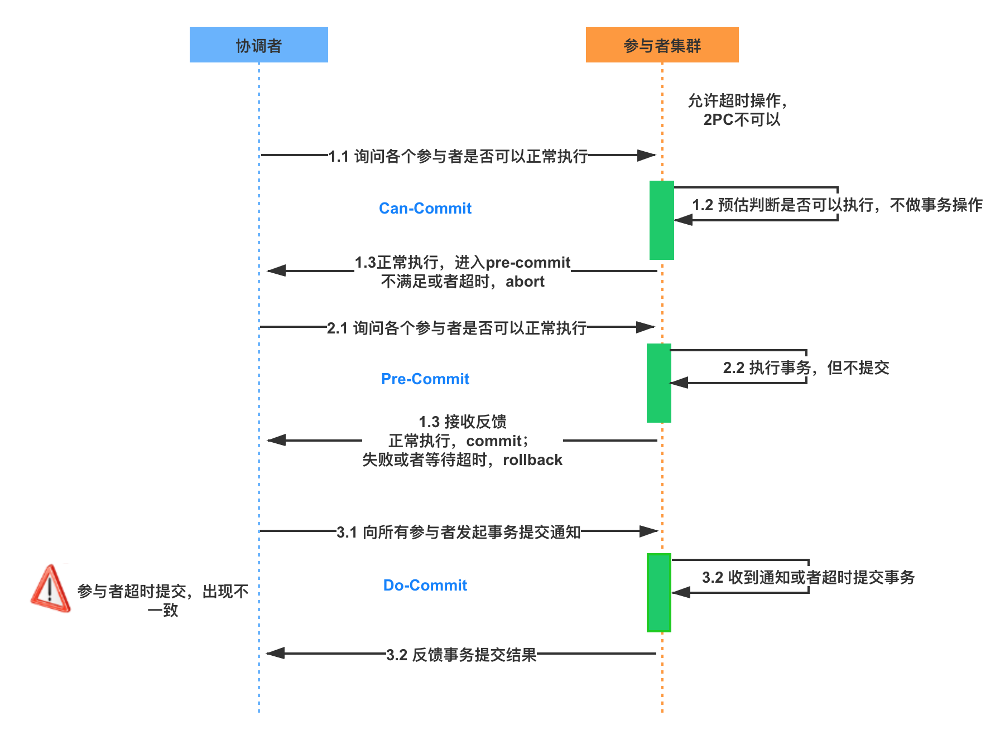

# SpringCloud 常用的注解

| 注解                   | 描述                                                         |
| ---------------------- | ------------------------------------------------------------ |
| @EnableDiscoveryClient | 标注在 Spring 启动类上,表明将该应用注册到注册中心上          |
| @EnableFeignClients    | 开启 OpenFeign 来调用远程服务，该注解会扫描该注解所修饰的类所在的包中被 @FeignClient 注解修饰的接口，并生成对应接口的实现类注入到 Spring 容器中 |
| @FeignClien            | 该注解的 value 参数用于指定被调用的服务在注册中心的名字，表明该接口的实现类要调用对应的服务 |
| @SentinelResource      | 该注解用来标识资源是否被限流、降级                           |
| @SentinelRestTemplate  | 该注解用于放置在 RestTemplate 上，从而达到熔断，服务降级的效果的效果 |
| @RefreshScope          | 该注解用于刷新配置                                           |

# 注册中心 Nacos

## Nacos VS Spring Cloud 

Nacos = Spring Cloud Eureka + Spring Cloud Config

Nacos 可以与 Spring, Spring Boot, Spring Cloud 集成，并能代替 Spring Cloud Eureka, Spring Cloud Config。

- 通过 Nacos Server 和 spring-cloud-starter-alibaba-nacos-config 实现配置的动态变更。

- 通过 Nacos Server 和 spring-cloud-starter-alibaba-nacos-discovery 实现服务的注册与发现。

## Nacos 的使用

在 Nacos 中，不论是服务提供者还是服务消费者，都需要注册到 Nacos 中，如果服务消费者不注册到 Nacos 上，那么它将无法调用服务提供者提供的服务

微服务之间通过 HTTP 来进行通信，因此还需要 Web 模块

### 服务提供者

```xml
<dependency>
    <groupId>com.alibaba.cloud</groupId>
    <artifactId>spring-cloud-starter-alibaba-nacos-discovery</artifactId>
</dependency>
<dependency>
    <groupId>org.springframework.boot</groupId>
    <artifactId>spring-boot-starter-web</artifactId>
</dependency>
```

```yaml
spring:
  application:
    name: nacos-provider # 当前服务在 Nacos 中的名字
  cloud:
    nacos:
      discovery:
        server-addr: localhost:8848 # Nacos Server 的 IP 地址和端口号
server:
  port: 8081
```

NacosProviderApplication.java

```java
@SpringBootApplication
@EnableDiscoveryClient // 将服务注册到注册到注册中心中
public class NacosProviderApplication {
    public static void main(String[] args) {
        SpringApplication.run(NacosProviderApplication.class, args);
    }
}
```

HelloController

```java
@RestController
@RequestMapping("/hello")
public class HelloController {
    @GetMapping("/{username}")
    public String sayHello(@PathVariable String username){
        return "Hello, I'm : " + username;
    }
}
```

### 服务消费者

```xml
<dependency>
    <groupId>com.alibaba.cloud</groupId>
    <artifactId>spring-cloud-starter-alibaba-nacos-discovery</artifactId>
</dependency>       
<dependency>
    <groupId>org.springframework.boot</groupId>
    <artifactId>spring-boot-starter-web</artifactId>
</dependency>

<dependency>
    <groupId>org.springframework.cloud</groupId>
    <artifactId>spring-cloud-starter-openfeign</artifactId>
</dependency>
```

NacosConsumerApplication.java

```java
@SpringBootApplication
@EnableDiscoveryClient // 将当前应用注册到注册中心中
@EnableFeignClients // 开启 OpenFeign 来调用远程服务，并且扫描该类所在的包及其字包下带有 @FeignClient 注解的接口，并生成对应接口的实现类交给 Spring 容器，底层本质上使用的应该是 RestTemplate
public class NacosConsumerApplication {
    public static void main(String[] args) {
        SpringApplication.run(NacosConsumerApplication.class, args);
    }
}
```

IHelloService.java

```java
@FeignClient(value = "nacos-provider")
@RequestMapping("/hello") // 路径要和服务提供者对应的 Controller 匹配，不然发送 Http 请求的时候可能找不到对应的资源
public interface IHelloService {
    @GetMapping("/{username}")
    String hello(@PathVariable("username") String username); // @PathVaraible("username") 不可以省略，否则会启动失败
}
```

HelloController.java

```java
@RestController
@RequestMapping("/hello1") // hello1 得和 IHelloService 中的 hello 有所区分
public class HelloController {
    @Autowired
    private IHelloService helloService;

    @GetMapping("/{username}")
    public String hello(@PathVariable String username) {
        return helloService.hello(username);
    }
}
```

# 配置中心 Nacos

[官方文档](https://spring-cloud-alibaba-group.github.io/github-pages/hoxton/zh-cn/index.html#_spring_cloud_alibaba_nacos_config)

使用 Spring Cloud Alibaba Nacos Config，可基于 Spring Cloud 的编程模型快速接入 Nacos 配置管理功能

Nacos Config 使用 DataId 和 GROUP 确定一个配置

配置中心的配置需要写在 bootstrap.yaml 文件中

Nacos Config 通过 namesapce > group > data id  三种级别来实现不同场景下的配置文件的切换

```properties
spring.cloud.nacos.config.namespace=b3404bc0-d7dc-4855-b519-570ed34b62d7
spring.cloud.nacos.config.group=DEVELOP_GROUP
```

data id 默认的规则是：`dataId = ${spring.cloud.nacos.config.prefix} + '-' + ${profile} + . + ${spring.cloud.nacos.config.file-extension}`：

- `${spring.cloud.nacos.config.prefxi}` 的默认值是: `spring.application.name`
- `${profile}` 为 `${spring.profiles.active}` 设置的值，如 dev,test 等
- `${spring.cloud.nacos.config.file-extension}` 的默认值是：`properties`

因此如果默认什么都不设置，应用会到 nacos 配置中心中寻找 data id 为 `${spring.applicaiotn.name}.properties` 且 group 为 DEFAULT_GROUP 的配置文件

所以在 nacos 配置中心设置 data id 时，需要带上对应配置文件类型的扩展名，如：nacos-consumer.yaml, nacos-consumer.properties。否则的话匹配不上。

多个共享配置间的一个优先级的关系我们约定：按照配置出现的先后顺序，即后面的优先级要高于前面的。

| 注解          | 描述                                               |
| ------------- | -------------------------------------------------- |
| @RefreshScope | 该注解所修饰的 Bean 可以在运行时动态的更新它的属性 |

## 配置的优先级

在 Spring Boot 中有两种上下文配置，一种是 bootstrap，另一种是 application。bootstrap 是应用程序的父上下文，也就是说 bootstrap 的加载优先于 application。 由于在加载远程配置之前，需要读取 Nacos 配置中心的服务地址信息，所以 Nacos 服务地址等属性配置需要放在 bootstrap 配置文件中。bootstrap 中的配置项不能够被 application 中的同名的配置项所覆盖。

bootstrap 配置文件常用的场景：

- 引导配置，用于连接到 Spring Cloud 的配置中心，加载应用真正的配置
- 固定一些不能够被覆盖的配置，默认情况下，本地的配置文件不能覆盖远程配置

Nacos Config 目前提供了三种配置能力从 Nacos 拉取相关的配置

- A: 通过 `spring.cloud.nacos.config.shared-dataids` 支持多个共享 Data Id 的配置
- B: 通过 `spring.cloud.nacos.config.ext-config[n].data-id` 的方式支持多个扩展 Data Id 的配置
- C: 通过内部相关规则(应用名、应用名 + Profile )自动生成相关的 Data Id 配置

当三种方式共同使用时，他们的一个优先级关系是:A < B < C

## Spring Cloud Config VS Spring Cloud Alibaba Nacos Config

SPring Cloud Alibaba Config 是 Spring Cloud config 中 Config Server 和 Config Client 的替代品。也就是说，我们可以在 Nacos 中进行配置，然后微服务从 Nacos 中拉取配置进行进行设置


## 配置的存储

Nacos Server 的数据存储默认采用的是 Derby 数据库，除此之外，还支持 Mysql 数据库

## 配置的管理和更新

在 Spring 启动时，会把配置加载到 Environment 中。当创建一个 Bean 时，可以从 Environment 中把一些属性通过 @Value 的形式进行注入。

而在 Spring Cloud 中要实现统一配置管理并且动态刷新配置，需要解决的问题有：

- 如何将远程服务器上的配置加载到 Environment 中
- 配置变更时，如何将新的配置更新到 Environment 中，保证配置变更时，可以进行属性值的动态刷新


# Sentinel

[官方文档](https://github.com/alibaba/Sentinel/wiki/%E6%96%B0%E6%89%8B%E6%8C%87%E5%8D%97)

[Sentinel](https://github.com/alibaba/Sentinel) 具有以下特征:

- **丰富的应用场景**： Sentinel 承接了阿里巴巴近 10 年的双十一大促流量的核心场景，例如秒杀（即突发流量控制在系统容量可以承受的范围）、消息削峰填谷、实时熔断下游不可用应用等。
- **完备的实时监控**： Sentinel 同时提供实时的监控功能。您可以在控制台中看到接入应用的单台机器秒级数据，甚至 500 台以下规模的集群的汇总运行情况。
- **广泛的开源生态**： Sentinel 提供开箱即用的与其它开源框架/库的整合模块，例如与 Spring Cloud、Dubbo、gRPC 的整合。您只需要引入相应的依赖并进行简单的配置即可快速地接入 Sentinel。
- **完善的 SPI 扩展点**： Sentinel 提供简单易用、完善的 SPI 扩展点。您可以通过实现扩展点，快速的定制逻辑。例如定制规则管理、适配数据源等。

可以将 Sentinel 和 OpenFeign 结合起来使用从而实现服务熔断和降级

Sentinel 实现限流是对某一个资源进行限流，而熔断则是微服务间调用时如果出现其他微服务不可用时的一个保护措施。这两者的设置并不冲突

## 将 Sentinel 配置放置在配置中心

原理图


1. 我们直接在配置中心创建规则，配置中心将规则推送到客户端；
2. Sentinel 控制台也从配置中心去获取配置信息。

### 配置步骤

修改application.yml配置文件，添加Nacos数据源配置：

```yaml
spring:
  cloud:
    sentinel:
      datasource:
        ds1:
          nacos: # 使用 nacos 作为配置中心
            server-addr: localhost:8848 # 配置中心的地址
            dataId: ${spring.application.name}-sentinel # 得和配置中心的一样
            groupId: DEFAULT_GROUP # 得和配置中心的一样
            data-type: json
            rule-type: flow
```

添加的配置信息如下

```json
[
    {
        "resource": "/rateLimit/byUrl",
        "limitApp": "default",
        "grade": 1,
        "count": 1,
        "strategy": 0,
        "controlBehavior": 0,
        "clusterMode": false
    }
]
```

相关参数解释：

- resource：资源名称；
- limitApp：来源应用；
- grade：阈值类型，0表示线程数，1表示QPS；
- count：单机阈值；
- strategy：流控模式，0表示直接，1表示关联，2表示链路；
- controlBehavior：流控效果，0表示快速失败，1表示Warm Up，2表示排队等待；
- clusterMode：是否集群。

## 限流的算法

### 计数器算法

计数器算法是一种比较简单的限流实现算法，在指定的周期内累加访问次数，当访问次数达到设定的阈值时，触发限流的策略，当进入下一个时间周期时，进行访问次数的清零。这种算法可以放在短信发送上，例如一分钟内同一个用户只能够发送一次短信。

该算法有一个临界问题：当限制 1 分钟内只处理 100 个请求，此时如果在 58s 是有 100 个请求到来，在 1:02s 时又到来 100 个请求，那么在 4s 内就需要处理 200 个请求，超过了阈值

### 滑动窗口算法

滑动窗口算法就是为了解决计数器算法的临界问题。滑动窗口是一种流量控制技术，在 TCP 网络协议中，就采用了滑动窗口算法来解决网络拥塞的情况。

滑动窗口算法的原理是在固定窗口中分割出多个小时间窗口，分别在每个小时间窗口中记录访问次数，然后根据时间将窗口往前滑动并删除过期的小时间窗口，最终只需要同级滑动窗口范围内的所有小时间窗口总的计数即可

Sentinel 就是采用滑动窗口算法来实现限流的

### 令牌桶限流算法(Token Bucket)

令牌桶是网络流量整形(Traffic Shapping) 和速率限制(Rate Limiting) 中最常使用的一种算法。对于每一个请求，都需要从令牌桶中获取一个令牌，如果没有获取令牌，则需要出发限流策略。系统会以一个恒定的速率往固定容量的令牌桶中放入令牌，如果此时有客户端请求过来，则需要从令牌桶中拿到令牌以获得访问资源。如果令牌桶满了，则丢弃令牌


假设令牌生成的速度为每秒 10 个，也就是等同于 QPS(Query Per Second) = 10,此时在请求获取令牌的时候，会存在三种情况：

- 请求速度大于令牌生成的速度，那么令牌很快就会被消耗完，或许再进来的请求就会被限流
- 请求速度等于令牌生成的速度，此时流量处于平稳状态。
- 请求速度小于令牌生成的速度，说明此时系统的并发数并不高，请求能够被正常处理

由于令牌桶有固定的大小，当请求速度小于令牌生成的速度时，令牌很快就会被填满。所以令牌桶能够处理突发流量，也就是在短时间内新增的流量系统能够正常处理，这是令牌桶的特性。

### 漏桶限流算法

漏桶限流算法的主要作用是控制数据注入网络的速率，平滑网络上的突发流量。


在漏桶限流算法内部维护一个容器，这个容器会以恒定的速度出水，不管上面的水流速度多块，漏桶漏水的速度始终不变。实际上消息中间件就是使用了漏桶限流的思想，不管生产者的请求量有多大，消息的处理能力取决于消费者

在漏桶限流算法中，存在如下几种可能的情况：

- 请求速度大于漏桶流出水滴的速度，也就是请求数超出当期服务所能够处理的极限，将会出发限流策略
- 请求速度小于或者等于漏桶流出水滴的作用，也就相当于服务端的处理能力正好满足客户端的请求量，将正常执行

漏桶限流算法和令牌桶限流算法的实现原理相差不大，最大的区别是漏桶限流算法无法处理短时间内的突发流量，漏桶限流算法是一种恒定速度的限流算法。比如设置桶的大小都是100，填充令牌的速度是 10个/s，漏水的速度是 10滴/s, 如果在某一时刻，突然出现 100 个请求，此时令牌桶限流可以直接处理，但是漏桶限流算法只能够每秒解决 10 个请求。

## 服务降级的指标

服务降级需要有一个参考指标，一般来说，有以下几种常见的方案：

- 平均响应时间：比如 1s 内持续进入 5 个请求，对应时刻的平均响应时间均超过阈值，那么接下来在一个固定的时间窗口内，对这个方法的访问都会自动熔断。
- 异常比例：当某个方法每秒调用所获得的异常总数的比例超过设置的阈值时，该资源会自动进入降级状态，也就是在接下来的一个固定时间窗口中，对该方法的调用会自动返回。
- 异常数量：和异常比例类似，当某个方法在指定时间窗口内获得的异常数量超过阈值时，会自动触发熔断

## Sentinel 资源保护规则

Sentinel 支持多种保护规则：流量控制规则，熔断降级规则，系统保护规则，来源访问控制规则，热点参数规则

### 基于并发数和 QPS 的流量控制

Sentinel 流量控制统计有两种类型，通过 Grade 属性来控制：

- 并发线程数(FLOW_GRADE_TRHEAD)
- QPS(FLOW_GRADE_QPS)

#### 并发线程数

并发线程数限流用来保护业务线程不被耗尽。比如 A 服务调用 B 服务，而 B 服务因为某种原因导致服务不稳定或者响应延迟，那么对于 A 服务来说，他的吞吐量会下降，也意味着占用跟更多的线程(线程阻塞后一致为释放),极端情况下造成线程池耗尽。

针对这种问题，一种常见的解决方案是通过不同业务逻辑使用不同的线程池来隔离业务自身的资源抢夺问题，但是这个方案同样会造成线程数量过多带来的线程上下文切换的问题

Sentinel 并发线程数限流就是统计当期请求的上下文线程数量，如果超出阈值，新的请求就会被拒绝。

#### QPS 的流量控制行为

当 QPS 超过阈值时，就会触发流量控制行为，这种行为是通过 controlBehavior 来设置的，它包含：

- 直接拒绝(RuleConstant.CONTROLE_BEHAVIOR_DEFAULT)
- Warm Up(RuleConstant.CONTROLE_BEHAVIOR_WARM_UP)，冷启动或者预热
- 匀速排队(RuleConstant.CONTROLE_BEHAVIOR_RATE_LIMITER)
- 冷启动 + 匀速排队 (RuleConstant.CONTROL_BEHAVIOR_WARM_UP_RATE_LIMITER)

直接拒绝是默认的流量控制方法， 也就是请求流量超出阈值时，直接抛出一个 FlowException

Warm Up 是一种冷启动(预热)的方式，当流量突然增大时，也就意味着系统从空闲状态突然切换到繁忙状态，有可能瞬间把系统压垮。当我们希望请求处理的数量逐步递增，并在一个预期时间之后达到处理请求的最大值时，Warm Up 流控方式就能够达到我们想要的效果

匀速排队的方法会严格控制请求通过的间隔时间，也就是让请求以匀速的速率通过，其实相当于漏桶限流算法。例如当 QPS = 2 时，表示每个 500ms 才允许下一个请求。这种方式的好处就是可以处理间隔性突发流量

## Sentinel 实现服务熔断

### Sentinel 的属性介绍

- grade: 熔断策略，支持秒级 RT(Response Time)，秒级异常比例，分钟级异常数。默认值是秒级 RT。
- timeWindow: 熔断降级的时间窗口，单位是 s。也就是触发熔断降级之后多长时间内自动熔断，如 5s，这表示在这 5s 内的请求都会自动熔断，5s 钟过后，恢复正常。
- rtSlowRequestAmount: 在 RT 模式下，1s 内持续多少个请求的平均 RT 超过阈值后触发熔断，默认值是 5
- minRequestAmount: 出发异常熔断的最小请求数，请求数小于该值时，即时异常比例超出阈值也不会出发熔断，默认值是 5。

### 配置限流资源

手动配置流控规则，可以借助 Sentinel 的 InitFunc SPI(Service Provider Interface) 扩展接口来实现，只需要自己实现 InitFunc 接口，并在 init 方法中编写规则加载的逻辑即可

```java
public class FlowRuleInitFunc implements InitFunc {
    @Override
    public void init() throws Exception {
        List<FlowRule> rules = new ArrayList<>();
        FlowRule rule = new FlowRule();
        rule.setCount(1);
        rule.setResource("hello");
        rule.setGrade(RuleConstant.FLOW_GRADE_QPS);
        rule.setLimitApp("default");
        rules.add(rule);
        FlowRuleManager.loadRules(rules);
    }
}
```

SPI 是扩展点机制，如果需要被 Sentinel 加载，那么还要在 resource 目录下创建 `META-INF/services/com.alibaba.csp.sentinel.init.InitFunc` 文件，文件内容就是自定义扩展点的全路径：

```text
com.autmaple.consumer.FlowRule.FluwRuleInitFunc
```

### 自定义限流异常

在默认情况下， URL 出发限流后会直接返回：

```text
Blocked By Sentinel (Flow limiting)
```

如果想自定义返回结果，可以实现 BlockExceptionHandler 并且重写 handle 方法

```java
@Component // 注入到 Spring 容器当中
public class CustomUrlBlockHandler implements BlockExceptionHandler {

    @Override
    public void handle(HttpServletRequest request, HttpServletResponse response, BlockException e) throws Exception {
        response.setHeader("Content-Type", "application/json;charset=UTF-8");
        String message = "{\"code\": 999, \"msg\": \"访问人数过多\"";
        response.getWriter().write(message);
    }
}
```

如果想在降级后直接跳转到一个页面，可以通过如下的配置实现:

```yaml
spring:
  cloud:
    sentinel:
      block-page: "/error" # 该路径得和 Controller 中的某一个路径相匹配，匹配之后回返回对应的 Controller 方法的返回结果
```

### URL 资源清洗

Sentinel 中 HTTP 服务的限流默认由 Sentinel-Web-Servlet 包中的 CommonFilter 来实现，从代码中可以看到，这个Filter 会把每个不同的 URL 都作为不同的资源来处理。在下面这段代码中，提供了一个携带 {id} 参数的 REST 风格的 API,对于每一个不同的 {id}, URL 也都不一样，所以在默认情况下 Sentinel 会把所有的 URL 当作资源来进行流控。

```java
@RestController
public class UrlCleanController{
    @GetMapping("/clean/[id}")
    public String clean(@PathVariable("id")int id){
        return "Hello clean";
    }
}
```

这会导致两个问题：

- 限流统计不准确，实际需求是控制 clean 方法总的 QPS, 结果统计的是每个 URL 的 QPS。
- 导致 Sentinel 中资源数量过多，默认资源数量的阈值是 6000，对于多出的资源规则将不会生效。

针对这个问题可以通过 UrlCleaner 接口来实现资源清洗，也就是对于 `/clean/{id}` 这个URL, 我们可以统一归集到 `/clean/*` 资源下，具体配置代码如下，实现 UrlCleaner 接口，并重写 clean 方法即可。

```java
@Service
public class CustomerUrlCleaner implements UrlCleaner {
    @Override
    public String clean(String originUrl) {
        if(StringUtils.isEmpty(originUrl))
            return originUrl;
        if(originUrl.startsWith("/clean/")){
            return "/clean/*";
        }
        return originUrl;
    }
}
```

### Sentinel 热点限流

热点数据表示经常访问的数据，在有些场景中我们希望针对这些访问频次非常高的数据进行限流，比如针对一段时间内频繁访问的用户 IP 地址进行限流，或者针对频繁访问的某个用户 ID 进行限流。


# Spring Cloud Gateway

Gateway 是在 Spring 生态系统之上构建的API网关服务，基于 Spring 5，Spring Boot 2 和 Project Reactor等技术。Gateway 旨在提供一种简单而有效的方式来对 API 进行路由，以及提供一些强大的过滤器功能， 例如：熔断、限流、重试等。

Sentinel 提供了热点参数限流的策略，它是一种特殊的限流，在普通限流的基础上对同一个受保护的资源区**根据请求中的参数分别处理**，该策略只对包含热点参数的资源调用生效。

热点限流在以下场景中使用较多:

- 服务网关层：例如防止网络爬虫和恶意攻击，一种常用方法就是限制爬虫的 IP 地址，客户端 IP 地址就是一种热点参数。
- 写数据的服务：例如业务系统提供写数据的服务，数据会写入数据库之类的存储系统。存储系统的底层会加锁写磁盘上的文件，部分存储系统会将某一类数据写入同一个文件。如果底层写同一文件，会出现抢占锁的情况，导致出现大量超时和失败。出现这种情况时一般有两种解决办法：修改存储设计、对热点参数限流。

Sentinel 通过 LRU 策略结合滑动窗口机制来实现热点参数的统计，其中，LRU 策略可以统计单位时间内最常访问的热点数据，滑动窗口机制可以协助统计每个参数的 QPS。

Sentinel 会根据请求的参数来判断哪些是热点参数，然后通过热点参数限流规则，将 QSP 超过设定阈值的请求阻塞。

## Spring Cloud Gateway 特性

- 基于Spring Framework 5, Project Reactor 和 Spring Boot 2.0 进行构建；
- 动态路由：能够匹配任何请求属性；
- 可以对路由指定 Predicate（断言）和 Filter（过滤器）；
- 集成 Hystrix 的断路器功能；
- 集成 Spring Cloud 服务发现功能；
- 易于编写的 Predicate（断言）和 Filter（过滤器）；
- 请求限流功能；
- 支持路径重写

## 相关概念

- Route（路由）：路由是构建网关的基本模块，它由 ID，目标 URI，一系列的断言和过滤器组成，如果断言为 true 则匹配该路由；
- Predicate（断言）：指的是 Java 8 的 Function Predicate。 输入类型是 Spring 框架中的ServerWebExchange。 这使开发人员可以匹配 HTTP 请求中的所有内容，例如请求头或请求参数。如果请求与断言相匹配，则进行路由；
- Filter（过滤器）：指的是 Spring 框架中 GatewayFilter 的实例，使用过滤器，可以在请求被路由前后对请求进行修改。

## 配置方式

有 yaml 和 java bean 两种方式设置路由:

yaml 方式

```yaml
service-url:
  user-service: http://localhost:8201
spring:
  cloud:
    gateway:
      routes:
        - id: path_route #路由的ID
          uri: ${service-url.user-service}/user/{id} #匹配后路由地址
          predicates: # 断言，路径相匹配的进行路由
            - Path=/user/{id}
```

java bean 方式

```java
/**
 * Created by macro on 2019/9/24.
 */
@Configuration
public class GatewayConfig {

    @Bean
    public RouteLocator customRouteLocator(RouteLocatorBuilder builder) {
        return builder.routes()
                .route("path_route2", r -> r.path("/user/getByUsername")
                        .uri("http://localhost:8201/user/getByUsername"))
                .build();
    }
}
```

## Route Predicate 的使用

Spring Cloud Gateway 包括许多内置的 Route Predicate 工厂。 所有这些 Predicate 都与 HTTP 请求的不同属性匹配。 多个 Route Predicate 工厂可以进行组合

| Predicate  | 作用                                                         |
| ---------- | ------------------------------------------------------------ |
| After      | 在指定时间之后的请求会匹配该路由                             |
| Before     | 在指定时间之前的请求会匹配改路由                             |
| Between    | 在指定时间范围内的请求会匹配该路由                           |
| Cookie     | 带有指定 Cookie 的请求会匹配该路由                           |
| Header     | 带有指定请求头参数的请求会匹配该路由                         |
| Host       | 带有指定 Host 的请求会匹配该路由                             |
| Method     | 带有指定请求方法的请求会匹配该路由，如 Get，Post 等          |
| Path       | 匹配指定路径的请求会匹配该路由，路径的写法和 GetMapping 等注解的写法一致 |
| Query      | 带有指定查询参数的请求会匹配该路由                           |
| RemoteAddr | 从指定远程地址发起的请求会匹配该路由                         |
| Weight     | 使用权重来进行路由的转发                                     |

## Route Filter 的使用

路由过滤器可用于修改 HTTP 请求和返回的 HTTP 响应，**路由过滤器只能指定路由进行使用**。Spring Cloud Gateway 内置了多种路由过滤器，他们都由 GatewayFilter 的工厂类来产生

| Filter              | 作用                                                         |
| ------------------- | ------------------------------------------------------------ |
| AddRequestParameter | 给请求添加查询参数(Query Parameter)                          |
| StripPrefix         | 去除匹配路径的前 n 级目录，如 StripPrefix = 1, 匹配的路径为 /api/user/1，则转发的路径为 /user/1 |
| PrefixPath          | 与 StripPrefix 相反，该 Filter 用于给路径添加前缀,如 PrefixPath=/api,匹配的路径为 /user/1, 则转发的路径为 /api/user/1 |
| Hystrix             | Hystrix 过滤器允许你将断路器功能添加到网关路由中，使你的服务免受级联故障的影响，并提供服务降级处理。 |
| RequestRateLimiter  | RequestRateLimiter 过滤器可以用于限流，使用 RateLimiter 实现来确定是否允许当前请求继续进行，如果请求太大默认会返回 HTTP 429 - 太多请求状态。 |
| Retry               | 对路由请求进行重试的过滤器，可以根据路由请求返回的 HTTP 状态码来确定是否进行重试 |

Spring Cloud Gateway 可以配置注册中心进行使用，并且如果要使用负载均衡，配置的 uri 需要使用 lb 协议，如： uri: lb://user-service, user-service 是微服务在注册中心的名字

# 分布式事务

分布式事务问题也叫分布式数据一致性问题，简单来说就是如何在分布式场景中保证多个节点数据的一致性。分布式事务产生的核心原因在于存储资源的分布性，比如多个数据库，或者 MySQL 和 Redis 两种不同存储设备的数据一致性等。在实际应用中，我们应该尽可能地从设计层面去避免分布式事务的问题，因为任何一种解决方案都会增加系统的复杂度。

## X/Open 分布式事务模型

X/Open DTP(X/Open Distributed Transaction Processing Reference Model)是 X/Open 这个组织定义的一套分布式事务的标准。这个标准提出了使用两阶段提交(2PC,Two-Phase-Commit)来保证分布式事务的完整性。X/Open DTP 中包含以下三种角色:

- AP: Application,表示应用程序。
- RM: Resource Manager, 表示资源管理器，比如数据库。
- TM:Transaction Manager,表示事务管理器，一般指事务协调者，负责协调和管理事务，提供 AP 编程接口或管理 RM。可以理解为 Spring 中提供的 Transaction Manager。


上图中所展示的角色和关系与本地事务的原理基本相同，唯一不同的在于，如果此时 TM 代表数据库，那么 TM 需要能够管理多个数据库的事务，大致实现步骤如下：

- 配置 TM,把多个 RM 注册到 TM ,相当于 TM 注册 RM 作为数据源。
- AP 从 TM 管理的 RM 中获取连接，如果 RM 是数据库则获取 JDBC 连接。
- AP 向 TM 发起一个全局事务，生成全局事务ID(XID),XID 会通知各个 RM。
- AP 通过第二步获得的连接直接操作 RM 完成数据操作。这时，AP在每次操作时会把 XID 传递给 RM。
- AP 结束全局事务，TM 会通知各个 RM 全局事务结束。
- 根据各个 RM 的事务执行结果，执行提交或者回滚操作

在原本的单机事务下，会存在跨库事务的可见性问题，导致无法实现多节点事务的全局可控。 而 TM 就是一个全局事务管理器，它可以管理多个资源管理器的事务。TM 最终会根据各个分支事务的执行结果进行提交或者回滚，如果注册的所有分支事务中任何一个节点事务执行失败，为了保证数据的一致性，TM 会触发各个 RM 的事务回滚操作。

需要注意的是，TM 和多个 RM 之间的事务控制，是基于 XA 协议(XA Specification)来完成的。XA 协议是 X/Open 提出的分布式事务处理规范，也是分布式事务处理的工业标准，它定义了 xa_ 和 ax_ 系列的函数原型及功能描述、约束等。目前 Oracle、MySQL、DB2 都实现了 XA 接口，所以它们都可以作为 RM。


## 两阶段提交协议

两阶段提交协议的执行流程如下:

- 准备阶段：事务管理器(TM)通知资源管理器(RM)准备分支事务，记录事务日志，并告知事务管理器的准备结果。

- 提交/回滚阶段：如果所有的资源管理器(RM)在准备阶段都明确返回成功，则事务管理器(TM)向所有的资源管理器(RM)发起事务提交指令完成数据的变更。反之，如果任何一个资源管理器(RM)明确返回失败，则事务管理器(TM)会向所有资源管理器(RM)发送事务回滚指令。完整的执行流程


两阶段提交将一个事务的处理过程分为投票和执行两个阶段，它的优点在于充分考虑到了分布式系统的不可靠因素，并且采用非常简单的方式（两阶段提交）就把由于系统不可靠而导致事务提交失败的概率降到最小。当然，它也并不是完美的，存在以下缺点:

- 同步阻塞：所有参与者(RM)都是事务阻塞型的，对于任何一次指令都必须要有明确的响应才能继续进行下一步，否则会处于阻塞状态，占用的资源一直被锁定。
- 过于保守：任何一个节点失败都会导致数据回滚。
- 事务协调者的单点故障：如果协调者在第二阶段出现了故障，那么其他的参与者(RM)会一直处于锁定状态。
- “脑裂”导致数据不一致问题：在第二阶段中，事务协调者向所有参与者(RM)发送 commit 请求后，发生局部网络异常导致只有一部分参与者(RM)接收到了 commit 请求，这部分参与者(RM) 收到请求后会执行 commit 操作，但是未收到 commit 请求的节点由于事务无法提交，导致数据出现不一致问题。

## 三阶段提交协议

三阶段提交协议是两阶段提交协议的改进版本，它利用超时机制解决了同步阻塞的问题，三阶段提交协议的具体描述如下:

- CanCommit(询问阶段)：事务协调者向参与者发送事务执行请求，询问是否可以完成指令，参与者只需要回答是或者不是即可，不需要做真正的事务操作，这个阶段会有超时中止机制。
- PreCommit(准备阶段)：事务协调者会根据参与者的反馈结果决定是否继续执行，如果在询问阶段所有参与者都返回可以执行操作，则事务协调者会向所有参与者发送 PreCommit 请求，参与者收到请求后写 redo 和 undo 日志，执行事务操作但是不提交事务，然后返回 ACK 响应等待事务协调者的下一步通知。如果在询问阶段任意参与者返回不能执行操作的结果，那么事务协调者会向所有参与者发送事务中断请求。
- DoCommit(提交或回滚阶段)：这个阶段也会存在两种结果，仍然根据上一步骤的执行结果来决定 DoCommit 的执行方式。如果每个参与者在 PreCommit 阶段都返回成功，那么事务协调者会向所有参与者发起事务提交指令。反之，如果参与者中的任一参与者返回失败，那么事务协调者就会发起中止指令来回滚事务。



三阶段提交协议和两阶段提交协议相比有一些不同点：

- 增加了一个 CanCommit 阶段，用于询问所有参与者是否可以执行事务操作并且响应，它的好处是，可以尽早发现无法执行操作而中止后续的行为。
- 在准备阶段之后，事务协调者和参与者都引入了超时机制，一旦超时，事务协调者和参与者会继续提交事务，并且认为处于成功状态，因为在这种情况下事务默认为成功的可能性
  比较大。

实际上，一旦超时，在三阶段提交协议下仍然可能出现数据不一致的情况，当然概率是比较小的。另外，**最大的好处就是基于超时机制来避免资源的永久锁定**。需要注意的是，不管是两阶段提交协议还是三阶段提交协议，都是数据一致性解决方案的实现，我们可以在实际应用中灵活调整。比如 ZooKeeper 集群中的数据一致性，就用到了优化版的两阶段提交协议，优化的地方在于，它不需要所有参与者在第一阶段返回成功才能提交事务，而是利用少数服从多数的投票机制来完成数据的提交或者回滚。
