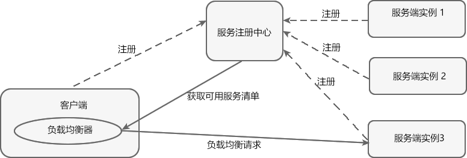
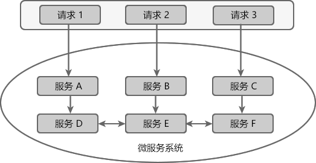

# 服务拆分带来的问题

- 运维的新挑战：在微服务架构中，运维人员需要维护的进程数量会大大增加
- 接口的一致性：虽然我们拆分了服务，但是业务逻辑上的依赖并不会消除，只是从单体应用中的代码依赖变为了服务间的通信依赖。而当我们对原有接口进行了一些修改，那么交互方也需要协调这样的改变来进行发布，以保证接口的正确调用。我们需要更完善的接口和版本管理，或是严格地遵循开闭原则。、
- 分布式的复杂性：由于拆分后的各个微服务都是独立部署并运行在各自的进程内，它们只能通过通信来进行协作，所以分布式环境的问题都将是微服务架构系统设计时需要考虑的重要因素，比如**网络延迟、分布式事务、异步消息**等。

# 微服务的九大特性

1. **服务组件化**：组件，是一个可以独立更换和升级的单元。就像电脑中的 CPU，内存和硬盘一样，可以独立的升级和更换而不影响其他的部分。每一个服务都独立开发、部署，可以有效避免一个服务的修改引起整个系统的重新部署

2. **按业务组织团队**：由于每一个微服务都是针对特定业务的宽栈或是全栈实现，既要负责数据的持久化存储，又要负责用户的接口定义等各种跨专业领域的职能。因此，面对大型项目的时候，对于微服务团队的拆分更加建议按业务线的方式进行拆分，一方面可以有效减少服务内部修改所产生的内耗；另一方面，团队边界可以变得更为清晰。

3. **做产品的态度**：我们需要用做“产品”的态度来对待每一个微服务，持续关注服务的运作情况，并不断分析以帮助用户来改善业务功能

4. **智能端点与哑管道**：在单体应用中，组件间直接通过函数调用的方式进行交互协作。而在微服务架构中，由于服务不在一个进程中，组件间的通信模式发生了改变，若仅仅将原本在进程内的方法调用改成 RPC 方式的调用，会导致微服务之间产生烦琐的通信，使得系统表现更为糟糕，所以，我们需要更粗粒度的通信协议。在微服务架构中，通常会使用以下两种服务调用方式：

   1. 使用 HTTP 的 RESTful API 或轻量级的消息发送协议，实现信息传递与服务调用的触发。

   2. 通过在轻量级消息总线上传递消息，类似 RabbitMQ 等一些提供可靠异步交换的中间件。

   在极度强调性能的情况下，有些团队会使用二进制的消息发送协议

5. **去中心化治理**：在实施微服务架构时，通过采用轻量级的契约定义接口，使得我们对于服务本身的具体技术平台不再那么敏感，这样整个微服务架构系统中的*各个组件就能针对其不同的业务特点选择不同的技术平台*，

6. **去中心化管理数据**：我们在实施微服务架构时，都希望让每一个服务来管理其自有的数据库。虽然数据管理的去中心化可以让数据管理更加细致化，通过采用 

   更合适的技术可让数据存储和性能达到最优。但是，由于数据存储于不同的数据库实例中后，*数据一致性也成为微服务架构中亟待解决的问题之一*。分布式事务本身的实现难度就非常大，所以在微服务架构中，我们更强调在各服务之间进行“无事务”的调用，*而对于数据一致性，只要求数据在最后的处理状态是一致的即可*，若在过程中发现错误，通过补偿机制来进行处理，使得错误数据能够达到最终的一致性

7. **基础设置自动化**：在微服务架构中，务必从一开始就构建起“持续交付”平台来支撑整个实施过程，该平台需要两大内容，缺一不可：

   - 自动化测试：每次部署前的强心剂，尽可能地获得对正在运行的软件的信心。

   - 自动化部署：解放烦琐枯燥的重复操作以及对多环境的配置管理

8. **容错设计**：在微服务中会出现故障的蔓延,例如调用顺序为： C->B->A，如果服务 A 出现故障，这 B 调用 A 服务的线程会挂起，此时如果有大量的 C 请求，则会导致 B 服务的线程出现大量挂起的现象，最后导致 A 服务也不能够正常工作。所以，在微服务架构中，快速检测出故障源并尽可能地自动恢复服务是必须被设计和考虑的。通常，我们都希望*在每个服务中实现监控和日志记录的组件*，比如服务状态、断路器状态、吞吐量、网络延迟等关键数据的仪表盘等。

9. **演进式设计**：随着系统的发展或者业务的需要，架构师会将一些经常变动或是有一定时间效应的内容进行微服务处理，并逐渐将原来在单体系统中多变的模块逐步拆分出来，而稳定不太变化的模块就形成一个核心微服务存在于整个架构之中。

# SpringCloud 简介

Spring Cloud是一个基于Spring Boot实现的微服务架构开发工具。它为微服务架构中涉及的配置管理、服务治理、断路器、智能路由、微代理、控制总线、全局锁、决策竞选、分布式会话和集群状态管理等操作提供了一种简单的开发方式。

Spring Cloud 本身并不是一个拿来即可用的框架，它是一套微服务规范，共有两代实现。

Spring Cloud Netflix 是 Spring Cloud 的第一代实现，主要由 Eureka、Ribbon、Feign、Hystrix 等组件组成。
Spring Cloud Alibaba 是 Spring Cloud 的第二代实现，主要由 Nacos、Sentinel、Seata 等组件组成。

**参考文章：**

[Spring Cloud教程](https://blog.csdn.net/qq_41854911/article/details/122792522)

## Spring Cloud 组件

- Spring Cloud Config：配置管理工具，支持使用 Git 存储配置内容，可以使用它实现应用配置的外部化存储，并支持客户端配置信息刷新、加密/解密配置内容等。

- Spring Cloud Netflix：核心组件，对多个 Netflix OSS 开源套件进行整合。

- Eureka：服务治理组件，包含服务注册中心、服务注册与发现机制的实现。
- Hystrix：容错管理组件，实现断路器模式，帮助服务依赖中出现的延迟和为故障提供强大的容错能力。
- Ribbon：客户端负载均衡的服务调用组件。
- Feign：基于 Ribbon 和 Hystrix 的声明式服务调用组件。
- Zuul：网关组件，提供智能路由、访问过滤等功能。
- Archaius：外部化配置组件。
- Spring Cloud Bus：事件、消息总线，用于传播集群中的状态变化或事件，以触发后续的处理，比如用来动态刷新配置等。
- Spring Cloud Cluster：针对 ZooKeeper、Redis、Hazelcast、Consul的选举算法和通用状态模式的实现。
- Spring Cloud Cloudfoundry：与Pivotal Cloudfoundry的整合支持。
- Spring Cloud Consul：服务发现与配置管理工具。
- Spring Cloud Stream：通过Redis、Rabbit或者Kafka实现的消费微服务，可以通过简单的声明式模型来发送和接收消息。
- Spring Cloud AWS：用于简化整合Amazon Web Service的组件。
- Spring Cloud Security：安全工具包，提供在 Zuul 代理中对 OAuth2 客户端请求的中继器。
- Spring Cloud Sleuth：Spring Cloud应用的分布式跟踪实现，可以完美整合 Zipkin。 
- Spring Cloud ZooKeeper：基于 ZooKeeper 的服务发现与配置管理组件。
- Spring Cloud Starters：Spring Cloud的基础组件，它是基于 SpringBoot 风格项目的基础依赖模块。
- Spring Cloud CLI：用于在 Groovy 中快速创建 Spring Cloud 应用的 Spring Boot CLI 插件。
- ......

### 现在使用的技术

- 网关：Spring Cloud Gateway
- 负载均衡：Spring Cloud LoadBalancer
- 注册中心: Spring Cloud Alibaba Nacos
- 远程调用: Spring Cloud OpenFeign

## SpringCloud 注解

| 注解                   | 作用                                                         |
| ---------------------- | ------------------------------------------------------------ |
| @EnableDiscoveryClient | 将应用声明为一个 Eureka 客户端                               |
| @EnableDiscoveryServer | 将应用声明为一个 Eureka 服务端                               |
| @LoadBalanced          | 主要用于修饰 RestTemplate 和 WebClient，被该注解修饰之后，注解会为它们配置 LoadBalancerClient，从而实现客户端负载均衡 |

## SpringCloud 版本与 SpringBoot 的版本的对应关系

在使用 Spring Boot + Spring Cloud 进行微服务开发时，我们需要根据项目中 Spring Boot 的版本来决定 Spring Cloud 版本，否则会出现许多意想不到的错误。

| Release Train        | Boot Version                          |
| :------------------- | :------------------------------------ |
| 2021.0.x aka Jubilee | 2.6.x, 2.7.x (Starting with 2021.0.3) |
| 2020.0.x aka Ilford  | 2.4.x, 2.5.x (Starting with 2020.0.3) |
| Hoxton               | 2.2.x, 2.3.x (Starting with SR5)      |
| Greenwich            | 2.1.x                                 |
| Finchley             | 2.0.x                                 |
| Edgware              | 1.5.x                                 |
| Dalston              | 1.5.x                                 |

可在[官网](https://spring.io/projects/spring-cloud)查看对应他们的对应关系

除了上表中展示的版本对应关系之外，我们还可以使用浏览器访问 https://start.spring.io/actuator/info，获取 Spring Cloud 与 Spring Boot 的版本对应关系（JSON 版）。

**注意**：Spring Cloud 官方已经停止对 Dalston、Edgware、Finchley 和 Greenwich 的版本更新。

# Actuator 监控与管理

spring-boot-starter-actuator 模块能够自动为 Spring Boot 构建的应用提供一系列用于监控的端点。spring-boot-starter-actuator 模块的实现对于实施微服务的中小团队来说，可以有效地省去或大大减少监控系统在采集应用指标时的开发量

## 端点

spring-boot-starter-actuator 模块中已经实现的一些原生端点。根据端点的作用，可以将原生端点分为以下三大类：

- 应用配置类：获取应用程序中加载的应用配置、环境变量、自动化配置报告等与 Spring Boot 应用密切相关的配置类信息。

- 度量指标类：获取应用程序运行过程中用于监控的度量指标，比如内存信息、线程池信息、HTTP请求统计等。
- 操作控制类：提供了对应用的关闭等操作类功能。

### 应用配置类

由于 Spring Boo为了改善传统 Spring 应用繁杂的配置内容，采用了包扫描和自动化配置的机制来加载原本集中于 XML 文件中的各项内容。虽然这样的做法让我们的代码变得非常简洁，但是整个应用的实例创建和依赖关系等信息都被离散到了各个配置类的注解上，这使我们分析整个应用中资源和实例的各种关系变得非常困难。而这类端点可以帮助我们轻松获取一系列关于 Spring 应用配置内容的详细报告，比如自动化配置的报告、Bean 创建的报告、环境属性的报告等。

- `/autoconfig`： 该端点用来获取应用自动化配置的报告，其中包括所有自动化配置的候选项。同时还列出了每个候选项是否满足自动化配置的各个先决条件
- `/beans`：该端点用来获取应用上下文中创建的所有 Bean
- `/configprops`：该端点用来获取应用中配置的属性信息报告。
- `/env`：该端点与 `/configprops` 不同，它用来获取应用所有可用的环境属性报告。包括环境变量、JVM 属性、应用的配置属性、命令行中的参数。通过该端点并配合 @ConfigurationProperties 注解可以将不容易发现的属性引入到我们的应用程序中来进行使用
- `/mapping`：该端点用来返回所有 Spring MVC 的控制器映射关系报告
- `/info`：该端点用来返回一些应用自定义的信息。默认情况下，该端点只会返回一个空的 JSON 内容。我们可以在 application.properties 配置文件中通过 info 前缀来设置一些属性

### 度量指标类

应用配置类获取的信息可以说是一个静态报告。而度量指标类端点提供的报告内容则是*动态变化*的，这些端点提供了应用程序在运行过程中的一些快照信息，比如内存使用情况、HTTP请求统计、外部资源指标等。

- `/metrics`：该端点用来返回当前应用的各类重要度量指标，比如内存信息、线程信息、垃圾回收信息等。对于 `gauge.*` 和 `counter.* ` 的统计，这里有一个特殊的内容请求 star-star，它代表了对静态资源的访问。这两类度量指标非常有用，我们不仅可以使用它默认的统计指标，还可以在程序中轻松地增加自定义统计值。只需要通过注入 org.springframework.boot.actuate.metrics.CounterService 和 org.springframework.boot.actuate.metrics.GaugeService 来实现自定义的统计指标信息。比如我们可以像下面这样自定义实现对hello接口的访问次数统计。我们还可以通过 `/metrics/{name}` 接口来更细粒度地获取度量信息，比如可以通过访问 `/metrics/mem.free` 来获取当前可用内存数量。

- `/health`：该端点在一开始的示例中我们已经使用过了，它用来获取应用的各类健康指标信息。在 spring-boot-starter-actuator 模块中自带实现了一些常用资源的健康指标检测器。这些检测器都通过 HealthIndicator 接口实现，并且会根据依赖关系的引入实现自动化装配，比如下面列出的这些。

  | 检测器                    | 功能                       |
  | ------------------------- | -------------------------- |
  | DiskSpaceHealthIndicator  | 低磁盘空间检测             |
  | DataSourceHealthIndicator | 检测 DataSource 是否可用   |
  | MongoHealthIndicator      | 检测 Mongo 数据库是否可用  |
  | RabbitHealthIndicator     | 检测 Rabbit 服务器是否可用 |
  | RedisHealthIndicator      | 检测 Redis 服务器是否可用  |
  | SolrHealthIndicator       | 检测 Solr 服务器是否可用   |

- `/dump`：该端点用来暴露程序运行中的线程信息。它使用 java.lang.management.ThreadMXBean 的 dumpAllThreads 方法来返回所有含有同步信息的活动线程详情。

- /trace：该端点用来返回基本的 HTTP 跟踪信息。默认情况下，跟踪信息的存储采用org.springframework.boot.actuate.trace.InMemoryTraceRepository 实现的内存方式，始终保留最近的 100 条请求记录

### 操作控制类

操作控制类端点拥有更强大的控制能力，如果要使用它们的话，需要通过属性来配置开启操作。在原生端点中，只提供了一个用来关闭应用的端点：`/shutdown`

```yaml
endpoints:
	shutdown:
		enabled: true
```

## 服务治理

服务治理可以说是微服务架构中最为核心和基础的模块，**它主要用来实现各个微服务实例的自动化注册与发现**

### 服务注册 

1. 在服务治理框架中，通常都会构建一个注册中心，每个服务单元向注册中心登记自己提供的服务，将主机与端口号、版本号、通信协议等一些附加信息告知注册中心，注册中心按服务名分类组织服务清单

2. 服务注册中心还需要以心跳的方式去监测清单中的服务是否可用，若不可用需要从服务清单中剔除，达到排除故障服务的效果

### 服务发现

由于在服务治理框架下运作，服务间的调用不再通过指定具体的实例地址来实现，而是通过向服务名发起请求调用实现。所以，服务调用方在调用服务提供方接口的时候，并不知道具体的服务实例位置。因此，调用方需要向服务注册中心咨询服务，并获取所有服务的实例清单，以实现对具体服务实例的访问。

## Eureka 服务注册与发现

Eureka 实现服务注册与发现的原理，如下图所示


图中共涉及到以下 3 个角色：

- 服务注册中心（Register Service）：它是一个 Eureka Server，用于提供服务注册和发现功能。
- 服务提供者（Provider Service）：它是一个 Eureka Client，用于提供服务。它将自己提供的服务注册到服务注册中心，以供服务消费者发现。
- 服务消费者（Consumer Service）：它是一个 Eureka Client，用于消费服务。它可以从服务注册中心获取服务列表，调用所需的服务。

Eureka 实现服务注册与发现的流程如下：

1. 搭建一个 Eureka Server 作为服务注册中心；
2. 服务提供者 Eureka Client 启动时，会把当前服务器的信息以服务名（spring.application.name）的方式注册到服务注册中心；
3. 服务消费者 Eureka Client 启动时，也会向服务注册中心注册；
4. 服务消费者还会获取一份可用服务列表，该列表中包含了所有注册到服务注册中心的服务信息（包括服务提供者和自身的信息）；
5. 在获得了可用服务列表后，服务消费者通过 HTTP 或消息中间件远程调用服务提供者提供的服务。

服务注册中心（Eureka Server）所扮演的角色十分重要，它是服务提供者和服务消费者之间的桥梁。服务提供者只有将自己的服务注册到服务注册中心才可能被服务消费者调用，而服务消费者也只有通过服务注册中心获取可用服务列表后，才能调用所需的服务。

### Netflix Eurka

Spring Cloud Eureka，使用 Netflix Eureka 来实现服务注册与发现，它既包含了服务端组件，也包含了客户端组件，并且服务端与客户端均采用 Jav编写，所以 Eurek主要适用于通过 Java 实现的分布式系统，或是与 JVM 兼容语言构建的系统。但是，由于 Eureka 服务端的服务治理机制提供了完备的RESTful API，所以它也支持将非 Java 语言构建的微服务应用纳入 Eureka 的服务治理体系中来。只是在使用其他语言平台的时候，需要自己来实现 Eureka 的客户端程序。

Eureka 服务端依托于强一致性提供良好的服务实例可用性，可以应对多种不同的故障场景。如果 Eureka 以集群模式部署，当集群中有分片出现故障时，那么 Eureka 就转入自我保护模式。*它允许在分片故障期间继续提供服务的发现和注册*，当故障分片恢复运行时，集群中的其他分片会把它们的状态再次同步回来

Eureka 客户端，主要处理服务的注册与发现。客户端服务通过注解和参数配置的方式，嵌入在客户端应用程序的代码中，在应用程序运行时，Eureka 客户端向注册中心注册自身提供的服务并周期性地发送心跳来更新它的服务租约。同时，它也能从服务端查询当前注册的服务信息并把它们缓存到本地并周期性地刷新服务状态。

一个微服务只能处于 region 下的某一个 zone 中，一个 region 对应多个 zone，

实例名是区分同一服务中不同实例的唯一标识，在 Spring Cloud Eureka 的配置中，实例名的默认规则：

```text
${spring.cloud.client.hostname}:${spring.application.name}:${spring.application.instance_id:${server.port}}
```

在默认设置下，该服务注册中心也会将自己作为客户端来尝试注册它自己，所以我们需要禁用它的客户端注册行为，只需在 application.properties 中增加如下配置：

```properties
server:
  port: 9000
spring:
  application:
    name: eureka-server # 定义服务的名称
eureka:
  instance:
    hostname: localhost
    prefer-ip-address: true # 将 Hostname 替换成 IP 地址，在 Eureka 客户端最好将这个配置加上，不然获取到的 host 可能不能够访问
    lease-expiration-duration-in-seconds: 90 # 定义服务失效的时间间隔
    lease-renewal-interval-in-seconds: 30 # 定义续费服务的时间间隔
    instance-id: ${spring.application.name}:${random.int} # 设置实例名
  client:
    service-url:
      defaultZone: http://localhost:9000/eureka # 设置服务注册中心的地址
    register-with-eureka: false # 不向 Eureka 注册自己
    fetch-registry: false # 不向 Eureka Server 获取服务列表
    registry-fetch-interval-seconds: 30 # 设置缓存清单的更新时间为 30 s
  server:
    enable-self-preservation: false # 关闭自我保护，确保注册中心可以将不可用实例正确剔除

```

#### 高可用注册中心

Eureka Server 的高可用实际上就是将自己作为服务向其他服务注册中心注册自己，这样就可以形成一组互相注册的服务注册中心，以实现服务清单的互相同步，达到高可用的效果.

# 负载均衡(Load Balance)

负载均衡（Load Balance），简单点说就是将用户的请求平摊分配到多个服务器上运行，以达到扩展服务器带宽、增强数据处理能力、增加吞吐量、提高网络的可用性和灵活性的目的。

常见的负载均衡方式有两种：

- 服务端负载均衡
- 客户端负载均衡

## 服务端负载均衡

服务端负载均衡是最常见的负载均衡方式，其工作原理如下图。


服务端负载均衡是在客户端和服务端之间建立一个独立的负载均衡服务器，该服务器既可以是硬件设备（例如 F5），也可以是软件（例如 Nginx）。这个负载均衡服务器维护了一份可用服务端清单，然后通过心跳机制来删除故障的服务端节点，以保证清单中的所有服务节点都是可以正常访问的。

当客户端发送请求时，该请求不会直接发送到服务端进行处理，而是全部交给负载均衡服务器，由负载均衡服务器按照某种算法（例如轮询、随机等），从其维护的可用服务清单中选择一个服务端，然后进行转发。

服务端负载均衡具有以下特点：

- 需要建立一个独立的负载均衡服务器。
- 负载均衡是在客户端发送请求后进行的，因此客户端并不知道到底是哪个服务端提供的服务。
- 可用服务端清单存储在负载均衡服务器上。

## 客户端负载均衡

相较于服务端负载均衡，客户端服务在均衡则是一个比较小众的概念。

客户端负载均衡的工作原理如下图：



**客户端负载均衡是将负载均衡逻辑以代码的形式封装到客户端上，即负载均衡器位于客户端**。客户端通过服务注册中心（例如 Eureka Server）获取到一份服务端提供的可用服务清单。有了服务清单后，负载均衡器会在**客户端发送请求前通过负载均衡算法选择一个服务端实例再进行访问，以达到负载均衡的目的**；

客户端负载均衡也需要心跳机制去维护服务端清单的有效性，这个过程需要配合服务注册中心一起完成。

客户端负载均衡具有以下特点：

- 负载均衡器位于客户端，不需要单独搭建一个负载均衡服务器。
- 负载均衡是在客户端发送请求前进行的，因此客户端清楚地知道是哪个服务端提供的服务。
- 客户端也维护了一份可用服务清单，而这份清单都是从服务注册中心获取的。

Ribbon 就是一个基于 HTTP 和 TCP 的客户端负载均衡器，当我们将 Ribbon 和 Eureka 一起使用时，Ribbon 会从 Eureka Server（服务注册中心）中获取服务端列表，然后通过负载均衡策略将请求分摊给多个服务提供者，从而达到负载均衡的目的。

## Ribbon

**该项目已经停止维护**

服务发现的任务交给 Eureka 的客户端完成，而服务的消费任务则交给 Ribbon 完成。Ribbon 是一个基于 HTTP 和 TCP 的客户端负载均衡器，它可以在通过客户端中配置的 ribbonServerList 服务端列表去轮询访问以达到均衡负载的作用

当 Ribbon 与 Eureka 联合使用时，Ribbon 的服务实例清单 RibbonServerList 会被 DiscoveryEnabledNIWSServerList 重写，扩展成从 Eureka 注册中心中获取服务端列表。同时它也会用 NIWSDiscoveryPing 来取代 IPing，它将职责委托给 Eureka 来确定服务端是否已经启动

Ribbon 在 Eureka 服务发现的基础上，实现了一套对服务实例的选择策略，从而实现对服务的消费

## OpenFeign

OpenFeign 全称 Spring Cloud OpenFeign，它是 Spring 官方推出的一种声明式服务调用与负载均衡组件，它的出现就是为了替代进入停更维护状态的 Feign。

OpenFeign 是 Spring Cloud 对 Feign 的二次封装，它具有 Feign 的所有功能，并在 Feign 的基础上增加了对 Spring MVC 注解的支持，例如 @RequestMapping、@GetMapping 和 @PostMapping 等。

### OpenFeign 常用注解

使用 OpenFegin 进行远程服务调用时，常用注解如下

| 注解                | 说明                                                         |
| ------------------- | ------------------------------------------------------------ |
| @FeignClient        | 该注解用于通知 OpenFeign 组件对 @RequestMapping 注解下的接口进行解析，并通过动态代理的方式产生实现类，实现负载均衡和服务调用。 |
| @EnableFeignClients | 该注解用于开启 OpenFeign 功能，当 Spring Cloud 应用启动时，OpenFeign 会扫描标有 @FeignClient 注解的接口，生成代理并注册到 Spring 容器中。 |
| @RequestMapping     | Spring MVC 注解，在 Spring MVC 中使用该注解映射请求，通过它来指定控制器（Controller）可以处理哪些 URL 请求，相当于 Servlet 中 web.xml 的配置。 |
| @GetMapping         | Spring MVC 注解，用来映射 GET 请求，它是一个组合注解，相当于 @RequestMapping(method = RequestMethod.GET) 。 |
| @PostMapping        | Spring MVC 注解，用来映射 POST 请求，它是一个组合注解，相当于 @RequestMapping(method = RequestMethod.POST) |

> Spring Cloud Finchley 及以上版本一般使用 OpenFeign 作为其服务调用组件。由于 OpenFeign 是在 2019 年 Feign 停更进入维护后推出的，因此大多数 2019 年及以后的新项目使用的都是 OpenFeign，而 2018 年以前的项目一般使用 Feign。

# 服务熔断和降级组件

在微服务架构中，一个应用往往由多个服务组成，这些服务之间相互依赖，依赖关系错综复杂。

例如一个微服务系统中存在 A、B、C、D、E、F 等多个服务，它们的依赖关系如下图：



通常情况下，一个用户请求往往需要多个服务配合才能完成。如图 1 所示，在所有服务都处于可用状态时，请求 1 需要调用 A、D、E、F 四个服务才能完成，请求 2 需要调用 B、E、D 三个服务才能完成，请求 3 需要调用服务 C、F、E、D 四个服务才能完成。

当服务 E 发生故障或网络延迟时，会出现以下情况：

1. 即使其他所有服务都可用，由于服务 E 的不可用，那么用户请求 1、2、3 都会处于阻塞状态，等待服务 E 的响应。在高并发的场景下，**会导致整个服务器的线程资源在短时间内迅速消耗殆尽**。
2. 所有依赖于服务 E 的其他服务，例如服务 B、D 以及 F 也都会处于线程阻塞状态，等待服务 E 的响应，导致这些服务的不可用。
3. 所有依赖服务B、D 和 F 的服务，例如服务 A 和服务 C 也会处于线程阻塞状态，以等待服务 D 和服务 F 的响应，导致服务 A 和服务 C 也不可用。

从以上过程可以看出，**当微服务系统的一个服务出现故障时，故障会沿着服务的调用链路在系统中疯狂蔓延，最终导致整个微服务系统的瘫痪**，这就是“雪崩效应”。为了防止此类事件的发生，微服务架构引入了“熔断器”等一系列服务容错和保护机制。

## 熔断器 Circuit Breaker

微服务架构中的熔断器能够在某个服务发生故障后，向服务调用方返回一个符合预期的、可处理的降级响应（FallBack），而不是长时间的等待或者抛出调用方无法处理的异常。这样就保证了服务调用方的线程不会被长时间、不必要地占用，避免故障在微服务系统中的蔓延，防止系统雪崩效应的发生。

### Spring Cloud Hystrix

Spring Cloud Hystrix 是一款优秀的服务容错与保护组件，也是 Spring Cloud 中最重要的组件之一。

Spring Cloud Hystrix 具有服务降级、服务熔断、线程隔离、请求缓存、请求合并以及实时故障监控等强大功能。

在微服务系统中，Hystrix 能够帮助我们实现以下目标：

- 保护线程资源：防止单个服务的故障耗尽系统中的所有线程资源。
- 快速失败机制：当某个服务发生了故障，不让服务调用方一直等待，而是直接返回请求失败。
- 提供降级（FallBack）方案：在请求失败后，提供一个设计好的降级方案，通常是一个兜底方法，当请求失败后即调用该方法。
- 防止故障扩散：使用熔断机制，防止故障扩散到其他服务。
- 监控功能：提供熔断器故障监控组件 Hystrix Dashboard，随时监控熔断器的状态。

#### Hystrix 服务降级

Hystrix 提供了服务降级功能，能够保证当前服务不受其他服务故障的影响，提高服务的健壮性。

服务降级的使用场景有以下 2 种：

- 在服务器压力剧增时，根据实际业务情况及流量，对一些不重要、不紧急的服务进行有策略地不处理或简单处理，从而释放服务器资源以保证核心服务正常运作。
- 当某些服务不可用时，为了避免长时间等待造成服务卡顿或雪崩效应，而主动执行备用的降级逻辑立刻返回一个友好的提示，以保障主体业务不受影响。

我们可以通过重写 HystrixCommand 的 getFallBack() 方法或 HystrixObservableCommand 的 resumeWithFallback() 方法，使服务支持服务降级。

Hystrix 服务降级 FallBack 既可以放在服务端进行，也可以放在客户端进行。

Hystrix 会在以下场景下进行服务降级处理：

- 程序运行异常
- 服务超时
- 熔断器处于打开状态
- 线程池资源耗尽

# 网关

## API 网关

API 网关是一个搭建在客户端和微服务之间的服务，我们可以在 API 网关中处理一些非业务功能的逻辑，例如权限验证、监控、缓存、请求路由等。

**API 网关就像整个微服务系统的门面一样，是系统对外的唯一入口**。有了它，客户端会先将请求发送到 API 网关，然后由 API 网关根据请求的标识信息将请求转发到微服务实例。


对于服务数量众多、复杂度较高、规模比较大的系统来说，使用 API 网关具有以下好处：

- 客户端通过 API 网关与微服务交互时，客户端只需要知道 API 网关地址即可，而不需要维护大量的服务地址，简化了客户端的开发。
- 客户端直接与 API 网关通信，能够减少客户端与各个服务的交互次数。
- 客户端与后端的服务耦合度降低。
- 节省流量，提高性能，提升用户体验。
- API 网关还提供了安全、流控、过滤、缓存、计费以及监控等 API 管理功能。

常见的 API 网关实现方案主要有以下 5 种：

- Spring Cloud Gateway
- Spring Cloud Netflix Zuul
- Kong
- Nginx+Lua
- Traefik

## Spring Cloud Gateway

Spring Cloud Gateway 是 Spring Cloud 团队基于 Spring 5.0、Spring Boot 2.0 和 Project Reactor 等技术开发的高性能 API 网关组件。

Spring Cloud Gateway 旨在提供一种简单而有效的途径来发送 API，并为它们提供横切关注点，例如：安全性，监控/指标和弹性。

> Spring Cloud Gateway 是基于 WebFlux 框架实现的，而 WebFlux 框架底层则使用了高性能的 Reactor 模式通信框架 Netty。

### Spring Cloud Gateway 的核心概念

Spring Cloud GateWay 最主要的功能就是路由转发，而在定义转发规则时主要涉及了以下三个核心概念

| 核心概念          | 描述                                                         |
| ----------------- | ------------------------------------------------------------ |
| Route（路由）     | 网关最基本的模块。它由一个 ID、一个目标 URI、一组断言（Predicate）和一组过滤器（Filter）组成。 |
| Predicate（断言） | 路由转发的判断条件，我们可以通过 Predicate 对 HTTP 请求进行匹配，例如请求方式、请求路径、请求头、参数等，如果请求与断言匹配成功，则将请求转发到相应的服务。 |
| Filter（过滤器）  | 过滤器，我们可以使用它对请求进行拦截和修改，还可以使用它对上文的响应进行再处理 |

> 注意：其中 Route 和 Predicate 必须同时声明。

### Spring Cloud Gateway 的特征

Spring Cloud Gateway 具有以下特性：

- 基于 Spring Framework 5、Project Reactor 和 Spring Boot 2.0 构建。
- 能够在任意请求属性上匹配路由。
- predicates（断言） 和 filters（过滤器）是特定于路由的。
- 集成了 Hystrix 熔断器。
- 集成了 Spring Cloud DiscoveryClient（服务发现客户端）。
- 易于编写断言和过滤器。
- 能够限制请求频率。
- 能够重写请求路径。

### Spring Cloud Gateway 工作流程


1. 客户端将请求发送到 Spring Cloud Gateway 上。
2. Spring Cloud Gateway 通过 Gateway Handler Mapping 找到与请求相匹配的路由，将其发送给 Gateway Web Handler。
3. Gateway Web Handler 通过指定的过滤器链（Filter Chain），将请求转发到实际的服务节点中，执行业务逻辑返回响应结果。
4. 过滤器之间用虚线分开是因为过滤器可能会在转发请求之前（pre）或之后（post）执行业务逻辑。
5. 过滤器（Filter）可以在请求被转发到服务端前，对请求进行拦截和修改，例如参数校验、权限校验、流量监控、日志输出以及协议转换等。
6. 过滤器可以在响应返回客户端之前，对响应进行拦截和再处理，例如修改响应内容或响应头、日志输出、流量监控等。
7. 响应原路返回给客户端。

总而言之，客户端发送到 Spring Cloud Gateway 的请求需要通过一定的匹配条件，才能定位到真正的服务节点。在将请求转发到服务进行处理的过程前后（pre 和 post），我们还可以对请求和响应进行一些精细化控制。

Predicate 就是路由的匹配条件，而 Filter 就是对请求和响应进行精细化控制的工具。有了这两个元素，再加上目标 URI，就可以实现一个具体的路由了。

### Predicate 断言

Spring Cloud Gateway 通过 Predicate 断言来实现 Route 路由的匹配规则。简单点说，Predicate 是路由转发的判断条件，请求只有满足了 Predicate 的条件，才会被转发到指定的服务上进行处理。

使用 Predicate 断言需要注意以下 3 点：

- Route 路由与 Predicate 断言的对应关系为“一对多”，一个路由可以包含多个不同断言。
- 一个请求想要转发到指定的路由上，就必须同时匹配路由上的所有断言。
- 当一个请求同时满足多个路由的断言条件时，**请求只会被首个成功匹配的路由转发**。


常见的 Predicate 断言如下表（假设转发的 URI 为 http://localhost:8001）。

| 断言         | 示例                                                         | 说明                                                         |
| ------------ | ------------------------------------------------------------ | ------------------------------------------------------------ |
| Path         | - Path=/dept/list/**                                         | 当请求路径与 /dept/list/** 匹配时，该请求才能被转发到 http://localhost:8001 上。 |
| Before       | - Before=2021-10-20T11:47:34.255+08:00[Asia/Shanghai]        | 在 2021 年 10 月 20 日 11 时 47 分 34.255 秒之前的请求，才会被转发到 http://localhost:8001 上。 |
| After        | - After=2021-10-20T11:47:34.255+08:00[Asia/Shanghai]         | 在 2021 年 10 月 20 日 11 时 47 分 34.255 秒之后的请求，才会被转发到 http://localhost:8001 上。 |
| Between      | - Between=2021-10-20T15:18:33.226+08:00[Asia/Shanghai],2021-10-20T15:23:33.226+08:00[Asia/Shanghai] | 在 2021 年 10 月 20 日 15 时 18 分 33.226 秒 到 2021 年 10 月 20 日 15 时 23 分 33.226 秒之间的请求，才会被转发到 http://localhost:8001 服务器上。 |
| CookieHeader | - Cookie=name,c.biancheng.net                                | 携带 Cookie 且 Cookie 的内容为 name=c.biancheng.net 的请求，才会被转发到 http://localhost:8001 上。 |
| Header       | - Header=X-Request-Id,\d+                                    | 请求头上携带属性 X-Request-Id 且属性值为整数的请求，才会被转发到 http://localhost:8001 上。 |
| Method       | - Method=GET                                                 | 只有 GET 请求才会被转发到 http://localhost:8001 上。         |

# 分布式配置组件

在分布式微服务系统中，几乎所有服务的运行都离不开配置文件的支持，这些配置文件通常由各个服务自行管理，以 properties 或 yml 格式保存在各个微服务的类路径下，例如 application.properties 或 application.yml 等。

这种将配置文件散落在各个服务中的管理方式，存在以下问题：

- 管理难度大：配置文件散落在各个微服务中，难以管理。
- 安全性低：配置跟随源代码保存在代码库中，容易造成配置泄漏。
- 时效性差：微服务中的配置修改后，必须重启服务，否则无法生效。
- 局限性明显：无法支持动态调整，例如日志开关、功能开关。

为了解决这些问题，通常我们都会使用配置中心对配置进行统一管理。市面上开源的配置中心有很多，例如百度的 Disconf、淘宝的 diamond、360 的 QConf、携程的 Apollo 等都是解决这类问题的。Spring Cloud 也有自己的分布式配置中心，那就是 Spring Cloud Config。

## Spring Cloud Config

Spring Cloud Config 是由 Spring Cloud 团队开发的项目，它可以为微服务架构中各个微服务提供集中化的外部配置支持。

简单点说就是，Spring Cloud Config 可以将各个微服务的配置文件集中存储在一个外部的存储仓库或系统（例如 Git 、SVN 等）中，对配置的统一管理，以支持各个微服务的运行。

Spring Cloud Config 包含以下两个部分：

- Config Server：也被称为分布式配置中心，它是一个独立运行的微服务应用，用来连接配置仓库并为客户端提供获取配置信息、加密信息和解密信息的访问接口。
- Config Client：指的是微服务架构中的各个微服务，它们通过 Config Server 对配置进行管理，并从 Config Sever 中获取和加载配置信息。

Spring Cloud Config 默认使用 Git 存储配置信息，因此使用 Spirng Cloud Config 构建的配置服务器天然就支持对微服务配置的版本管理。我们可以使用 Git 客户端工具方便地对配置内容进行管理和访问。除了 Git 外，Spring Cloud Config 还提供了对其他存储方式的支持，例如 SVN、本地化文件系统等。

## Spring Cloud Config 工作原理

Spring Cloud Config 工作原理如下图:


Spring Cloud Config 工作流程如下：

1. 开发或运维人员提交配置文件到远程的 Git 仓库。
2. Config 服务端（分布式配置中心）负责连接配置仓库 Git，并对 Config 客户端暴露获取配置的接口。
3. Config 客户端通过 Config 服务端暴露出来的接口，拉取配置仓库中的配置。
4. Config 客户端获取到配置信息，以支持服务的运行。

## Spring Cloud Config 的特点

Spring Cloud Config 具有以下特点：

- Spring Cloud Config 由 Spring Cloud 团队开发，可以说是 Spring 的亲儿子，能够与 Spring 的生态体系无缝集成。
- Spring Cloud Config 将所有微服务的配置文件集中存储在一个外部的存储仓库或系统（例如 Git）中，统一管理。
- Spring Cloud Config 配置中心将配置以 REST 接口的形式暴露给各个微服务，以方便各个微服务获取。
- 微服务可以通过 Spring Cloud Config 向配置中心统一拉取属于它们自己的配置信息。
- 当配置发生变化时，微服务不需要重启即可感知到配置的变化，并自动获取和应用最新配置。
- 一个应用可能有多个环境，例如开发（dev）环境、测试（test）环境、生产（prod）环境等等，开发人员可以通过 Spring Cloud Config 对不同环境的各配置进行管理，且能够确保应用在环境迁移后仍然有完整的配置支持其正常运行。

# Spring Cloud Alibaba

## Spring Cloud Alibaba 组件

Spring Cloud Alibaba 包含了多种开发分布式微服务系统的必需组件

- Nacos：阿里巴巴开源产品，一个更易于构建云原生应用的动态服务发现, 配置管理和服务管理平台。
- Sentinel：阿里巴巴开源产品，把流量作为切入点, 从流量控制, 熔断降级, 系统负载保护等多个维度保护服务的稳定性。
- RocketMQ：Apache RocketMQ 是一款基于 Java 的高性能、高吞吐量的分布式消息和流计算平台。
- Dubbo：Apache Dubbo 是一款高性能的 Java RPC 框架。
- Seata：阿里巴巴开源产品，一个易于使用的高性能微服务分布式事务解决方案。
- Alibaba Cloud OSS：阿里云对象存储服务器（Object Storage Service，简称OSS），是阿里云提供的海量、安全、低成本、高可靠的云存储服务。
- Alibaba Cloud Schedulerx：阿里中间件团队开发的一款分布式调度产品,支持周期性的任务与固定时间点触发任务。

通过 Spring Cloud Alibaba 的这些组件，我们只需要添加一些注解和少量配置，就可以将 Spring Cloud 应用接入阿里微服务解决方案，通过阿里中间件来迅速搭建分布式应用系统。

## Spring Cloud 两代实现组件对比

下表展示了 Spring Cloud 两代实现的组件对比情况

| Spring Cloud 第一代实现（Netflix） | 状态                                             | Spring Cloud 第二代实现（Alibaba） | 状态                                                 |
| ---------------------------------- | ------------------------------------------------ | ---------------------------------- | ---------------------------------------------------- |
| Ereka                              | 2.0 孵化失败                                     | Nacos Discovery                    | 性能更好，感知力更强                                 |
| Ribbon                             | 停更进维                                         | Spring Cloud Loadbalancer          | Spring Cloud 原生组件，用于代替 Ribbon               |
| Hystrix                            | 停更进维                                         | Sentinel                           | 可视化配置，上手简单                                 |
| Zuul                               | 停更进维                                         | Spring Cloud Gateway               | 性能为 Zuul 的 1.6 倍                                |
| Spring Cloud Config                | 搭建过程复杂，约定过多，无可视化界面，上手难点大 | Nacos Config                       | 搭建过程简单，有可视化界面，配置管理更简单，容易上手 |
