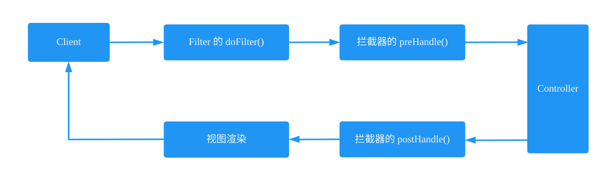

# SpringMVC 的使用

## SpringMVC 介绍

SpringMVC：是基于 spring 的一个框架， 实际上就是 spring 的一个模块， 专门是做 web 开发的。可以理解成是 servlet 的一个升级

web开发底层是 servlet ， 框架是在 servlet 基础上面加入一些功能，让我们做 web 开发更方便。

SpringMVC就是一个 Spring。 Spring 是容器，ioc 能够管理对象，使用 `<bean>`, @Component, @Repository, @Service, @Controller，SpringMVC能够创建对象， 并放入到容器中（SpringMVC容器）， SpringMVC 容器中放的是控制器对象。

我们要做的是使用@Contorller 创建控制器对象， 把对象放入到 SpringMVC 容器中， 把创建的对象作为控制器使用。这个控制器对象能接收用户的请求， 显示处理结果，就当做是一个 Servlet 使用。

 使用@Controller注解创建的是一个普通类的对象， 不是Servlet。 SpringMVC 赋予了控制器对象一些额外的功能。web开发底层是 servlet， SpringMVC中有一个对象是Servlet ： DispatherServlet (中央调度器)。DispatherServlet 负责接收用户的所有请求。 用户把请求给 DispatherServlet， 之后 DispatherServlet 把请求转发给我们的 Controller 对象， 最后是 Controller 对象处理请求。

# Spring Web 应用启动顺序

listener -> filter -> servlet

# 参数解析常用注解

| 注解              | 描述                  |
| ----------------- | --------------------- |
| @RequestParam     |                       |
| @PathVariable     | 处理 url 路径中的参数 |
| @RequestHeader    |                       |
| @RequestAttribute |                       |
| @CookieValue      |                       |
| @MatrixVariable   |                       |
| @SessionAttribute |                       |
| @Value            |                       |
| @ModelAttribute   |                       |
| @RequestPart      |                       |
| @RequestBody      |                       |

# 重定向传递参数

## FlashMap

在重定向时，如果需要传递参数，但是又不想放在地址栏中，我们就可以通过 flashMap 来传递参数

```java
@RestController
public class HelloController {
    @PostMapping("/order")
    public String order(HttpServletRequest request) {
        FlashMap flashMap = (FlashMap) request.getAttribute(DispatcherServlet.OUTPUT_FLASH_MAP_ATTRIBUTE);
        flashMap.put("name", "AutMaple");
        return "redirect:/orderList";
    }

    @GetMapping("/orderList")
    public String orderList(Model model) {
        return (String) model.getAttribute("name");
    }
}
```

上面的代码不够优雅，重定向传递参数比较优雅的方式是通过 `RedirectAttributes` :

```java
@RestController
public class HelloController {
    @PostMapping("/order")
    public String order(RedirectAttributes attributes) {
        attributes.addFlashAttribute("name", "AutMaple"); // 放入 Flashmap 中，不会出现在地址栏中
        attributes.addAttribute("email", "autmaple609@qq.com"); // 参数放入到地址栏中
        return "redirect:/orderList";
    }

    @GetMapping("/orderList")
    public String orderList(Model model) {
        return (String) model.getAttribute("name");
    }
}

```

## 实现原理

使用 FlashMap 实现重定向传参的媒介是 HttpSession。

整个参数传递的过程可以分为三大步：

1. 将参数设置到 outputFlashMap 中，有两种设置方式：
   - 第一种方式是通过 `req.getAttribute(DispatcherServlet.OUTPUT_FLASH_MAP_ATTRIBUTE)` 直接获取 outputFlashMap 对象，然后把参数放进去
   - 第二种方式就是通过在接口中添加 RedirectAttributes 参数，然后把需要传递的参数放入 RedirectAttributes 中，这样当处理器处理完毕后，会自动将其设置到 outputFlashMap 中
2. 将 outputFlashMap 保存到 session 中。保存之前会给 flashMap 设置两个属性，一个是重定向的 url 地址，另一个则是过期时间，过期时间默认 180 秒，这两个属性在第三步加载 flashMap 的时候会用到
3. 当重定向请求到达 `DispatcherServlet#doService` 方法后，此时会调用 `FlashMapManager#retrieveAndUpdate` 方法从 Session 中获取 outputFlashMap 并设置到 Request 属性中备用

参考文章：[SpringMVC 中的参数还能这么传递？涨姿势了！](https://mp.weixin.qq.com/s/vwR0YRKVQQFN5B99NJKXYA)

# SpringMVC 中的核心组件

## DispatcherServlet

DispatcherServlet 是整个流程控制的中心，相当于是 SpringMVC 的大脑，由它调用其它组件处理用户的请求，DispatcherServlet 的存在降低了组件之间的耦合性。

## HandlerMapping

HandlerMapping (处理器映射器) 负责根据用户请求找到 Handler 即处理器（也就是我们所说的 Controller），SpringMVC 提供了不同的映射器实现不同的映射方式，例如：配置文件方式，实现接口方式，注解方式等，在实际开发中，我们常用的方式是注解方式。

HandlerMapping 是负责根据 request 请求找到对应的 Handler 处理器及 Interceptor 拦截器，将它们封装在 HandlerExecutionChain 对象中返回给前端控制器。

正常情况下，我们在项目中使用的是 RequestMappingHandlerMapping，这个是根据处理器中的注解，来匹配请求（即 @RequestMapping 注解中的 url 属性）

我们需要 RequestMappingHandlerMapping 才能定位到需要执行的方法，需要 RequestMappingHandlerAdapter，才能执行定位到的方法

## Handler

Handler 是继 DispatcherServlet 前端控制器的后端控制器，在DispatcherServlet 的控制下 Handler 对具体的用户请求进行处理。由于 Handler 涉及到具体的用户业务请求，所以一般情况需要程序员根据业务需求开发 Handler。（这里所说的 Handler 就是指我们的 Controller）

## HandlAdapter

通过 HandlerAdapter 对处理器进行执行，这是适配器模式的应用，通过扩展适配器可以对更多类型的处理器进行执行。

## ViewResolver

ViewResolver 负责将处理结果生成 View 视图，ViewResolver 首先根据逻辑视图名解析成物理视图名即具体的页面地址，再生成 View 视图对象，最后对 View 进行渲染将处理结果通过页面展示给用户。 SpringMVC 框架提供了很多的 View 视图类型，包括：jstlView、freemarkerView、pdfView 等。一般情况下需要通过页面标签或页面模版技术将模型数据通过页面展示给用户，需要由程序员根据业务需求开发具体的页面。

# springmvc执行过程源代码分析

1. tomcat启动，创建容器的过程
   通过 web.xml 中的 `<load-on-start>` 标签指定的 1，创建 DisaptcherServlet 对象， 
   DisaptcherServlet 它的父类是继承HttpServlet 的， 它是一个 serlvet， 因此在被创建时，会执行 init() 方法。
   在 init() 方法中,会执行如下语句

   ```java
   //创建容器，读取配置文件
   WebApplicationContext ctx = new ClassPathXmlApplicationContext("springmvc.xml");
   //把容器对象放入到ServletContext中
   getServletContext().setAttribute(key, ctx);
   ```

   上面创建容器作用： 创建@controller注解所在的类的对象， 创建 MyController 对象，这个对象放入到 SpringMVC 的容器中， 容器是一个 map ， 类似 `map.put("myController",MyController对象)`

2. 请求的处理过程
   执行 servlet 的service()

   ```java
   protected void service(HttpServletRequest request, HttpServletResponse response)
   
   protected void doService(HttpServletRequest request, HttpServletResponse response)
       
   DispatcherServlet.doDispatch(request, response){
         调用MyController的.doSome()方法
     }
   ```

   doDispatch：是 SpringMVC 中 DispatcherServlet 的核心方法， 所有的请求都在这个方法中完成的。

# Tomcat 处理静态资源

Tomcat 本身能处理静态资源的访问， 像html， 图片， js文件都是静态资源

tomcat的配置文件中的 web.xml 文件有一个 servlet 名称是 default ， 在服务器启动时创建的。

```xml
<servlet>
    <servlet-name>default</servlet-name>
    <servlet-class>org.apache.catalina.servlets.DefaultServlet</servlet-class>
    <init-param>
        <param-name>debug</param-name>
        <param-value>0</param-value>
    </init-param>
    <init-param>
        <param-name>listings</param-name>
        <param-value>false</param-value>
    </init-param>
    <load-on-startup>1</load-on-startup>
</servlet>
<servlet-mapping>
	<servlet-name>default</servlet-name>
	<url-pattern>/</url-pattern>  ===> 表示静态资源和未映射的请求都这个default处理
</servlet-mapping>
```

这个 default Servlet 作用： 

> The default servlet for all web applications,  that serves static resources. 
>
> It processes all requests that are not mapped to other servlets with servlet mappings (defined either here or in your own web.xml file).

- 处理静态资源
- 处理未映射到其它 servlet 的请求。

因此当我们在项目的 web.xml 中配置了 `<url-pattern>/</url-pattern>` 时，就会替代 Tomacat 默认的 Servlet，此时就不能够访问静态资源和未被映射的请求了，只能够处理项目中映射的请求。如果还需要 tomcat 的默认servlet 工作，就需要在配置文件中加上： `<mvc:default-servlet-handler/>`标签

## 配置

web.xml

```xml
<?xml version="1.0" encoding="UTF-8"?>
<web-app xmlns="http://xmlns.jcp.org/xml/ns/javaee"
         xmlns:xsi="http://www.w3.org/2001/XMLSchema-instance"
         xsi:schemaLocation="http://xmlns.jcp.org/xml/ns/javaee http://xmlns.jcp.org/xml/ns/javaee/web-app_4_0.xsd"
         version="4.0">

    <servlet>
        <servlet-name>springMVC</servlet-name>
        <!--
 			
            所有的浏览器的请求都会经过DispatcherServlet
            DispatcherServlet 会将请求转发给对应的 Controller
            经 Controller 处理之后，交给 DispatcherServlet,最后交给浏览器
           浏览器发送请求 ===> DispatcherServlet ===> Controller ===> DispatcherServlet ===> 浏览器
        -->
        <servlet-class>org.springframework.web.servlet.DispatcherServlet</servlet-class>
        
        <!-- 自定义springMVC配置文件的位置 -->
        <init-param>
            <param-name>contextConfigLocation</param-name>
            <param-value>classpath:springMVC.xml</param-value>
        </init-param>
        <!-- 服务器一启动就创建 DispatcherServlet 实例 -->
        <load-on-startup>1</load-on-startup>
    </servlet>
    <servlet-mapping>
        <servlet-name>springMVC</servlet-name>
        <url-pattern>/</url-pattern>
    </servlet-mapping>
</web-app>
```

springMVC.xml

```xml
<?xml version="1.0" encoding="UTF-8"?>
<beans xmlns="http://www.springframework.org/schema/beans"
       xmlns:xsi="http://www.w3.org/2001/XMLSchema-instance"
       xmlns:context="http://www.springframework.org/schema/context"
       xmlns:mvc="http://www.springframework.org/schema/mvc"
       xsi:schemaLocation="http://www.springframework.org/schema/beans
        http://www.springframework.org/schema/beans/spring-beans.xsd
        http://www.springframework.org/schema/context
        http://www.springframework.org/schema/context/spring-context.xsd
        http://www.springframework.org/schema/mvc
        https://www.springframework.org/schema/mvc/spring-mvc.xsd">

     <!--指定springMVC需要扫描的包-->
    <context:component-scan base-package="com.autmaple.controller" use-default-filters="false">
        <!--指定扫描带有@Conntroller注解的类，而不是包下的所有类-->
        <context:include-filter type="annotation" expression="org.springframework.stereotype.Controller"/>
    </context:component-scan>

    <!--
        在 WEB 容器启动的时候会在上下文中定义一个 DefaultServletHttpRequestHandler，它会对DispatcherServlet的请求进行处理
        如果该请求已经作了映射，那么会接着交给后台对应的处理程序，如果没有作映射，就交给 WEB 应用服务器默认的 Servlet 进行处理
        从而找到对应的静态资源并返回给客户端，此时如果还找不到路径对应的资源时就报错。
		将springMVC不能处理的请求交给 Tomcat 的默认Servlet去处理
    -->
    <mvc:default-servlet-handler/>
    
    
 	<!-- 
		注解驱动实现的功能是完成 java 对象到 json ，xml ，text ， 二进制等数据格式的转换
 		HttpMessageConverter接口：消息转换器
		功能：定义了 java 转换成 json ，xml 等数据格式的方法。这个接口有很多的实现类
			 这些实现类是实现了 java 对象到 json ，java 对象到 xml， java 对象到二进制数据的在
		支持springMVC更高级的一些功能，比如更简单的ajax, 路径请求映射(@RequestMapping等)
		同时该标签也可以用于处理 @RequestMapping 和其他路径处理器的冲突问题
	-->
    <mvc:annotation-driven/>


    <!--配置视图解析器-->
    <bean class="org.springframework.web.servlet.view.InternalResourceViewResolver">
        <property name="prefix" value="/WEB-INF/templates/"/>
        <property name="suffix" value=".jsp"/>
    </bean>
</beans>
```

# 处理静态资源的第二种方式

在 Spring 3.0 之后， Spring 定义了专门用于处理处理静态资源访问请求的处理器 ResourceHttpHandler。 并且添加了 `<mvc:resources/>`标签，专门用于解决静态资源文件无法访问的问题。需要在 spring 的配置文件中添加如下形式的配置

```xml
<mvc:resources mapping="/html/**" location="/static/"/>
```

配置文件中加入了`<mvc:resources/>`这个标签之后，就会在框架中创建一个 ResourceHttpRequestHandler 处理器对象。这个对象用于处理静态资源的请求，而不用依赖于 Tomcat 默认的 Servlet 来进行处理。

mapping： 表示静态资源访问的 uri 地址，使用通配符 `**` 来匹配所有的 `/img/....`的路径。 `**`表示文件和文件夹

location: 静态资源在项目中存放的位置

最终访问项目中的资源路径就是` WEB-INF/static/**`

例如访问 `/html/hello.html`, 那么就会去寻找项目中的`WEB-INF/static/hello.html`。

静态资源可以统一放入 `WEB-INF/static`目录下，然后使用如下配置配置进行访问

```xml
<mvc:resources mapping="/**" location="/static/"/>
```

# 相对路径和绝对路径的问题

路径以`/`开头的路径为绝对路路径，不以`/`开头的路径为相对路径

绝对路径最终生成的地址是：服务器的域名 + 绝对路径

相对路径最终生成的地址是：项目发布地址 + 相对路径

例如：

绝对路径：/html/hello.html

相对路径：html/hello.html

项目发布地址：http://localhost/sprignmvc/

当我们访问 `/html/hello.html` 时，访问的真实地址是： `http://localhost/html/hello.html`

当我们访问 `html/hello.html` 时，访问的真实地址是： `htpp://localhost/springmvc/html/hello.html`

建议使用相对路径，但是使用绝对路径的方式。虽然使用相对路径会出现一些问题，比如：

`html/user`这个相对路径会返回一个页面，访问该页面的地址是`htpp://localhost/springmvc/html/user`

此时在请求该路径返回的页面中有一个链接也是 `html/user`,此时如果点击该链接，那么访问的地址就会变成 `htpp://localhost/springmvc/html/html/user`, 这样访问就会出错，因为没有对应的资源。因此**推荐使用**绝对路径

但是使用绝对路径就需要在路径中加上项目地址，可以使用在 JSP 中使用 EL表达式`${pageContext.request.contextPath}`这样能够获取到项目的地址，但是这种方法需要在所有的路径中都加上这个表达式，非常的麻烦。

另一种解决方案，通过 html 标签`<base>`来解决

该标签中有一个属性 `href` ， 在设置了 `<base>`标签的 html 页面中，所有的相对路径都将以`<base>` 标签中的 `href`属性为参考地址。

```jsp
<%@ page contentType="text/html;charset=UTF-8" language="java" %>
<%
    String basePath = request.getScheme() + "://" +
                      request.getServerName() + ":" + request.getServerPort() +
                      request.getContextPath() + "/";
%>
<html>
<head>
    <title>Title</title>
    <base resource="<%=basePath%>">
</head>
<body>
    <a href="html/user">click me</a>
</body>
</html>
```

# @RequestMapping 注解

HelloController.java

```java
@Controller
public class HelloController {
    @RequestMapping("/")
    public ModelAndView index(){
        ModelAndView mv = new ModelAndView();
        mv.addObject("name", "AutMaple");
        mv.setViewName("hello");
        return mv;
    }
}
```

`@RequestMapping`注解的作用是将一个请求路径和一个方法进行绑定。绑定的方法必须返回一个 ModelAndView 对象。在处理对应的请求时，可以设置该请求视图名称，比如 `setViewName("hello")`, 该代码表示为对应的请求返回 `/WEB-INF/templates/hello.jsp`对应的页面，类似于 Servlet 的 doGet, doPost 方法

Model 表示要显示给用户的数据，View 表示视图，比如 jsp 页面。可以通过 ModelAndView 对象的 addObject()方法 传递数据给对应的视图，然后在视图中进行使用

```jsp
<%@ page contentType="text/html;charset=UTF-8" language="java" %>
<html>
<head>
    <title>Title</title>
</head>
<body>
<h1>Hello ${name}</h1>
</body>
</html>
```

如果将 `@RequestMapping`注解放在类上面，那么该类中各方法对应的`@RequestMapping`的路径在访问时需要加上类上`@RequestMapping`注解上的路径才可以访问

```java
@Controller
RequestMapping("/user")
public class HelloController {
    @RequestMapping("/maple")
    public ModelAndView index(){
        ModelAndView mv = new ModelAndView();
        mv.addObject("name", "AutMaple");
        mv.setViewName("hello");
        return mv;
    }
}
```

如果想要让 index 方法处理对应的请求，那么请求路径就得是`/user/maple` 才可以

# 路径处理方法的返回值

要使用 @ResponsBody 注解，需要在spring 的配置文件中配上注解驱动标签 `<mvc:annotation-driven/>`

当路径处理方法返回对象 (Object) 时，springMVC 默认使用 jackson 处理 json 格式的数据。因此需要引入 jackson 的 jar 包

```xml
<dependency>
    <groupId>com.fasterxml.jackson.core</groupId>
    <artifactId>jackson-core</artifactId>
    <version>2.12.3</version>
</dependency>
<dependency>
    <groupId>com.fasterxml.jackson.core</groupId>
    <artifactId>jackson-databind</artifactId>
    <version>2.12.3</version>
</dependency>
```

没有加入注解驱动标签`<mvc:annotation-driven/>`时的状态

```java
org.springframework.http.converter.ByteArrayHttpMessageConverter 
org.springframework.http.converter.StringHttpMessageConverter
org.springframework.http.converter.xml.SourceHttpMessageConverter
org.springframework.http.converter.support.AllEncompassingFormHttpMessageConverter
```

加入注解驱动标签`<mvc:annotation-driven/>`时的状态

```java
org.springframework.http.converter.ByteArrayHttpMessageConverter
org.springframework.http.converter.StringHttpMessageConverter <=== 纯文本数据使用的转换器
org.springframework.http.converter.ResourceHttpMessageConverter
org.springframework.http.converter.ResourceRegionHttpMessageConverter
org.springframework.http.converter.xml.SourceHttpMessageConverter 
org.springframework.http.converter.support.AllEncompassingFormHttpMessageConverter 
org.springframework.http.converter.xml.Jaxb2RootElementHttpMessageConverter
org.springframework.http.converter.json.MappingJackson2HttpMessageConverter <=== json 数据使用的转换器，使用 jackson 作为转换器
```

# @ResponseBody注解

位置：路径处理方法上

作用：把路径处理方法返回的对象转换成 json 格式的数据之后，通过 HttpServletResponse 输出给浏览器

```java
@RequestMapping("/json")
@ResponseBody
public User json(){
    User user = new User();
    user.setAge(22);
    user.setUsername("AutMaple");
    return user;
}
```

如果返回的是一个 List 集合，那么返回的数据就是一个 json 数组。

看路径处理方法是否加上 @ResponseBody 注解。如果加上 @ResponseBody 注解，那么处理方法返回的是 String 类型时，那么浏览器接收的数据就是纯文本数据，不是 json 格式的数据也不是对应的 String 的 view 视图。在返回纯文本格式的数据时，中文返回会乱码，此时需要配置路径处理方法上的 @RequestMapping

```java
@RequestMapping(value=".....", produces = "text/palin;charset=utf-8")
```

# 路径处理方法中的参数

`@RequestMapping` 标注的方法中，可以传递 `HttpServletRequest` 、`HttpServletResponse` 、`HttpSession`、请求的参数。

 `HttpServletRequest` 、`HttpServletResponse` 、`HttpSession`

```java
@Controller
public class HelloController {
    @RequestMapping("/")
    public ModelAndView index(HttpServletRequest req, HttpServletResponse res, HttpSession session){
        ModelAndView mv = new ModelAndView();
        mv.addObject("name", "AutMaple");
        mv.setViewName("hello");
        return mv;
    }
}
```

请求的参数

请求的参数可以一个一个的接收，也可以直接接收一个对象。一个一个的接收要求方法中的形参名要和请求中的参数名要一致, 并且 springMVC 会进行类型转换。因此如果参数自动转换成基本数据类型失败会报错，此时，可以将基本数据类型转换成对应的包装类型，这样如果转换失败，对应路径的处理方法将不会执行

```java
@RequestMapping("/login")
public ModelAndView login(String username, int age){
    ModelAndView mv = new ModelAndView();
    mv.addObject("username", username);
    mv.addObject("age", age);
    mv.setViewName("user");
    return mv;
}
```

login.jsp

```jsp
<%@ page contentType="text/html;charset=UTF-8" language="java" %>
<html>
<head>
    <title>Title</title>
</head>
<body>
<form action="login">
    <input type="text" name="username">
    <input type="text" name="age">
    <button type="submit">submit</button>
</form>
</body>
</html>
```

# 乱码问题

使用 get 请求提交参数不会出现问题，但是使用 post 方法提交参数时，会出现乱码问题

解决方法：配置 filter

可以在 web.xml 中配置 filter

```xml
 <filter>
    <filter-name>characterEncodingFilter</filter-name>
    <filter-class>org.springframework.web.filter.CharacterEncodingFilter</filter-class>

    <!--设置项目中使用的字符编码-->
    <init-param>
        <param-name>encoding</param-name>
        <param-value>utf-8</param-value>
    </init-param>
    <init-param>
        <param-name>forceRequestEncoding</param-name>
        <param-value>true</param-value>
    </init-param>
    <init-param>
        <param-name>forceResponseEncoding</param-name>
        <param-value>true</param-value>
    </init-param>
</filter>
<filter-mapping>
    <filter-name>characterEncodingFilter</filter-name>
    <!-- 所有的请求都先经过过滤器 -->
    <url-pattern>/*</url-pattern>
</filter-mapping>
```

# @RequestParam

value: 请求中的参数名,可以是请求体中的参数，也可以是 URL 中带的参数

required: 一个 boolean 值，默认是 true。设置为 true 表示请求中必须含有此参数

如果方法中的参数没有被该注解修饰，则请求发送的参数中有没有该参数都会被正确的处理

被 @RequestParam 修饰的变量名可以不与请求中的参数名相同

```java
@RequestMapping("/login")
public ModelAndView login(@RequestParam("username")String name,
                          @RequestParam("age") int age){
    ModelAndView mv = new ModelAndView();
    mv.addObject("username", name);
    mv.addObject("age", age);
    mv.setViewName("user");
    return mv;
}
```

# @PathVariable 注解

该注解是 spring3.0 的新功能，用于接收请求路径中占位符的值,例如

```java
@RequestMapping("show/{id}/{name}")
public String test(@PathVariable("id") long ids, @PathVariable("name") String names){
    .....
    return "";
}
```

# @RequestBody

该注解主要用来接受前端传递给后端的 json 字符串中的数据(请求体中的数据)

最常用的使用请求体传递参数的请求方式就是 Post 方式，因此 @RequestBody 注解通常和 Post 提交方式一起使用

### @RequestBody 和 @RequestParam 参数

- 在后端的某个路径处理方法中，只能够有一个 @RequestBody 注解，而 @RequestParam 注解可以有多个，它们并不冲突
- 当着两个注解同时使用时，RequestBody 注解接收的是请求体中的数据，RequestParam 接收的是 key-value 中的数据,其中 key-value 的数据就是在路径中传递的参数，也即 get 方法传递参数的方式，在 Post 请求中也可以在请求路径中传递参数

- 如果通过 `application/json` 的方式传递参数，**只能**通过 RequestBody 的方式进行接收, 如果请求的参数不是放在请求体中，而是放在路径中，我们只能够通过 RequestParam 的方式进行接收
- 如果路径处理方法中什么注解都不加，**默认**将路径中传递的相匹配的参数进行赋值
- 根据不同的 Content-Type 等情况,Spring-MVC 会采取不同的 `HttpMessageConverter` 实现来进行信息转换解析

### @RequestBody 修饰一个对象

如果 RequestBody 修饰的是一个对象，则前端传递过来的参数需要符合如下要求

- 根据 json 中的 key 来匹配对象中对应的属性，如果匹配且 key 对应的值是**可转换的**就调用对应的 setter 方法进行赋值
- json字符串中，如果 value 为 `""` 的话，后端对应属性如果是 String 类型的，那么接受到的就是 `""`，如果是后端属性的类型是Integer、Double等类型，那么接收到的就是 null。
- json字符串中，如果 value 为 null 的话，后端对应收到的就是 null。
- 如果某个参数没有 value 的话，在传 json 字符串给后端时，要么干脆就不把该字段写到 json 字符串中；要么写 value 时， 必须有值，null  或 `""` 都行，千万不能有类似 `"stature":` 这样的写法

# 传递一个对象

如果处理方法中的参数是一个对象，那么 spring 会将请求中的参数封装成对应而对象，此时要求对象的字段名和请求参数名要相同

```java
@RequestMapping("/login")
public ModelAndView login(User user){
    ModelAndView mv = new ModelAndView();
    mv.addObject("username", user.getUsername());
    mv.addObject("age", user.getAge());
    mv.setViewName("user");
    return mv;
}
```

# @JsonAlias 注解

修饰类中的某一个属性，当对前端传递过来的数据进行转换时，根据是否与注解中指定的值相匹配进行赋值和序列化操作，例如

```java
@JsonAlias(value = {"Name", "name123"})
private String name;
```

这样前端传递过来的参数中的 key 含有 Name, name, name123 中的任意一个都能够识别，并进行赋值

该注解需要依赖于 getter 和 setter

如果 json 中含有多个相同的 key，那么在转换为模型时，最后出现的那个 key 值会被赋值，前面的 key 对应的值会被覆盖，因为 setter 会覆盖原来的值

# @JsonProperty 注解

修饰类中的某个属性，并指定一个值，使得只能够识别该注解指定的值，而不能够识别其他的值，例如

```java
@JsonProperty(value = "MOTO")
private String moto;
```

那么前端传递过来的参数中能够识别的 key 只有 MOTO， moto 这个 key 则不能够被识别

该注解不依赖于 getter 和 setter

在不添加 JsonAlias 和 JsonProperty 这两个注解时，key 的匹配默认是大小写敏感的

# Filter 和 Interceptor

请求流程如下图所示：



在请求处理和响应过程中过滤器和拦截器等组件的执行流程及关系:

1. 请求首先到达 Servlet 容器(如 Tomcat)，将请求转给 web 容器。
2. web 容器调用 Servlet 过滤器，
3. 将请求转交给 Spring 的 DispatcherServlet, 请求就转交给 Spring 上下文。
4. DispatcherServlet 就可以调用 Spring 的拦截器对请求进行拦截处理，最后交给资源控制器。
5. 最终由资源控制器结合业务模型进行业务处理，然后沿着与进入相反的方向朝外做相应进行处理，最终返回给客户端。

## Filter 和 Inteceptor 的区别

- Interceptor 的控制粒度更精细，可以详细到具体的路径，而 Filter 是一种粗粒度的控制，他几乎是对所有的请求进行过滤。
- Interceptor 通常用于权限控制，日志打印, 参数校验；Filter 通常用于解决编码问题,跨域问题

## 总结

1. 过滤器是被容器调用的，容器启动会调用过滤器的 init() 方法。
2. 过滤器是针对所有请求的，包括普通的 jsp 页面，比如首页。
3. 多个过滤器执行顺序是按照在 web.xml 中配置的顺序执行的。
4. 拦截器是 Spring 上下文执行的，是在容器启动之后，请求被转给 Spring 的时候。
5. 多个拦截器 preHandle 执行顺序按照在容器中配置的顺序进行执行。
6. 多个拦截器 postHandle 执行顺序按照在容器中配置的倒序进行执行。
7. 多个拦截器 afterCompletion 执行顺序按照在容器中配置的倒序进行执行，并且在所有 postHandle 执行完成之后执行。

# 全局异常处理器

SpringMVC 中，针对全局异常提供了相应的解决方案，主要是通过 @ControllerAdvice 和 @ExceptionHandler 两个注解来处理的。

```java
@ControllerAdvice // 表示这是一个增强版的 Controller，主要用来做全局数据处理
public class MyException {
    @ExceptionHandler(Exception.class)
    public ModelAndView fileuploadException(Exception e) {
        ModelAndView error = new ModelAndView("error");
        error.addObject("error", e.getMessage());
        return error;
    }
}
```

- @ControllerAdvice 表示这是一个增强版的 Controller，主要用来做全局数据处理

- @ExceptionHandler 表示这是一个异常处理方法，这个注解的参数，表示需要拦截的异常，参数为 Exception 表示拦截所有异常，这里也可以具体到某一个异常，如果具体到某一个异常，那么发生了其他异常则不会被拦截到。

- 异常方法的定义，和 Controller 中方法的定义一样，可以返回 ModelAndview，也可以返回 String 或者 void

# 参数校验

Spring 支持 JSR-303 验证框架，JSR-303 是 JAVA EE 6  中的一项子规范，叫做 Bean Validation，官方参考实现是 Hibernate Validator，JSR-303 用于对 Java Bean 中的字段的值进行验证。

## 分组校验

由于校验规则都是定义在实体类上面的，但是，在不同的数据提交环境下，校验规则可能不一样。例如，用户的 id 是自增长的，添加的时候，可以不用传递用户 id，但是修改的时候则必须传递用户 id，这种情况下，就需要使用分组校验。 

分组校验，首先需要定义校验组，所谓的校验组，其实就是空接口:

```java
public interface ValidationGroup1 {
    
}
public interface ValidationGroup2 {
    
}
```

然后再实体类中指定每一个校验规则所属的组：

```java
@Getter
@Setter
@ToString
public class Student {
    @NotNull(message = "{student.id.notnull}", groups = ValidationGroup1.class)
    private Integer id;
    @NotNull(message = "{student.name.notnull}", groups = {ValidationGroup1.class, ValidationGroup2.class})
    @Size(min = 2,max = 10,message = "{student.name.length}", groups = {ValidationGroup1.class, ValidationGroup2.class})
    private String name;
    @Email(message = "{student.email.error}", groups = {ValidationGroup1.class, ValidationGroup2.class})
    private String email;
    @Max(value = 150,message = "{student.age.error}",groups = {ValidationGroup2.class})
    private Integer age;

    public String getEmail() {
        return email;
    }
}
```

在 groups 参数中指定校验组，一条校验规则可以属于多个校验组

最后在接收参数的地方指定校验组:

```java
@Controller
public class StudentController {
    @RequestMapping("/addstudent")
    @ResponseBody
    public void addStudent(@Validated(ValidationGroup2.class) Student student, BindingResult result) {
        if (result != null) {
            //校验未通过，获取所有的异常信息并展示出来
            List<ObjectError> allErrors = result.getAllErrors();
            for (ObjectError allError : allErrors) {
                System.out.println(allError.getObjectName()+":"+allError.getDefaultMessage());
            }
        }
    }
}
```

