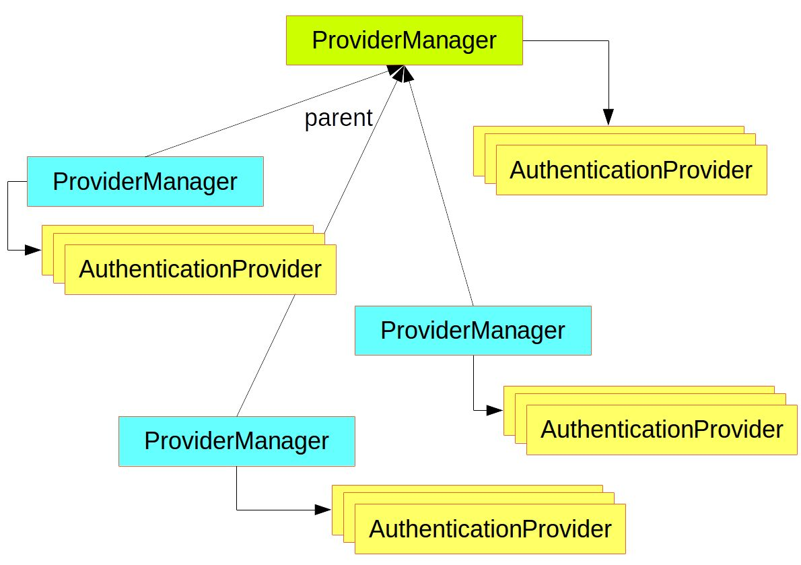
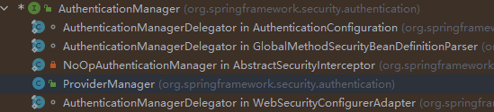
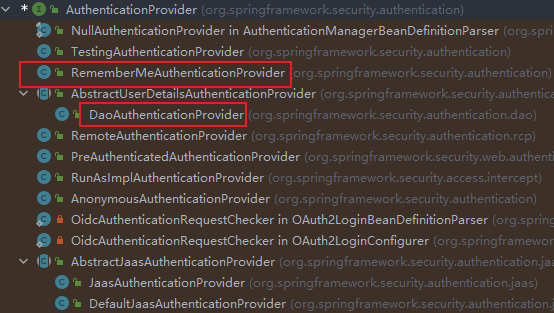

# 参考文章

- [Spring Security Architecture](https://spring.io/guides/topicals/spring-security-architecture/)

# Authentication and Access Control

authentication (who are you?) and authorization (what are you allowed to do?).

Sometimes people say “access control” instead of "authorization", which can get confusing, but it can be helpful to think of it that way because “authorization” is overloaded in other places.

# Authentication

The main strategy interface for authentication is `AuthenticationManager`, which has only one method:

```java
public interface AuthenticationManager {
  Authentication authenticate(Authentication authentication)
    throws AuthenticationException;
}
```

An `AuthenticationManager` can do one of 3 things in its `authenticate()` method:

- Return an `Authentication` (normally with `authenticated=true`) if it can verify that the input represents a valid principal.如果 authenticate 方法可以证明输入是一个有效的主体，就返回一个 Authentication 对象

- Throw an `AuthenticationException` if it believes that the input represents an invalid principal.
- Return `null` if it cannot decide.

**The most commonly used implementation of `AuthenticationManager` is `ProviderManager`, which delegates to a chain of `AuthenticationProvider` instances**

An `AuthenticationProvider` is a bit like an `AuthenticationManager`, but **it has an extra method to allow the caller to query whether it supports a given `Authentication` type:**

`AuthenticationProvider` 允许调用者去查询它是否支持一个给定的 Authentication 类型

```java
public interface AuthenticationProvider {

	Authentication authenticate(Authentication authentication)
			throws AuthenticationException;

	boolean supports(Class<?> authentication);
}
```

A `ProviderManager` can support multiple different authentication mechanisms in the same application by delegating to a chain of `AuthenticationProviders`. If a `ProviderManager` does not recognize a particular `Authentication` instance type, it is skipped

Sometimes, an application has logical groups of protected resources (for example, all web resources that match a path pattern, such as `/api/**`), and **each group can have its own dedicated `AuthenticationManager`.** Often, each of those is a `ProviderManager`, and **they share a parent. The parent is then a kind of “global” resource, acting as a fallback for all providers.**

ProviderManager 实例共享一个 parent, 这个父类用作全局资源的一种，并作为所有 Provider 的后备资源



# Authentication Managers

SpringSecurity 提供了一些帮助我们快速搭建应用程序认证管理功能的助手。最常用的一个就是：`AuthenticationManagerBuilder`。用它来搭建 in-memory user details，JDBC user details 或者 LDAP user detail 或者是添加一个自定义的 `UserDetailsService` 是非常好的

```Java
@Configuration
@EnableWebSecurity
public class WebSecurityConfig extends WebSecurityConfigurerAdapter {
    .... // other Configuration
    @Autowired
    public void initialize(AuthenticationManagerBuilder builder, DataSource dataSource) throws Exception {
        builder.jdbcAuthentication()
                .dataSource(dataSource)
                .withUser("dava")
                .password("secret")
                .roles("USER");

    }
}
```

## Authentication

该接口代表尚未认证的 token 或者是已认证的 token, 它的实现类：


```java
public interface Authentication extends Principal, Serializable {
	Collection<? extends GrantedAuthority> getAuthorities(); // 获取用户的权限

	Object getCredentials(); // 获取用户的凭证(通常指的是密码)

	Object getDetails(); // 获取一些额外的信息，至于存放一些什么信息，由程序员自己定义，如可以存放登录的验证码

	Object getPrincipal();// 通常值得是用户名

	boolean isAuthenticated(); // 判断是否已经成功认证

	void setAuthenticated(boolean isAuthenticated) throws IllegalArgumentException;
}
```

在认证成功之后，SpringSecurity 会将 Authentication 放入到 Security 的上下文中，我们可以使用如下的方式获取：

```java
Authentication authentication = SecurityContextHolder.getContext().getAuthentication();
```

因此如果想自定义实现认证逻辑可以通过 Filter 提供一个 Authentication，通常都是 UsernamePasswordAuthenticationToken 或者是它的子类

## AuthenticaitonManager

该接口用于处理认证请求

```java
public interface AuthenticationManager {
	Authentication authenticate(Authentication authentication) throws AuthenticationException; // 在该方法中处理认证请求
}
```

实现类：



实现类中最重要的就是 ProviderMananger 实现类

## ProviderManager

该实现类用于处理具体的认证处理请求，SpringSecurity 的认证逻辑基本上都在该类的 authenticate 方法中实现了，因此为了区分不同的认证方法，SpringSecurity 将它们抽象成了一个 AuthenticationProvider 接口，认证时，首先判断对应的 AuthenticationProvider 能否处理对应的认证方式，能处理然后才会调用 AuthenticationProvider 的 authenticate 方法进行认证。同时 ProviderManager 的认证方式默认是自己处理认证，如果自己处理不了时，就交给父类处理。

## AuthenticationProvider

该接口用于指示该类能够处理何种认证方式

```java
public interface AuthenticationProvider {
	Authentication authenticate(Authentication authentication) throws AuthenticationException;
	boolean supports(Class<?> authentication); // 判断是否支持该认证方式
}
```

实现类



其中比较常用的就是圈起来的：DaoAuthenticatonProvider 和 RememberMeAuthenticationProvider:

- DaoAuthenticationProvider: 可以处理 UsernamePasswordAuthenticationToken 
- RememberMeAuthenticationProvider: 可以处理 RememberMeAuthenticationToken

### DaoAuthenticaitonProvider

用户名密码方式的登录请求是调用 AbstractUserDetailsAuthenticationProvider#authenticate 方法进行认证的，在该方法中，又会调用到 DaoAuthenticationProvider#additionalAuthenticationChecks 方法做进一步的校验，去校验用户登录密码。因此我们可以自定义一个 AuthenticationProvider 代替 DaoAuthenticationProvider，并重写它里边的 additionalAuthenticationChecks 方法，在重写的过程中，加入自定义的校验逻辑即可。

这样既不破坏原有的过滤器链，又实现了自定义认证功能。

重写之后我们需要重新提供 AuthenticationManager(通常都是 ProviderManager) 和 AuthenticationProvider(这个是我们自己实现的)

```java
@Configuration
public class SecurityConfig extends WebSecurityConfigurerAdapter {
    @Bean
    MyAuthenticationProvider myAuthenticationProvider() {
        MyAuthenticationProvider myAuthenticationProvider = new MyAuthenticationProvider();
        myAuthenticationProvider.setPasswordEncoder(passwordEncoder());
        myAuthenticationProvider.setUserDetailsService(userDetailsService());
        return myAuthenticationProvider;
    }

    @Override
    @Bean
    protected AuthenticationManager authenticationManager() throws Exception {
        ProviderManager manager = new ProviderManager(Arrays.asList(myAuthenticationProvider()));
        return manager;
    }

    @Bean
    @Override
    protected UserDetailsService userDetailsService() {
        InMemoryUserDetailsManager manager = new InMemoryUserDetailsManager();
        manager.createUser(User.withUsername("javaboy").password("123").roles("admin").build());
        return manager;
    }

    @Bean
    PasswordEncoder passwordEncoder() {
        return NoOpPasswordEncoder.getInstance();
    }
}
```

## 认证流程

通过过滤器链，生成未认证的 Authentication 并交给 AuthenticationManager 去进行认证处理

Authentication 常用的实现类就是 UseranmePasswordAuthenticationToken

AuthenticationManager 常用的实现类就是 ProviderManager, 该实现类的认证方法为了实现不同的认证方式，提供了一个 AuthenticationProvider 接口，该接口中有一个方法可以判断是否能够处理该认证方式。

