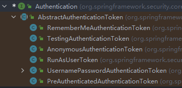
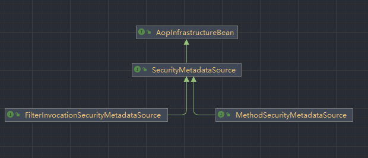

# 参考文章

- [Spring Security Architecture](https://spring.io/guides/topicals/spring-security-architecture/)

# Authentication and Access Control

authentication (who are you?) and authorization (what are you allowed to do?).

Sometimes people say “access control” instead of "authorization", which can get confusing, but it can be helpful to think of it that way because “authorization” is overloaded in other places.

# Authentication

The main strategy interface for authentication is `AuthenticationManager`, which has only one method:

```java
public interface AuthenticationManager {
  Authentication authenticate(Authentication authentication)
    throws AuthenticationException;
}
```

An `AuthenticationManager` can do one of 3 things in its `authenticate()` method:

- Return an `Authentication` (normally with `authenticated=true`) if it can verify that the input represents a valid principal.如果 authenticate 方法可以证明输入是一个有效的凭证，就返回一个 Authentication 对象

- Throw an `AuthenticationException` if it believes that the input represents an invalid principal.
- Return `null` if it cannot decide.

**The most commonly used implementation of `AuthenticationManager` is `ProviderManager`, which delegates to a chain of `AuthenticationProvider` instances**

An `AuthenticationProvider` is a bit like an `AuthenticationManager`, but **it has an extra method to allow the caller to query whether it supports a given `Authentication` type:**

`AuthenticationProvider` 允许调用者去查询它是否支持一个给定的 Authentication 类型

```java
public interface AuthenticationProvider {

	Authentication authenticate(Authentication authentication)
			throws AuthenticationException;

	boolean supports(Class<?> authentication);
}
```

A `ProviderManager` can support multiple different authentication mechanisms in the same application by delegating to a chain of `AuthenticationProviders`. If a `ProviderManager` does not recognize a particular `Authentication` instance type, it is skipped

Sometimes, an application has logical groups of protected resources (for example, all web resources that match a path pattern, such as `/api/**`), and **each group can have its own dedicated `AuthenticationManager`.** Often, each of those is a `ProviderManager`, and **they share a parent. The parent is then a kind of “global” resource, acting as a fallback for all providers.**

ProviderManager 实例共享一个 parent, 这个父类用作全局资源的一种，并作为所有 Provider 的后备资源


# Authentication Managers

SpringSecurity 提供了一些帮助我们快速搭建应用程序认证管理功能的助手。最常用的一个就是：`AuthenticationManagerBuilder`。用它来搭建 in-memory user details，JDBC user details 或者 LDAP user detail 或者是添加一个自定义的 `UserDetailsService` 是非常好的

```Java
@Configuration
@EnableWebSecurity
public class WebSecurityConfig extends WebSecurityConfigurerAdapter {
    .... // other Configuration
    @Autowired
    public void initialize(AuthenticationManagerBuilder builder, DataSource dataSource) throws Exception {
        builder.jdbcAuthentication()
                .dataSource(dataSource)
                .withUser("dava")
                .password("secret")
                .roles("USER");

    }
}
```

## Authentication

该接口代表尚未认证的 token 或者是已认证的 token, 它的实现类：



```java
public interface Authentication extends Principal, Serializable {
	Collection<? extends GrantedAuthority> getAuthorities(); // 获取用户的权限

	Object getCredentials(); // 获取用户的凭证(通常指的是密码)

	Object getDetails(); // 获取一些额外的信息，至于存放一些什么信息，由程序员自己定义，如可以存放登录的验证码

	Object getPrincipal();// 通常值得是用户名

	boolean isAuthenticated(); // 判断是否已经成功认证

	void setAuthenticated(boolean isAuthenticated) throws IllegalArgumentException;
}
```

在认证成功之后，SpringSecurity 会将 Authentication 放入到 Security 的上下文中，我们可以使用如下的方式获取：

```java
Authentication authentication = SecurityContextHolder.getContext().getAuthentication();
```

因此如果想自定义实现认证逻辑可以通过 Filter 提供一个 Authentication，通常都是 UsernamePasswordAuthenticationToken 或者是它的子类

## AuthenticaitonManager

该接口用于处理认证请求

```java
public interface AuthenticationManager {
	Authentication authenticate(Authentication authentication) throws AuthenticationException; // 在该方法中处理认证请求
}
```

实现类：


实现类中最重要的就是 ProviderMananger 实现类

## ProviderManager

该实现类用于处理具体的认证处理请求，SpringSecurity 的认证逻辑基本上都在该类的 authenticate 方法中实现了，因此为了区分不同的认证方法，SpringSecurity 将它们抽象成了一个 AuthenticationProvider 接口，认证时，首先判断对应的 AuthenticationProvider 能否处理对应的认证方式，能处理然后才会调用 AuthenticationProvider 的 authenticate 方法进行认证。同时 ProviderManager 的认证方式默认是自己处理认证，如果自己处理不了时，就交给父类处理。

### AuthenticationProvider

该接口用于指示该类能够处理何种认证方式

```java
public interface AuthenticationProvider {
	Authentication authenticate(Authentication authentication) throws AuthenticationException;
	boolean supports(Class<?> authentication); // 判断是否支持该认证方式
}
```

实现类


其中比较常用的就是圈起来的：DaoAuthenticatonProvider 和 RememberMeAuthenticationProvider:

- DaoAuthenticationProvider: 可以处理 UsernamePasswordAuthenticationToken 
- RememberMeAuthenticationProvider: 可以处理 RememberMeAuthenticationToken

#### DaoAuthenticaitonProvider

用户名密码方式的登录请求是调用 AbstractUserDetailsAuthenticationProvider#authenticate 方法进行认证的，在该方法中，又会调用到 DaoAuthenticationProvider#additionalAuthenticationChecks 方法做进一步的校验，去校验用户登录密码。因此我们可以自定义一个 AuthenticationProvider 代替 DaoAuthenticationProvider，并重写它里边的 additionalAuthenticationChecks 方法，在重写的过程中，加入自定义的校验逻辑即可。

这样既不破坏原有的过滤器链，又实现了自定义认证功能。

重写之后我们需要重新提供 AuthenticationManager(通常都是 ProviderManager) 和 AuthenticationProvider(这个是我们自己实现的)

```java
@Configuration
public class SecurityConfig extends WebSecurityConfigurerAdapter {
    @Bean
    MyAuthenticationProvider myAuthenticationProvider() {
        MyAuthenticationProvider myAuthenticationProvider = new MyAuthenticationProvider();
        myAuthenticationProvider.setPasswordEncoder(passwordEncoder());
        myAuthenticationProvider.setUserDetailsService(userDetailsService());
        return myAuthenticationProvider;
    }

    @Override
    @Bean
    protected AuthenticationManager authenticationManager() throws Exception {
        ProviderManager manager = new ProviderManager(Arrays.asList(myAuthenticationProvider()));
        return manager;
    }

    @Bean
    @Override
    protected UserDetailsService userDetailsService() {
        InMemoryUserDetailsManager manager = new InMemoryUserDetailsManager();
        manager.createUser(User.withUsername("javaboy").password("123").roles("admin").build());
        return manager;
    }

    @Bean
    PasswordEncoder passwordEncoder() {
        return NoOpPasswordEncoder.getInstance();
    }
}
```

# 参数提取

在 Security 认证的过程中，会使用 setDetails 方法对请求参数进行提取:

```java
protected void setDetails(HttpServletRequest request, UsernamePasswordAuthenticationToken authRequest) {
	authRequest.setDetails(authenticationDetailsSource.buildDetails(request));
}
```

UsernamePasswordAuthenticationToken 是 Authentication 的具体实现，实现的细节如下:

```java
public class WebAuthenticationDetailsSource implements
    AuthenticationDetailsSource<HttpServletRequest, WebAuthenticationDetails> {
	public WebAuthenticationDetails buildDetails(HttpServletRequest context) {
		return new WebAuthenticationDetails(context);
	}
}
public class WebAuthenticationDetails implements Serializable {
	private final String remoteAddress; // IP 地址
	private final String sessionId; // 会话 ID
	public WebAuthenticationDetails(HttpServletRequest request) {
		this.remoteAddress = request.getRemoteAddr();

		HttpSession session = request.getSession(false);
		this.sessionId = (session != null) ? session.getId() : null;
	}
    //省略其他方法
}
```

因此如果想提取请求中的更多参数，可以自己实现一个 AuthenticationDetailsSource 接口，返回自定义的一个 WebAuthenticationDetails 即可

```java
public class MyWebAuthenticationDetails extends WebAuthenticationDetails {
    private boolean isPassed;
    
    public MyWebAuthenticationDetails(HttpServletRequest req) {
        super(req);
        String code = req.getParameter("code");
        String verify_code = (String) req.getSession().getAttribute("verify_code");
        if (code != null && verify_code != null && code.equals(verify_code)) {
            isPassed = true;
        }
    }

    public boolean isPassed() {
        return isPassed;
    }
}

@Component
public class MyWebAuthenticationDetailsSource implements AuthenticationDetailsSource<HttpServletRequest,MyWebAuthenticationDetails> {
    @Override
    public MyWebAuthenticationDetails buildDetails(HttpServletRequest context) {
        return new MyWebAuthenticationDetails(context);
    }
}
```

最后的问题就是如何用自定义的 MyWebAuthenticationDetailsSource 代替系统默认的 WebAuthenticationDetailsSource，很简单，我们只需要在 SecurityConfig 中稍作定义即可：

```java
@Autowired
MyWebAuthenticationDetailsSource myWebAuthenticationDetailsSource;

@Override
protected void configure(HttpSecurity http) throws Exception {
    http.authorizeRequests()
            ...
            .and()
            .formLogin()
            .authenticationDetailsSource(myWebAuthenticationDetailsSource)
            ...
}
```

# 认证流程

通过过滤器链，生成未认证的 Authentication 并交给 AuthenticationManager 去进行认证处理

Authentication 常用的实现类就是 UseranmePasswordAuthenticationToken

AuthenticationManager 常用的实现类就是 ProviderManager, 该实现类的认证方法为了实现不同的认证方式，提供了一个 AuthenticationProvider 接口，该接口中有一个方法可以判断是否能够处理该认证方式。

# 过滤器

## ExceptionTranslationFilter

ExceptionTranslationFilter 位于整个 springSecurityFilterChain 过滤器链的后方，用来**转换**整个链路中出现的异常。dd它是将 Java 异常转换为 HTTP Response 的桥梁, 同时 ExceptionTranslationFilter 不做任何安全方面的处理，只关注用户交互方面的问题

ExceptionTranslationFilter 会处理在过滤器链中抛出的 `AccessDeniedException` 和 `AuthenticationException` 异常。

- 当 ExceptionTranslationFilter  检测到 `AuthenticationException` 异常时，过滤器会启动 `AuthenticationEntryPoint`, 这里可以对认证异常进行一个统一处理
- 当 ExceptionTranslationFilter  检测到 `AccessDeniedException` 异常时，该过滤器首先会判断用户是否是匿名用户，如果是匿名用户，过滤器就会启动 `AuthenticationEntryPoint`, 如果不是匿名用户，过滤器将会委托 `AccessDeniedHandler` 处理器进行处理

此过滤器的作用是处理 FilterSecurityInterceptor 中抛出的异常，然后将请求重定向到对应页面，或返回对应的响应码

## AnonymousAuthenticationFilter

匿名认证过滤器，当 SecurityContextHolder 中认证信息为空,则会创建一个匿名用户存入到 SecurityContextHolder 中。Spirng Security 为了整体逻辑的统一性，即使是未通过认证的用户，也给予了一个匿名身份。而 AnonymousAuthenticationFilter 该过滤器的位置也是非常的科学的，它位于常用的身份认证过滤器（如 UsernamePasswordAuthenticationFilter、BasicAuthenticationFilter、RememberMeAuthenticationFilter）之后，意味着只有在上述身份过滤器执行完毕后，SecurityContext依旧没有用户信息，AnonymousAuthenticationFilter 该过滤器才会有意义—-基于用户一个匿名身份。

## Listener 监听器

Listener 是 Servlet 中的一种特殊类，它们能够帮助开发者监听 web 中的特定事件，比如 ServletContext, HttpSession, ServletRequest 的创建和销毁；变量的创建、销毁和修改等。可以在某些动作前后进行处理，实现监控。

# HttpSecurity 类

HttpSecurity 就是一个构建类，它的作用就是构建出一个 SecurityFilterChain

## HttpSecurity 的属性

```java
// 配置匹配指定 ant 表达式的请求的处理流程，即在 security 的配置类中使用 antMatchers 方法配置的规则
private final RequestMatcherConfigurer requestMatcherConfigurer;

// 过滤器链
private List<OrderedFilter> filters = new ArrayList<>();

// 这个匹配器会匹配所有的请求
private RequestMatcher requestMatcher = AnyRequestMatcher.INSTANCE;

// 将过滤器链中的过滤器按照 @Order 注解指定的顺序从小到大排序，越小优先级越高
private FilterOrderRegistration filterOrders = new FilterOrderRegistration();

// 认证管理器
private AuthenticationManager authenticationManager;
```

`HttpSecurity` 维护了一个过滤器的列表，这个过滤器的列表最终放入了 `DefaultSecurityFilterChain` 这个过滤器链中

`HttpSecurity` 提供了很多的配置用于处理和维护我们的过滤器列表

# SecurityFilterChain

```java
public interface SecurityFilterChain {
    // 判断当前请求是否匹配，匹配时，就将请求交给该对应的过滤器链进行处理
    boolean matches(HttpServletRequest request);
    // 过滤器组成的有序过滤器链
    List<Filter> getFilters();
}
```

一个应用中可以存在多个 SecurityFilterChain, 并且这些过滤器链由 FilterChainProxy 来进行管理

## FilterChainProxy

FilterChainProxy 是一个 GenericFilterBean(既是 Servlet Filter 又是 Spring Bean)，它管理了所有注入到 Spring Ioc 容器中的 SecurityFilterChain

FilterChainProxy 的主要作用就是将 url 规则与 SecurityFilterChain 对应起来，实现特定的 url 使用特定的 SecurityFilterChain 过滤器链

# DelegatingFilterProxy

标准 Servlet 过滤器的代理，DelegatingFilterProxy 会委托给一个实现了 Filter 接口并且被 Spring 管理的 Bean 进行过滤处理。在实例化 DelegatingFilterProxy 时，可以传递一个需要委托的 Filter 在 Spring 容器中的 name 作为参数， 假设为  A。 指定了委托之后，所有对 DelegatingFilterProxy 过滤器的调用都会被委托给 Filter A 进行处理, 即调用 Filter A 的 doFilter 方法, 通常这个 Filter A  为 FilterChainProxy，大致流程如下图：


本质上来说 DelegatingFilterProxy 就是一个 Filter，其间接实现了 Filter 接口，但是 **在 doFilter 方法中其实调用的是从 Spring 容器中获取到的委托 Filter 的 doFilter 方法。**

## DelegatingFilterProxy 的作用

- 通过 Spring 容器来管理 Servlet Filter 的生命周期
- 可以通过 Spring 进行配置并且可以使用 Spring 容器中的对象和属性

# 在 Spring Boot 中添加 Filter

Spring Boot 会自动扫描所有 `FilterRegistrationBean` 类型的 Bean，然后，将它们返回的 `Filter` 自动注册到 Servlet 容器中，无需任何配置

`FilterRegistrationBean` 本身不是 `Filter`，它实际上是 `Filter` 的工厂。Spring Boot 会调用 `getFilter()`，把返回的 `Filter` 注册到 Servlet 容器中。因为我们可以在 `FilterRegistrationBean` 中注入需要的资源

# 动态权限实现

## 实现方式

Spring Security 目前实现动态权限的方法有如下几种：

1. 实现 `FilterInvocationSecurityMetadataSource` 接口
2. 基于 SpEL 表达式的方式
3. 实现 `AuthorizationManager`接口(Spring Security 5.6+ 版本支持)

## FilterInvocationSecurityMetadataSource 接口

实现 `FilterInvocationSecurityMetadataSource` 接口是 `Spring Security 5.6` 版本之前用于实现动态权限设置的方案。

## SecurityMetadataSource 接口

要实现动态权限的验证，需要有资源所需要的权限，`Spring Security` 通过 `SecurityMetadataSource` 接口来获取资源(uri)所需要的权限。`FilterInvocationSecurityMetadataSource` 接口继承于 `SecurityMetadataSource` 接口，并且没有新增任何需要实现的方法，因此该接口是一个标识接口：

```java
public interface SecurityMetadataSource extends AopInfrastructureBean {  
    Collection<ConfigAttribute> getAttributes(Object object) throws IllegalArgumentException;  
  
    Collection<ConfigAttribute> getAllConfigAttributes();  
  
    boolean supports(Class<?> clazz);  
}

public interface FilterInvocationSecurityMetadataSource extends SecurityMetadataSource {  
    
}
```

- `getAttributes(Object obejct)`：获取指定资源(接口)需要的权限(角色)。该方法通常会配合 `boolean supports(Class<?> clazz)` 方法使用，从而确保安全对象能被 `SecurityMetadataSource` 所支持之后在调用该方法
- `supports(Class<?> clazz)`: 判断是否支持指定的类，如果该方法返回 true，则可以对  getAttributes(Object obejct) 方法中的object 参数进行一个安全的类型转换，在 Web 项目中，object 的类型通常都是 `FilterInvocation` 类型，当然也可以直接返回 true。
-  在项目启动时，AbstractSecurityInterceptor 会对该方法返回的 ConfigAttribute 对象进行校验操作。

### 继承关系



- MethodSecurityMetadataSource： 表示的是方法上定义的权限信息，即使用 @PreAuthorize 等注解上定义的权限信息。通过实现该接口，可以自定义注解来配置对应的权限配置
- FilterInvocationSecurityMetadataSource：通常表示的 web 请求配置的权限信息，通过实现该接口，可以自定义配置每个请求所需要的权限信息。

通常我们在项目中实现的就是 `FilterInvocationSecurityMetadataSource` 接口。

## AccessDecisionManager 接口

`AccessDecisionManager` 接口的作用就是用于判断用户是否具备访问当前资源的权限。

```java
public interface AccessDecisionManager {  
  
   void decide(Authentication authentication, Object object, Collection<ConfigAttribute> configAttributes)  
         throws AccessDeniedException, InsufficientAuthenticationException;  
  
    boolean supports(ConfigAttribute attribute);  
  
    boolean supports(Class<?> clazz);  
}
```

## 授权的过程：

1. 首先通过 `SecurityMetadataSource#getAttributes()` 方法获取资源(接口)所需要的权限(角色)
2. 在 `AccessDecisionManager` 中判断用户是否具备资源(接口)所需要的权限

## 具体代码实现

