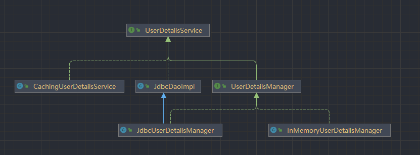

# SpringSecurity

SpringSecurity 中的认证(Authentication)和授权(Authorization) 是分开的，因此无论使用什么认证方式，都不会影响授权，这种独立带来的好处就是 SpringSecurity 可以非常方便的整合一些外部的认证方式。

## 认证(Authentication)

在 SpringSecurity 中，用户的认证信息被保存在 Authentication 的实现类中

```java
public interface Authentication extends Principal, Serializable {
    // 用于获取用户的权限
    Collection<? extends GrantedAuthority> getAuthorities();
    
    // 用来获取用户的凭证，一般来说是密码
    Object getCredentials();
    
    // 用来获取用户携带的详细信息，可能是当前请求之类等
    Object getDetails();
    
    // 用来获取当前用户，例如是一个用户名或者一个用户实体
    Object getPrincipal();
    
    // 判断是否认证成功，如果返回 true 则之后的每个请求将不会在通过 AuthenticationMananger 进行认证，从而提升执行效率
    boolean isAuthenticated();
    
    void setAuthenticated(boolean isAuthenticated) throws IllegalArgumentException;
}
```

Authentication 的结构图


当用户使用用户名/密码登录或者使用 Remember-me 功能登录时，都会对应一个不同的 Authentication 实例。

SpringSecurity 中的认证工作主要是由 AuthenticationManager 接口来负责

```java
public interface AuthenticationManager {
	Authentication authenticate(Authentication authentication) throws AuthenticationException;
}
```

该方法有三个不同的返回值：

- 返回 Authentication 表示认证成功
- 抛出 AuthenticationException 异常表示用户输入了无效的凭证
- null 表示不能够确定

AuthenticationManager 最主要的实现类是 ProviderManager, ProviderManager 管理了众多的 AuthenticationProvider 实例。AuthenticationProvider 有点类似于 AuthenticationManager。但是它多了一个 supports 方法用来判断是否支持给定的 Authentication 类型


```java
public interface AuthenticationProvider {
	Authentication authenticate(Authentication authentication) throws AuthenticationException;
	boolean supports(Class<?> authentication);
}
```

由于 Authentication 拥有众多不同的实现类，这些不同的实现类又由不同的 AuthenticationProvider 来处理，所以 AuthenticationProvider 会有一个 supports 方法，用来判断当前的 Authentication Provider 是否支持对应的 Authentication。

在一次完整的认证流程中，可能会同时存在多个 AuthenticationProvider (例如，项目同时支持 form 表单登录和短信验证码登录)，多个 AuthenticationProvider 统一由 ProviderManager 来管理。同时，ProviderManager 具有一个可选的 parent, 如果所有的 AuthenticationProvider 都认证失败，那么就会调用 parent 进行认证。parent 相当于一个备用认证方式，即各个 AuthenticationProvider 都无法处理认证问题的时候，就由 parent 出场收拾残局。

## 授权(Authorization)

在 Spring Security 的授权体系中，有两个关键的接口

- AccessDecisionManager
- AccessDecisionVoter

AccessDecisionVoter 是一个投票器，投票器会检查用户是否具备应有的角色，进而投出赞成、反对或者弃权票；

AccessDecisionManager 则是一个决策器，来决定此次访问是否被允许。

AccessDecisionVoter 和 AccessDecisionManager 都有众多的实现类，在 AccessDecisionManager 中会挨个遍历 AccessDecisionVoter, 进而决定是否允许用户访问，因而 AccessDecisionVoter 和 AccessDecisionManager 两者的关系类似于 AuthenticationProvider 和 ProviderManager 的关系。

在 Spring Security 中，用户请求一个资源（通常是一个网络接口或者一个 Java 方法）所需要的角色会被封装成一个 ConfigAttribute 对象，在 ConfigAttribute 中只有一个 getAttribute 方法，该方法返回一个 String 字符串，就是角色的名称。一般来说，角色名称都带有一个 ROLE 前缀，投票器 AccessDecisionVoter 所做的事情，其实就是比较用户所具备的角色和请求某个资源所需的 ConfigAttribute 之间的关系。

# SpringSecurity 的使用

在 Java Web 工程中，一般使用 Servlet 过滤器（Filter）对请求进行拦截，然后在 Filter 中通过自己的验证逻辑来决定是否放行请求。同样地， Spring Security 也是基于这个原理，在进入到 DispatcherServlet 前就可以对 Spring MVC 的请求进行拦截，然后通过一定的验证，从而决定是否放行请求访问系统。

为了对请求进行拦截，Spring Security 提供了过滤器 DelegatingFilterProxy 类给予开发者配置。

在 Web 工程中可以使用 @EnableWebSecurity 来驱动 Spring Security 的启动，如果属于非 Web 工程，可以使用 @EnableGlobalAuthentication ，而事实上 @EnableWebSecurity 上已经标注了 @EnableGlobalAuthentication 并且依据自己的需要加入了许多 Web 的特性。

## 过滤器(Filter)

SpringSecurity 的认证和授权等功能都是基于过滤器来实现的，常见的过滤器以及默认加载的过滤器如下表

| 过滤器                                   | 描述                                                         | 默认加载 |
| ---------------------------------------- | ------------------------------------------------------------ | -------- |
| ChannelProcessingFilter                  | 过滤请求协议，如 HTTPS 和 HTTP                               | NO       |
| WebAsyncManagerIntergrationFilter        | 将 WebAsyncManager 与 SpringSecurity 上下文进行集成          | YES      |
| SecurityContextPersistenceFilter         | 在处理请求之前，将安全信息加载到 SecurityContextHolder 中以方便后续使用。请求结束后，再擦除 SecurityContextHolder 中的信息 | YES      |
| HeaderWriterFilter                       | 头信息加入到响应中                                           | YES      |
| CorsFilter                               | 处理跨域问题                                                 | NO       |
| CsrfFilter                               | 处理 CSRF 攻击                                               | YES      |
| LogoutFilter                             | 处理注销登录                                                 | YES      |
| OAuth2AuthorizationRequestRedirectFilter | 处理 OAuth2 认证重定向                                       | NO       |
| Saml2WebSsoAuthenticationRequestFilter   | 处理 SAML 认证                                               | NO       |
| X509AuthenticationFilter                 | 处理 X509 认证                                               | NO       |
| AbstractPreAuthenticatedProcessingFilter | 处理预认证问题                                               | NO       |
| CasAuthenticationFilter                  | 处理 CAS 单点登录                                            | NO       |
| OAuth2LoginAuthenticationFilter          | 处理 OAuth2 认证                                             | NO       |
| Saml2WebSsoAuthenticationFilter          | 处理 SAML 认证                                               | NO       |
| UsernamePasswordAuthenticationFilter     | 处理表单登录                                                 | YES      |
| OpenIDAuthenticationFilter               | 处理 OpenID 认证                                             | NO       |
| DefaultLoginPageGeneratingFilter         | 配置默认登录页面                                             | YES      |
| DefaultLogoutPageGeneratingFilter        | 配置默认注销页面                                             | YES      |
| ConcurrentSessionFilter                  | 处理 Session 有效期                                          | NO       |
| DigestAuthenticationFilter               | 处理 HTTP 摘要认证                                           | NO       |
| BearerTokenAuthenticationFilter          | 处理 OAuth2 认证时的 AccessToken                             | NO       |
| BasicAuthenticationFilter                | 处理 HttpBasic 登录                                          | YES      |
| RequestCacheAwareFilter                  | 处理请求缓存                                                 | YES      |
| SecurityContextHolderAwareRequestFilter  | 包装原始请求                                                 | YES      |
| JaasApiIntegrationFilter                 | 处理 JAAS 认证                                               | NO       |
| RememberMeAuthenticationFilter           | 处理 RememberMe 登录                                         | NO       |
| AnonymousAuthenticationFilter            | 处理匿名认证                                                 | YES      |
| OAuth2AuthorizaiotnCodeGrantFilter       | 处理 OAuth2 认证中的授权码                                   | NO       |
| SessionManagementFilter                  | 处理 Session 并发问题                                        | YES      |
| ExceptionTranslationFilter               | 处理异常认证/授权的情况                                      | YES      |
| FilterSecurityInterceptor                | 处理授权                                                     | YES      |
| SwitchUserFilter                         | 处理账户切换                                                 | NO       |

上面的这些过滤器按照既定的优先级排列，最终形成一个过滤器链。我们在使用 SpringSecurity 的时候，也可以自定义过滤器，并通过 @Order 注解去调整自定义过滤器在过滤器链中的位置

**注意: **默认过滤器并不是直接放在 Web 项目的原生过滤器链中，而是通过一个 FilterChainProxy 来统一管理。Spring Security 中的过滤器链通过 FilterChainProxy 嵌入到 Web 项目的原生过滤器链中，如图1-1所示。


在 Spring Security 中，这样的过滤器链不仅仅只有一个，可能会有多个，如图 1-2 所示。当存在多个过滤器链时，多个过滤器链之间要指定优先级，当请求到达后，会从 FilterChainProxy 进行分发，先和哪个过滤器链匹配上，就用哪个过滤器链进行处理。当系统中存在多个不同的认证体系时，那么使用多个过滤器链就非常有效。


FilterChainProxy 作为一个顶层管理者，将统一管理 Security Filter。**FilterChainProxy 本身将通过 Spring 框架提供的DelegatingFilterProxy 整合到原生过滤器链中**，所以图 1-2 还可以做进一步的优化，如图 1-3 所示。


## 登录数据保存

当用户登录成功后，Spring Security 会将登录成功的用户信息保存到 SecurityContextHolder 中。SecurityContextHolder 中的数据保存默认是通过 ThreadLocal 来实现的，使用 ThreadLocal 创建的变量只能被当前线程访问，不能被其他线程访问和修改，也就是**用户数据和请求线程绑定在一起**。当登录请求处理完毕后，Spring Security 会将 SecurityContextHolder 中的数据拿出来保存到 Session 中，同时将 SecurityContextHolder 中的数据清空。以后每当有请求到来时，Spring Security 就会先从 Session 中取出用户登录数据，保存到 SecurityContextHolder 中，方便在该请求的后续处理过程中使用，同时在请求结束时将 SecurityContextHolder 中的数据拿出来保存到 Session 中，然后将 SecurityContextHolder 中的数据清空。

这一策略非常方便用户在 Controller 或者 Service 层获取当前登录用户数据，但是带来的另外一个问题就是，在子线程中想要获取用户登录数据就比较麻烦。Spring Security 对此也提供了相应的解决方案，如果开发者使用 @Asyc 注解来开启异步任务的话，那么只需要添加如下配置，使用 Spring Security 提供的异步任务代理，就可以在异步任务中从 SecurityContextHolder 里边获取当前登录用户的信息：

```java
@Configuration
public class ApplicationConfiguration extends AsyncConfigurerSupport{
    @Override
	public Executor getAsyncExecutor(){
		return new DelegatingSecurityContextExecutorService(Executors.newFixedThreadPool(5));
    }
}
```

### 登录用户数据的获取

在 Spring Security 中，用户登录信息本质上还是保存在 HttpSession 中，但是为了方便使用，Spring Security 对 HttpSession 中的用户信息进行了封装，封装之后，开发者若再想获取用户登录数据就会有两种不同的思路：

- 从 SecurityContextHolder 中获取。
- 从当前请求对象中获取

无论是哪种获取方式，都离不开一个重要的对象：Authentication。在 Spring Security 中，Authentication 对象主要有两方面的功能：

- 作为 AuthenticationManager 的输入参数，提供用户身份认证的凭证，当它作为一个输入参数时，它的 isAuthenticated 方法返回 false, 表示用户还未认证。
- true 代表已经经过身份认证的用户，此时的 Authentication 可以从 SecurityContext 中获取。

一个 Authentication 对象主要包含三个方面的信息：

1. principal: 定义认证的用户。如果用户使用用户名/密码的方式登录，principal 通常就是一个 UserDetails 对象。
2. credentials: 登录凭证，一般就是指密码。当用户登录成功之后，登录凭证会被自动擦除，以防止泄漏。
3. authorities: 用户被授予的权限信息。

在 Spring Security 中，只要能够拿到 Authentication 对象，就可以获取到登录用户的详细信息

### 从 SecurityContextHolder 中获取 Authentication

```java
@GetMapping("/info")
public void userInfo(){
    Authentication authentication = SecurityContextHolder.getContext().getAuthentication();
    String username = authentication.getName();
    Collection<? extends GrantedAuthority> authorities = authentication.getAuthorities();
    System.out.println(username);
    System.out.println("authorities: " + authorities);
}
```

## SecurityContextHolder

SecurityContextHolder、ContextHolder、Authentication 三者之间的关系


### 从当前请求对象中获取

```java
@GetMapping("/authentication")
public void authentication(Authentication authentication){
    System.out.println("authentication: " + authentication);
}

@GetMapping("/principal")
public void principal(Principal principal){
    System.out.println("principal: " + principal);
}

```

开发者可以直接在 Controller 的请求参数中放入 Authentication 对象来获取登录用户信息。通过前面的讲解，大家已经知道 Authentication 是 Principal 的子类，所以也可以直接在请求参数中放入 Principal 来接收当前登录用户信息。需要注意的是，即使参数是 Principal, 真正的实例依然是 Authentication 的实例。

用过 Spring MVC 的读者都知道，**Controller 中方法的参数都是当前请求 HttpServletRequest 带来的**。毫无疑问，前面的 Authentication 和 Principal 参数也都是 HttpServletRequest 带来的，那么这些数据到底是何时放入 HttpServletRequest 的呢？又是以何种形式存在的呢？接下来我们一起分析一下。

如果使用了 Spring Security 框架，那么我们在 Controller 参数中拿到的 HttpServletRequest 实例将是 Servlet3SecurityContextHolderAwareRequestWrapper, 很明显，这是被 Spring Security 封装过的请求。


在 Servlet 规范中，最早有三个和安全管理相关的方法：

```java
public String getRemoteUser();
public boolean isUserInRole(String role);
public java.security.Principal getUserprincipal();
```

- getRemoteUser 方法用来获取登录用户名。

- isUserInRole 方法用来判断当前登录用户是否具备某一个指定的角色。

- getUserPrincipal 方法用来获取当前认证主体。

从 Servlet3.0 开始，在这三个方法的基础之上，又增加了三个和安全管理相关的方法：

```java
public boolean authenticate(HttpServletResponse response) throws IOException,ServletException;
public void login(String username,String password)throws ServletException;
public void logout (throws ServletException;
```

- authenticate 方法可以判断当前请求是否认证成功。
- login 方法可以执行登录操作。
- logout 方法可以执行注销操作。

SecurityContextHolderAwareRequestWrapper 类主要实现了 Servlet3.0 之前和安全管理相关的三个方法，也就是 getRemoteUser()、 isUserInRole(String) 以及 getUserPrincipal()。Servlet3.0 中新增的三个安全管理相关的方法，则在Servlet3SecurityContextHolderAwareRequestWrapper 类中实现。获取用户登录信息主要和前面三个方法有关，因此这里我们主要来看一下SecurityContextHolderAwareRequestWrapper 类中相关方法的实现。

SecurityContextHolderAwareRequestWrapper 类其实非常好理解：

- getAuthentication: 该方法用来获取当前登录对象 Authentication, 获取方式就是我们前面所讲的从 SecurityContextHolder 中获取。如果不是匿名对象就返回，否则就返回 null。
- getRemoteUser: 该方法返回了当前登录用户的用户名，如果 Authentication 对象中存储的 Principal 是当前登录用户对象，则返回用户名；如果 Authentication 对象中存储的 Principal 是当前登录用户名（字符串），则直接返回即可。
- getUserPrincipal: 该方法返回当前登录用户对象，其实就是 Authentication 的实例。
- isGranted:该方法是一个私有方法，作用是判断当前登录用户是否具备某一个指定的角色。判断逻辑也很简单，先对传入进来的角色进行预处理，有的情况下可能需要添加 ROLE 前缀，然后调用 Authentication#getauthorities 方法，获取当前登录用户所具备的所有角色，最后再和传入进来的参数进行比较。
- isUserInRole: 该方法调用 isGranted 方法，进而实现判断当前用户是否具备某一个指定角色的功能。

看到这里，相信读者己经明白了，在使用了Spring Security之后，我们通过 HttpServletRequest 就可以获取到很多当前登录用户信息了，代码如下：

```java
@GetMapping("/requestInfo")
public void info(HttpServletRequest request){
    String remoteUser = request.getRemoteUser();
     Authentication authentication = (Authentication) request.getUserPrincipal();
    boolean flag = request.isUserInRole("admin");
    System.out.println("remoteUser: " + remoteUser);
    System.out.println("authentication: " + authentication);
    System.out.println("Is admin: " + flag);
}
```

对请求的 HttpServletRequest 包装之后，接下来在过滤器链中传递的 HttpServletRequest 对象，它的 getRemoteUser()、isUserInRole(String) 以及 getUserPrincipal() 方法就可以直接使用了。

HttpServletRequest 中 getUserPrincipal() 方法有了返回值之后，最终在 Spring MVC 的 ServletRequestMethodArgumentResolver#resolveArgument(`Class<?>,HttpServletRequest`) 进行默认参数解析，自动解析出 Principal 对象。开发者在 Controller 中既可以通过 Principal 来接收参数，也可以通过 Authentication 对象来接收。

## UserDetails 接口

该接口用于规范开发者自定义用户对象，接口定义如下

```java
public interface UserDetails extends Serializable {
    // 获取用户的权限
    Collection<? extends GrantedAuthority> getAuthorities();
    String getPassword();
    String getUsername();
    boolean isAccountNonExpired();
    boolean isAccountNonLocked();
    // 判断凭证是否过期
    boolean isCredentialsNonExpired();
    // 判断当前账号是否可用
    boolean isEnabled();
}
```

## UserDetailsService 接口

UserDetailsService 接口负责提供用户数据源，该接口只有一个查询用户的方法

```java
public interface UserDetailsService{
    UserDetails loadUserByUsername(String username) throws UsernameNotFoundException;
}
```

继承链如下：




- UserDetailsManager 在 UserDetailsService 的基础上，继续定义了添加用户、更新用户、删除用户、修改密码以及判断用户是否存在共 5 种方法。
- JdbcDaoImpl 在 UserDetailsService 的基础上，通过 spring-jdbc 实现了从数据库中查询用户的方法。
- InMemoryUserDetailsManager 实现了 UserDetailsManager 中关于用户的增删改查方法，不过都是基于内存的操作，数据并没有持久化。
- JdbcUserDetailsManager 继承自 JdbcDaoImpl 同时又实现了 UserDetailsManager 接口，因此可以通过 JdbcUserDetailsManager 实现对用户的增删改查操作，这些操作都会持久化到数据库中。不过 JdbcUserDetailsManager 有一个局限性，就是操作数据库中用户的 SQL 都是提前写好的，不够灵活，因此在实际开发中 JdbcUserDetailsManager 使用并不多。

如果引入 SpringSecurity 的依赖而不进行任何的配置，那么默认使用 InMemoryUserDetailsManager 提供的用户。有两个比较重要的条件促使系统自动提供一个 InMemoryUserDetailsManager 的实例：

1. 当前 classpath 下存在 AuthenticationManager 类。
2. 当前项目中，系统没有提供 AuthenticationManager、AuthenticationProvider、UserDetailsService 以及ClientRegistrationRepository 实例。

默认情况下，上面的条件都满足时，SrpingSecurity 才会提供一个 InMemoryUserDetailsManager 实例。并且会创建一个用户名为 user ，密码随机生成的一个用户，并在启动应用的时候，在日志中打印随机生成的密码。如果不想要随机生成的用户，可以在配置文件中进行如下的配置：

```yaml
spring:
  security:
    user:
      name: autmaple
      password: 111000
      roles:
        - admin
        - user
```

## 认证用户自定义

自定义用户其实就是使用 UserDetailsService 的不同实现类来提供用户数据，同时将配置好的 UserDetailsService 配置给 Authentication ManagerBuilder,系统再将 UserDetailsService 提供给 AuthenticationProvider 使用。

## AuthenticationSuccessHandler 和 AuthenticationFailureHandler 

设置用户认证成功之后的处理器

```java
public class LoginSuccessHandler implements AuthenticationSuccessHandler {
    @Override
    public void onAuthenticationSuccess(HttpServletRequest request,
                                        HttpServletResponse response,
                                        Authentication authentication) throws IOException, ServletException {
        response.setContentType("application/json;charset=utf-8");
        HashMap<String, Object> data = new HashMap<>();
        data.put("status", 200);
        data.put("msg", "登录成功");
        ObjectMapper mapper = new ObjectMapper();
        String res = mapper.writeValueAsString(data);
        response.getWriter().write(res);
    }
}
```

```java
public class SecurityConfig extends WebSecurityConfigurerAdapter {
    @Override
    protected void configure(HttpSecurity http) throws Exception {
        http.authorizeHttpRequests()
                .anyRequest().authenticated()
                .and()
                .formLogin()
                .loginPage("/login")
                .loginProcessingUrl("/doLogin")
                .successHandler(new LoginSuccessHandler());
    }
}
```

## 过滤器链

### ObjectPostProcessor

ObjectPostProcessor 是 Spring Security 中使用频率最高的组件之一，它是一个对象后置处理器，也就是当一个对象创建成功后，如果还有一些额外的事情需要补充，那么可以通过 ObjectPostProcessor 来进行处理。这个接口中默认只有一个方法 postProcess,该方法用来完成对对象的二次处理，代码如下：

```java
public interface ObjectPostProcessor<T>{
      <O extends T>O postProcess (O object);
}
```

ObjectPostProcessor 有两个实现类：

- AutowireBeanFactoryObjectPostProcessor: 由于Spring Security 中大量采用了 Java 配置，许多过滤器都是直接 new 出来的，这些直接 new 出来的对象并不会自动注入到 Spring 容器中。Spring Security 这样做的本意是为了简化配置，但是却带来了另外一个问题就是，大量 new 出来的对象需要我们手动注册到 Spring 容器中去。AutowireBeanFactoryObjectPostProcessor 对象所承担的就是这件事，一个对象 new 出来之后，只要调用 AutowireBeanFactoryObjectPostProcessor#postProcess 方法，就可以成功注入到 Spring 容器中，它的实现原理就是通过调用 Spring 容器中的 AutowireCapableBeanFactory 对象将一个 new 出来的对象注入到 Spring 容器中去。
- CompositeObjectPostProcessor: 这是 ObjectPostProcessor 的另一个实现，一个对象可以有一个后置处理器，开发者也可以自定义多个对象后置处理器。CompositeObjectPostProcessor 是一个组合的对象后置处理器，它里边维护了一个 List 集合，集合中存放了某一个对象的所有后置处理器，当需要执行对象的后置处理器时，会遍历集合中的所有 ObjectPostProcessor 实例，分别调用实例的 postProcess 方法进行对象后置处理。在 Spring Security 框架中，最终使用的对象后置处理器其实就是 CompositeObjectPostProcessor ,它里边的集合默认只有一个对象，就是 AutowireBeanFactoryObjectPostProcessor

在 Spring Security 中，开发者可以灵活地配置项目中需要哪些 Spring Security 过滤器，一旦选定过滤器之后，每一个过滤器都会有一个对应的配置器，叫作 xxxConfigurer (例如 CorsConfigurer、CsrfConfigurer 等)。过滤器都是在 xxxConfigurer 中 new 出来的，然后在 postProcess 方法中处理一遍，就将这些过滤器注入到 Spring 容器中了。

这是对象后置处理器 ObjectPostProcessor 的主要作用。

#### ObjectPostProcessor 的使用

前面介绍了 ObjectPostProcessor 的基本概念。相信读者己经明白，所有的过滤器都由对应的配置类来负责创建，配置类在将过滤器创建成功之后，会调用父类的 postProcess 方法，该方法最终会调用到 CompositeObjectPostProcessor 对象的 postProcess 方法，在该方法中，会遍历 CompositeObjectPostProcessor 对象所维护的 List 集合中存储的所有 ObjectPostProcessor 对象，并调用其postProcess方法对对象进行后置处理。默认情况下，CompositeObjectPostProcessor 对象中所维护的 List 集合中只有一个对象那就是 AutowireBeanFactoryObjectPostProcessor,调用 AutowireBeanFactoryObjectPostProcessor 的 postProcess 方法可以将对象注册到Spring 容器中去。

开发者可以自定义 ObjectPostProcessor 对象，并添加到 CompositeObjectPostProcessor 所维护的 List 集合中，此时，当一个过滤器在创建成功之后，就会被两个对象后置处理器处理，第一个是默认的对象后置处理器，负责将对象注册到 Spring 容器中：第二个是我们自定义的对象后置处理器，可以完成一些个性化配置。

自定义 ObjectPostProcessor 对象比较典型的用法是动态权限配置，为了便于大家理解，笔者这里先通过一个大家熟悉的案例来展示 ObjectPostProcessor 的用法

```java
public class SecurityConfig extends WebSecurityConfigurerAdapter {
    @Override
    protected void configure(HttpSecurity http) throws Exception {
        http.authorizeHttpRequests()
                .anyRequest().authenticated()
                .and()
                .formLogin()
                .withObjectPostProcessor(new ObjectPostProcessor<UsernamePasswordAuthenticationFilter>() {
                    @Override
                    public <O extends UsernamePasswordAuthenticationFilter> O postProcess(O object) {
                        object.setUsernameParameter("name");
                        object.setPasswordParameter("passwd");
                        object.setAuthenticationSuccessHandler((req, res, auth) -> {
                            res.getWriter().write("Login Success");
                        });
                        return object;
                    }
                }).and().csrf().disable();
    }
}
```

### SecurityFilterChain

```java
public interface SecurityFilterchain{
    boolean matches (HttpServletRequest request);
	List<Filter>getFilters();
}
```

- matches: 该方法用来判断 request 请求是否应该被当前过滤器链所处理。
- getFilters: 该方法返回一个 List 集合，集合中存放的就是 Spring Security 中的过滤器。换言之，如果 matches 方法返回 true, 那么 request 请求就会在 getFilters 方法所返回的 Filter 集合中被处理。

SecurityFilterChain 只有一个默认的实现类就是 DefaultSecurityFilterChain, 其中定义了两个属性，并具体实现了 SecurityFilterChain 中的两个方法。

### 过滤器链的顺序

SpringSecurity 中在加载完 Filter 之后，会对 Filter 做一个排序，排序后的顺序如下：

1. ChannelProcessingFilter
2. WebAsyncManagerIntegrationFilter
3. SecurityContextPersistenceFilter
4. HeaderWriterFilter
5. CorsFilter
6. CsrfFilter
7. LogoutFilter
8. OAuth2AuthorizationRequestRedirectFilter
9. Saml2WebSsoAuthenticationRequestFilter
10. X509AuthenticationFilter
11. AbstractPreAuthenticatedProcessingFilter
12. CasAuthenticationFilter
13. OAuth2LoginAuthenticationFilter
14. Saml2WebSsoAuthenticationFilter
15. UsernamePasswordAuthenticationFilter
16. OpenlDAuthenticationFilter
17. DefaultLoginPageGeneratingFilter
18. DefaultLogoutPageGeneratingFilter
19. ConcurrentSessionFilter
20. DigestAuthenticationFilter
21. BearerTokenAuthenticationFilter
22. BasicAuthenticationFilter
23. RequestCacheAwareFilter
24. SecurityContextHolderAwareRequestFilter
25. JaasApiIntegrationFilter
26. RememberMeAuthenticationFilter
27. AnonymousAuthenticationFilter
28. OAuth2AuthorizationCodeGrantFilter
29. SessionManagementFilter
30. ExceptionTranslationFilter
31. DynamicSecurityFilter
32. FilterSecurityInterceptor


## HttpSecurity

HttpSecurity 的主要作用是用来构建一条过滤器链，并反映到代码上，也就是构建一个 DefaultSecurityFilterChain 对象。一个 DefaultSecurityFilterChain 对象包含一个路径匹配器和多个 Spring Security 过滤器，HttpSecurity 中通过收集各种各样的 xxxConfigurer,将 Spring Security 过滤器对应的配置类收集起来，并保存到父类 AbstractConfiguredSecurityBuilder 的 configurers 变量中，在后续的构建过程中，再将这些 xxxConfigurer 构建为具体的 Spring Security 过滤器，同时添加到 HttpSecurity 的 filters 对象中。

## SpringSecurity 的原理

一旦启用了 Spring Security，Spring IoC 容器就会为你创建一个名称为 springSecurityFilterChain 的 Spring Bean。它的类型为 FilterChainProxy，事实上它也实现了 Filter 接口，只是它是一个特殊的拦截器。在 Spring Security 操作的过程中它会提供 Servlet 过滤器 DelegatingFilterProxy，这个过滤器会通过 Spring Web IoC 容器去获取 Spring Security
所自动创建的 FilterChainProxy 对象，这个对象上存在一个拦截器列表（List），列表上存在用户验证的拦截器、跨站点请求伪造等拦截器，这样它就可以提供多种拦截功能。于是焦点又落到了
FilterChainProxy 对象上，通过它还可以注册 Filter，也就是允许注册自定义的 Filter 来实现对应的拦截逻辑，以满足不同的需要。当然，Spring Security 也实现了大部分常用的安全功能，并提供了相应的机制来简化开发者的工作，所以大部分情况下并不需要自定义开发，使用它提供的机制即可。

## 自定义配置

为了给 FilterChainProxy 对象加入自定义的初始化，SpringSecurity 提供了 SecurityConfigurer 接口，通过它就能够实现对 Spring Security 的配置。只是有了这个接口还不太方便，因为它只是能够提供接口定义的功能，为了更方便，Spring 对 Web 工程还提供了专门的接口 WebSecurityConfigurer，并且在这个接口的定义上提供了一个抽象类 WebSecurityConfigurerAdapter。开发者通过继承它就能得到 Spring Security 默认的安全功能。也可以通过覆盖它提供的方法，来自定义自己的安全拦截方案。这里需要研究 WebSecurityConfigurerAdapter 中默认存在的 3 个方法:

```java
/**
* 用来配置用户签名服务，主要是 user-details 机制，你还可以给予用户赋予角色
* @param auth 签名管理器构造器,用于构建用户具体权限控制
*/
protected void configure(AuthenticationManagerBuilder auth);
/**
* 用来配置 Filter 链
*@param web Spring Web Security 对象
*/
public void configure(WebSecurity web);
/**
* 用来配置拦截保护的请求，比如什么请求放行，什么请求需要验证
* @param http http 安全请求对象
*/
protected void configure(HttpSecurity http) throws Exception;
```

- WebSecurity 参数的方法主要是配置 Filter 链的内容，可以配置 Filter 链忽略哪些内容。WebSecurityConfigurerAdapter 提供的是空实现，也就是没有任何的配置。

- AuthenticationManagerBuilder 参数的方法，则是定义用户（user）、密码（password）和角色（role），在默认的情况下 Spring 不会为你创建任何的用户和密码，也就是有登录页面而没有可登录的用户。
- HttpSecurity 参数的方法，则是指定用户和角色与对应 URL 的访问权限，也就是开发者可以通过覆盖这个方法来指定用户或者角色的访问权限。

在 WebSecurityConfigurerAdapter 提供的验证方式下满足通过用户验证或者 HTTP 基本验证的任何请求，Spring Security 都会放行。

## 自定义用户认证服务

Spring Security 提供了一个 UserDetailsService 接口，通过它可以获取用户信息，而这个接口只有一个 loadUserByUsername 方法需要实现，这个方法定义返回 UserDetails 接口对象

```java
@Service
public class UserDetailsServiceImpl implements UserDetailsService {
    // 注入服务接口
    @Autowired
    private UserRoleService userRoleService = null;

    @Override
    @Transactional
    public UserDetails loadUserByUsername(String userName) throws UsernameNotFoundException {
        // 获取数据库用户信息
        DatabaseUser dbUser = userRoleService.getUserByName(userName);
        // 获取数据库角色信息
        List<DatabaseRole> roleList = userRoleService.findRolesByUserName(userName);
        // 将信息转换为 UserDetails 对象
        return changeToUser(dbUser, roleList);
    }
    private UserDetails changeToUser(DatabaseUser dbUser, List<DatabaseRole> roleList) {
        // 权限列表
        List<GrantedAuthority> authorityList = new ArrayList<>();
        // 赋予查询到的角色
        for (DatabaseRole role : roleList) {
        	GrantedAuthority authority = new SimpleGrantedAuthority(role.getRoleName());
        	authorityList.add(authority);
        }
        // 创建 UserDetails 对象，设置用户名、密码和权限
        UserDetails userDetails = new User(dbUser.getUserName(),dbUser.getPwd(), authorityList); // org.springframework.security.core.userdetails.User
        return userDetails;
    }
}
```

## CSRF 跨域请求伪造

CSRF 攻击的原理是通过在第三方网站中放置对应请求的链接(如交易的请求)，当点击对应的请求时，会携带该请求对应的 Cookie，而服务器无法识别改次请求是来自第三方网站，认为改次请求是用户主动的行为，从而导致用户账户中的钱莫名减少或者增多的情况。

Spring Security 提供了方案来处理 CSRF 过滤器。在默认的情况下，它会启用这个过滤器来防止 CSRF 攻击。对于不关闭 CSRF 的 Spring Security，每次 HTTP 请求的表单（Form）就要求存在 CSRF 参数。当访问表单的时候，Spring Security 就生成 CSRF 参数，放入表单中，这样当提交表单到服务器时，就要求连同 CSRF 参数一并提交到服务器。Spring Security 就会对 CSRF 参数进行判断，判断是否与其生成的保持一致。如果一致，它就不会认为该请求来自 CSRF 攻击；如果 CSRF 参数为空或者与服务器的不一致，它就认为这是一个来自 CSRF 的攻击而拒绝请求。因为这个参数不在 Cookie 中，所以第三方网站是无法伪造的，这样就可避免 CSRF 攻击。

## SpringSecurity 的起源

Spring Security 是 Spring 家族中的一个安全管理框架，实际上，在 Spring Boot 出现之前，Spring Security 就已经发展了多年了，但是使用的并不多，安全管理这个领域，一直是 Shiro 的天下。

相对于 Shiro，在 SSM/SSH 中整合 Spring Security 都是比较麻烦的操作，所以，Spring Security 虽然功能比 Shiro 强大，但是使用反而没有 Shiro 多（Shiro 虽然功能没有 Spring Security 多，但是对于大部分项目而言，Shiro 也够用了）。

自从有了 Spring Boot 之后，Spring Boot 对于 Spring Security 提供了 自动化配置方案，可以零配置使用 Spring Security。

因此，一般来说，常见的安全管理技术栈的组合是这样的：

- SSM + Shiro
- Spring Boot/Spring Cloud + Spring Security

**注意，这只是一个推荐的组合而已，如果单纯从技术上来说，无论怎么组合，都是可以运行的。**

## SpringSecurity 是什么

SpringSecurity 是一个强大的可高度定制的**认证和授权**框架，对于 Spring 应用来说它是一套 Web 安全标准

SpringSecurity 注重于为 Java 应用提供认证和授权功能，像所有的 Spring 项目一样，它对自定义需求具有强大的扩展性。

## SpringBoot 中整合 SpringSecurity

添加依赖

```xml
<!--SpringSecurity依赖配置-->
<dependency>
    <groupId>org.springframework.boot</groupId>
    <artifactId>spring-boot-starter-security</artifactId>
</dependency>
```

只要项目中引入了上述的依赖，项目中所有的接口都会自动的被保护起来

重新启动项目，然后再去访问某一个路径，会自动跳转到 `/login` 这个路径，并且默认的用户名是 user， 密码则是在控制台中输出，是一个 uuid。即使项目的 Controller 中没有设置这个路径，依然会进行跳转并访问

### 自定义用户名和密码

自定义用户名和密码有三种方式

- 在配置文件中配置
- 在内存中配置
- 通过数据库中数据进行创建

1. 在配置文件中进行配置

自定义用户名和密码可以在 application.yaml 文件中配置

```yaml
spring:
  security:
    user:
      name: autmaple
      password: 111111

```

2. 使用内存中的用户信息

使用内存中的用户信息需要使用 WebSecurityConfigurerAdapter 这个适配器，SpringSecurity 配置 Web 相关的配置可以通过继承WebSecurityConfigurerAdapter 这个适配器来进行配置

自定义的认证信息需要重写其中的 `protected void configure(AuthenticationManagerBuilder auth)` 这个方法

```java
@Configuration
@EnableWebSecurity
public class SecurityConfig extends WebSecurityConfigurerAdapter {
    @Override
    protected void configure(AuthenticationManagerBuilder auth) throws Exception {
        auth.inMemoryAuthentication().withUser("autmaple").password("111111").roles();
        auth.inMemoryAuthentication().withUser("irvin").password("111111").roles();
        auth.inMemoryAuthentication().withUser("kobe").password("111111").roles();
        auth.inMemoryAuthentication().withUser("admin").password("admin").roles();
    }
}

```

可以一次性设置多个用户名和密码, 此时项目可以正常的启动，但是不能够正常的登录

#### 密码加密

在 SpringSecurity5 版本中要求密码必须加密，否则当你输入用户名和密码时，登录不了，并在控制台报错： `There is no PasswordEncoder mapped for the id "null"`, 要解决这个问题需要创建一个实现了 PasswordEncode 接口的加密类，SpringSecurity 默认实现了一些类，可以直接使用, 不同的实现类使用不同的加密方法，可以自由的进行选择,通常使用 BCryptPasswordEncoder 这个类来对密码进行加密


```java
@Configuration
@EnableWebSecurity // 表示启用 SpringSecurity 安全框架的功能
public class SecurityConfig extends WebSecurityConfigurerAdapter {
    @Autowired
    private PasswordEncoder pe;
    
    @Override
    protected void configure(AuthenticationManagerBuilder auth) throws Exception {
        // PasswordEncoder pe = passwordEncoder();
        
        auth.inMemoryAuthentication()
                .withUser("autmaple")
                .password(pe.encode("111111"))
                .roles();
        auth.inMemoryAuthentication()
                .withUser("irvin")
                .password(pe.encode("111111"))
                .roles();
        auth.inMemoryAuthentication()
                .withUser("kobe")
                .password(pe.encode("111111"))
                .roles();
        auth.inMemoryAuthentication()
                .withUser("admin")
                .password(pe.encode("111111"))
                .roles();
    }

    @Bean
    public PasswordEncoder passwordEncoder(){
        return new BCryptPasswordEncoder();
    }
}

```

#### 设置角色信息

基于角色 role 的身份认证，同一个用户可以担任不同的角色

```java
package com.autmaple.security.configure;

import org.springframework.beans.factory.annotation.Autowired;
import org.springframework.context.annotation.Bean;
import org.springframework.context.annotation.Configuration;
import org.springframework.security.config.annotation.authentication.builders.AuthenticationManagerBuilder;
import org.springframework.security.config.annotation.method.configuration.EnableGlobalMethodSecurity;
import org.springframework.security.config.annotation.web.configuration.EnableWebSecurity;
import org.springframework.security.config.annotation.web.configuration.WebSecurityConfigurerAdapter;
import org.springframework.security.crypto.bcrypt.BCryptPasswordEncoder;
import org.springframework.security.crypto.password.PasswordEncoder;


@Configuration
@EnableWebSecurity
// 表示启用方法级别的角色认证，prePostEnabled = true 表示可以使用 @PreAuthorize 和 @PostAuthorize
// @PreAuthorize ==> 表示在访问方法之前进行角色认证
// @PostAuthorize ==> 表示在访问方法之后进行角色认证
@EnableGlobalMethodSecurity(prePostEnabled = true)
public class SecurityConfig extends WebSecurityConfigurerAdapter {
    @Autowired
    private PasswordEncoder pe;
    @Override
    protected void configure(AuthenticationManagerBuilder auth) throws Exception {
        // PasswordEncoder pe = passwordEncoder();

        auth.inMemoryAuthentication()
                .withUser("autmaple")
                .password(pe.encode("111111"))
                .roles("admin","normal");
        auth.inMemoryAuthentication()
                .withUser("irvin")
                .password(pe.encode("111111"))
                .roles("normal");
        auth.inMemoryAuthentication()
                .withUser("kobe")
                .password(pe.encode("111111"))
                .roles("normal");
        auth.inMemoryAuthentication()
                .withUser("admin")
                .password(pe.encode("111111"))
                .roles("normal", "admin");
    }

    @Bean
    public PasswordEncoder passwordEncoder(){
        return new BCryptPasswordEncoder();
    }
}

```

```java
package com.autmaple.security.controller;

import org.springframework.security.access.prepost.PreAuthorize;
import org.springframework.web.bind.annotation.RequestMapping;
import org.springframework.web.bind.annotation.RestController;

@RestController
public class HelloController {

    @RequestMapping("/hello")
    @PreAuthorize(value = "hasAnyRole('admin', 'normal')") // 在访问该方法之前进行角色的认证
    public String hello(){
        return "admin and normal";
    }

    @RequestMapping("/admin")
    @PreAuthorize(value = "hasAnyRole('admin')")
    public String admin(){
        return "admin";
    }
}
```

3. 根据数据库中信息创建用户

在 SpringSecurity 框架中，用户信息的表示定义在 UserDetails 接口中，这个接口高度抽象了用户的信息

创建用户的步骤如下：

1. 实现 UserDetails 接口，SpringSecurity 中提供了一个实现类：User, 因此可以直接拿来用
2. 实现 UserDetailsService 接口，这个接口中定义了一个方法：`UserDetails loadUserByUsername(String username)`, 通过实现这个方法从数据库中获取数据并将数据封装到 User 对象中然会返回 User 对象, 其中的 username 为前端传递过来的数据

### 关闭验证功能

在开发阶段如果觉得每次启动都需要验证比较麻烦，可以选择将其关闭, 但是不建议这么做

```java
@SpringBootApplication(exclude = {SecurityAutoConfiguration.class})
public class SecurityApplication {
    public static void main(String[] args) {
        ConfigurableApplicationContext run = SpringApplication.run(SecurityApplication.class, args);
        System.out.println("1111");
    }
}
```

## 登录认证的流程

1. 将传递过来的用户名和密码和数据库的用户名和密码进行比对
2. 如果匹配成功，则生成一个 Jwt（Json Web token）字符串返回给用户,同时将 jwt token 加入到 redis 中，提升访问速度
3. 登录之后的所有请求都需要携带 jwt 才能够对网站进行正常的访问
4. 服务器根据 jwt 获取相关的信息从而进行相关的授权操作 => 即授予用户哪些权限，用户可以访问哪些资源
5. 将用户请求的可访问的资源返回给用户

### 具体实现

#### 登录

1. 自定义登录接口

   调用 ProviderManager 的方法进行认证，如果认证通过，则生成 jwt, 并将用户信息存入 redis 中

2. 自定义 UserDetailsService

   在这个接口中实现查询数据库

### 校验

1. 定义 jwt 认证过滤器

   获取并解析 token，根据 token 从 redis 中获取对应用户的信息，并将用户信息存入 SecurityContextHolder

## SpringSecurity 的完整流程

SpringSecurity 的原理就是一个过滤器链，其内部提供各种功能的过滤器,常用的过滤器：

- UsernamePasswordAuthenticationFilter: 负责处理在登录界面发送过来的登录请求,登录中的认证操作主要是由这个过滤器完成
- ExceptionTranslationFilter: 处理过滤链中抛出的任何 AccessDeniedException 和 AuthenticationException
- FilterSecurityInterceptor: 负责权限校验的过滤器

### 查看 SpringSecurity 提供的过滤器

1. 打断点

```java
@SpringBootApplication
public class SecurityApplication {
    public static void main(String[] args) {
        ConfigurableApplicationContext run = SpringApplication.run(SecurityApplication.class, args);
        System.out.println("1111");
    }
}
```


2. 点击箭头指向的按钮，执行相应的指令：run.getBean(DefaultSecurityFilterChain.class)


3. 得到的结果如下


## 常用的一些接口

1. Authentication 接口：它的实现类表示当前访问系统的用户，封装了用户的相关信息
2. AuthenticationManager 接口： 定义了认证 Authentication 的方法
3. UserDetailsService 接口：加载用户特定数据的核心接口，里面定义了根据用户名查询用户信息的方法

4. UserDetails 接口： 提供核心用户信息。通过 UserDetailService 接口并根据用户名获取到处理过的用户信息之后要将其封装成 UserDetails 对象,然后将这些信息封裝到 Authentication 对象中

## 授权

SpringSecuriy 中使用 RBAC(Role-Based Access Control) 基于角色的访问控制， 在 RBAC 中，权限与角色相关联，用户通过成为适当的角色而得到对应角色的权限，这就极大的简化了权限的管理。这样管理都是层级相互依赖的，权限赋予给角色，而将角色赋予给用户，这样的权限设计很清楚，管理起来很方便

其基本思想就是，对系统操作的各种权限不是直接赋予给用户，而是在用户集合与权限集合之间建立一个角色集合，每一种角色对应一组相应的权限，一旦用户被分配了适当的角色后，该用户就拥有此角色的所有操作权限。这样做的好处是，不必在每次创建用户时都进行分配权限的操作，只要分配用户相应的角色即可，而且角色的权限的变更比用户权限的变更要少的多，这样就简化用户的权限管理，减少系统的开销

### 基于 RBAC 设计表

- 用户表：用于用户认证， 即用户登录
- 角色表：定义角色信息，如角色的名称，角色的描述
- 用户和角色的关系：用户和角色的关系可以是多对多的关系 => 一个用户可以有多个角色，一个角色对应多个用户
- 权限表：定义角色和权限的关系，角色可以有哪些权限

## SpringSecurity 中认证的类和接口

UserDetails 接口：表示用户的信息，可以自定义来实现着接口，从而作为这个系统的用户，这个类可以交给 SpringSecurity 来使用

UserDetailsService 接口：实现这个接口可以根据前端传递过来的 username 从数据库中查询信息并创建相应的用户对象，一般都需要实现, 最后在配置 SpringSecurity 时，需要告诉 SpringSecurity 使用哪一个 UserDetailService 来做用户的认证工作

## 自定义登录页面,表单参数，失败页面

```java
    @Override
    protected void configure(HttpSecurity http) throws Exception {
        http.authorizeRequests()
                .and()
                .formLogin()
                .usernameParameter("...")
                .passwordParameter("...")
                .loginPage("...")
                .loginProcessingUrl("...")
                .failureUrl("...")
                
    }
```

## SpringSecurity 处理登录流程

1. SpringSecurity 提取前端表单中的 username 和 password 字段，封装到 Authentication 接口的实现类：UsernamePasswordAuthenticationToken 对象中
2. 将 UsernamePasswordAuthenticationToken 对象传给 AuthenticationMananger 的实现类 ProviderManager 进行验证；
3. ProviderManager 在一条链上依次调用 AuthenticationProvider 进行验证；它是如何确定使用哪一个具体的 Provider 来进行验证的呢？答案是通过判断 AuthenticationToken 的实现类的类型来判断和对应方法的返回的结果来判断,且只要有一个 Provider 验证成功就不再继续验证
4. 验证成功则返回一个封装了权限信息的 Authentication对 象（即对象的Collection<? extends GrantedAuthority>属性被赋值）；
5. 将此对象放入安全上下文 SecurityContext中；
6. 需要时，可以将 Authentication 对象从 SecurityContextHolder 上下文中取出。

## UserDetailsService 接口

UserDetailService 接口作用是允许我们自定义用户的认证(查询数据库来判读用户是否是合法用户，登录是否有效)，如果合法则返回用户的详细信息，即返回一个 UserDetail 接口的实现类，这个类可以自定义实现，也可以使用 SpringSecurity 实现好的一个类：User

该接口只有一个方法需要实现

```java
public interface UserDetailsService {
    UserDetails loadUserByUsername(String username) throws UsernameNotFoundException;
}
```

实现类可以在这个方法中查询数据库并将用户信息封装成 UserDetails 类型的对象

## UserDetails 接口

这个接口规定了 SpringSecurity 的用户对象必须拥有的一些方法, 从而规定了用户对象必须要有的属性，属性名可以自定义，但是对应的意思必须与 SpringSecurity 方法规定的意思相同

## 认证过程中使用到的一些接口

- Authentication 接口：认证的接口，接口实现类中封装前端传递过来的用户名和密码,如果验证成功，则 Authentication 就会被放入 SecurityContextHolder 中, 在验证未过期的时间段内一直有效

- AuthenticatoinManager 接口：验证管理类的总接口，常用的实现类是 ProviderMananger，这个实现类中写好了验证的链条（需要经过哪些 AuthenticationProvider 接口的实现类) ， AuthenticationPorvider 提供具体的验证工作(对用户名和密码进行校验)
- AuthenticationProvider 接口： 进行具体验证的接口，其有一个实现类 DaoAuthenticationProvider 提供与数据库中的信息比对的服务

## 使用数据库中的数据进行认证

要使用数据库中的数据对用户进行认证，需要使用 DaoAuthenticationProvider。在 SpringSecurity 中可以直接通过 SpringSecurity 的配置类直接进行配置

```java
protected void configure(AuthenticationManagerBuilder auth) throws Exception {
        ...省略
        //加入数据库验证类，下面的语句实际上在验证链中加入了一个DaoAuthenticationProvider
        auth.userDetailsService(myUserDetailsService).passwordEncoder(new BCryptPasswordEncoder());
    }
```

## SpringSecurity 的配置类

```java
package com.autmaple.mall.config;

import com.autmaple.mall.component.JwtAuthenticationTokenFilter;
import com.autmaple.mall.component.RestAuthenticationEntryPoint;
import com.autmaple.mall.component.RestfulAccessDeniedHandler;
import com.autmaple.mall.dto.AdminUserDetails;
import com.autmaple.mall.mbg.model.UmsAdmin;
import com.autmaple.mall.mbg.model.UmsPermission;
import com.autmaple.mall.service.UmsAdminService;
import org.springframework.beans.factory.annotation.Autowired;
import org.springframework.context.annotation.Bean;
import org.springframework.context.annotation.Configuration;
import org.springframework.http.HttpMethod;
import org.springframework.security.config.annotation.authentication.builders.AuthenticationManagerBuilder;
import org.springframework.security.config.annotation.method.configuration.EnableGlobalMethodSecurity;
import org.springframework.security.config.annotation.web.builders.HttpSecurity;
import org.springframework.security.config.annotation.web.configuration.EnableWebSecurity;
import org.springframework.security.config.annotation.web.configuration.WebSecurityConfigurerAdapter;
import org.springframework.security.config.http.SessionCreationPolicy;
import org.springframework.security.core.userdetails.UserDetailsService;
import org.springframework.security.core.userdetails.UsernameNotFoundException;
import org.springframework.security.crypto.bcrypt.BCryptPasswordEncoder;
import org.springframework.security.crypto.password.PasswordEncoder;
import org.springframework.security.web.authentication.UsernamePasswordAuthenticationFilter;

import java.util.List;

@Configuration
@EnableWebSecurity
@EnableGlobalMethodSecurity(prePostEnabled = true)
public class SecurityConfig extends WebSecurityConfigurerAdapter {
    @Autowired
    private UmsAdminService umsAdminService;

    @Autowired
    private RestfulAccessDeniedHandler restfulAccessDeniedHandler;

    @Autowired
    private RestAuthenticationEntryPoint restAuthenticationEntryPoint;


    @Override
    protected void configure(HttpSecurity httpSecurity) throws Exception {
        httpSecurity.csrf().disable()// 由于使用的 JWT， 这里不需要 csrf
                .sessionManagement()// 基于 token， 所有不用 session
                .sessionCreationPolicy(SessionCreationPolicy.STATELESS)
                .and()
                .authorizeRequests()
                .antMatchers(HttpMethod.GET, // 允许对静态资源的无授权访问
                        "/",
                        "/*.html",
                        "/favicon.ico",
                        "/**/*.html",
                        "/**/*.css",
                        "/**/*.js",
                        "/swagger-resources/**",
                        "/v2/api-docs/**"
                )
                .permitAll()
                .antMatchers("/admin/login","/admin/register")// 对登录注册允许匿名访问
                .permitAll()
                .antMatchers(HttpMethod.OPTIONS)// 跨域请求先进行一个 options 请求
                .permitAll()
                // .antMatchers("/**")// 测试时全部都可以访问
                // .permitAll()
                .anyRequest()// 除了上面的请求外全部都需要鉴权认证
                .authenticated();

        // 禁用缓存
        httpSecurity.headers().cacheControl();

        // 添加 JWT filter
        httpSecurity.addFilterBefore(jwtAuthenticationTokenFilter(), UsernamePasswordAuthenticationFilter.class);

        // 添加自定义未授权和未登录用户的返回
        httpSecurity.exceptionHandling()
                .accessDeniedHandler(restfulAccessDeniedHandler) // 当用户访问没有权限的资源时，SpringSecurity 会使用该处理器来处里
                .authenticationEntryPoint(restAuthenticationEntryPoint); // 当用户没有认证或者是认证失败时，交给该处理器处理
    }

    @Override
    protected void configure(AuthenticationManagerBuilder auth) throws Exception {
        // 配置 DaoAuthenticationProvider,用于使用数据库中的数据进行认证和授权工作
        auth.userDetailsService(userDetailsService())
                .passwordEncoder(passwordEncoder());
    }

    @Bean
    public JwtAuthenticationTokenFilter jwtAuthenticationTokenFilter() {
        return new JwtAuthenticationTokenFilter();
    }


    @Bean
    public PasswordEncoder passwordEncoder(){
        return new BCryptPasswordEncoder();
    }

    @Bean
    public UserDetailsService userDetailsService() {
        return username -> {
            UmsAdmin admin = umsAdminService.getAdminByUsername(username);
            if(admin != null){
                List<UmsPermission> permissionList = umsAdminService.getPermissionList(admin.getId());
                return new AdminUserDetails(admin, permissionList);
            }
            throw new UsernameNotFoundException("用户名或密码错误");
        };
    }
}
```

## 在配置文件中配置用户名和密码

```properties
#自定义用户名和密码
spring.security.user.name=myuser
spring.security.user.password=123456
```

有了安全配置的属性，即使没有加入 @EnableWebSecurity，Spring Boot 也会根据配置的项自动启动安全机制

