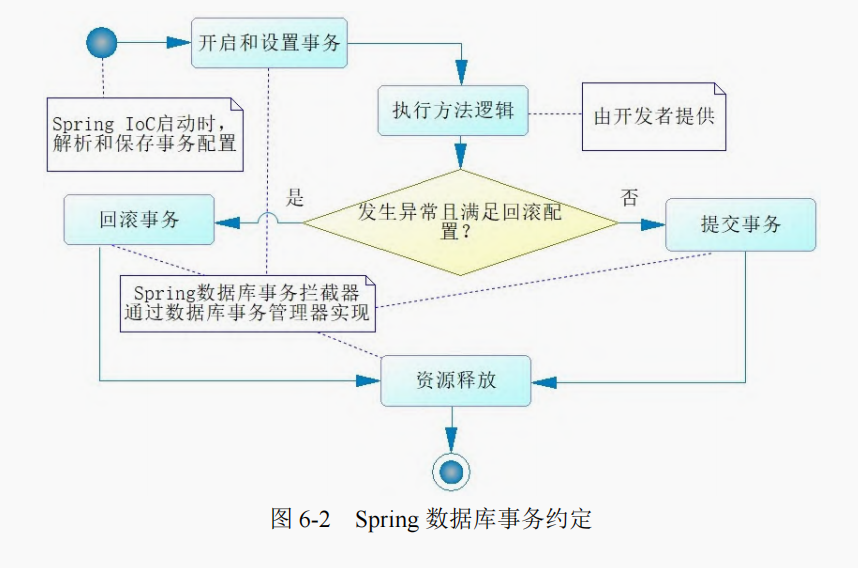

# springboot 的使用

当访问路径 `/` 时，springboot 默认显示 static 文件夹下的 index.html 文件

# 配置文件存放的位置

1. file: ./config
2. file: ./config/\*/
3. file: ./
4. classpath:/config/
5. classpath:/

`./` 表示的是项目的根目录下

配置文件扫描的顺序为从上到下。一个配置在加入配置集合的时候，会首先判断是否已经存在同名配置，如果存在的话，就不加入了，所以遇到同名问题的时候需要根据加载顺序判断优先级。顺序越靠前，优先级越高

## 参考文章

- [Spring全解系列 - @Import注解](https://zhuanlan.zhihu.com/p/147025312)

## SpringBoot 启动常用的一些接口

- ImportBeanDefinitionRegistrar: 用于在处理 @Configuration 注解的时候

## SpringBoot 启动过程

1. 实例化一个 SpringApplication 对象：
   1. 将 run 方法传入进来的 class 赋值给 SpringApplication 的 primarySource 属性
   2. 推测应用的类型: NONE -> AnnotationConfigApplicationContenxt, SERVLET, REACTIVE
   3. 从 spring.factories 中获取 ApplicationContextInitiaizer 的实现类并赋值给 SpringApplication 的 initializers 属性
   4. 从 spring.factories 中获取 ApplicationListener 的实现类并赋值给 SpringApplication 的 listeners 属性
   5. 找到 main 方法所在的类
2. 调用 SpringApplication 的 run 方法
   1. 获取 RunListener，并发布 starting 事件
   2. 准备 Environment 对象: 解析 properties，yaml，环境变量这些位置的配置信息
   3. 打印 banner
   4. 创建一个 Spring 容器
   5. 执行 ApplicationContextInitializer: 
   6. 发布 contextPrepared 事件
   7. 往容器中添加配置类(run 方法传入进来的类)
   8. 发布 contextLoaded 事件
   9. 启动 Spring 容器
   10. afterRefresh 方法 -> 这是一个空方法， 典型的模板设计模式，交给子类自定义实现
   11. 发布一个 started 事件
   12. 调用 callRunners 方法
   13. 发布一个 ready 事件

### SpringApplicationRunListener 接口

该接口定义了 SpringBoot 应用启动过程的声明周期函数，可以通过实现该接口对 SpringBoot 应用启动的各个过程进行一个自定义的扩展

## 常用注解

| 注解                           | 描述                                                         |
| ------------------------------ | ------------------------------------------------------------ |
| @EnableConfigurationProperties | 将配置了 @ConfigurationProperties 注解的类注入到 IOC 容器中  |
| @ConfigurationProperties       | 声明类的属性通过 application.yaml 配置文件中对应的属性来进行初始化，比较重要的一个参数就是 prefix |
| @Value                         | 将 application.yml 文件中指定的值注入到该注解所修饰的字段上  |
| @ComponentScan                 | 使用该注解时什么参数都不传时，默认只会扫描该注解所修饰的类所在的包及其子包 |
| @AutoWired                     | @Autowired 提供这样的规则，首先它会根据类型找到对应的 Bean，如果对应类型的 Bean 不是唯一的，那么它会根据其属性名称和 Bean 的名称进行匹配。如果匹配得上，就会使用该 Bean；如果还无法匹配，就会抛出异常。 |
| @Primary                       | 声明类的优先级，当有多个相同类型的 Bean 时，优先使用该注解所修饰的类的 Bean |
| @Quelifier                     | 注入指定 name 的 Bean                                        |
| @PropertySource                | 读取指定路径的配置文件,加上 classpath 前缀表示到类路径下去找对应的配置文件，并且默认找不到配置文件会报错，可以设置 ignoreResourceNotFound 为 true |
| @Conditional                   | 该注解用于条件装配，只有满足某些条件时，才会将 Bean 装配到容器中, 指定的参数需要实现 Condition 接口，该接口的 matches 方法返回的布尔值用于判断是否将 Conditional 注解修饰的类装配到 Spring 容器中 |
| @Scope                         | 该注解用于定义 Bean 的作用域范围                             |
| @Profile                       | 该注解用于根据环境使用不同的配置文件                         |
| @ImportResource                | 该注解引入 XML 文件，用于创建 Bean。指定该注解的 value 的时候需要使用 `classpath:` 前缀 |
| @PostConstruct                 | 表示 Spring Bean 生命周期的一个方法，表示在 Spring 实例化注解所在的 Bean 之后立马执行该注解所修饰的方法，执行顺序：构造方法 -> @Autowired -> @PostConstruct |
| @Transactional                 | 这个注解可以标注在类或者方法上，当它标注在类上时，代表这个类所有公共（public）非静态的方法都将启用事务功能 |

## @EnableConfigurationProperties

该注解的作用就是让配置了 @ConfigurationProperties 注解的类生效

#### 说明

如果一个类只配置了 @ConfigurationProperties 注解而没有配置 @Component 注解, 即没有声明该类是一个 Bean 交给容器管理，那么在 IOC 容器中就获取不到 properties 文件转化成的 Bean 对象。

说白了 @EnableConfigurationProperties 相当于把配置 @ConfigurationProperties 的类进行了一次注入。并经过测试发现，不使用 @EnableConfigurationProperties 注解而使用 @Component 注解同样能够正确的进行访问，但是如果这两个注解中的任何一个都没有配置到对应的类上就会报错

## 测试

application.yaml

```yaml
swagger:
  title: "AutMaple的 API 测试"
  description: "Hello AutMaple"
  version: "1.0"
```

Swagger2Attribute.java 这个类用 applicaiton.yaml 中对应名称的属性来对类中的属性进行初始化，通过对应属性的 setter 方法进行赋值操作

```java
package com.autmaple.mall.config;

import org.springframework.boot.context.properties.ConfigurationProperties;
import org.springframework.stereotype.Component;

@ConfigurationProperties(prefix = "swagger")
@Component
//@EnableConfigurationProperties(Swagger2Attribute.class) 这个注解的作用和 @Component 注解的作用是一样的
public class Swagger2Attribute {
    private String title;
    private String description;
    private String version;

    public String getTitle() {
        return title;
    }

    public void setTitle(String title) {
        this.title = title;
    }

    public String getDescription() {
        return description;
    }

    public void setDescription(String description) {
        this.description = description;
    }

    public String getVersion() {
        return version;
    }

    public void setVersion(String version) {
        this.version = version;
    }
}
```

## @Import 注解

@Import 注解是 Spring 基于注解开发的重要组成部分，该注解的作用是用于导入一个或多个组件到 Spring 容器中，同时还可以用于组织多个 @Configuration，等价于基于 xml 配置的 `<import>` 标签

同时该注解优先于 @Configuration 进行加载:

```java
@Configuration
@Import(ConfigB.class)
public class ConfigA{
    @Bean
    @ConditionalOnMissingBean
    public Service serviceA() {
        return new ServiceA();
    }
}
```

```java
@Configuration
public class ConfigB{
    @Bean
    public Service serviceB(){
        return new ServiceB();
    }
}
```

```java
public interface Service{
    void print();
}

public class ServiceA implements Service {
    @Override
    public void print() {
        System.out.println("Service A");
    }
}

public class ServiceB implements Service {
    @Override
    public void print() {
        System.out.println("Service B");
    }
}
```

```java
public class ConfigTest{
    public static void main(String[] args){
        AnnotationConfigApplicationContext ct = new AnnotationConfigApplicationContext(ConfigA.class);
        Service service = ct.getBean(Service.class);
        service.print(); // Service B
    }
}
```

### AnnotationMetadata 接口

该接口可以在指定的类没有加载的情况下访问它的注解信息

### ImportSelector 接口

```java
public interface ImportSelector {

	/**
	 * 根据 AnnotationMetadata 信息决定往容器中导入那些类，这个 AnnotationMetadata 通常是 @Configuration 所修饰的类上面的注解信息
	 * 返回值: 需要导入容器的类的全限定类名数组
	 */
	String[] selectImports(AnnotationMetadata importingClassMetadata);

	@Nullable
	default Predicate<String> getExclusionFilter() {
		return null;
	}

}
```

该接口的作用就是决定哪一个类将会被导入到容器中，

## Bean 的生命周期


Bean 的生命周期大致分为 Bean 定义、Bean 的初始化、Bean 的生存期和 Bean 的销毁 4 个部分。其中 Bean 定义过程大致如下：

1. Spring 通过我们的配置，如 @ComponentScan 定义的扫描路径去找到带有 @Component 的类，这个过程就是一个资源定位的过程。
2. 一旦找到了资源，那么它就开始解析，并且将定义的信息保存起来。注意，此时还没有初始化 Bean，也就没有 Bean 的实例，它有的仅仅是 Bean 的定义。
3. 然后就会把 Bean 定义发布到 Spring IoC 容器中。此时，IoC 容器也只有 Bean 的定义，还是没有 Bean 的实例生成。

完成了这 3 步只是一个资源定位并将 Bean 的定义发布到 IoC 容器的过程，还没有 Bean 实例的生成，更没有完成依赖注入。在默认的情况下，Spring 会继续去完成 Bean 的实例化和依赖注入，这样从 IoC 容器中就可以得到一个依赖注入完成的 Bean。但是，有些 Bean 会受到变化因素的影响，这时我们希望取出 Bean 的时候在完成初始化和依赖注入，换句话说就是让那些 Bean 只是将定义发布到 IoC 容器而不做实例化和依赖注入，当我们取出来的时候才做初始化和依赖注入等操作。


## Bean 的作用域

| 作用域        | 使用范围         | 作用域描述                                                   |
| ------------- | ---------------- | ------------------------------------------------------------ |
| singleton     | 所有 Spring 应用 | 默认值，IoC 容器只存在单例                                   |
| prototypes    | 所有 Spring 应用 | 每当从 Ioc 容器中取出一个 Bean, 则创建一个新的 Bean          |
| session       | Spring Web 应用  | HTTP 会话                                                    |
| application   | Spring Web 应用  | Web 工程生命周期                                             |
| request       | Spring Web 应用  | Web 工程单次请求                                             |
| globalSession | Spring Web 应用  | 在一个全局的 HTTP Session 中, 一个 Bean 定义对应一个实例。实践中基本不使用 |

常用的就是前 4 种, 对于 application 作用域，完全可以使用单例来替代

## Spring EL(Expression Languate) Spring 表达式语言

通过 Spring EL 可以拥有更为强大的运算规则来更好地装配 Bean，最常用的就是：

```java
@Value("${database.driverName}")
String driver;
```

`${...}` 表示占位符，可以嵌套，它会读取 spring 配置文件(如 application.yaml) 中的值装配到对应的字段中。

除了读取 Spring 配置文件之外，可以进行运算，要进行运算需要使用: `#{...}` 占位符

```java
@Value("#{T(System).currentTimeMillis()}") // `T(...)` 表示引入类
private Long initTime = null;

@Value("#{'使用 Spring EL 赋值字符串'}") 
private String str = null; 

// 科学计数法赋值
@Value("#{9.3E3}") 
private double d; 

// 赋值浮点数
@Value("#{3.14}") 
private float pi;

// 获取其他 Bean 中的属性
@Value("#{beanName.str}") 
private String otherBeanProp = null;

@Value("#{beanName.str?.toUpperCase()}") // ? 表示如果为空就不执行后面的方法
private String otherBeanProp = null;

// 数学运算
@Value("#{1+2}") 
private int run; 

// 浮点数比较运算
@Value("#{beanName.pi == 3.14f}") 
private boolean piFlag; 

// 字符串比较运算
@Value("#{beanName.str eq 'Spring Boot'}") 
private boolean strFlag; 

// 字符串连接
@Value("#{beanName.str + ' 连接字符串'}") 
private String strApp = null; 

// 三元运算
@Value("#{beanName.d > 1000 ? '大于' : '小于'}") 
private String resultDesc = null;
```

## AOP

### AOP 常用注解

| 注解            | 描述                                                         |
| --------------- | ------------------------------------------------------------ |
| @Aspect         | 声明所修饰的类为一个切面，可在切面中定义各类通知             |
| @Before         |                                                              |
| @After          | 无论是否发生异常，都会执行                                   |
| @AfterReturning |                                                              |
| @AfterThrowing  |                                                              |
| @Pointcut       | 定义切点                                                     |
| @DeclareParents | 它的作用是引入新的类来增强服务，它有两个必须 value 和 defaultImpl |

### AOP 术语和流程

通过约定，可以将一些业务逻辑织入流程中，并且可以将一些通用的逻辑抽取出来，然后**给予默认实现**，这样你只需要完成部分的功能就可以了，这样做可以使得开发者的代码更加简短，同时可维护性也得到提高。

- 连接点（join point）：对应的是具体被拦截的对象，因为 Spring 只能支持方法，所以被拦截的对象往往就是指特定的方法，例如，我们前面提到的 HelloServiceImpl 的 sayHello 方法就是一个连接点，AOP 将通过动态代理技术把它织入对应的流程中。

- 切点（point cut）：有时候，我们的切面不单单应用于单个方法，也可能是多个类的不同方法，这时，可以通过正则式和指示器的规则去定义，从而适配连接点。切点就是提供这样一个功能的概念。

- 通知（advice）：就是按照约定的流程下的方法，分为前置通知（before advice）、后置通知（after advice）、环绕通知（around advice）、事后返回通知（afterReturning advice）和异常通知（afterThrowing advice），它会根据约定织入流程中，需要弄明白它们在流程中的顺序和运行的条件。

- 目标对象（target）：即被代理对象，例如，约定编程中的 HelloServiceImpl 实例就是一个目标对象，它被代理了。

- 引入（introduction）：是指引入新的类和其方法，增强现有 Bean 的功能。

- 织入（weaving）：它是一个通过动态代理技术，为原有服务对象生成代理对象，然后将与切点定义匹配的连接点拦截，并按约定将各类通知织入约定流程的过程。

- 切面（aspect）：是一个可以定义切点、各类通知和引入的内容，Spring AOP 将通过它的信息来增强 Bean 的功能或者将对应的方法织入流程。

AOP 编程的实质是通过动态代理织入切面，并将连接点(被增强的方法)放置在切面的合适位置


### 开发切面

@Aspect 注解修饰的类表示一个切面，然后就可以使用各类注解来声明各种通知了。

```java
@Aspect
public class MyAspect { 
    @Before("execution(* com.springboot.chapter4.aspect.service.impl.UserServiceImpl.printUser(..))") 
    public void before() { 
    	System.out.println("before ......"); 
	} 
 
    @After("execution(* com.springboot.chapter4.aspect.service.impl.UserServiceImpl.printUser(..))") 
    public void after() { 
    	System.out.println("after ......"); 
    } 
 

    @AfterReturning("execution(* com.springboot.chapter4.aspect.service.impl.UserServiceImpl.printUser(..))") 
    public void afterReturning() { 
    	System.out.println("afterReturning ......"); 
    } 
    @AfterThrowing("execution(* com.springboot.chapter4.aspect.service.impl.UserServiceImpl.printUser(..))") 
    public void afterThrowing() { 
    	System.out.println("afterThrowing ......"); 
    }
}
```

execution 中的正则表达式就是切点，匹配正则表达式的方法则为连接点。上面代码的注解中，每个注解都使用了同一个正则表达式。为了克服这个问题，Spring 定义了切点（Pointcut）的概念，**切点的作用就是向 Spring 描述哪些类的哪些方法需要启用 AOP 编程**

```java
@Aspect 
public class MyAspect { 
 
 @Pointcut("execution(* com.springboot.chapter4.aspect.service.impl.UserServiceImpl.printUser(..))")
 public void pointCut() { 
 } 
 
 @Before("pointCut()") 
 public void before() { 
 	System.out.println("before ......"); 
 } 
 
 @After("pointCut()") 
 public void after() { 
 	System.out.println("after ......"); 
 } 
 @AfterReturning("pointCut()") 
 public void afterReturning() { 
 	System.out.println("afterReturning ......"); 
 } 
 
 @AfterThrowing("pointCut()") 
 public void afterThrowing() { 
 	System.out.println("afterThrowing ......"); 
 } 
}
```

其中：

- execution 表示在执行的时候，拦截里面的正则匹配的方法；

- `*` 表示任意返回值类型的方法；

- com.springboot.chapter4.aspect.service.impl.UserServiceImpl 指定目标对象的全限定名称；

- printUser 指定目标对象的方法；

- (..)表示任意参数进行匹配。

### 环绕通知

环绕通知（Around）是所有通知中最为强大的通知，强大也意味着难以控制。一般而言，**使用它的场景是在你需要大幅度修改原有目标对象的服务逻辑时**，否则都尽量使用其他的通知。环绕通知是一个取代原有目标对象方法的通知，当然它也提供了回调原有目标对象方法的能力。

```java
@Around("pointCut()") 
public void around(ProceedingJoinPoint jp) throws Throwable { 
    System.out.println("around before......"); 
    // 回调目标对象的原有方法
    jp.proceed();
    System.out.println("around after......"); 
}
```

### @DeclareParens 注解

```java
@Aspect 
public class MyAspect { 
    @DeclareParents(
    value= "com.springboot.chapter4.aspect.service.impl.UserServiceImpl+", 
    defaultImpl=UserValidatorImpl.class)
    public UserValidator userValidator;
    ...... 
}
```

@DeclareParents，它的作用是引入新的类来增强服务，它有两个必须配置的属性 value 和 defaultImpl。 

- value：指向你要增强功能的目标对象，这里是要增强 UserServiceImpl 对象，因此可以看到配置为 com.springboot.chapter4.aspect.service.impl.UserServiceImpl+。 

- defaultImpl：引入增强功能的类，这里配置为 UserValidatorImpl，用来提供校验用户是否为空的功能。

```java
// 定义请求
@RequestMapping("/vp") 
// 返回 JSON 
@ResponseBody 
public User validateAndPrint(Long id, String userName, String note) { 
    User user = new User(); 
    user.setId(id); 
    user.setUsername(userName); 
    user.setNote(note); 
    // 强制转换
    UserValidator userValidator = (UserValidator)userService;
    // 验证用户是否为空
    if (userValidator.validate(user)) { 
    	userService.printUser(user); 
    } 
	return user; 
}
```

### 通知获取参数

给通知传递参数，只需要在切点处加入对应的正则式就可以了。当然，对于非环绕通知还可以使用一个连接点（JoinPoint）类型的参数，通过它也可以获取参数

```java
@Before("pointCut() && args(user)") 
public void beforeParam(JoinPoint point, User user) { 
    Object[] args = point.getArgs(); 
    System.out.println("before ......"); 
}
```

正则式 pointCut() && args(user)中，pointCut()表示启用原来定义切点的规则，并且约定将连接点(目标对象方法)名称为 user 的参数传递进来

JoinPoint 类型的参数对于非环绕通知而言，Spring AOP 会自动地把它传递到通知中；对于环绕通知而言，可以使用 ProceedingJoinPoint 类型的参数

### 多个切面

当指定多个切面时，执行顺序是混乱的，如果要明确执行的顺序，可以使用 Spring 提供的注解 @Order 和接口 Ordered。我们可以使用它们的任意一个指定切面的顺序

#### @order

```java
@Aspect 
@Order(1)
public class MyAspect1 { 
	...... 
}
```

#### Ordered 接口

```java
@Aspect 
public class MyAspect1 implements Ordered { 
// 指定顺序
    @Override 
    public int getOrder() { 
    return 1; 
    }
    
}
```

## 事务

Spring Boot 中通过 @Transactional 注解开启事务



### Spring 事务执行步骤

如果都没有发生异常，Spring 数据库拦截器就会帮助我们提交事务，这点也并不需要我们干预。

如果发生异常，就要判断一次事务定义器内的配置，如果事务定义器已经约定了该类型的异常不回滚事务就提交事务，如果没有任何配置或者不是配置不回滚事务的异常，则会回滚事务，并且将异常抛出，这步也是由事务拦截器完成的。

**无论发生异常与否，Spring 都会释放事务资源，这样就可以保证数据库连接池正常可用了，这也是由 Spring 事务拦截器完成的内容。**

### 事务的传播行为

事物的传播行为是方法之间调用事务采取的策略问题。在 Spring 中，当一个方法调用另外一个方法时，可以让事务采取不同的策略工作,如新建事务或者挂起当前事务等，这便是事务的传播行为,例如：

批量任务我们称之为当前方法，那么批量事务就称为当前事务，当它调用单个交易时，称单个交易为子方法，当前方法调用子方法的时候，让每一个子方法不在当前事务中执行，而是创建一个新的事务去执行子方法，我们就说当前方法调用子方法的传播行为为新建事务

#### 传播行为枚举类

```java
package org.springframework.transaction.annotation;
/**** imports ****/
public enum Propagation {
    /**
    * 需要事务，它是默认传播行为，如果当前存在事务，就沿用当前事务，
    * 否则新建一个事务运行子方法
    */
    REQUIRED(TransactionDefinition.PROPAGATION_REQUIRED),
    
    /**
    * 支持事务，如果当前存在事务，就沿用当前事务，
    * 如果不存在，则继续采用无事务的方式运行子方法
    */
    SUPPORTS(TransactionDefinition.PROPAGATION_SUPPORTS),
    
    /**
    * 必须使用事务，如果当前没有事务，则会抛出异常，
    * 如果存在当前事务，就沿用当前事务
    */
    MANDATORY(TransactionDefinition.PROPAGATION_MANDATORY),
    
    /**
    * 无论当前事务是否存在，都会创建新事务运行方法，
    * 这样新事务就可以拥有新的锁和隔离级别等特性，与当前事务相互独立
    */
    REQUIRES_NEW(TransactionDefinition.PROPAGATION_REQUIRES_NEW),
    
    /**
    * 不支持事务，当前存在事务时，将挂起事务，运行方法
    */
    NOT_SUPPORTED(TransactionDefinition.PROPAGATION_NOT_SUPPORTED),
    
    /**
    * 不支持事务，如果当前方法存在事务，则抛出异常，否则继续使用无事务机制运行
    */
    NEVER(TransactionDefinition.PROPAGATION_NEVER),
    
    /**
    * 在当前方法调用子方法时，如果子方法发生异常，
    * 只回滚子方法执行过的 SQL，而不回滚当前方法的事务
    */
    NESTED(TransactionDefinition.PROPAGATION_NESTED);
    private final int value;
    Propagation(int value) { this.value = value; }
    public int value() { return this.value; }
}
```

在大部分的数据库中，一段 SQL 语句中可以设置一个标志位，然后后面的代码执行时如果有异常，只是回滚到这个标志位的数据状态，而不会让这个标志位之前的代码也回滚。这个标志位，在数据库的概念中被称为保存点（save point）。从加粗日志部分可以看到，Spring 为我们生成了 nested 事务，而从其日志信息中可以看到保存点的释放，可见 Spring 也是使用保存点技术来完成让子事务回滚而不致使当前事务回滚的工作。

**注意**，并不是所有的数据库都支持保存点技术，因此 Spring 内部有这样的规则：当数据库支持保存点技术时，就启用保存点技术；如果不能支持，就新建一个事务去运行你的代码，即等价于 REQUIRES_NEW 传播行为。

NESTED 传播行为和 REQUIRES_NEW 还是有区别的。NESTED 传播行为会沿用当前事务的隔离级别和锁等特性，而 REQUIRES_NEW 则可以拥有自己独立的隔离级别和锁等特性，这是在应用中需要注意的地方。

### @Transactional 注解

```java
package org.springframework.transaction.annotation;

@Target({ElementType.METHOD, ElementType.TYPE})
@Retention(RetentionPolicy.RUNTIME)
@Inherited
@Documented
public @interface Transactional {
    // 通过 bean name 指定事务管理器
    @AliasFor("transactionManager") 
    String value() default "";
    
    // 同 value 属性
    @AliasFor("value")
    String transactionManager() default "";
    
    // 指定传播行为
    Propagation propagation() default Propagation.REQUIRED;
    
    // 指定隔离级别
    Isolation isolation() default Isolation.DEFAULT;
    
    // 指定超时时间（单位秒）
    int timeout() default TransactionDefinition.TIMEOUT_DEFAULT;
    
    // 是否只读事务
    boolean readOnly() default false;
    
    // 方法在发生指定异常时回滚，默认是所有异常都回滚
    Class<? extends Throwable>[] rollbackFor() default {};
    
    // 方法在发生指定异常名称时回滚，默认是所有异常都回滚
    String[] rollbackForClassName() default {};
    
    // 方法在发生指定异常时不回滚，默认是所有异常都回滚
    Class<? extends Throwable>[] noRollbackFor() default {};
    
    // 方法在发生指定异常名称时不回滚，默认是所有异常都回滚
    String[] noRollbackForClassName() default {};
}
```

关于注解 @Transactional 值得注意的是它可以放在接口上，也可以放在实现类上。但是 Spring 团队推荐放在实现类上，因为放在接口上将使得你的类基于接口的代理时它才生效。Spring 可以使用 JDK 动态代理，也可以使用 CGLIG 动态代理。如果使用接口，那么你将不能切换为 CGLIB 动态代理，而只能允许你使用 JDK 动态代理，并且使用对应的接口去代理你的类，这样才能驱动这个注解，这将大大地限制你的使用，因此在实现类上使用 @Transactional 注解才是最佳的方式

#### @Transational 自调用失效的问题

Spring 数据库事务的约定，其实现原理是 AOP，而 AOP 的原理是动态代理，在自调用的过程中，是类自身的调用，而不是代理对象去调用，那么就不会产生 AOP，这样 Spring 就不能把你的代码织入到约定的流程中，于是就产生了现在看到的失败场景。此时我们可以从 IOC 容器中取出代理对象来调用对应的方法，从而达到目的。

### 事务管理器

事务的打开、回滚和提交是由事务管理器来完成的。在 Spring 中，事务管理器的顶层接口为 PlatformTransactionManager。当我们引入其他框架时，还会有其他的事务管理器的类，比如引入 Hibernate, 那么那么 Spring orm 包还会提供 HibernateTransactionManager 与之对应并给我们使用; Mybatis 中最常用到的事物管理器就是 DataSourceTransactionManager。

在 Spring Boot 中，当你依赖于 mybatis-spring-boot-starter 之后，它会自动创建一个 DataSourceTransactionManager 对象，作为事务管理器，如果依赖于 spring-boot-starter-data-jpa，则它会自动创建 JpaTransactionManager 对象作为事务管理器，所以我们一般不需要自己创建事务管理器而直接使用它们即可

# AOP 动态代理

- Spring 中的 AOP，有接口就用 JDK 动态代理，没有接口就用 Cglib 动态代理。

- Spring Boot 中的 AOP，2.0 之前和 Spring 一样；2.0 之后首选 Cglib 动态代理，如果用户想要使用 JDK 动态代理，需要自己手动配置。

SpringBoot 2.0 之后，如果想用 JDK 动态代理需要在 application.yaml 配置文件中配置如下选项：

```properties
spring.aop.proxy-target-class=false
```

# 定义系统启动任务的两种方式

在项目启动阶段要做一些数据初始化操作，这些操作有一个共同的特点，只在项目启动时进行，以后都不再执行。Spring Boot 中针对系统启动任务提供了两种解决方案，分别是 CommandLineRunner 和 ApplicationRunner, 接口的定义如下：

```java
@FunctionalInterface
public interface CommandLineRunner {
	void run(String... args) throws Exception; // args 来自项目启动时传递的参数，这个接口无法解析 key/value 形式的参数
}

@FunctionalInterface
public interface ApplicationRunner {
	void run(ApplicationArguments args) throws Exception;
}
```

ApplicationRunner 和 CommandLineRunner 功能一致，用法也基本一致，唯一的区别主要体现在对参数的处理上，ApplicationRunner 可以接收更多类型的参数（ApplicationRunner 除了可以接收 CommandLineRunner 的参数之外，还可以接收 key/value 形式的参数）

# 定时任务

在 Spring  + SpringMVC 环境中，要实现定时任务，通常有两种方案：

1. Spring 自带的 @Scheduled 注解
2. 定时任务框架：Quartz

## @Scheduled

使用 @Scheduled 非常容易，直接创建一个 Spring Boot 项目并添加 Web 依赖，然后再启动类中添加 `@EnableScheduling` 注解来开启定时任务：

```java
@SpringBootApplication
@EnableScheduling
public class MyApplication {
    public static void main(String[] args) {
        SpringApplication.run(MyApplication.class, args);
    }
}
```

接下来就可以使用 @Scheduled 注解来定义定时任务了：

```java
@Scheduled(fixedRate = 2000)
public void fixedRate() {
    System.out.println("FixedRage: " + new Date());
}

@Scheduled(fixedDelay = 2000)
public void fixedDelay() {
    System.out.println("FixedDelay: " + new Date());
}

@Scheduled(initialDelay = 2000, fixedDelay = 2000)
public void initialDelay() {
    System.out.println("InitialDelay: " + new Date());
}
```

- fixedRate: 表示每隔 2000 ms 执行一次该任务，2000 表示的是两次任务开始执行的时间间隔
- fixedDelay: 表示上一个任务结束到下一个任务开始之间的时间间隔
- initialDelay: 表示任务首次执行的延时时间

### Cron 表达式

@Scheduled 注解也支持 Cron 表达式，Cron 表达式的格式如下：

```txt
[秒][分][时][日][月][周][年]
```

```java
@Scheduled(cron="0/5 * * * * *") // 表示每隔 5s 执行一次
public void cron() {
    System.out.println(new Date())
}
```

## Quartz 

一般在项目中，除非定时任务涉及到的业务非常的简单，才会使用 @Scheduled 注解来解决定时任务，否则大部分情况可能都是使用 Quartz 来做定时任务

参考文章：[配置定时任务](http://docs.javaboy.org/springboot/scheduled_task/#_4-%E5%AE%9A%E6%97%B6%E4%BB%BB%E5%8A%A1%E6%80%8E%E4%B9%88%E9%85%8D)

# 配置过滤器

在 SpringBoot 中配置过滤器有三种方式：

1. @WebFilter
2. @Bean
3. FilterRegistrationBean

## @WebFilter

通过 @WebFilter 来标记一个过滤器，这是将 Servlet 中的那套方式直接搬到 SpringBoot 中

```java
@WebFilter(urlPatterns = "/*")
public class MyFilter implements Filter {

    @Override
    public void doFilter(ServletRequest request, ServletResponse response, FilterChain chain) throws IOException, ServletException {
        System.out.println("-----doFilter-----");
        chain.doFilter(request, response);
    }
}
```

在 @WebFilter 中可以配置拦截规则，但是要想让这个过滤器剩下，还需要进行如下的配置：

```java
@SpringBootApplication
@ServletComponentScan
public class FilterdemoApplication {

    public static void main(String[] args) {
        SpringApplication.run(FilterdemoApplication.class, args);
    }

}
```

@ServletComponentScan 注解虽然名字带了 Servlet, 但是实际上它不仅仅可以扫描项目中的 Servlet 容器，也可以扫描 Filter 和 Listener

在实际项目中，这种方式使用较少，因为这种方式有一个很大的弊端就是无法指定 Filter 的优先级，如果存在多个 Filter 时，无法通过 @Order 指定优先级

## @Bean

第二种方式就是将过滤器配置成 Bean，注册到容器中去：

```java
@Component
public class MyFilter implements Filter {

    @Override
    public void doFilter(ServletRequest request, ServletResponse response, FilterChain chain) throws IOException, ServletException {
        System.out.println("-----doFilter-----");
        chain.doFilter(request, response);
    }
}
```

这种方式看起来很方便，一个注解就将 Filter 注入到容器中，并且可以通过 @Order 指定 Filter 的优先级。但是这种方式不能够设置过滤器的拦截规则，只能够是默认的: `/*` ，也就是默认拦截所有的请求

## FilterRegistrationBean

通过 FilterRegistrationBean， 既可以设置优先级，也可以设置过滤器的拦截规则

```java
@Configuration
public class FilterConfiguration {
    @Bean
    FilterRegistrationBean<MyFilter> myFilterFilterRegistrationBean() {
        FilterRegistrationBean<MyFilter> bean = new FilterRegistrationBean<>();
        bean.setFilter(new MyFilter());
        bean.setOrder(-1);
        bean.setUrlPatterns(Arrays.asList("/*"));
        return bean;
    }
    @Bean
    FilterRegistrationBean<MyFilter2> myFilterFilterRegistrationBean2() {
        FilterRegistrationBean<MyFilter2> bean = new FilterRegistrationBean<>();
        bean.setFilter(new MyFilter2());
        bean.setOrder(-2);
        bean.setUrlPatterns(Arrays.asList("/hello"));
        return bean;
    }
}
```

SpringBoot 为了方便开发人员向 Servlet 容器中注册 Servlet、Filter 以及 Listener, 提供了一个 Bean 注册的抽象类：RegistrationBean

```java
public abstract class RegistrationBean implements ServletContextInitializer, Ordered {
	private int order = Ordered.LOWEST_PRECEDENCE;
	private boolean enabled = true;
	@Override
	public final void onStartup(ServletContext servletContext) throws ServletException {
		String description = getDescription();
		if (!isEnabled()) {
			logger.info(StringUtils.capitalize(description) + " was not registered (disabled)");
			return;
		}
		register(description, servletContext);
	}
	protected abstract String getDescription();
	protected abstract void register(String description, ServletContext servletContext);
	public void setEnabled(boolean enabled) {
		this.enabled = enabled;
	}
	public boolean isEnabled() {
		return this.enabled;
	}
	public void setOrder(int order) {
		this.order = order;
	}
	@Override
	public int getOrder() {
		return this.order;
	}

}
```

1. RegistrationBean 实现了 ServletContextInitializer 接口，在 Servlet 启动时，RegistrationBean#onStartup 方法会被调用，进而完成 Filter、Servlet 以及 Listener 的注册。

2. enabled 属性可以理解为一个开关，设置为 false 相当于关闭组件注册。

# 自定义 SpringMVC 的配置

跟自定义 SpringMVC 相关的类和注解主要有如下四个：

- WebMvcConfigurerAdapter
- WebMvcConfigurer
- WebMvcConfigurationSupport
- @EnableWebMvc

## WebMvcConfigurerAdapter

WebMvcConfigurerAdapter，这个是在 Spring Boot 1.x 中我们自定义 SpringMVC 时继承的一个抽象类，这个抽象类本身是实现了 WebMvcConfigurer 接口，然后抽象类里边都是空方法。从 Spring5 开始，由于我们要使用 Java8，而 Java8 中的接口允许存在 default 方法，因此官方建议我们直接实现 WebMvcConfigurer 接口，而不是继承 WebMvcConfigurerAdapter 。

## WebMvcConfigurer 

WebMvcConfigurer 是我们在 Spring Boot 2.x 中实现自定义配置的方案。

WebMvcConfigurer 是一个接口，接口中的方法和 WebMvcConfigurerAdapter 中定义的空方法其实一样，所以用法上来说，基本上没有差别，从 Spring Boot 1.x 切换到 Spring Boot 2.x ，只需要把继承类改成实现接口即可。

## WebMvcConfigurationSupport

Spring Boot 给我们提供了很多自动化配置，很多时候当我们修改这些配置的时候，并不是要全盘否定 Spring Boot 提供的自动化配置，我们可能只是针对某一个配置做出修改，其他的配置还是按照 Spring Boot 默认的自动化配置来，而继承 WebMvcConfigurationSupport 来实现对 SpringMVC 的配置会导致所有的 SpringMVC 自动化配置失效，因此，一般情况下我们不选择这种方案

## @EnableWebMvc

@EnableWebMvc 注解，这个注解很好理解，它的作用就是启用 WebMvcConfigurationSupport

加了这个注解，就会自动导入 WebMvcConfigurationSupport，所以在 Spring Boot 中，我们也不建议使用 @EnableWebMvc 注解，因为它一样会导致 Spring Boot 中的 SpringMVC 自动化配置失效。

## 总结

1. Spring Boot 1.x 中，自定义 SpringMVC 配置可以通过继承 WebMvcConfigurerAdapter 来实现。

2. Spring Boot 2.x 中，自定义 SpringMVC 配置可以通过实现 WebMvcConfigurer 接口来完成。

3. 如果在 Spring Boot 中使用继承 WebMvcConfigurationSupport 来实现自定义 SpringMVC 配置，或者在 Spring Boot 中使用了 @EnableWebMvc 注解，都会导致 Spring Boot 中默认的 SpringMVC 自动化配置失效。

4. 在纯 Java 配置的 SSM 环境中，如果我们要自定义 SpringMVC 配置，有两种办法，第一种就是直接继承自 WebMvcConfigurationSupport 来完成 SpringMVC 配置，还有一种方案就是实现 WebMvcConfigurer 接口来完成自定义 SpringMVC 配置，如果使用第二种方式，则需要给 SpringMVC 的配置类上额外添加 @EnableWebMvc 注解，表示启用 WebMvcConfigurationSupport，这样配置才会生效。换句话说，在纯 Java 配置的 SSM 中，如果你需要自定义 SpringMVC 配置，你离不开 WebMvcConfigurationSupport ，所以在这种情况下建议通过继承 WebMvcConfigurationSupport 来实现自动化配置

# JPA

JPA: Java Persistence API, Java 持久化层 API, 是 JAVA EE 5.0 平台标准的 ORM 规范，使得应用程序以统一的方式访问持久层

## JPA 与 Hibernate 的关系

JPA 是一种规范，而 Hibernate 是 JPA 的实现

## Spring Data

Spring Data 是 Spring 的一个子项目，用于简化数据库的访问, 支持关系型数据库和 NoSQL 数据库:

1. 支持的 NoSQL 数据库:
   - MongoDB(文档型数据库)
   - Neo4j(图形数据库)
   - Redis(键/值数据库)
   - Hbase(列存储数据库)
2. 支持的关系型数据库：
   - JDBC
   - JPA

Spring Data JPA 致力于减少数据访问层(DAO)的开发量. 开发者唯一需要做的就是声明持久层的接口，其他的交给 Spring Data JPA 来完成。Spring Data JPA 通过规范方法的名字, 然后根据方法的名字来确定如何操作数据库。

# HTTP 响应统一处理

Spring Web 项目总，如果要对 http 响应做统一的处理，只需要实现 Spring Web 提供的 ResponseBodyAdvice 接口即可

在 Spring Web 项目中，Controller 中的参数与返回值的处理流程：

1. 首先需要经过 `HandlerMethodArgumentResolver` 判断是否支持对应参数类型的解析
2. 如果允许解析则会调用对应的解析方法，将对应的值赋值给对应的参数
3. 执行 Controller 中的逻辑
4. 将方法的执行结果返回给用户
5. 在第 2 步以及第 4 步中，有的 `HandlerMethodArgumentResolver` 还支持 `RequestBodyAdvice` 和 `ResponseBodyAdvice` 接口，方便开发者对请求体和响应体进行自定义处理。Spring Web 中默认支持这两个接口的消息转换器是：`RequestResponseBodyMethodProcessor` 以及 `HttpEntityMethodProcessor`。

## ResponseBodyAdvice 接口

接口定义如下:

```java
/**
 * ResponseBodyAdvice 接口允许自定义修改 Controller 方法执行之后的返回值，
 * 前提是该方法被 @ResponseBody 注解修饰或者返回值类型是 ResponseEntity。
 *
 * ResponseBodyAdvice 接口的实现类可以需要注册到 RequestMappingHandlerAdapter 和 ExceptionHandlerExceptionResolver 中。
 * 但是如果实现类使用 @ControllerAdvice 注解，则会被上述的两个类自动检测到并完成相应的注册
 */
public interface ResponseBodyAdvice<T> {
    /**
     * 判断是否支持指定的数据类型以及 Spring Web 选择的消息转换器，通常直接返回 true 就好
     *
     * @param returnType: 返回类型，通过该参数可以获取到方法的返回值类型
     * @param converterType: Spring Web 选择的 消息转化器 的类型
     * @return 如果返回值为 true，则调用接口的 beforeBodyWrite 方法，否则不调用
     */
	boolean supports(MethodParameter returnType, Class<? extends HttpMessageConverter<?>> converterType);

	/**
	 * 该方法中执行具体的转换逻辑
	 * 
	 * @param body Controller 方法返回的数据
	 * @param returnType 方法的返回值类型参数
	 * @param selectedContentType 响应体 ContenetType
	 * @param selectedConverterType Spring Web 根据 ContentType 选择的消息转换器
	 * @param request 请求对象
	 * @param response 响应对象
	 * @return 转换后的数据对象
	 */
	@Nullable
	T beforeBodyWrite(@Nullable T body, MethodParameter returnType, MediaType selectedContentType,
			Class<? extends HttpMessageConverter<?>> selectedConverterType,
			ServerHttpRequest request, ServerHttpResponse response);

}
```

```ad-info
title: 总结

ResponseBodyAdvice 接口的实现类需要注册到 RequestMappingHandlerAdapter 和 ExceptionHandlerExceptionResolver 中。但是如果实现类使用 @ControllerAdvice 注解，则会被上述的两个类自动检测到并完成相应的注册。

因此使用 @ControllerAdvice 注解是最方便的
```


### String 类型转换成自定义消息体类型失败的问题

Spring Web 转换的流程：

1. 首先根据 Controller 方法的返回值类型选择合适的消息转换器(HttpMessageConverter)
2. 调用 ResponseBodyAdvice 的 beforeBodyWrite 方法
3. 使用选择的数据转换器进行数据转换

而 String 类型转换失败的问题就出在数据类型转换器。因为 Spring Web 为 String 类型选择的数据转换器是 StringHttpMessageConverter，而该转换器的作用就是将输入参数转化成 String 类型输出，所以如果 beforeBodyWrite  方法返回不是 String 类型，就会报类型转换异常的错误。

解决的办法就是直接将需要封装的消息先转化成 String 之后，在返回：

```java
if (body instanceof String) {
    return new ObjectMapper().writeValueAsString(ResponseResult.success(body));
}
// 如果本身已经是自定义的响应结果，直接返回即可
if(body instanceof ResponseResult) 
    return body;
return ResponseResult.success(body);
```

# 全局异常处理器

在 SpringBoot 项目中实现全局异常统一处理可以通过 `@ControllerAdvice` 注解、`@RestControllerAdvice` 注解以及 `BasicErrorController` 类将 Filter、Intercepor 以及 Controller 中的异常集中在一个地方进行一个统一的处理。

这里需要注意的一个地方就是 `@ControllerAdvice` 注解和 `@RestControllerAdvice` 注解对于 Interceptor 中抛出的异常的一个捕获。有的情况下可以捕获，有的情况不可以捕获：

- 如果用户请求的是系统中存在的路径，那么在 Intercepor 中抛出的异常则能够被 `@ControllerAdvice` 和 `@RestControllerAdvice` 注解所修饰的类所捕获
- 如果用户请求的是系统中不存在的路径，则 Intercepor 中抛出的异常不能够被 `@ControllerAdvice` 和 `@RestControllerAdvice` 注解所修饰的类所捕获。这时，异常将会直接交给 SpringBoot 自带的一个兜底处理器 `BasicErrorController` 进行一个异常的处理

## SpringBoot 全局异常处理自动配置

SpringBoot 通过配置类 `ErrorMvcAutoConfiguration` 对异常提供了自动配置，该配置类向容器中注入了以下的 4 个类

- ErrorPageCustomizer: 该组件在系统发生异常后，默认将请求转发到 `/error` 路径下。
- BasicErrorController: 处理 `/error` 请求
- DefautltErrorViewResolver: 默认的异常视图解析器，将异常信息解析到视图上
- DefautlErrorAttribute: 用于在请求过程中，共享一些配置信息

其中，ErrorPageCustomizer 默认会注入到 Spring 容器中。其他的三个，都是条件注入，如果用户提供了对应的类，那么 SpringBoot 将不会再注入对应的 Bean

## BasicErrorController

BasicErrorController 是 SpringBoot 自带的一个全局异常处理器，该处理器会处理 Web 项目中所有未被处理的异常，该组件的作用是作为一个兜底的组件来处理项目未考虑到的一些异常情况。

当异常未被处理时，请求会被转发到 `/error` 路径进行处理，而这个路径是 `BasicErrorController` 注册的。

如果我们想要自定义异常的逻辑，可以继承 `BasicErrorController` 并重写它的  `error` 方法即可

该 Controller 返回的 json 数据中会包含如下字段：

- timestamp：时间戳；
- status：错误状态码
- error：错误的提示
- errors: 错误提示
- exception：导致请求处理失败的异常对象
- message：错误/异常消息
- trace： 错误/异常栈信息
- path: 错误/异常抛出时所请求的URL路径

其中默认会返回的字段是：

- timestamp
- status
- error
- path

如果要返回其他的字段需要在 application 文件中进行配置：

```yaml
server:  
  error:  
    include-stacktrace: always # 开启 trace  字段
    include-message: always # 开启 message 字段
    include-exception: true  # 开启 exception 字段
    include-binding-errors: always # 开启 errors 字段
```

可配置字段的值的设置：

1.  status

```java
request.setAttribute(RequestDispatcher.ERROR_STATUS_CODE, code);
```

其中 code 是 Integer 的类型

2. exception

```java
request.setAttribute(DefaultErrorAttributes.ERROR_INTERNAL_ATTRIBUTE, exception); 

request.setAttribute(RequestDispatcher.ERROR_EXCEPTION, exception);
```

其中 exception 为 Throwable 类型, 上面两种方式都可以设置 exception ，但是第一个的优先级更高。个人推荐使用第二种方式，因为与设置其他参数的写法类似

3. message

```java
request.setAttribute(RequestDispatcher.ERROR_MESSAGE, msg);
```

其中 msg 类型可以是：

- Optional
- Array
- CharSequence: 字符串
- Collection
- Map

最终的 msg 为上述类型调用对应的 `toString()` 方法的返回值

4. path

```java
request.setAttribute(RequestDispatcher.ERROR_REQUEST_URI, path)
```

其中的 path 是 String 类型

# ApplicationRunner 和 CommandLineRunner

某些情况下，我们需要在项目启动之后，执行一些任务，例如配置文件的加载等。Spring Boot 提供了两种解决方案：

1. ApplicationRunner 接口
2. CommandLineRunner 接口

这两个接口的使用方法大体上是一致的，差别主要体现在参数上:

```java
public interface CommandLineRunner {

	/**
	 * Callback used to run the bean.
	 * @param args incoming main method arguments
	 * @throws Exception on error
	 */
	void run(String... args) throws Exception;
}
```

```java
public interface ApplicationRunner {

	/**
	 * Callback used to run the bean.
	 * @param args incoming application arguments
	 * @throws Exception on error
	 */
	void run(ApplicationArguments args) throws Exception;
}
```

`SpringApplicaiton#run(String... args)` 方法会在方法的最后调用 `callRunners(args)` 方法，这个方法会收集 Spring 容器中所有的 ApplicationRunner 和 CommandLineRunner 接口，并调用相应的方法：

```java
private void callRunners(ApplicationContext context, ApplicationArguments args) {
		List<Object> runners = new ArrayList<>();
		runners.addAll(context.getBeansOfType(ApplicationRunner.class).values());
		runners.addAll(context.getBeansOfType(CommandLineRunner.class).values());
		AnnotationAwareOrderComparator.sort(runners);
		for (Object runner : new LinkedHashSet<>(runners)) {
			if (runner instanceof ApplicationRunner) {
				callRunner((ApplicationRunner) runner, args);
			}
			if (runner instanceof CommandLineRunner) {
				callRunner((CommandLineRunner) runner, args);
			}
		}
	}
```

通过上面的方法可以看出：

1. 可以通过 @Order 注解或者实现 `org.springframework.core.Ordered` 接口指定 Runner 的执行顺序，值越小，优先级越高。