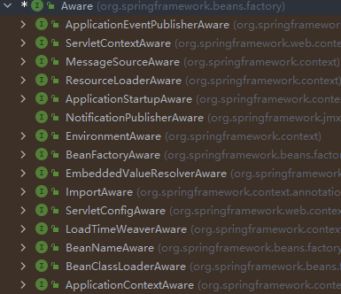
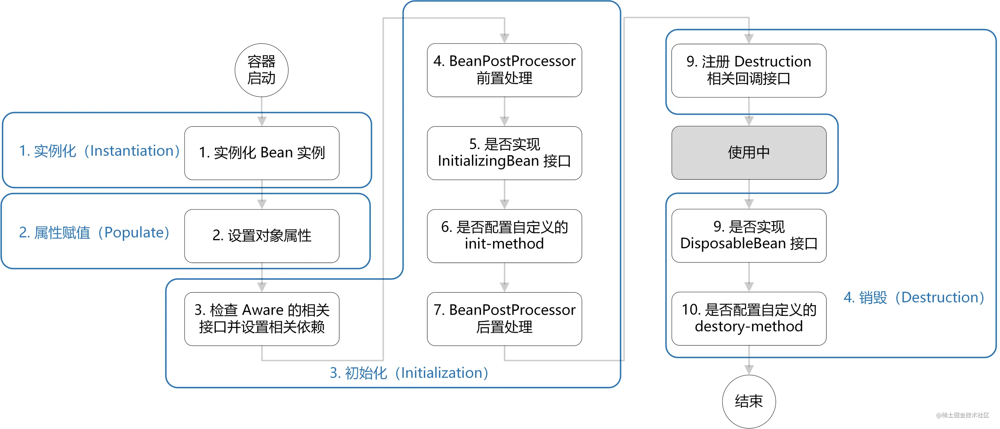

# Spring 开发

## Spring 常用注解

| 注解            | 描述                                                         |
| --------------- | ------------------------------------------------------------ |
| @Conditional    | 在类实例化之前根据给定的 Condition 类判断是否需要实例化该注解修饰的类 |
| @PostConstruct  | 该注解属于 `javax.annotation` 包下面的注解, 可以在 Bean 初始化之后执行一些操作 |
| @PreDestroy     | 该注解属于 `javax.annotation` 包下面的注解, 通常用于做一些善后工作。该注解在 Spring 环境下，在发布容器关闭事件之后，在执行Bean的destroy方法之前执行。Servlet 环境下, 被该注解修饰的方法会在 Servlet 的 destroy 方法执行之后，在 Servlet 被彻底卸载完成之前执行，并且只会执行一次。 |
| @Primary        | 指定同类型 Bean 装配的优先级，被该注解修饰的类优先被注入，同时如果和 @Qualifier 注解一同使用，则优先使用 @Qualifier 注解指定的 Bean |
| @Qualifier      | 该注解的作用是告诉 Spring 容器应该注入 Qualifier 注解所指定的名字的 Bean |
| @Resource       | 该注解是 Java 自带的注解，默认按照名称进行注入，其中优先级为：@Resource > @Qualifier > @Primary ， |
| @Inject         | @Inject 注解默认也是按照 Bean 的名称进行注入，要想使用该注解需要导入对应的包，同时该注解可以和 @Primary 注解一起使用 |
| @PropertySource | 通过该注解可以将 properties 文件中的配置加载到 Spring 的 Environment 中 |
| @Profile        | 用于指定一个组件或者方法只有在指定的开发环境下才起作用       |

## Spring 的介绍

Spring 框架是 Java 平台的一个开源的全栈( full-stack) 应用程序框架和控制反转( Inversion of Control，IoC )容器实现，一般被直接称为 Spring。该框架的一些核心功能理论上可用于任何 Java 应用，但 Spring 还为基于 Java 企业版平台构建的 Web 应用提供了大量的拓展支持。**Spring 没有直接实现任何的编程模型**，但它已经在 Java 社区中广为流行，基本上完全代替了企业级 JavaBeans（EJB）模型。

**核心技术**：IOC （Inversion of Control）， AOP（Aspect Oriented Programming）

## 控制反转 IOC

IOC ==> Iversion of Control 。控制反转在 java 中表示把创建对象的权利交给框架，也就是指将对象的创建和赋值、对象的存储、对象的管理交给了 Spring 容器。Spring 容器是 Spring 中的一个核心模块，用于管理对象，底层是一个 ConcurrentHashMap 集合。Spring 实现 IOC 通过 DI (Dependency Injection )依赖注入来实现。

IOC 在 Spring 中的体现就是：把创建对象的过程交给 Spring 来进行管理，从而做到将原来需要自己手动 new 对象，变成直接从 Spring 中获取。

Spring 提供了一个接口 BeanFactory。这个接口是 Spring 实现 IOC 容器的顶级接口，这个接口是 Spring 内部使用的，并不是专门为框架的使用者提供的。

我们一般使用的是 BeanFactory 的子接口 ApplicationContext 接口，这个接口提供了更多并且更加强大的功能。

在 ApplicationContext 接口中有三个常用的实现类分别是：AnnotationConfigApplicationContext、FileSystemXmlApplicationContext、ClassPathXmlApplicationContext。

容器的创建需要读取配置文件或配置类，通过这些配置告诉 Spring 哪些 bean 是需要 Spring 来进行管理的。

**注意**：读取配置文件时，如果读取绝对路径时入参需要添加前缀“file:”，读取相对路径时入参需要添加“classpath:”。

### BeanFactory 和 ApplicationContext

- BeanFactory 负责读取 bean 配置文档，管理 bean 的加载，实例化，维护 bean 之间的依赖关系，负责 bean 的声明周期。
- ApplicationContext 除了提供上述 BeanFactory 所能提供的功能之外，还提供了更完整的框架功能：
  1. 国际化支持
  2. 资源访问：`Resource rs = ctx. getResource(“classpath:config.properties”), “file:c:/config.properties”`
  3. 事件传递：通过实现 ApplicationContextAware 接口

### Aware 接口

Aware 是一个具有标识作用的超级接口，实现该接口的 bean 是具有被 spring 容器通知的能力的，而被通知的方式就是通过回调。也就是说：直接或间接实现了这个接口的类，都具有被 spring 容器通知的能力。

通过 Aware 接口，可以实现在自定义的 Bean 中去使用 Spring 的一些底层组件，如 Spring 的上下文对象 ApplicationContext, Bean 工厂 BeanFactory 等，使用这些对象可以完成一些特殊的工作，如修改 Bean 的定义， 给 Bean 容器中设置 property 属性等，所有的 Aware 接口如下图：



实现 xxxAware 接口就可以获取到 Spring 底层的组件，如实现 ApplicationContextAware 接口就可以获取 Spring 的 ApplicationContext，要获取什么，只需要实现对应的 xxxAware 接口即可

### 常用的 Aware 接口

- BeanFactoryAware 用于获取创建 Bean 的 BeanFactory
- BeanNameAware 用于获取当前 Bean 的名字
- ApplicationContenxtAware 用于获取当前 Bean 所在的 Spring 应用上下文对象，利用该对象可以获取到 Spring 容器中 Bean 的很多信息，例如：所有 bean 的名称，所有 bean 的定义，bean 注册中心等等，除此之外，还可以再获取到上下文之后，然后创建一个特定的 Bean 定义，并注册到 Spring 的 BeanDefinitionRegistry 中
- MessageSourceAware 可以用于获取当前应用的国际化信息，包括区域，语言等，在做 Web 应用的国际化是有用
- EnvironmentAware 可用于获取当前 Bean 运行的环境信息，例如操作系统，环境变量，当前 classpath 中配置的所有 property 属性值和属性名等
- EmbeddedValueResolverAware：可用于获取一个 String 类型的值解析器，解析容器中占位符中的字符串值，例如：`${name}`，`#{12+10}` 等。第一个 `${name}` 为普通的占位符，容器中必须存在这个 name 属性，第二个 `#{12+10}` 为 SPEL 表达式，可以实现一些计算逻辑，通过注入的值解析器都可以完成解析。

### Aware 底层实现原理

在 Spring 中 Aware 接口作为一个顶层接口，其底层的 xxxAware 子接口中全部定义了 setxxx 方法，用于交给具体的类来实现，然后通过xxxAwareProcessor 来实现具体的注入。

例如通过 ApplicationContextAware 注入 ApplicationContext 时，使用的后置处理器为 ApplicationContextAwareProcessor

### Spring Bean 的生命周期

Bean 的生命周期概括起来就是 **4 个阶段**：

1. 实例化（Instantiation）
2. 属性赋值（Populate）
3. 初始化（Initialization）
4. 销毁（Destruction）





1. 实例化：第 1 步，实例化一个 bean 对象；
2. 属性赋值：第 2 步，为 bean 设置相关属性和依赖；
3. 初始化：第 3~7 步，步骤较多，其中第 5、6 步为初始化操作，第 3、4 步为在初始化前执行，**第 7 步在初始化后执行，该阶段结束，才能被用户使用；**
4. 销毁：第 8~10 步，第8步不是真正意义上的销毁（还没使用呢），而是先在使用前注册了销毁的相关调用接口，为了后面第9、10步真正销毁 bean 时再执行相应的方法。

下面我们结合代码来直观的看下，在 doCreateBean() 方法中能看到依次执行了这 4 个阶段：

```java
// AbstractAutowireCapableBeanFactory.java
protected Object doCreateBean(final String beanName, final RootBeanDefinition mbd, final @Nullable Object[] args)
    throws BeanCreationException {

    // 1. 实例化
    BeanWrapper instanceWrapper = null;
    if (instanceWrapper == null) {
        instanceWrapper = createBeanInstance(beanName, mbd, args);
    }
    
    Object exposedObject = bean;
    try {
        // 2. 属性赋值
        populateBean(beanName, mbd, instanceWrapper);
        // 3. 初始化
        exposedObject = initializeBean(beanName, exposedObject, mbd);
    }

    // 4. 销毁-注册回调接口
    try {
        registerDisposableBeanIfNecessary(beanName, bean, mbd);
    }

    return exposedObject;
}
```

由于初始化包含了第 3~7 步，较复杂，所以我们进到 initializeBean() 方法里具体看下其过程（注释的序号对应图中序号）：

```java
// AbstractAutowireCapableBeanFactory.java
protected Object initializeBean(final String beanName, final Object bean, @Nullable RootBeanDefinition mbd) {
    // 3. 检查 Aware 相关接口并设置相关依赖
    if (System.getSecurityManager() != null) {
        AccessController.doPrivileged((PrivilegedAction<Object>) () -> {
            invokeAwareMethods(beanName, bean);
            return null;
        }, getAccessControlContext());
    }
    else {
        invokeAwareMethods(beanName, bean);
    }

    // 4. BeanPostProcessor 前置处理
    Object wrappedBean = bean;
    if (mbd == null || !mbd.isSynthetic()) {
        wrappedBean = applyBeanPostProcessorsBeforeInitialization(wrappedBean, beanName);
    }

    // 5. 若实现 InitializingBean 接口，调用 afterPropertiesSet() 方法
    // 6. 若配置自定义的 init-method 方法，则执行
    try {
        invokeInitMethods(beanName, wrappedBean, mbd);
    }
    catch (Throwable ex) {
        throw new BeanCreationException(
            (mbd != null ? mbd.getResourceDescription() : null),
            beanName, "Invocation of init method failed", ex);
    }
    // 7. BeanPostProceesor 后置处理
    if (mbd == null || !mbd.isSynthetic()) {
        wrappedBean = applyBeanPostProcessorsAfterInitialization(wrappedBean, beanName);
    }

    return wrappedBean;
}
```

在 invokInitMethods() 方法中会检查 InitializingBean 接口和 init-method 方法，销毁的过程也与其类似：

```java
// DisposableBeanAdapter.java
public void destroy() {
    // 9. 若实现 DisposableBean 接口，则执行 destory()方法
    if (this.invokeDisposableBean) {
        try {
            if (System.getSecurityManager() != null) {
                AccessController.doPrivileged((PrivilegedExceptionAction<Object>) () -> {
                    ((DisposableBean) this.bean).destroy();
                    return null;
                }, this.acc);
            }
            else {
                ((DisposableBean) this.bean).destroy();
            }
        }
    }
    
	// 10. 若配置自定义的 detory-method 方法，则执行
    if (this.destroyMethod != null) {
        invokeCustomDestroyMethod(this.destroyMethod);
    }
    else if (this.destroyMethodName != null) {
        Method methodToInvoke = determineDestroyMethod(this.destroyMethodName);
        if (methodToInvoke != null) {
            invokeCustomDestroyMethod(ClassUtils.getInterfaceMethodIfPossible(methodToInvoke));
        }
    }
}
```

从 Spring 的源码我们可以直观的看到其执行过程，而我们记忆其过程便可以从这 4 个阶段出发，实例化、属性赋值、初始化、销毁。其中细节较多的便是初始化，涉及了 Aware、BeanPostProcessor、InitializingBean、init-method 的概念。这些都是 Spring 提供的扩展点，其具体作用将在下一节讲述。

## 3. 扩展点的作用

### 3.1 Aware 接口

若 Spring 检测到 bean 实现了 Aware 接口，则会为其注入相应的依赖。所以**通过让bean 实现 Aware 接口，则能在 bean 中获得相应的 Spring 容器资源**。

Spring 中提供的 Aware 接口有：

1. BeanNameAware：注入当前 bean 对应 beanName；
2. BeanClassLoaderAware：注入加载当前 bean 的 ClassLoader；
3. BeanFactoryAware：注入当前 BeanFactory 容器的引用。

其代码实现如下：

```java
// AbstractAutowireCapableBeanFactory.java
private void invokeAwareMethods(final String beanName, final Object bean) {
    if (bean instanceof Aware) {
        if (bean instanceof BeanNameAware) {
            ((BeanNameAware) bean).setBeanName(beanName);
        }
        if (bean instanceof BeanClassLoaderAware) {
            ((BeanClassLoaderAware) bean).setBeanClassLoader(bcl);
            
        }
        if (bean instanceof BeanFactoryAware) {
            ((BeanFactoryAware) bean).setBeanFactory(AbstractAutowireCapableBeanFactory.this);
        }
    }
}
```

以上是针对 BeanFactory 类型的容器，而对于 ApplicationContext 类型的容器，也提供了 Aware 接口，只不过这些 Aware 接口的注入实现，是通过 BeanPostProcessor 的方式注入的，但其作用仍是注入依赖。

1. EnvironmentAware：注入 Enviroment，一般用于获取配置属性；
2. EmbeddedValueResolverAware：注入 EmbeddedValueResolver（Spring EL解析器），一般用于参数解析；
3. ApplicationContextAware（ResourceLoader、ApplicationEventPublisherAware、MessageSourceAware）：注入 ApplicationContext 容器本身。

其代码实现如下：

```java
// ApplicationContextAwareProcessor.java
private void invokeAwareInterfaces(Object bean) {
    if (bean instanceof EnvironmentAware) {
        ((EnvironmentAware)bean).setEnvironment(this.applicationContext.getEnvironment());
    }

    if (bean instanceof EmbeddedValueResolverAware) {
        ((EmbeddedValueResolverAware)bean).setEmbeddedValueResolver(this.embeddedValueResolver);
    }

    if (bean instanceof ResourceLoaderAware) {
        ((ResourceLoaderAware)bean).setResourceLoader(this.applicationContext);
    }

    if (bean instanceof ApplicationEventPublisherAware) {
        ((ApplicationEventPublisherAware)bean).setApplicationEventPublisher(this.applicationContext);
    }

    if (bean instanceof MessageSourceAware) {
        ((MessageSourceAware)bean).setMessageSource(this.applicationContext);
    }

    if (bean instanceof ApplicationContextAware) {
        ((ApplicationContextAware)bean).setApplicationContext(this.applicationContext);
    }

}
```

### 3.2 BeanPostProcessor

BeanPostProcessor 是 Spring 为 **修改 bean** 提供的强大扩展点，其可作用于容器中所有 bean，其定义如下：

```java
public interface BeanPostProcessor {

	// 初始化前置处理
	default Object postProcessBeforeInitialization(Object bean, String beanName) throws BeansException {
		return bean;
	}

	// 初始化后置处理
	default Object postProcessAfterInitialization(Object bean, String beanName) throws BeansException {
		return bean;
	}

}
```

常用场景有：

1. 对于标记接口的实现类，进行自定义处理。例如 3.1 节中所说的 ApplicationContextAwareProcessor，为其注入相应依赖；再举个例子，自定义对实现解密接口的类，将对其属性进行解密处理；
2. **为当前对象提供代理实现。例如 Spring AOP 功能，生成对象的代理类，然后返回。**

```java
// AbstractAutoProxyCreator.java
public Object postProcessBeforeInstantiation(Class<?> beanClass, String beanName) {
    TargetSource targetSource = getCustomTargetSource(beanClass, beanName);
    if (targetSource != null) {
        if (StringUtils.hasLength(beanName)) {
            this.targetSourcedBeans.add(beanName);
        }
        Object[] specificInterceptors = getAdvicesAndAdvisorsForBean(beanClass, beanName, targetSource);
        Object proxy = createProxy(beanClass, beanName, specificInterceptors, targetSource);
        this.proxyTypes.put(cacheKey, proxy.getClass());
        // 返回代理类
        return proxy;
    }

    return null;
}
```

### 3.3 InitializingBean 和 init-method

InitializingBean 和 init-method 是 Spring 为 **bean 初始化** 提供的扩展点。

InitializingBean 接口的定义如下：

```java
public interface InitializingBean {
	void afterPropertiesSet() throws Exception;
}
```

在 afterPropertiesSet() 方法写初始化逻辑。

指定 init-method 方法，指定初始化方法：

```xml
<?xml version="1.0" encoding="UTF-8"?>
<beans xmlns="http://www.springframework.org/schema/beans"
       xmlns:xsi="http://www.w3.org/2001/XMLSchema-instance"
       xsi:schemaLocation="http://www.springframework.org/schema/beans http://www.springframework.org/schema/beans/spring-beans.xsd">

    <bean id="demo" class="com.chaycao.Demo" init-method="init()"/>
    
</beans>
```

DisposableBean 和 destory-method 与上述类似，就不描述了。

### 3.4 BeanFactoryPostProcessor

该扩展点执行的时机：在 Bean 定义全部解析及加载完毕 [加载完毕指的是bean定义已经被放入到了bean定义注册中心beanDefinitonMap中]，但是 bean 实例化之前。

使用该扩展点，可以在实例化 Bean 之前修改 Bean 的定义信息，例如：修改 bean 的类型，修改 bean 的作用域，是否为懒加载，是否参与自动装配或者是修改 bean 的工厂方法等等

### BeanDefinition

在 Spring 中 Bean 定义是专门用来描述 bean 的一种结构，里面包括了 bean 的方方面面的信息，在创建 bean 实例以及初始化 bean 的过程中就是根据 bean 定义中的信息来完成的

## 4. 总结

最后总结下如何记忆 Spring Bean 的生命周期：

- 首先是实例化、属性赋值、初始化、销毁这 4 个大阶段；
- 再是初始化的具体操作，有 Aware 接口的依赖注入、BeanPostProcessor 在初始化前后的处理以及 InitializingBean 和 init-method 的初始化操作；
- 销毁的具体操作，有注册相关销毁回调接口，最后通过 DisposableBean 和 destory-method 进行销毁。

## Bean 的实例化和初始化

实例化：创建对象并填充对应的属性

初始化：执行 init-method 指定的方法或者 InitializingBean 接口的 afterPropertiesSet 方法

## 多级缓存

Spring 创建 Bean 的底层代码是通过三级缓存实现，对应三个 Map：

- singletonObjects：一级缓存，也被称为单实例缓存池，用来缓存所有初始化完成的 Bean
- earlySingletonObjects：二级缓存，用来保存早期对象，这个早期对象就是Bean的一个半成品对象，只完成了实例化化，未进行属性填充和初始化的对象
- singletonFactories：三级缓存，用来保存获取早期对象的一个回调函数，通过这个回调函数，可以获取到未初始化完成的早期对象

### 查询流程

1. 根据 Bean 的名称首先查找以及缓存，如果找到，直接返回
2. 如果没有找到并且允许使用二级缓存，则查询二级缓存。找到就直接返回
3. 二级缓存中没有找到早期对象，则通过回调函数调用获取早期对象的方法获取早期对象，然后保存到二级缓存中并返回。

### 早期对象

早期对象指的是 Bean 的一个半成品。更确切的说，就是实例化完成，并执行了一部分后置处理器，但是还未填充属性的对象，这个对象不能直接使用。

早期对象会被保存在 Spring 的二级缓存中，Spring 在进行属性注入的时候，首先会在一级缓存(单实例 Bean)找，如果没有找到则回到二级缓存(早期对象缓存)中去找，如果找到了就直接赋值，如果没有找到则会创建新的 Bean 对象。

通过一个二级缓存从而解决了 Bean 之间通过 set 方法注入的循环依赖问题，但是不能够解决通过构造方法进行注入时引发的循环依赖的问题。

### 依赖注入 DI

依赖注入 DI (Dependency Injection ) 是 IOC 的一种技术实现，Spring 通过 java 的反射技术实现。在程序中只需要提供类的名称, Spring 就会自动的创建和管理该类。至于对象的创建、存储、查找、获取都由容器( Spring )内部自己实现，程序员无需理会。

## 面向切面编程 AOP

面向切面编程（Aspect-Oriented Programming, AOP） 就是将那些与业务无关，却为业务模块所共同调用的逻辑或责任分开封装起来，便于减少系统的重复代码，降低模块间的耦合度，并有利于未来的可操作性和可维护性。

## Spring 的配置文件

```XML
<?xml version="1.0" encoding="UTF-8"?>
<beans xmlns="http://www.springframework.org/schema/beans"
       xmlns:xsi="http://www.w3.org/2001/XMLSchema-instance"
       xsi:schemaLocation="http://www.springframework.org/schema/beans http://www.springframework.org/schema/beans/spring-beans.xsd">
    <bean id="..." class="..." .../>
    ...
    <bean id="..." class="..." .../>
    
</beans>
```

> - Spring 中把类称为 Bean
> - id 类的表示符，可以不写，Spring 会提供默认值
> - class 类 的全名，需要指定类所在的位置( 全路径 )，必须填写，Spring 通过这个设置创建对象
> - 该配置文件告诉 Spring 需要创建那些对象，有多少个 就创建多少个对象

### bean 对象的 scope 属性

常用可选值: singleton 和 prototype 

区别：

- singleton表示单实例，prototype 表示多实例
- 当 scope 是 singleton 的时候，java 在加载配置文件时就会创建单实例对象
- 当 scope 是 prototype 的时候，java 不会在加载配置文件时创建对象，而是在调用 getBean 方法的时候在创建对象

### bean 的生命周期

1. 通过构造器创建 bean 实例（无参构造方法）
2. 为 bean 设置属性值（ setter 方法）
3. 调用 bean 的后置处理器方法 postProcessBeforeInitialization （需要 bean 实现 BeanPostProcessor 接口， 可选）
4. 调用 bean 的初始化方法 （需要配置初始化方法， 通过 init-method 属性配置）
5. 调用 bean 的后置处理器方法 postProcessAfterInitialization (需要 bean 实现 BeanPostProcessor 接口, 可选)
6. bean创建完毕，可以使用
7. 当容器关闭时，调用 bean 的销毁方法（需要配置销毁方法， 通过 destroy-method 属性配置）

注意：如果在配置文件中声明了后置处理器，那么配置文件中的所有 bean 都会被配置后置处理器

User.java

```java
package com.autmaple.entity;

public class User {
    private String name;

    public User(){
        System.out.println("调用无参构造方法");
    }
    public String getName() {return name;}

    public void setName(String name) {
        System.out.println("调用 setter 方法");
        this.name = name;
    }

    public void initMethod(){
        System.out.println("调用 initMethod");
    }

    public void destroyMethod(){
        System.out.println("调用 destroyMethod ");
    }
}

```

bean.xml

```xml
<bean class="com.autmaple.entity.User" id="user7" init-method="initMethod" destroy-method="destroyMethod">
    <property name="name" value="AutMaple"/>
</bean>
<bean class="com.autmaple.entity.BeanPost" id="beanPost"/>
```

BeanPost.java

```java
package com.autmaple.entity;

import org.springframework.beans.BeansException;
import org.springframework.beans.factory.config.BeanPostProcessor;

public class BeanPost implements BeanPostProcessor {

    @Override
    public Object postProcessBeforeInitialization(Object bean, String beanName) throws BeansException {
        System.out.println("before init");
        return BeanPostProcessor.super.postProcessBeforeInitialization(bean, beanName);
    }

    @Override
    public Object postProcessAfterInitialization(Object bean, String beanName) throws BeansException {
        System.out.println("after init");
        return BeanPostProcessor.super.postProcessAfterInitialization(bean, beanName);
    }
}

```

test.java

```java
ClassPathXmlApplicationContext cpx = new ClassPathXmlApplicationContext("bean.xml");
User user7 = cpx.getBean("user7", User.class);
System.out.println(user7);
cpx.close();
```

输出：

```text
调用无参构造方法
调用 setter 方法
before init
调用 initMethod
after init
User{name='AutMaple'}
调用 destroyMethod 
```

## Spring 获取对象

配置文件 Bean.xml

```XML
<?xml version="1.0" encoding="UTF-8"?>
<beans xmlns="http://www.springframework.org/schema/beans"
       xmlns:xsi="http://www.w3.org/2001/XMLSchema-instance"
       xsi:schemaLocation="http://www.springframework.org/schema/beans http://www.springframework.org/schema/beans/spring-beans.xsd">

    <bean id="user" class="com.autmaple.User"/>

</beans>
```

代码中使用对象

```JAVA
ClassPathXmlApplicationContext cpx = new ClassPathXmlApplicationContext("Bean.xml");
User user = (User)cpx.getBean("user");
System.out.println(user.getName());
```

> 1. ClassPathXmlApplicationContext 就是容器对象，Spring 创建的对象可以通过该容器获得
> 2. Bean.xml 是 Spring 的配置文件，在该配置文件中声明需要创建的对象
> 3. Spring 默认使用无参构造方法构建对象
> 4. **Spring 默认在创建容器时就将所有的对象创建好，并放在容器中，并不是程序需要使用的时候才去创建**

### 获取容器相关信息

获取容器中创建的对象数量

```JAVA
int count = cpx.getBeanDefinitionCount();
```

获取容器中创建的对象的名称

```JAVA
String[] names = cpx.getBeanDefinitionNames();
```

## Spring 给对象赋值

java 中给对象赋值有两种方式：构造方法或者 setter 方法，Spring 两种方式都支持。Spring 可以在 xml 中进行相关的配置进行赋值也可以使用注解的方法进行赋值。

Spring 中建议使用 setter 方法进行注入

### xml 配置中进行赋值操作

#### setter 方法进行赋值

xml 中使用 setter 赋值需要配置 bean 的 property 属性。如果赋值的是基本数据类型，可以使用`value="..."`的方式进行赋值；如果是引用数据类型则需要使用`ref="..."`。

User.java

```JAVA
package com.autmaple;

public class User {
    private String name;
    private int age;
    private School school;

    public String getName() {return name;}
    public void setName(String name) {this.name = name; }

    public int getAge() { return age;}
    public void setAge(int age) {this.age = age;}

    public School getSchool() { return school;}
    public void setSchool(School school) { this.school = school;}

    @Override
    public String toString() {
        return "User{" +
                "name='" + name + '\'' +
                ", age=" + age +
                ", school=" + school +
                '}';
    }
}
```

School.java

```JAVA
public class School {
    private String name;
    private String address;

    public String getName() {return name; }
    public void setName(String name) {this.name = name;}

    public String getAddress() {return address;}
    public void setAddress(String address) {this.address = address; }

    @Override
    public String toString() {
        return "School{" +
                "name='" + name + '\'' +
                ", address='" + address + '\'' +
                '}';
    }
}
```

xml 配置

```XML
<?xml version="1.0" encoding="UTF-8"?>
<beans xmlns="http://www.springframework.org/schema/beans"
       xmlns:xsi="http://www.w3.org/2001/XMLSchema-instance"
       xsi:schemaLocation="http://www.springframework.org/schema/beans http://www.springframework.org/schema/beans/spring-beans.xsd">
    
    <bean id="user" class="com.autmaple.User">
        <property name="age" value="10"/>
        <property name="name" value="AutMaple"/>
        <property name="school" ref="school"/>
    </bean>

    <bean id="school" class="com.autmaple.School">
        <property name="name" value="市一中"/>
        <property name="address" value="郴州市北湖区"/>
    </bean>
</beans>
JAVA
ClassPathXmlApplicationContext cpx = new ClassPathXmlApplicationContext("Bean.xml");
User user = cpx.getBean(User.class);
System.out.println(user); 
//输出： User{name='AutMaple', age=10, school=School{name='市一中', address='郴州市北湖区'}}
```

除了使用 property 属性进行 setter 注入外，还可以使用 p 命名空间进行 setter 注入，该方法了解即可，不经常使用

```XML
<?xml version="1.0" encoding="UTF-8"?>
<beans xmlns="http://www.springframework.org/schema/beans"
       xmlns:xsi="http://www.w3.org/2001/XMLSchema-instance" xmlns:p="http://www.springframework.org/schema/p"
       xsi:schemaLocation="http://www.springframework.org/schema/beans http://www.springframework.org/schema/beans/spring-beans.xsd">

    <bean id="user" class="com.autmaple.User"
    p:age="10" p:name="AutMaple" p:school-ref="school"/>

    <bean id="school" class="com.autmaple.School">
        <property name="name" value="市一中"/>
        <property name="address" value="郴州市北湖区"/>
    </bean>

</beans>
```

注意：p 需要引入名称空间，在 IDEA 中使用时直接根据提示进行引入即可(Alt + Enter), 使用 IDEA 会在 xml 加入`xmlns:p="http://www.springframework.org/schema/p"`

#### 构造方法进行赋值

使用构造方法进行赋值，需要使用 bean 的 constructor-arg 属性。基本数据类型使用 value 赋值；引用数据类型使用 ref 进行赋值

```XML
<bean id="user" class="com.autmaple.User">
        <constructor-arg name="age" value="10"/>
        <constructor-arg name="name" value="AutMaple"/>
        <constructor-arg name="school" ref="school"/>
    </bean>

    <bean id="school" class="com.autmaple.School">
        <property name="name" value="市一中"/>
        <property name="address" value="郴州市北湖区"/>
    </bean>
```

也可以根据 bean 构造方法的参数位置进行赋值。下标从 0 开始

```XML
<bean id="user" class="com.autmaple.User">
    <constructor-arg index="0" value="AutMaple"/>
    <constructor-arg index="1" value="10"/>
    <constructor-arg index="2" ref="school"/>
</bean>
```

#### 自动注入

自动注入只能够在引用数据类型中使用。Spring 有两种自动注入方式：byName, byType。

byName: java 类中引用数据类型的属性名称与 Spring 容器中 bean 的 id 名称一样，且数据类型也一样的时候，该属性会被 Spring 自动赋值

byType: java 类中引用的数据类型和 bean 中的 class 是同源的时候，也会被 Spring 自动的进行赋值。但是需要注意的是，如果 xml 配置文件中出现了 多个同源的 bean 时，会报错。

通过设置 bean 中的 autowire 属性即可进行配置

byName 自动注入

```XML
<bean id="user" class="com.autmaple.User" autowire="byName">
    <property name="age" value="10"/>
    <property name="name" value="AutMaple"/>
</bean>

<bean id="school" class="com.autmaple.School">
    <property name="name" value="市一中"/>
    <property name="address" value="郴州市北湖区"/>
</bean>
```

```java
ClassPathXmlApplicationContext cpx = new ClassPathXmlApplicationContext("Bean.xml");
User user = cpx.getBean(User.class);
System.out.println(user); 
//输出： User{name='AutMaple', age=10, school=School{name='市一中', address='郴州市北湖区'}}
```

byType 自动注入

PrimarySchool.java

```JAVA
package com.autmaple;

public class PrimarySchool extends School{}
```

```xml
<bean id="user" class="com.autmaple.User" autowire="byType">
    <property name="age" value="10"/>
    <property name="name" value="AutMaple"/>
</bean>


<bean id="primarySchool" class="com.autmaple.PrimarySchool">
    <property name="name" value="金海小学"/>
    <property name="address" value="郴州市苏仙区"/>
</bean>
```

```java
ClassPathXmlApplicationContext cpx = new ClassPathXmlApplicationContext("Bean.xml");
User user = cpx.getBean(User.class);
System.out.println(user); 
//输出：User{name='AutMaple', age=10, school=School{name='金海小学', address='郴州市苏仙区'}}
```

### 外部 Bean 的注入

有些对象的创建不是通过构造方法创建出来的，而是使用其他的方法创建的。这种对象如何使用 Spring 容器来创建和管理呢？答案是使用工厂注入的方式。工厂分为静态工厂和实例工厂，它们将 bean 对象注入到 Spring 容器的方式不同。

#### 静态工厂

首先提供静态工厂类 DruidUtils

```JAVA
package com.autmaple;

public class DruidUtils {
    private static User user;
    public static User getInstance(){
        if(user == null){
            user = new User();
        }
        return user;
    }
}
```

然后再 xml 配置文件中配置该工厂

```XML
<bean id="userFactory" class="com.autmaple.DruidUtils" factory-method="getInstance"/>
```

在到 java 中使用

```JAVA
ClassPathXmlApplicationContext cpx = new ClassPathXmlApplicationContext("Bean.xml");
User user = cpx.getBean("userFactory", User.class);
System.out.println(user); // 输出: User{name='null', age=0, school=null}
```

#### 实例工厂

首先提供工厂类 DruidUtils

```JAVA
public class DruidUtils {
    private User user;
    public User getInstance(){
        if(user == null){
            user = new User();
        }
        return user;
    }
}
```

然后在 xml 配置文件中配置该工厂。配置实例工厂时，由于需要先获取到实例才能够使用其方法，因此需要先配置工厂的 bean。然后在该实例来获取对应的 bean

```XML
<bean id="User" class="com.autmaple.DruidUtils"/>
<bean id="userFactory" class="com.autmaple.User" factory-bean="User2" factory-method="getInstance1"/>
```

在 java 中使用

```JAVA
ClassPathXmlApplicationContext cpx = new ClassPathXmlApplicationContext("Bean.xml");
User user = cpx.getBean("userFactory", User.class);
System.out.println(user);
```

### 复杂属性的赋值

#### 数组注入

数组注入和集合注入在 xml 中的配置是一样的。如下：

```XML
<bean class="org.javaboy.User" id="user">
    <property name="cat" ref="cat"/>
    <property name="favorites">
        <array>
            <value>足球</value>
            <value>篮球</value>
            <value>乒乓球</value>
        </array>
    </property>
</bean>
<bean class="org.javaboy.Cat" id="cat">
    <property name="name" value="小白"/>
    <property name="color" value="白色"/>
</bean>
```

注意，array 节点，也可以被 list 节点代替。

当然，array 或者 list 节点中也可以是对象。

```XML
<bean class="org.javaboy.User" id="user">
    <property name="cat" ref="cat"/>
    <property name="favorites">
        <list>
            <value>足球</value>
            <value>篮球</value>
            <value>乒乓球</value>
        </list>
    </property>
    <property name="cats">
        <list>
            <ref bean="cat"/>
            <ref bean="cat2"/>
            <bean class="org.javaboy.Cat" id="cat3">
                <property name="name" value="小花"/>
                <property name="color" value="花色"/>
            </bean>
        </list>
    </property>
</bean>
<bean class="org.javaboy.Cat" id="cat">
    <property name="name" value="小白"/>
    <property name="color" value="白色"/>
</bean>
<bean class="org.javaboy.Cat" id="cat2">
    <property name="name" value="小黑"/>
    <property name="color" value="黑色"/>
</bean>
```

注意，即可以通过 ref 使用外部定义好的 Bean，也可以直接在 list 或者 array 节点中定义 bean。

#### Map 注入

```XML
<property name="map">
    <map>
        <entry key="age" value="99"/>
        <entry key="name" value="javaboy"/>
    </map>
</property>
```

#### Properties 注入

```XML
<property name="info">
    <props>
        <prop key="age">99</prop>
        <prop key="name">javaboy</prop>
    </props>
</property>
```

## Spring 配置文件中引入 properties 文件

引入 context 名称空间

```xml
<?xml version="1.0" encoding="UTF-8"?>
<beans xmlns="http://www.springframework.org/schema/beans"
       xmlns:xsi="http://www.w3.org/2001/XMLSchema-instance" 
       xmlns:context="http://www.springframework.org/schema/context" <==
       xsi:schemaLocation="http://www.springframework.org/schema/beans http://www.springframework.org/schema/beans/spring-beans.xsd
		http://www.springframework.org/schema/context http://www.springframework.org/schema/context/spring-context.xsd"> <==
```

引入 properties 文件

```xml
<context:property-placeholder location="classpath:jdbc.properties"/>
```

jdbc.properties

```properties
prop.driverClass=com.mysql.jdbc.Drive
prop.url=jdbc:mysql://localhost:3306/userdb
prop.userName=root
prop.password=root
```

在 spring 配置文件中使用 properties 中的属性: `${ keyName }`

```xml
<bean id="dataSource" class="com.alibaba.druid.pool.DruidDataSource">
    <property name="driverClassName" value="${prop.driverClass}"/>
    <property name="url" value="${prop.url}"/>
    <property name="username" value="${prop.userName}"/>
    <property name="password" value="${prop.password}"/>
</bean>
```

## java 中配置 Bean

在 Spring 中，想要将一个 Bean 注册到 Spring 容器中，整体上来说，有三种不同的方式。

- XML 注入，如前文所说
- Java 配置（通过 Java 代码将 Bean 注册到 Spring 容器中）
- 自动化扫描

Java 配置这种方式在 Spring Boot 出现之前，其实很少使用，自从有了 Spring Boot，Java 配置开发被广泛使用，因为在 Spring Boot 中，不使用一行 XML 配置。

例如我有如下一个 Bean：

```JAVA
public class SayHello {
    public String sayHello(String name) {
        return "hello " + name;
    }
}
```

在 Java 配置中，我们用一个 Java 配置类去代替之前的 applicationContext.xml 文件。

```JAVA
@Configuration
public class JavaConfig {
    @Bean
    SayHello sayHello() {
        return new SayHello();
    }
}
```

首先在配置类上有一个 @Configuration 注解，这个注解表示这个类不是一个普通类，而是一个配置类，它的作用相当于 applicationContext.xml。 然后，定义方法，方法返回对象，方法上添加 @Bean 注解，表示将这个方法的返回值注入的 Spring 容器中去。也就是说，@Bean 所对应的方法，就相当于 applicationContext.xml 中的 bean 节点。

既然是配置类，我们需要在项目启动时加载配置类。

```JAVA
public class Main {
    public static void main(String[] args) {
        AnnotationConfigApplicationContext ctx = new AnnotationConfigApplicationContext(JavaConfig.class);
        SayHello hello = ctx.getBean(SayHello.class);
        System.out.println(hello.sayHello("javaboy"));
    }
}
```

注意，配置的加载，是使用 AnnotationConfigApplicationContext 来实现。

关于 Java 配置，这里有一个需要注意的问题:Bean 的名字是什么？

Bean 的默认名称是方法名。以上面的案例为例，Bean 的名字是 sayHello。 如果开发者想自定义方法名，也是可以的，直接在 @Bean 注解中进行过配置。如下配置表示修改 Bean 的名字为 javaboy：

```JAVA
@Configuration
public class JavaConfig {
    @Bean("javaboy")
    SayHello sayHello() {
        return new SayHello();
    }
}
```

## 注解开发

在 Spring4 之后，使用注解开发需要导入 aop 包

```xml
<dependency>
    <groupId>org.springframework</groupId>
    <artifactId>spring-aop</artifactId>
    <version>5.3.1</version>
</dependency>
```

同时需要在配置文件中配置注解支持

```XML
<contex:component-scan base-package="....."/>
<contex:annotation-config/>
```

扫描多个包可以是用 `，`隔开

### 配置如何扫描包

如果使用

```xml
<contex:component-scan base-package="....."/>
```

那么 spring 会使用默认 filter 去扫描指定包中的所有内容

如果想配置自己的 filter 可以禁用默认的 filter，此时，就必须指定 filter 来告诉 spring 如何进行扫描

```xml
<context:component-scan base-package="com.autmaple.entity" use-default-filters="false">
    <context:include-filter type="annotation" expression="org.springframework.stereotype.Controller"/>
</context:component-scan>
```

上述配置告诉 spring 只扫描 `com.autmaple.entity`下带`Controller`注解的内容

```xml
 <context:component-scan base-package="com.autmaple.entity">
    <context:exclude-filter type="annotation" expression="org.springframework.stereotype.Controller"/>
</context:component-scan>
```

上述配置告诉 spring 不扫描 `com.autmaple.entity`下带`Controller`注解的内容

### 常用注解

| 注解              | 说明                                                         |
| ----------------- | ------------------------------------------------------------ |
| @Autowired        | 根据 Type 自动进行注入，目标类中可以没有 setter 方法         |
| @Qualifier        | 配合 Autowired 使用，指定注入的类型。当类型有多个时，就需要指定使用哪一个 |
| @Resource         | 默认根据 Type 自动进行注入，也可以配置根据 Name 进行自动注入。 同时 Resource 注解位于 `javax.annotation`包中 |
| @Value            | 配置基本数据类型的自动注入, 可以注入配置文件中的值           |
| @Scope            | 声明 Bean 的生存方式，singleton 还是 prototype               |
| @Component        | 声明对应类为一个 Bean 对象，交给 Spring 容器管理             |
| @Repository       | 声明 Dao 包中的类为一个 Bean 对象，交给 Spring 容器管理      |
| @Service          | 声明 Service 包中的类为一个 Bean 对象，交给 Spring 容器管理  |
| @Controller       | 声明 Controller 包中的类为一个 Bean 对象，交给 Spring 容器管理 |
| @RestController   | 该注解声明该类是一个直接返回数据的 Controller，该注解是 @ResponseBody 和 @Controller 的组合 |
| @Configuration    | 申明该类是一个配置类                                         |
| @ComponentScan    | 指定扫描那个包下的 Component                                 |
| @Import           | 导入配置类                                                   |
| @Aspect           | 声明标注类是一个切面                                         |
| @Before           | 目标方法执行之前执行                                         |
| @After            | 目标方法执行完毕之后执行，不论其是否报错都会执行             |
| @Around           | 可以在方法执行前后设置相关的信息，即在方法执行之前调用一次，方法执行完毕以后再调用一次 |
| @AfterReturning   | 方法返回之后执行                                             |
| @AfterThrowing    | 目标方法抛出异常时执行                                       |
| @ControllerAdvice | 该注解是 @Controller 注解的一个特殊化，该注解修饰的类中被指定注解修饰的方法可以被**所有的 @Controller 所共享**，并且可以使用 @Order 注解指定多个 @ControllerAdvice 的执行顺序。这些注解包括：@ExceptionHandler, @InitBinder, @ModelAttribute, |

#### @Autowired 注解

该注解既可以放在字段、方法和构造方法中

- 如果注解放在字段上，那么 Spring 在项目启动时自动注入对应类型的实例对象
- 如果注解放在方法上，那么 Spring 在注入时，会调用一次 @Autowired 注解所在的方法，同时如果方法声明了参数，会自动对参数进行装配。这种方式可以用于在自动注入的时候进行一些初始化操作

#### Idea 使用 @Autowired 报 warning 的问题

> Spring Team recommends "Always use constructor based dependency injection in your beans. Always use assertions for mandatory dependencies". 使用构造方法进行依赖注入，使用断言进行强制依赖

@Autowired 注入 bean，相当于在配置文件中配置 bean，并且使用 setter 进行注入

Java 变量初始化的步骤：

静态代码块 -> 构造方法 -> @Autowired

### 注解声明一个bean

使用注解声明一个 bean 可以使用如下注解

- `@Component` ===> 普通的bean
- `@Controller` ===> controller 层的 bean
- `@Service` ===> service 层的 bean
- `@Repository` ==> dao 层的 bean

上述四个注解都可以申明对应的类为一个 bean， 基本上没有差别，这几个注解的设置可以增强代码可可阅读性

