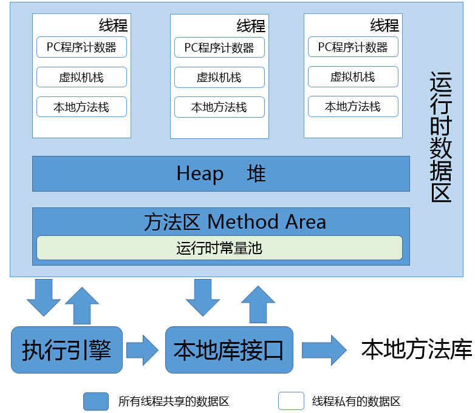
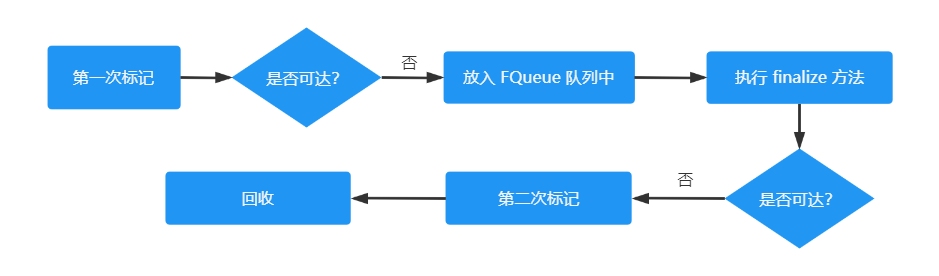

# Java 运行时数据区

## 程序计数器

可以看作是当前线程所执行的字节码的行号指示器。如果线程正在执行的是一个 Java 方法，这个计数器记录的是正在执行的虚拟机字节码指令的地 址；如果正在执行的是本地(Native)方法，这个计数器值则应为空(Undefined)

## Java 虚拟机栈

虚拟机栈描述的是 Java 方法执行的线程内存模型：每个方法被执行的时候，Java 虚拟机都会同步创建一个栈帧(Stack Frame)用于存储局部变量表、操作数栈、动态连接、方法出口等信息。每一个方法被调用直至执行完毕的过程，就对应着一个栈帧在虚拟机栈中从入栈到出栈的过程。

局部变量表存放了编译期可知的各种 Java 虚拟机基本数据类型(boolean、byte、char、short、int、 float、long、double)、对象引用(reference 类型，它并不等同于对象本身，可能是一个指向对象起始地址的引用指针，也可能是指向一个代表对象的句柄或者其他与此对象相关的位置)和returnAddress 类型(指向了一条字节码指令的地址)。

这些数据类型在局部变量表中的存储空间以局部变量槽(Slot)来表示，其中 64 位长度的 long 和 double 类型的数据会占用两个变量槽，其余的数据类型只占用一个。局部变量表所需的内存空间在编译期间完成分配，当进入一个方法时，这个方法需要在栈帧中分配多大的局部变量空间是完全确定的，在方法运行期间不会改变局部变量表的大小。请注意，这里说的“大小”是指变量槽的数量，虚拟机真正使用多大的内存空间（譬如按照 1 个变量槽占用 32 个比特、64 个比特，或者更多）来实现一个变量槽，这是完全由具体的虚拟机实现自行决定的事情。

## Java 堆

对于 Java 应用程序来说，Java 堆(Java Heap)是虚拟机所管理的内存中最大的一块。Java 堆是被所有线程共享的一块内存区域，在虚拟机启动时创建。此内存区域的唯一目的就是存放对象实例，Java 世界里“几乎”所有的对象实例都在这里分配内存。Java 堆是垃圾收集器管理的内存区域。

Java 堆既可以被实现成固定大小的，也可以是可扩展的，不过当前主流的 Java 虚拟机都是按照可扩展来实现的(通过参数 -Xmx 和 -Xms 设定)

## 方法区

方法区(Method Area)与 Java 堆一样，是各个线程共享的内存区域，它用于存储已被虚拟机加载 的类型信息、常量、静态变量、即时编译器编译后的代码缓存等数据。

考虑到 HotSpot 未来的发展，在 JDK 6 的时候 HotSpot 开发团队就有放弃永久代，逐步改为采用本地内存（Native Memory）来实现方法区的计划了，到了 JDK 7 的 HotSpot，已经把原本放在永久代的字符串常量池、静态变量等移出，而到了 JDK 8，终于完全废弃了永久代的概念，改用与 JRockit、J9 一样在本地内存中实现的元空间（Metaspace）来代替，把 JDK 7 中永久代还剩余的内容(主要是类型信息)全部移到元空间中。

### 运行时常量池

运行时常量池（Runtime Constant Pool）是方法区的一部分。Class文件中除了有类的版本、字段、方法、接口等描述信息外，还有一项信息是常量池表（Constant Pool Table），用于存放编译期生成的各种字面量与符号引用，这部分内容将在类加载后存放到方法区的运行时常量池中。

运行时常量池相对于 Class 文件常量池的另外一个重要特征是**具备动态性**，Java 语言并不要求常量一定只有编译期才能产生，也就是说，并非预置入 Class文件中常量池的内容才能进入方法区运行时常量池，运行期间也可以将新的常量放入池中，这种特性被开发人员利用得比较多的便是 String 类的 intern() 方法。

### 直接内存

直接内存（Direct Memory）并不是虚拟机运行时数据区的一部分，也不是《Java虚拟机规范》中 定义的内存区域。但是这部分内存也被频繁地使用，而且也可能导致 OutOfMemoryError 异常出现。在 JDK 1.4 中新加入了 NIO（New Input/Output）类，引入了一种基于通道（Channel）与缓冲区 （Buffer）的 I/O 方式，它可以使用 Native 函数库直接分配堆外内存，然后通过一个存储在 Java 堆里面的 DirectByteBuffer 对象作为这块内存的引用进行操作。这样能在一些场景中显著提高性能，因为避免了在 Java 堆和 Native 堆中来回复制数据。

# 对象的创建

当 Java 虚拟机遇到一条字节码 new 指令时，首先将去检查这个指令的参数是否能在常量池中定位到一个类的符号引用，并且检查这个符号引用代表的类是否已被加载、解析和初始化过。如果没有，那必须先执行相应的类加载过程，在类加载检查通过后，接下来虚拟机将为新生对象分配内存。**对象所需内存的大小在类加载完成后便可完全确定**

## 内存分配方式

### 指针碰撞

假设 Java 堆中内存是绝对规整的，所有被使用过的内存都被放在一边，空闲的内存被放在另一边，中间放着一个指针作为分界点的指示器，那所分配内存就仅仅是把那个指针向空闲空间方向挪动一段与对象大小相等的距离，这种分配方式称为“指针碰撞”(Bump The Pointer)。

### 空闲列表

但如果 Java 堆中的内存并不是规整的，已被使用的内存和空闲的内存相互交错在一起，那就没有办法简单地进行指针碰撞了，虚拟机就必须维护一个列表，记录上哪些内存块是可用的，在分配的时候从列表中找到一块足够大的空间划分给对象实例，并更新列表上的记录，这种分配方式称为“空闲列表”(Free List)。

选择哪种分配方式由 Java 堆是否规整决定，而 Java 堆是否规整又由所采用的垃圾收集器是否带有空间压缩整理（Compact）的能力决定。因此，当使用Serial、ParNew 等带压缩整理过程的收集器时，系统采用的分配算法是指针碰撞，既简单又高效；而当使用 CMS 这种基于清除（Sweep）算法的收集器时，理论上就只能采用较为复杂的空闲列表来分配内存。

### 并发创建对象时指针的修改问题

对象创建在虚拟机中是非常频繁的行为，即使仅仅修改一个指针所指向的位置，在并发情况下也并不是线程安全的，可能出现正在给对象 A 分配内存，指针还没来得及修改，对象 B 又同时使用了原来的指针来分配内存的情况。解决这个问题 有两种可选方案：一种是对分配内存空间的动作进行同步处理——实际上虚拟机是采用 CAS 配上失败 重试的方式保证更新操作的原子性；另外一种是把内存分配的动作按照线程划分在不同的空间之中进行，即每个线程在 Java 堆中预先分配一小块内存，称为本地线程分配缓冲（Thread Local Allocation Buffer，TLAB），哪个线程要分配内存，就在哪个线程的本地缓冲区中分配，只有本地缓冲区用完 了，分配新的缓存区时才需要同步锁定。虚拟机是否使用 TLAB，可以通过 -XX：+/-UseTLAB 参数来 设定。

## 对象在内存中的布局

在 HotSpot 虚拟机里，对象在堆内存中的存储布局可以划分为三个部分：对象头（Header）、实例数据（Instance Data）和对齐填充（Padding）

HotSpot 虚拟机对象的对象头部分包括两类信息。第一类是用于存储对象自身的运行时数据，如哈希码（HashCode）、GC 分代年龄、锁状态标志、线程持有的锁、偏向线程 ID、偏向时间戳等，这部分数据的长度在 32 位和 64 位的虚拟机（未开启压缩指针）中分别为 32 个比特和 64 个比特，官方称它为“Mark Word”。

### 对象头

对象头的另外一部分是类型指针，即对象指向它的类型元数据的指针，Java虚拟机通过这个指针 来确定该对象是哪个类的实例。并不是所有的虚拟机实现都必须在对象数据上保留类型指针，换句话说，查找对象的元数据信息并不一定要经过对象本身。此外，如果对象是一个 Java 数组，那在对象头中还必须有一块用于记录数组长度的数据，因为虚拟机可以通过普通 Java 对象的元数据信息确定 Java 对象的大小，但是如果数组的长度是不确定的，将无法通过元数据中的信息推断出数组的大小。

### 实例数据部分

实例数据部分是对象真正存储的有效信息，即我们在程序代码里面所定义的各种类型的字段内容，无论是从父类继承下来的，还是在子类中定义的字段都必须记录起来。这部分的存储顺序会受到虚拟机分配策略参数(-XX：FieldsAllocationStyle参数)和字段在 Java 源码中定义顺序的影响。HotSpot 虚拟机默认的分配顺序为 longs/doubles、ints、shorts/chars、bytes/booleans、oops(Ordinary Object Pointers，OOPs)，从以上默认的分配策略中可以看到，*相同宽度的字段总是被分配到一起存放*，在满足这个前提条件的情况下，*在父类中定义的变量会出现在子类之前*。如果 HotSpot 虚拟机的 +XX：CompactFields 参数值为 true(默认就为 true)，那子类之中较窄的变量也允许插入父类变量的空隙之中，以节省出一点点空间。

### 对齐填充

对象的第三部分是对齐填充，这并不是必然存在的，也没有特别的含义，它仅仅起着占位符的作 用。由于 HotSpot 虚拟机的自动内存管理系统要求对象起始地址必须是 8 字节的整数倍，换句话说就是 任何对象的大小都必须是 8 字节的整数倍。对象头部分已经被精心设计成正好是 8 字节的倍数(1 倍或者 2 倍)，因此，如果对象实例数据部分没有对齐的话，就需要通过对齐填充来补全。

# 方法区和常量池

自JDK 7起，原本存放在永久代(方法区)的字符串常量池被移至Java堆之中。在 JDK 8 以后，永久代便完全退出了历史舞台，元空间作为其替代者登场

# 垃圾回收

程序计数器、虚拟机栈、本地方法栈3个区域随线程而生，随线程而灭，栈 中的栈帧随着方法的进入和退出而有条不紊地执行着出栈和入栈操作。而 Java 堆和方法区这两个区域则有着很显著的不确定性：一个接口的多个实现类需要的内存可能会不一样，一个方法所执行的不同条件分支所需要的内存也可能不一样，只有处于运行期间，我们才能知道程序究竟会创建哪些对象，创建多少个对象，这部分内存的分配和回收是动态的。

## 可达性分析算法

可达性分析算法的基本思路就是通过一系列称为 “GC Roots” 的根对象作为起始节点集，从这些节点开始，根据引用关系向下搜索，搜索过 程所走过的路径称为“引用链”（Reference Chain），如果某个对象到 GC Roots 间没有任何引用链相连，或者用图论的话来说就是从 GC Roots 到这个对象不可达时，则证明此对象是不可能再被使用的。

即使在可达性分析算法中判定为不可达的对象，也不是“非死不可”的，这时候它们暂时还处于“缓刑”阶段，要真正宣告一个对象死亡，至少要经历两次标记过程：如果对象在进行可达性分析后发现没有与GC Roots相连接的引用链，那它将会被第一次标记，随后进行一次筛选，筛选的条件是此对象是否有必要执行finalize()方法。假如对象没有覆盖 finalize() 方法，或者 finalize() 方法已经被虚拟机调用过，那么虚拟机将这两种情况都视为“没有必要执行”。

## 二次标记

如果这个对象被判定为确有必要执行 finalize() 方法，那么该对象将会被放置在一个名为 F-Queue 的队列之中，并在稍后由一条由虚拟机自动建立的、低调度优先级的 Finalizer 线程去执行它们的 finalize() 方法。这里所说的“执行”是指虚拟机会触发这个方法开始运行，但并不承诺一定会等待它运行结束。这样做的原因是，如果某个对象的 finalize() 方法执行缓慢，或者更极端地发生了死循环，将很可能导致 F-Queue 队列中的其他对象永久处于等待，甚至导致整个内存回收子系统的崩溃。finalize() 方法是对象逃脱死亡命运的最后一次机会，稍后收集器将对 F-Queue 中的对象进行第二次小规模的标记，如果对象要在 finalize() 中成功拯救自己 —— 只要重新与引用链上的任何一个对象建立关联即可，譬如把自己(this关键字)赋值给某个类变量或者对象的成员变量，那在第二次标记时它将被移出“即将回收”的集合；如果对象这时候还没有逃脱，那基本上它就真的要被回收了。

任何一个对象的 finalize() 方法都只会被系统自动调用一次，如果对象面临下一次回收，它的 finalize() 方法不会被再次执行

# 垃圾回收器

## G1 垃圾回收器

G1 不再坚持固定大小以及固定数量的分代区域划分，而是把连续的 Java 堆划分为多个大小相等的独立区域（Region），每一个 Region 都可以根据需要，扮演新生代的 Eden 空间、Survivor 空间，或者老年代空间。收集器能够对扮演不同角色的 Region 采用不同的策略去处理，这样无论是新创建的对象还是已经存活了一段时间、熬过多次收集的旧对象都能获取很好的收集效果。

Region 中还有一类特殊的 Humongous 区域，专门用来存储大对象。G1 认为只要大小超过了一个 Region 容量一半的对象即可判定为大对象。每个Region 的大小可以通过参数 -XX：G1HeapRegionSize 设定，取值范围为 1MB～32MB，且应为 2 的 N 次幂。而对于那些超过了整个 Region 容量的超级大对象， 将会被存放在 N 个连续的 Humongous Region 之中，G1 的大多数行为都把 Humongous Region 作为老年代的一部分来进行看待