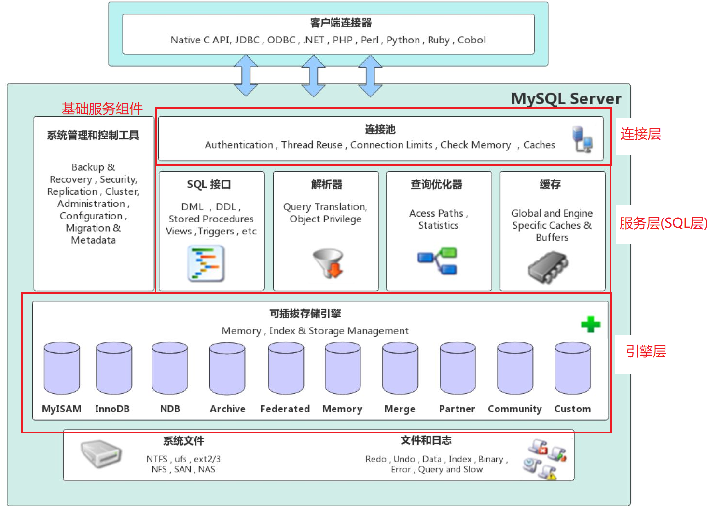
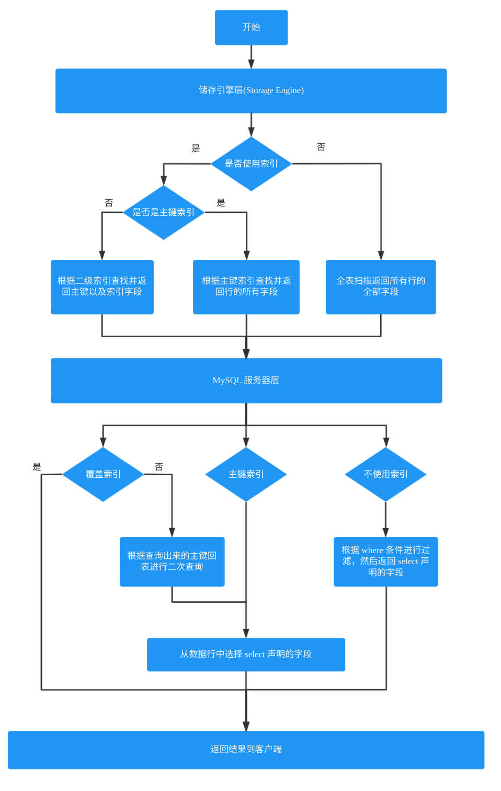
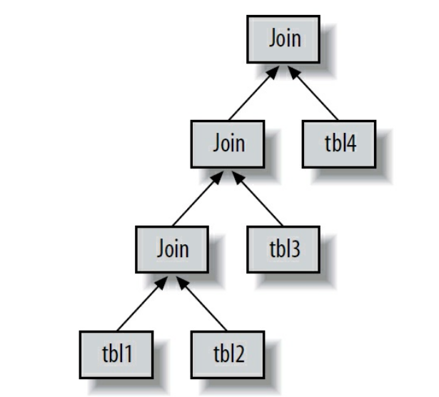

# Mysql Architecture



The server communicates with *Storage Engine* through the storage engine API. This interface hides differences between storage engines and makes them largely transparent at the query layer. The API contains a couple of dozen low-level functions that perform operations such as “begin a transaction” or “fetch the row that has this primary key.” The storage engines don’t parse SQL or communicate with each other; they simply respond to requests from the server.

>One exception is InnoDB, which does parse foreign key definitions, because the MySQL server doesn’t
>yet implement them itself.

# Shared Locks and Exclusive Locks

Shared Locks and Exclusive Locks (Read Locks and Write Locks). Write Locks are exclusive, they block both read blocks and wirte blocks == because the only safe policy is to have a single client to writing to the resource at a given time and to prevent all reads when a client is writing.

# Isolution Levels

## READ UNCOMMITTED

In the READ UNCOMMITTED isolation level, transactions can view the results of uncommitted transactions. At this level, many problems can occur unless you really, really know what you are doing and have a good reason for doing it. **This level is rarely used in practice**, because its performance isn’t much better than the other levels, which have many advantages. Reading uncommitted data is also known as
a dirty read.

## READ COMMITTED

The default isolation level for most database systems (but not MySQL!) is READ COMMITTED. It satisfies the simple definition of isolation used earlier: a transaction will see only those changes made by transactions that were already committed when it began, and its changes won’t be visible to others until it has committed. This level still allows what’s known as a *nonrepeatable read*. This means you can run the same statement twice and see different data.

## REPEATABLE READ

REPEATABLE READ solves the problems that READ UNCOMMITTED allows. It guarantees that any rows a transaction reads will “look the same” in subsequent reads within the same transaction, but in theory it still allows another tricky problem: *phantom reads*. Simply put, a phantom read can happen when you select some range of rows, another transaction inserts a new row into the range, and then you select the same range again; you will then see the new “phantom” row. **InnoDB and XtraDB solve the phantom read problem with multiversion concurrency control**

REPEATABLE READ is MySQL’s default transaction isolation level.

it has a *next-key locking strategy* that prevents phantom reads in this isolation level: rather than
locking only the rows you’ve touched in a query, InnoDB locks gaps in the index structure as well, preventing phantoms from being inserted.

## SERIALIZABLE

The highest level of isolation, SERIALIZABLE, solves the phantom read problem by forcing transactions to be ordered so that they can’t possibly conflict. In a nutshell, **SERIALIZABLE places a lock on every row it reads**. At this level, a lot of timeouts and lock contention can occur. We’ve rarely seen people use this isolation level, but your application’s needs might force you to accept the decreased concurrency in favor of the data stability that results.

# DeadLock

The way InnoDB currently handles deadlocks is to roll back the transaction that has the fewest exclusive row locks(an approximate metric for which will be the easiest to roll back)

# Transaction Logging

Transaction logging helps make transactions more efficient. Instead of updating the tables on disk each time a change occurs. The storage engine can change its in-memory copy of data. This is very fast. The storage engine can then wirte a record of the change to the transaction log, which is on disk and therefore durable.This is also a relatively fast operation, because appending log events involves sequential I/O in one small area of the disk instead of random I/O in many places. Thus, most storage engines that use this technique (known as *write-ahead logging*) end up writing the changes to disk twice

If there’s a crash after the update is written to the transaction log but before the changes are made to the data itself, the storage engine can still recover the changes upon restart. The recovery method varies between storage engines.

# MVCC

MVCC(Multiversion Concurrency Control)

MVCC works only with the *REPEATABLE READ* and *READ COMMITTED* isolation levels.  *READ UNCOMMITTED* isn’t MVCC-compatible because queries don’t read the row version that’s appropriate for their transaction version; they read the newest version, no matterwhat. *SERIALIZABLE* isn’t MVCC-compatible because reads lock every row they return.

# InnoDB

InnoDB tables are built on a *clustered index*

InnoDB has a variety of internal optimizations. These include predictive read-ahead for prefetching data from disk, an adaptive hash index that automatically builds hash indexes in memory for very fast lookups, and an insert buffer to speed inserts.

## 自适应哈希索引(Adaptive Hash Index)

当 InnoDB 注意到某些索引值被使用得非常频繁时，它会在内存中基于 B-Tree 索引之上再创建一个哈希索引，这样就让 B-Tree 索引也具有哈希索引的一些优点，比如快速的哈希查找。这是一个完全自动的、内部的行为，用户无法控制或者配置，不过如果有必要，完全可以关闭该功能。

## 锁

InnoDB 在二级索引上使用共享(读)锁，但访问主键索引需要排他(写)锁。这消除了使用覆盖索引的可能性，并且使得 SELECT FOR UPDATE 比 LOCK IN SHARE MODE 或非锁定查询要慢很多。

# Memory engine 

MySQL uses the Memory engine internally while processing queries that require a temporary table to hold intermediate results. If the intermediate result becomes too large for a Memory table, or has TEXT or BLOB columns, MySQL will convert it to a MyISAM table on disk. 

# 数据类型

## Char And Varchar

### Varchar

VARCHAR 类型用于存储可变长字符串，是最常见的字符串数据类型。它比定长类型更节省空间，因为它仅使用必要的空间（例如，越短的字符串使用越少的空间）。有一种情况例外，如果 MySQL 表使用 ROW_FORMAT=FIXED 创建的话，每一行都会使用定长存储，这会很浪费空间。
VARCHAR 需要使用 1 或 2 个额外字节记录字符串的长度：如果列的最大长度小于或等于 255 字节，则只使用 1 个字节表示，否则使用 2 个字节。假设采用 latin1 字符集，一个 VARCHAR (10) 的列需要 11 个字节的存储空间。VARCHAR(1000) 的列则需要 1002 个字节，因为需要 2 个字节存储长度信息。

VARCHAR 节省了存储空间，所以对性能也有帮助。但是，由于行是变长的，在 UPDATE 时可能使行变得比原来更长，这就导致需要做额外的工作。如果一个行占用的空间增长，并且在页内没有更多的空间可以存储，在这种情况下，不同的存储引擎的处理方式是不一样的。例如，MyISAM 会将行拆成不同的片段存储，InnoDB 则需要分裂页来使行可以放进页内。

### Char

CHAR 类型是定长的：MySQL 总是根据定义的字符串长度分配足够的空间。**当存储 CHAR 值时，MySQL 会删除所有的末尾空格**, CHAR 值会根据需要采用空格进行填充以方便比较

## BLOB And TEXT

因为 Memory 引擎不支持 BLOB 和 TEXT 类型，所以，如果查询使用了 BLOB 或 TEXT 列并且需要使用隐式临时表，将不得不使用MyISAM 磁盘临时表，即使只有几行数据也是如此，这会导致严重的性能开销。即使配置 MySQL 将临时表存储在内存块设备上(RAM Disk)，依然需要许多昂贵的系统调用。最好的解决方案是尽量避免使用 BLOB 和 TEXT 类型。如果实在无法避免，有一个技巧是在所有用到BLOB 字段的地方都使用 SUBSTRING(column，length) 将列值转换为字符串(在 ORDER BY 子句中也适用)，这样就可以使用内存临时表了。但是要确保截取的子字符串足够短，不会使临时表的大小超过 max_heap_table_size 或 tmp_table_size，超过以后 MySQL 会将内存临时表转换为 MyISAM 磁盘临时表。

## DateTime And Timestamp

### DATETIME

这个类型能保存大范围的值，从 1001 年到 9999 年，精度为秒。它把日期和时间封装到格式为 YYYYMMDDHHMMSS 的整数中，与时区无关。使用 8 个字节的存储空间。

### TIMESTAMP

TIMETAMP 类型保存了从 1970 年 1 月 1 日午夜(格林尼治标准时间)以来的秒数，它和 UNIX 时间戳相同。TIMESTAMP 只使用 4 个字节的存储空间，因此它的范围比 DATETIME 小得多：只能表示从 1970 年到 2038 年

MySQL 提供了 FROM_UNIXTIME() 函数把 Unix 时间戳转换为日期，并提供了 UNIX_TIMESTAMP() 函数把日期转换为 Unix 时间戳。

datetime 是存储服务器当前的时区. 而 timestamp 类型,是将服务器当前时间转换为 UTC(世界时间) 来存储.即 datetime 与时区无关, 存什么, 返回什么. 而 timestamp 存储的时间,返回的时间会随着数据库的时区不同而发生改变。

TIMESTAMP 也有 DATETIME 没有的特殊属性。默认情况下，如果插入时没有指定第一个 TIMESTAMP 列的值，MySQL 则设置这个列的值为当前时间。在插入一行记录时，MySQL 默认也会更新第一个 TIMESTAMP 列的值(除非在 UPDATE 语句中明确指定了值)。你可以配置任何 TIMESTAMP 列的插入和更新行为。最后，TIMESTAMP 列默认为 NOT NULL，这也和其他的数据类型不一样。

除了特殊行为之外，通常也应该尽量使用 TIMESTAMP，因为它比 DATETIME 空间效率更高。有时候人们会将 Unix 时间截存储为整数值， 但这不会带来任何收益。用整数保存时间截的格式通常不方便处理，所以我们不推荐这样做。

## BIT

可以使用 BIT 列在一列中存储一个或多个 true/false 值。BIT（1） 定义一个包含单个位的字段，BIT(2) 存储 2 个位，依此类推。BIT 列的最大长度是 64 个位。BIT 默认的字符集是二进制字符串(binary)

BIT 的行为因存储引擎而异。MyISAM 会打包存储所有的 BIT 列，所以 17 个单独的 BIT 列只需要 17 个位存储（假设没有可为 NULL 的列），这样 MyISAM 只使用3个字节就能存储这 17 个 BIT 列。其他存储引擎例如 Memory 和 InnoDB，为每个 BIT 列使用一个足够存储的最小整数类型来存放，所以不能节省存储空间。

```sql
mysql>create table bittest(a bit(8) not null);
mysql>insert into bittest values(b'001110011');
mysql>insert into bittest values(b'001110001');
mysql>insert into bittest values(b'11111111');
mysql>insert into bittest values(b'01111111');
mysql>insert into bittest values(b'00111111');
mysql>select a, a+0 from bittest;
+------+-----+
| a    | a+0 |
+------+-----+
| s    | 115 |
| q    | 113 |
| 9    | 57  |
| 0xff | 255 |
| 0x7f | 127 |
| ?    | 63  |
+------+-----+
mysql>select charset(a) from bittest;
+------------+
| charset(a) |
+------------+
| binary     |
| binary     |
| binary     |
| binary     |
| binary     |
| binary     |
+------------+
```

从上面的测试中可以看出：

- 在查询 BIT 类型的数据时，如果 BIT 存储的二进制对应的 ASCII 码值对应的字符是一个可打印字符则会将对应的字符打印出来，如果不能够打印则将二进制转换成 16 进制进行显示
- 如果查询时对 BIT 列做了数学运算，那么查询出来的内容会以 10 进制进行显示

## ENUM 枚举类型

在 ENUM 中使用枚举类型的缺点是：如果后期需要对枚举列添加内容时，需要进行一次 ALTER TABLE 操作

# 为什么不推荐在完全随机的字符串中创建索引

完全“随机”的字符串: 例如 MD5()、SHA1() 或者 UUID() 等算法产生的字符串，这些函数生成的新值会任意分布在很大的空间内，这会导致 INSERT 以及一些 SELECT 语句变得很慢:

- 因为插入值会随机地写到索引的不同位置，所以使得 INSERT 更慢。这会导致页分裂、磁盘随机访问，以及对于聚簇存储引擎产生聚簇索引碎片。
- SELECT 语句会变得更慢，因为逻辑上相邻的行会分布在磁盘和内存的不同地方。
- 随机值导致缓存对所有类型的查询语句效果都很差，因为会使得缓存赖以工作的访问局部性原理失效。如果整个数据集都是热点数据，那么缓存任何一部分特定数据到内存都没有好处；如果工作集比内存大，缓存将会有很多刷新和不命中。

如果要存储 UUID 值，则应该移除 “-” 符号；或者更好的做法是，用 UNHEX() 函数转换 UUID 值为 16 字节的数字，并且存储在一个
BINARY(16) 列中。检索时可以通过 HEX() 函数来格式化为十六进制格式。UUID() 生成的值与加密散列函数例如 SHA1() 生成的值有不同的特征：UUID 值虽然分布也不均匀，但还是有一定顺序的。尽管如此，但还是不如递增的整数好用。

# IPv4 地址的存储

IPv4 地址实际上是 32 位无符号整数，不是字符串。用小数点将地址分成四段的表示方法只是为了让人们阅读容易。所以应该用无符号整数存储IP 地址。MySQL 提供 INET_ATON() 和 INET_NTOA () 函数在这两种表示方法之间转换。

# 范式的优点和缺点

## 优点

- 范式化的更新操作通常比反范式化要快。

- 当数据较好地范式化时，就只有很少或者没有重复数据，所以只需要修改更少的数据。
- 范式化的表通常更小，可以更好地放在内存里，所以执行操作会更快。
- 很少有多余的数据意味着检索列表数据时会更少需要 DISTINCT 或者 GROUP BY 语句。

## 缺点

范式化设计的 schema 的缺点是通常需要关联。稍微复杂一些的查询语句在符合范式的 schema 上可能至少需要一次关联，也许更多。这不
但代价昂贵，也可能使一些索引策略无效。例如，范式化可能将列存放在不同的表中，而这些列如果在一个表中本可以属于同一个索引。

# 更快的读，更慢的写

为了提升读查询的速度，经常会需要建一些额外索引，增加冗余列，甚至是创建缓存表和汇总表。这些方法会增加写查询的负担，也需要额外的维护任务，但在设计高性能数据库时，这些都是常见的技巧：虽然写操作变得更慢了，但更显著地提高了读操作的性能。然而，写操作变慢并不是读操作变得更快所付出的唯一代价，还可能同时增加了读操作和写操作的开发难度。

# ALTER TABLE

MySQL 的 ALTER TABLE 操作的性能对大表来说是个大问题。MySQL 执行大部分修改表结构操作的方法是用新的结构创建一个空表，从旧表中查出所有数据插入新表，然后删除旧表。这样操作可能需要花费很长时间，如果内存不足而表又很大，而且还有很多索引的情况下尤其如此。许多人都有这样的经验，ALTER TABLE 操作需要花费数个小时甚至数天才能完成。

一般而言，大部分 ALTER TABLE 操作将导致 MySQL 服务中断

ALTER TABLE 是让人痛苦的操作，因为在大部分情况下，它都会锁表并且重建整张表

# 索引

## 索引的优点

1. 索引大大减少了服务器需要扫描的数据量。

2. 索引可以帮助服务器避免排序和临时表。
3. 索引可以将随机 I/O 变为顺序 I/O。

## 前缀索引的优缺点

前缀索引是一种能使索引更小、更快的有效办法，但另一方面也有其缺点：MySQL 无法使用前缀索引做 ORDER BY 和 GROUP BY ，也无法使用前缀索引做覆盖扫描。

## 聚簇索引

InnoDB 的聚簇索引实际上在同一个结构中保存了 B-Tree 索引和数据行, 当表有聚簇索引时，它的数据行实际上存放在索引的叶子页(leaf page) 中。术语“聚簇”表示数据行和相邻的键值紧凑地存储在一起(通常情况下，但并不是总是成立),因为无法同时把数据行存放在两个不同的地方，所以一个表只能有一个聚簇索引

InnoDB 将通过主键聚集数据，这也就是说“被索引的列” 就是主键列。如果没有定义主键，InnoDB 会选择一个唯一的非空索引代替。如果没有这样的索引，InnoDB 会隐式定义一个主键来作为聚簇索引。

### 聚簇索引插入顺序的索引值

当以一个整数作为 ID 时，ID 的值是顺序的，因此 InnoDB 把每一条记录都存储在上一条记录的后面，当达到页的最大填充因子时(InnoDB 默认的最大填充因子是页大小的 15/16 ，留出部分空间用于以后修改）下一条记录就会写入新的页中, 一旦数据按照这种顺序的方式加载，主
键页就会近似于被顺序的记录填满。

### 顺序主键的缺点是什么？

对于高并发工作负载，在 InnoDB 中按主键顺序插入可能会造成明显的争用。主键的上界会成为“热点”。因为所有的插入都发生在这里，所以并发插入可能导致间隙锁竞争。另一个热点可能是 AUTO_INCREMENT 锁机制；如果遇到这个问题，则可能需要考虑重新设计表或者应用，或者更改 innodb_autoinc_lock_mode 配置。

### 为什么不推荐使用 UUID 作为主键

- 写入的目标页可能已经刷到磁盘上并从缓存中移除，或者是还没有被加载到缓存中，InnoDB 在插入之前不得不先找到并从磁盘读取目标页到内存中。这将导致大量的随机I/O。
- 因为写入是乱序的，InnoDB 不得不频繁地做页分裂操作，以便为新的行分配空间。页分裂会导致移动大量数据，一次插入最少需要修改三个页而不是一个页。
- 由于频繁的页分裂，页会变得稀疏并被不规则地填充，所以最终数据会有碎片。

## 覆盖索引

如果一个索引包含（或者说覆盖）所有需要查询的字段的值，我们就称之为“覆盖索引”

### 覆盖索引的优点

- 索引条目通常远小于数据行大小，所以如果只需要读取索引，那 MySQL 就会极大地减少数据访问量。这对缓存的负载非常重要，因为这种情况下响应时间大部分花费在数据拷贝上。覆盖索引对于 I/O 密集型的应用也有帮助，因为索引比数据更小，更容易全部放入内存中
- 因为索引是按照列值顺序存储的（至少在单个页内是如此），所以对于 I/O 密集型的范围查询会比随机从磁盘读取每一行数据的 I/O 要少得多。
- 由于 InnoDB 的聚簇索引，覆盖索引对 InnoDB 表特别有用。InnoDB 的二级索引在叶子节点中保存了行的主键值，所以如果二级主键能够覆盖查询，则可以避免对主键索引的二次查询。

不是所有类型的索引都可以成为覆盖索引。覆盖索引必须要存储索引列的值，而哈希索引、空间索引和全文索引等都不存储索引列的值.

## 索引优化技巧

### 索引失效的场景

1. 索引不能是表达式的一部分或者是函数的参数,为了避免这种情况，通常需要将索引列单独的放在比较运算符的一侧

### 添加冗余列

如果一个字符串数据查询的非常频繁，如 URL，则可以添加一个冗余列，用来存储 URL 的哈希值，hash 值的生成可以使用 CRC32 函数, 该函数会返回一个 32 位的无符号整数,而整数的比较是非常快的, 使用 CRC32 函数时需要注意，如果数据量非常大的话，会出现很多的哈希冲突，出现哈希冲突时，就必须包含常量值，如下面的 url 字段就是常量值:

```sql
SELECT id FROM url WHERE url="http://www.mysql.com" AND url_crc=CRC32("http://www.mysql.com");
```

这样做的性能会非常高，因为 MySQL 化器会使用这个选择性很高而体积很小的基于 url_crc 列的索引来完成查找。即使有多个记录有相同的索引值，查找仍然很快，只需要根据哈希值做快速的整数比较就能找到索引条目，然后一一比较返回对应的行。

还可以使用如 FNV64() 函数作为哈希函数，这是移植自 Percona Server 的函数，可以以插件的方式在任何 MySQL 版本中使用，哈希值为 64 位，速度快，且冲突比 CRC32() 要少很多。

同时，冗余列的维护可以通过两个前置触发器来完成：before insert 和 update insert;

# Where 条件底层原理

一般 MySQL 能够使用如下三种方式应用 WHERE 条件，从好到坏依次为：

- 在索引中使用 WHERE 条件来过滤不匹配的记录。这是在存储引擎层完成的。
- 使用索引覆盖扫描（在 Explain 命令的输出结果中 Extra 列出现了 Using index）来返回记录，直接从索引中过滤不需要的记录并返回命中的结果。这是在 MySQL 服务器层完成的，但无须再回表查询记录。
- 从数据表中返回数据，然后过滤不满足条件的记录（在 Extra 列中出现 Using Where）。这在 MySQL 服务器层完成，MySQL 需要先从数据表读出记录然后过滤。



# Mysql 客户端和服务端的通信

Mysql 客户端和服务端之间的通信协议是“半双工”的，这意味着，在任何一个时刻，要么是由服务器向客户端发送数据，要么是由客户端向服务器发送数据，这两个动作不能同时发生。

客户端用一个单独的数据包将查询传给服务器。这也是为什么当查询的语句很长的时候，参数 max_allowed_packet 就特别重要了。一
旦客户端发送了请求，它能做的事情就只是等待结果了。

相反的，一般服务器响应给用户的数据通常很多，由多个数据包组成。当服务器开始响应客户端请求时，客户端必须完整地接收整个返回结果，而不能简单地只取前面几条结果，然后让服务器停止发送数据。这种情况下，客户端若接收完整的结果，然后取前面几条需要的结果，或者接收完几条结果后就“粗暴”地断开连接，都不是好主意。这也是在必要的时候一定要在查询中加上 LIMIT 限制的原因。

多数连接 MySQL 的库函数都可以获得全部结果集并缓存到内存里，还可以逐行获取需要的数据。默认一般是获得全部结果集并缓存到内存中。MySQL 通常需要等所有的数据都已经发送给客户端才能释放这条查询所占用的资源，所以接收全部结果并缓存通常可以减少服务器的压力，让查询能够早点结束、早点释放相应的资源。

当使用多数连接 MySQL 的库函数从 MySQL 获取数据时，其结果看起来都像是从 MySQL 服务器获取数据，而实际上都是从这个库函数的缓存获取数据。多数情况下这没什么问题，但是如果需要返回一个很大的结果集的时候，这样做并不好，因为库函数会花很多时间和内存来存储所有的结果集。如果能够尽早开始处理这些结果集，就能大大减少内存的消耗，这种情况下可以不使用缓存来记录结果而是直接处理。这样做的缺点是，对于服务器来说，需要查询完成后才能释放资源，所以在和客户端交互的整个过程中，服务器的资源都是被这个查询所占用的

# IN() 条件的底层实现

MySQL 将 IN() 列表中的数据先进行排序(这样可以充分利用局部性原理)，然后通过二分查找的方式来确定列表中的值是否满足条件，这是一个 $O(logN)$ 复杂度的操作，等价地转换成 OR 查询的复杂度为 $O(N)$ ，对于 IN() 列表中有大量取值的时候，MySQL 的处理速度将会更快。

## 为什么不要在 IN 中使用子查询

MySQL对 IN() 列表中的选项有专门的优化策略，一般会认为 MySQL 会先执行子查询返回对应的结果再执行外层的查询，但是，MySQL 不是这样做的。MySQL 会将相关的外层表压到子查询中，它认为这样可以更高效率地查找到数据行。这种优化可能会导致全表扫描, 如果外层的表是一个非常大的表，那么这个查询的性能会非常糟糕。

因为使用 IN() 加子查询，性能经常会非常糟，所以通常建议使用 EXISTS() 等效的改写查询来获取更好的效率

# 存储引擎提供给优化器的信息

存储引擎提供给优化器对应的统计信息包括：

- 每个表或者索引有多少个页面
- 每个表的每个索引的基数是多少
- 数据行和索引长度
- 索引的分布信息等。

优化器根据这些信息来选择一个最优的执行计划。

# 关联查询

MySQL 总是从一个表开始一直嵌套循环、回溯完成所有表关联。所以，MySQL 的执行计划总是一棵左测深度优先的树：



MySQL 对任何关联都执行嵌套循环关联操作，即 MySQL 先在一个表中循环取出单条数据，然后再嵌套循环到下一个表中寻找匹配的行，依次下去，直到找到所有表中匹配的行为止。然后根据各个表匹配的行，返回查询中需要的各个列。MySQL 会尝试在最后一个关联表中找到所有匹配的行，如果最后一个联表无法找到更多的行以后，MySQL 返回到上一层次关联表，看是否能够找到更多的匹配记录，依此类推迭代执行。

从本质上说，MySQL 对所有的类型的查询都以同样的方式运行。MySQL 在 FROM 子句中遇到子查询时，先执行子查询并将其结果放到一个临时表中，然后将这个临时表当作一个普通表对待。MySQL 在执行 UNION 查询时也使用类似的临时表，在遇到右外连接的时候，MySQL 将其改写成等价的左外连接。简而言之，当前版本的 MySQL 会将所有的查询类型都转换成类似的执行计划

## UNION 查询

对于 UNION 查询，MySQL 先将一系列的单个查询结果放到一个临时表中，然后再重新读出临时表数据来完成 UNION 查询

# 排序

当不能使用索引生成排序结果的时候，MySQL 需要自己进行排序，如果数据量小则在内存中进行，如果数据量大则需要使用磁盘，不过 MySQL将这个过程统一称为文件排序(filesort )，即使完全是内存排序不需要任何磁盘文件时也是如此。

如果需要排序的数据量小于“排序缓冲区”，MySQL 使用内存进行“快速排序”操作。如果内存不够排序，那么 MySQL 会先将数据分块，对每个独立的块使用“快速排序”进行排序，并将各个块的排序结果存放在磁盘上，然后将各个排好序的块进行合并(merge)，最后返回排序结果。

## 排序实现

排序的实现一共有两种算法：两次传输排序以及单次传输排序

## 两次传输排序

读取行指针和需要排序的字段，对其进行排序，然后再根据排序结果读取所需要的数据行。

这需要进行两次数据传输，即需要从数据表中读取两次数据，第二次读取数据的时候，因为是读取排序列进行排序后的所有记录，这会产生大量的随机 I/O，所以两次数据传输的成本非常高。当使用的是 MyISAM 表的时候，成本可能会更高，因为 MyISAM 使用系统调用进行数据的读取(MyISAM 非常依赖操作系统对数据的缓存)。不过这样做的优点是，在排序的时候存储尽可能少的数据，这就让“排序缓冲区”中可能容纳尽可能多的行数进行排序。

## 单次传输排序

先读取查询所需要的所有列，然后再根据给定列进行排序，最后直接返回排序结果。

这个算法只在 MySQL 4.1 和后续更新的版本才引入。因为不再需要从数据表中读取两次数据，对于 I/O 密集型的应用，这样做的效率高了很多。另外，相比两次传输排序，这个算法只需要一次顺序 I/O 读取所有的数据，而无须任何的随机 I/O。缺点是，如果需要返回的列非常多、非常大，会额外占用大量的空间，而这些列对排序操作本身来说是没有任何作用的。因为单条排序记录很大，所以可能会有更多的排序块需要合并。

很难说哪个算法效率更高，两种算法都有各自最好和最糟的场景。当查询需要所有列的总长度不超过参数 max_length_for_sort_data 时，MySQL 使用“单次传输排序”，可以通过调整这个参数来影响 MySQL 排序算法的选择。

MySQL 在进行文件排序的时候需要使用的临时存储空间可能会比想象的要大得多。原因在于 MySQL 在排序时，对每一个排序记录都会分配一个足够长的定长空间来存放。这个定长空间必须足够长以容纳其中最长的字符串，例如，如果是 VARCHAR 列则需要分配其完整长度；如果使用UTF-8 字符集，那么 MySQL 将会为每个字符预留三个字节。

在关联查询的时候如果需要排序，MySQL 会分两种情况来处理这样的文件排序。如果 ORDER BY 子句中的所有列都来自关联的第一个表，那么 MySQL 在关联处理第一个表的时候就进行文件排序。如果是这样，那么在 MySQL 的 EXPLAIN 结果中可以看到 Extra 字段会有 “Using filesort”。除此之外的所有情况，MySQL 都会先将关联的结果存放到一个临时表中，然后在所有的关联都结束后，再进行文件排序。这种情况下，在 MySQL 的 EXPLAIN 结果的 Extra 字段可以看到 “Using temporary;Using filesort”。如果查询中有 LIMIT 的话，LIMIT 也会在排序之后应用，所以即使需要返回较少的数据，临时表和需要排序的数据量仍然会非常大。

# 优化分页查询

优化此类分页查询的一个最简单的办法就是尽可能地使用索引覆盖扫描，而不是查询所有的列。然后根据需要做一次关联操作再返回所需的列。对于偏移量很大的时候，这样做的效率会提升非常大。