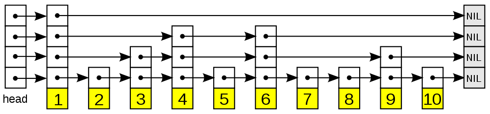

# SDS(Simple Dynamic String)简单动态字符串

## SDS 的结构

```c
/* Note: sdshdr5 is never used, we just access the flags byte directly.
 * However is here to document the layout of type 5 SDS strings. */
struct __attribute__ ((__packed__)) sdshdr5 {
    unsigned char flags; /* 3 lsb of type, and 5 msb of string length */
    char buf[];
};
struct __attribute__ ((__packed__)) sdshdr8 {
    uint8_t len; /* used */
    uint8_t alloc; /* excluding the header and null terminator */
    unsigned char flags; /* 3 lsb of type, 5 unused bits */
    char buf[];
};
struct __attribute__ ((__packed__)) sdshdr16 {
    uint16_t len; /* used */
    uint16_t alloc; /* excluding the header and null terminator */
    unsigned char flags; /* 3 lsb of type, 5 unused bits */
    char buf[];
};
struct __attribute__ ((__packed__)) sdshdr32 {
    uint32_t len; /* used */
    uint32_t alloc; /* excluding the header and null terminator */
    unsigned char flags; /* 3 lsb of type, 5 unused bits */
    char buf[];
};
struct __attribute__ ((__packed__)) sdshdr64 {
    uint64_t len; /* used */
    uint64_t alloc; /* excluding the header and null terminator */
    unsigned char flags; /* 3 lsb of type, 5 unused bits */
    char buf[];
};
```

- len 表示字符串的长度
- buf 存储字符串的数组
- alloc 执行分配 buf 数组分配空间的大小
- flags 表示字符串的类型

## SDS 与 C 语言字符串的区别

获取 SDS 字符串长度的时间复杂度为 $O(1)$, 而获取 C 语言字符串的时间复杂度为 $O(n)$ ,因为 C 语言字符串并不记录字符串的长度信息，得通过遍历的方式来获取字符串的长度

### SDS 的优点

- 常数复杂度获取字符串长度。
- 杜绝缓冲区溢出。
- 减少修改字符串长度时所需的内存重分配次数。
- 二进制安全。
- 兼容部分 C 字符串函数(以为 SDS 中的 buf 数组总是以 ‘\0’ 结尾，与 C 语言字符串保持一致)。

## SDS 的空间分配规则

如果对 SDS 进行修改之后，SDS 的长度（也即是 len 属性的值）小于 1MB，那么程序分配和 len 属性同样大小的未使用空间，这时 SDS len 属性的值将和 free 属性的值相同。举个例子，如果进行修改之后，SDS 的 len 变成了 13 个字节，那么程序也会分配 13 字节的未使用空间，SDS 的 buf 数组的实际长度将变成 13+13+1=27 字节（额外的一字节用于保存空字符）。

如果对 SDS 进行修改之后，SDS 的长度大于等于 1MB，那么程序会分配 1MB 的未使用空间。举个例子，如果进行修改之后，SDS 的 len 将变成 30MB，那么程序会分配 1MB 的未使用空间，SDS 的 buf 数组的实际长度将为 `30MB + 1MB + 1byte`。

通过空间预分配策略，Redis 可以减少连续执行字符串增长操作所需的内存重分配次数。

## SDS 的惰性空间释放

惰性空间释放用于优化 SDS 的字符串缩短操作：当 SDS 的 API 需要缩短 SDS 保存的字符串时，程序并不立即使用内存重分配来回收缩短后多出来的字节，而是使用 free 属性将这些字节的数量记录起来，并等待将来使用。与此同时，SDS 也提供了相应的 API，让我们可以在有需要时，真正地释放 SDS 的未使用空间，所以不用担心惰性空间释放策略会造成内存浪费。

## 二进制安全

为了确保 Redis 可以适用于各种不同的使用场景，SDS 的 API 都是二进制安全的（binary-safe），所有 SDS API 都会以处理二进制的方式来处理 SDS 存放在 buf 数组里的数据，程序不会对其中的数据做任何限制、过滤、或者假设，数据在写入时是什么样的，它被读取时就是什么样。

这也是我们将 SDS 的 buf 属性称为字节数组的原因——Redis 不是用这个数组来保存字符，而是用它来保存一系列二进制数据。

使用SDS来保存特殊数据格式没有任何问题，因为 SDS 使用 len 属性的值而不是空字符(‘\0’)来判断字符串是否结束

# 链表

链表节点的定义

```c
typedef strucct listNode {
    struct listNode* prev;
    struct listNode* next;
    void* value;
} listNode;
```

链表的定义

```c
typedef struct list{
    listNode * head;
    listNode * tail;
    unsigned long len;
    void* (*dum)(void* ptr); // 复制链表节点中保存的值的函数
    void (*free)(void* prt); // 结点值释放函数
    int (*match)(void* ptr, void* key); //比较节点值和另一个输入值是否相等
}list;
```

## Redis 实现的链表特性

- 双端：链表节点带有 prev 和 next 指针，获取某个节点的前置节点和后置节点的复杂度都是 $O(1)$。
- 无环：表头节点的 prev 指针和表尾节点的 next 指针都指向 NULL，对链表的访问以 NULL 为终点。
- 带表头指针和表尾指针：通过 list 结构的 head 指针和 tail 指针，程序获取链表的表头节点和表尾节点的复杂度为 $O(1)$。
- 带链表长度计数器：程序使用 list 结构的 len 属性来对 list 持有的链表节点技术，程序获取链表中节点数量的复杂度为 $O(1)$
- 多态：链表节点使用 `void*` 指针来保存节点值，并且可以通过 list 结构的 `dup、free、match` 三个属性为节点值设置类型特定函数，所以链表可以用于保存各种不同类型的值

# 字典

字典结构

```c
typedef struct dictht{
    dictEntry **table; // 存放元素的哈希数组
    unsigned long size;
    unsigned long sizeMask; // 哈希表的掩码，总是为 size - 1
    unsigned long used; // 存入哈希表中的元素个数
}
```

table 属性是一个数组，数组中的每个元素都是一个指向 `dict.h/dictEntry` 结构指针，每个 dictEntry 结构保存着一个键值对

节点结构

```c
typedef struct dictEntry{
    void* value;
    union{
        void* val;
        uint64_tu64;
        int64_ts64;
    }v;
    struct dictEntry* next;
}dictEntry;
```

key 属性保存着键值对中的键，而 v 属性则保存着键值对中的值，其中键值对的值可以是一个指针，或者是一个 uint64_t 整数，又或者是一个 int64_t 整数。next 属性是指向另一个哈希表节点的指针，这个指针可以将多个哈希值相同的键值对连接在一次，以此来解决键冲突（collision）的问题。

Redis 中定义的字典

```c
/*
 * 字典
 *
 * 每个字典使用两个哈希表，用于实现渐进式 rehash
 */
typedef struct dict {

    // 特定于类型的处理函数
    dictType *type;

    // 类型处理函数的私有数据
    void *privdata;

    // 哈希表（2 个）
    dictht ht[2];

    // 记录 rehash 进度的标志，值为 -1 表示 rehash 未进行
    int rehashidx;

    // 当前正在运作的安全迭代器数量
    int iterators;

} dict;

typedef struct dictType {
    unsigned int (*hashFunction)(const void *key); // 计算 hash 值的函数
    void *(*keyDup)(void *privdata, const void *key); // 复制 key 的函数
    void *(*valDup)(void *privdata, const void *obj); // 复制 value 的函数
    int (*keyCompare)(void *privdata, const void *key1, const void *key2); // key 比较的函数
    void (*keyDestructor)(void *privdata, void *key); // 删除 key 的函数
    void (*valDestructor)(void *privdata, void *obj); // 删除 value 的函数
} dictType;
```

type 属性和 privdata 属性是针对不同类型的键值对，为创建多态字典而设置的：

- type 属性是一个指向 dictType 结构的指针，每个 dictType 结构保存了一簇用于操作特定类型键值对的函数，Redis 会为用途不同的字典设置不同的类型特定函数。

- privdata 属性则保存了需要传给那些类型特定函数的可选参数。

ht 属性是一个包含两个项的数组，数组中的每个项都是一个 dictht 哈希表，一般情况下，字典只使用 ht[0] 哈希表，ht[1] 哈希表只会在对 ht[0]
哈希表进行 rehash 时使用。

当字典被用作数据库的底层实现，或者哈希键的底层实现时，Redis 使用 MurmurHash2 算法来计算键的哈希值。

MurmurHash 算法最初由 Austin Appleby 于 2008 年发明，这种算法的优点在于，即使输入的键是有规律的，算法仍能给出一个很好的随机分布性，并且算法的计算速度也非常快。MurmurHash 算法目前的最新版本为 MurmurHash3，而 Redis 使用的是 MurmurHash2

因为 dictEntry 节点组成的链表没有指向链表表尾的指针，所以为了速度考虑，程序总是将新节点添加到链表的表头位置（复杂度为$O(1)$），排在其他已有节点的前面。

## rehash

随着操作的不断执行，哈希表保存的键值对会逐渐地增多或者减少，为了让哈希表的负载因子（load factor）维持在一个合理的范围之内，当哈希表保存的键值对数量太多或者太少时，程序需要对哈希表的大小进行相应的扩展或者收缩。

扩展和收缩哈希表的工作可以通过执行 rehash（重新散列）操作来完成，Redis 对字典的哈希表执行 rehash 的步骤如下：

1. 为字典的 ht[1] 哈希表分配空间，这个哈希表的空间大小取决于要执行的操作，以及 ht[0] 当前包含的键值对数量（也即是 ht[0].used 属性的值）:
   - 如果执行的是扩展操作，那么 ht[1] 的大小为第一个大于等于 `ht[0].used * 2` 的 $2^n$；
   - 如果执行的是收缩操作，那么 ht[1] 的大小为第一个大于等于 ht[0].used 的 $2^n$。

2. 将保存在 ht[0] 中的所有键值对 rehash 到 ht[1] 上面：rehash 指的是重新计算键的哈希值和索引值，然后将键值对放置到 ht[1] 哈希表的指定位置上。
3. 当 ht[0] 包含的所有键值对都迁移到了 ht[1] 之后（ ht[0] 变为空表 ），释放 ht[0]，将 ht[1] 设置为 ht[0] ，并在 ht[1] 新创建一个空白哈希表，为下一次 rehash 做准备。

## 哈希表的扩展与收缩

当以下条件中的任意一个被满足时，程序会自动开始对哈希表执行扩展操作：

1. 服务器目前没有在执行 BGSAVE 命令或者 BGREWRITEAOF 命令，并且哈希表的负载因子大于等于 1。
2. 服务器目前正在执行 BGSAVE 命令或者 BGREWRITEAOF 命令，并且哈希表的负载因子大于等于 5。

收缩操作

1. 当哈希表的负载因子小于 0.1 时，程序自动开始对哈希表执行收缩操作。

### 负载因子的计算

```text
load_factor = ht[0].used / ht[0].size
```

通过上面的分析知道：当存储的元素个数达到数组的上限时，会进行扩容操作

根据 BGSAVE 命令或 BGREWRITEAOF 命令是否正在执行，服务器执行扩展操作所需的负载因子并不相同，这是因为在执行 BGSAVE 命令或 BGREWRITEAOF 命令的过程中，Redis 需要创建当前服务器进程的子进程，而大多数操作系统都采用写时复制（copy-on-write）技术来优化子进程的使用效率，**所以在子进程存在期间，服务器会提高执行扩展操作所需的负载因子**，从而尽可能地避免在子进程存在期间进行哈希表扩展操作，这可以避免不必要的内存写入操作，最大限度地节约内存。

## 渐进式 rehash

rehash 动作并不是一次性、集中式地完成的，而是分多次、渐进式地完成的。

这样做的原因在于，如果 ht[0] 里只保存着四个键值对，那么服务器可以在瞬间就将这些键值对全部 rehash 到 ht[1]；但是，如果哈希表里保存的键值对数量不是四个，而是四百万、四千万甚至四亿个键值对，那么要一次性将这些键值对全部 rehash 到 ht[1] 的话，庞大的计算量可能会导致服务器在一段时间内停止服务。因此，为了避免 rehash 对服务器性能造成影响，服务器不是一次性将 ht[0] 里面的所有键值对全部 rehash 到 ht[1] ，而是分多次、渐进式地将 ht[0] 里面的键值对慢慢地 rehash 到 ht[1]。

### 渐进式 rehash 的详细步骤

1. 为 ht[1] 分配空间，让字典同时持有 ht[0] 和 ht[1] 两个哈希表。
2. 在字典中维持一个索引计数器变量 rehashidx，并将它的值设置为 0，表示 rehash 工作正式开始。
3. 在 rehash 进行期间，每次对字典执行添加、删除、查找或者更新操作时，程序除了执行指定的操作以外，还会顺带将 ht[0] 哈希表在 rehashidx 索引上的所有键值对 rehash 到ht[1]，当rehash 工作完成之后，程序将 rehashidx 属性的值增一。
4. 随着字典操作的不断执行，最终在某个时间点上，ht[0] 的所有键值对都会被 rehash 至 ht[1] ，这时程序将 rehashidx 属性的值设为 -1，表示 rehash 操作已完成。

渐进式 rehash 的好处在于它采取分而治之的方式，将 rehash 键值对所需的计算工作均摊到对字典的每个添加、删除、查找和更新操作上，从而避免了集中式 rehash 而带来的庞大计算量。

因为在进行渐进式 rehash 的过程中，字典会同时使用 ht[0] 和 ht[1] 两个哈希表，所以在渐进式 rehash 进行期间，字典的删除(delete)、查找(find)、更新(update)等操作会在两个哈希表上进行。例如，要在字典里面查找一个键的话，程序会先在 ht[0] 里面进行查找，如果没找到的话，就会继续到 ht[1] 里面进行查找，诸如此类。

另外，在渐进式 rehash 执行期间，新添加到字典的键值对一律会被保存到 ht[1] 里面，而 ht[0] 则不再进行任何添加操作，这一措施保证了 ht[0] 包含的键值对数量会只减不增，并随着 rehash 操作的执行而最终变成空表。

# 跳跃表

跳跃表（skiplist）是一种有序数据结构，它通过在每个节点中维持多个指向其他节点的指针，从而达到快速访问节点的目的。跳跃表支持平均 $O(logN)$、最坏 $O(N)$ 复杂度的节点查找，还可以通过顺序性操作来批量处理节点。在大部分情况下，跳跃表的效率可以和平衡树相媲美，并且因为跳跃表的实现比平衡树要来得更为简单，所以有不少程序都使用跳跃表来代替平衡树。

跳跃表以有序的方式在层次化的链表中保存元素， 效率和平衡树媲美 —— 查找、删除、添加等操作都可以在对数期望时间下完成， 并且比起平衡树来说， 跳跃表的实现要简单直观得多。

> 跳表只能够用于元素有序的情况, 是一种 插入/删除/搜索 都是 $O(logN)$ 的数据结构。1989 年出现。




跳跃表主要由以下部分构成：

- 表头(head)：负责维护跳跃表的节点指针。
- 跳跃表节点：保存着元素值，以及多个层。
- level：保存着指向其他元素的指针。高层的指针越过的元素数量大于等于低层的指针，为了提高查找的效率，程序总是从高层先开始访问，然后随着元素值范围的缩小，慢慢降低层次。
- 表尾：全部由 `NULL` 组成，表示跳跃表的末尾。

Redis 使用跳跃表作为有序集合键的底层实现之一，如果一个有序集合包含的元素数量比较多，又或者有序集合中元素的成员(member)是比较长的字符串时，Redis 就会使用跳跃表来作为有序集合键的底层实现。

Redis 只在两个地方用到跳跃表，一个是实现有序集合键，另一个是在集群节点中用作内部数据结构，除此之外，跳跃表在 Redis 里面没有其他用途。

```c
typedef struct zskiplist {

    // 头节点，尾节点
    struct zskiplistNode *header, *tail;

    // 节点数量
    unsigned long length;

    // 目前表内节点的最大层数
    int level;

} zskiplist;


typedef struct zskiplistNode {

    // member 对象
    robj *obj;

    // 分值
    double score;

    // 后退指针
    struct zskiplistNode *backward;

    // 层
    struct zskiplistLevel {

        // 前进指针
        struct zskiplistNode *forward;

        // 这个层跨越的节点数量
        unsigned int span;

    } level[];

} zskiplistNode;
```

每次创建一个新跳跃表节点的时候，程序都根据幂次定律（power law，越大的数出现的概率越小）随机生成一个介于 1 和 32 之间的值作为 level 数组的大小，这个大小就是层的“高度”。

## 跨度

初看上去，很容易以为跨度和遍历操作有关，但实际上并不是这样，遍历操作只使用前进指针就可以完成了，跨度实际上是用来计算排位（rank）的：**在查找某个节点的过程中，将沿途访问过的所有层的跨度累计起来，得到的结果就是目标节点在跳跃表中的排位**。

## 分值和成员

在同一个跳跃表中，**各个节点保存的成员对象必须是唯一的**，但是多个节点保存的分值却可以是相同的：分值相同的节点将按照成员对象在字典序中的大小来进行排序，成员对象较小的节点会排在前面（靠近表头的方向），而成员对象较大的节点则会排在后面(靠近表尾的方向)。

## 面试：为啥 redis 使用跳表(skiplist)而不是使用红黑树？

skiplist 的复杂度和红黑树一样，而且实现起来更简单。

在并发环境下 skiplist 有另外一个优势，红黑树在插入和删除的时候可能需要做一些 rebalance 的操作，这样的操作可能会涉及到整个树的其他部分，而 skiplist 的操作显然更加局部性一些，锁需要盯住的节点更少，因此在这样的情况下性能好一些。

# 整数集合

整数集合（intset）是集合键的底层实现之一，当一个集合只包含整数值元素，并且这个集合的元素数量不多时，Redis就会使用整数集合
作为集合键的底层实现。

```c
typedef struct intset{
    uint32_t encoding;
    uint32_t length;
    int8_t contens[]; // 字节数组
}intset;
```

contents 数组是整数集合的底层实现：整数集合的每个元素都是 contents 数组的一个数组项（item），**各个项在数组中按值的大小从小到大有序地排列，并且数组中不包含任何重复项。**

虽然 intset 结构将 contents 属性声明为 int8_t 类型的数组，但实际上 contents 数组并不保存任何 int8_t 类型的值, contents 数组的真正类型取决于 encoding 属性的值：

- 如果 encoding 属性的值为 INTSET_ENC_INT16，那么 contents 就是一个 int16_t 类型的数组，数组里的每个项都是一个int16_t 类型的整数值(最小值为-32768，最大值为32767)。
- 如果 encoding 属性的值为 INTSET_ENC_INT32，那么 contents 就是一个 int32_t 类型的数组，数组里的每个项都是一个int32_t 类型的整数值(最小值为 -2147483648，最大值为 2147483647)。
- 如果 encoding 属性的值为 INTSET_ENC_INT64，那么 contents 就是一个 int64_t 类型的数组，数组里的每个项都是一个 int64_t 类型的整数值(最小值为-9223372036854775808，最大值为9223372036854775807)

## 整数升级

每当我们要将一个新元素添加到整数集合里面，并且新元素的类型比整数集合现有所有元素的类型都要长时，整数集合需要先进行升级(upgrade)，然后才能将新元素添加到整数集合里面。

升级整数集合并添加新元素共分为三步进行：

1. 根据新元素的类型，扩展整数集合底层数组的空间大小，并为新元素分配空间。
2. 将底层数组现有的所有元素都转换成与新元素相同的类型，并将类型转换后的元素放置到正确的位上，而且在放置元素的过程中，需
   要继续维持底层数组的有序性质不变。
3. 将新元素添加到底层数组里面。

因为每次向整数集合添加新元素都可能会引起升级，而每次升级都需要对底层数组中已有的所有元素进行类型转换，所以向整数集合添加
新元素的时间复杂度为$(O(N))$。

### 升级之后元素的摆放位置

将整型数字放入 set 中时，会判断 encoding 对应的数据类型是否可以放的下，放不下就需要进行整数的升级。这也是为什么说升级时，新插入的元素的位置是确定的。要么最后边，要么最前边

因为引发升级的新元素的长度总是比整数集合现有所有元素的长度都大，所以这个新元素的值要么就大于所有现有元素，要么就
小于所有现有元素：

- 在新元素小于所有现有元素的情况下，新元素会被放置在底层数组的最开头（索引0）；
- 在新元素大于所有现有元素的情况下，新元素会被放置在底层数组的最末尾（索引length-1）。

### 升级的好处

#### 提升灵活性

因为整数集合可以通过自动升级底层数组来适应新元素，所以我们可以随意地将 int16_t、int32_t 或者 int64_t 类型的整数添加到集合
中，而不必担心出现类型错误，这种做法非常灵活。

#### 节约内存

当然，要让一个数组可以同时保存 int16_t、int32_t、int64_t 三种类型的值，最简单的做法就是直接使用 int64_t 类型的数组作为整数集合的底层实现。不过这样一来，即使添加到整数集合里面的都是 int16_t 类型或者 int32_t 类型的值，数组都需要使用 int64_t 类型的空间去保存它们，从而出现浪费内存的情况。而整数集合现在的做法既可以让集合能同时保存三种不同类型的值，又可以确保升级操作只会在有需要的时候进行，这可以尽量节省内存。

> 不存在降级的操作。

# 压缩列表

压缩列表（ziplist）是列表键和哈希键的底层实现之一:

- 当一个列表键只包含少量列表项，并且每个列表项要么就是小整数值，要么就是长度比较短的字符串，那么 Redis 就会使用压缩列表来做列表键的底层实现。
- 当一个哈希键只包含少量键值对，比且每个键值对的键和值要么就是小整数值，要么就是长度比较短的字符串，那么 Redis 就会使用压缩列表来做哈希键的底层实现。

压缩列表是 Redis 为了节约内存而开发的，是由一系列特殊编码的连续内存块组成的顺序型(sequential)数据结构。一个压缩列表可以包
含任意多个节点(entry)，**每个节点可以保存一个字节数组或者一个整数值**。

## 连锁更新(cascade update)

压缩列表中每个节点的 previous_entry_length 属性都记录了前一个节点的长度：

- 如果前一节点的长度小于 254 字节，那么 previous_entry_length 属性需要用 1 字节长的空间来保存这个长度值。
- 如果前一节点的长度大于等于 254 字节，那么 previous_entry_length 属性需要用 5 字节长的空间来保存这个长度值。

现在，考虑这样一种情况：在一个压缩列表中，有多个连续的、长度介于 250 字节到 253 字节之间的节点 e1 至 eN。因为 e1 至 eN 的所有节点的长度都小于 254 字节，所以记录这些节点的长度只需要 1 字节长的 previous_entry_length 属性，换句话说，e1 至 eN 的所有节点的 previous_entry_length 属性都是 1 字节长的。

这时，如果我们将一个长度大于等于 254 字节的新节点 new 设置为压缩列表的表头节点，那么 new 将成为 e1 的前置节点，因为 e1 的previous_entry_length 属性仅长 1 字节，它没办法保存新节点 new 的长度，所以程序将对压缩列表执行空间重分配操作，并将 e1 节点的 previous_entry_length 属性从原来的 1 字节长扩展为 5 字节长。

现在，麻烦的事情来了，e1 原本的长度介于 250 字节至 253 字节之间，在为 previous_entry_length 属性新增四个字节的空间之后，e1 的长度就变成了介于 254 字节至 257 字节之间，而这种长度使用 1 字节长的 previous_entry_length 属性是没办法保存的。因此，为了让 e2 的 previous_entry_length 属性可以记录下 e1 的长度，程序需要再次对压缩列表执行空间重分配操作，并将 e2 节点的 previous_entry_length 属性从原来的 1 字节长扩展为 5 字节长。

正如扩展 e1 引发了对 e2 的扩展一样，扩展 e2 也会引发对 e3 的扩展，而扩展 e3 又会引发对 e4 的扩展……为了让每个节点的 previous_entry_length 属性都符合压缩列表对节点的要求，程序需要不断地对压缩列表执行空间重分配操作，直到 eN 为止。

Redis 将这种在特殊情况下产生的连续多次空间扩展操作称之为“连锁更新”(cascade update)。

除了添加新节点可能会引发连锁更新之外，删除节点也可能会引发连锁更新。

如果 e1 至 eN 都是大小介于 250 字节至 253 字节的节点，big 节点的长度大于等于 254 字节（需要 5 字节的 previous_entry_length 来保存），而 small 节点的长度小于 254 字节（只需要 1 字节的 previous_entry_length 来保存)，那么当我们将 small 节点从压缩列表中删除之后，为了让 e1 的 previous_entry_length 属性可以记录 big 节点的长度，程序将扩展 e1 的空间，并由此引发之后的连锁更新。

`big -> small -> e1 -> e2 -> ... -> eN`

因为连锁更新在最坏情况下需要对压缩列表执行 N 次空间重分配操作，而每次空间重分配的最坏复杂度为 $O(N)$，所以连锁更新的最坏复杂度为 $O(N^2)$。

> 尽管连锁更新的复杂度较高，但它真正造成性能问题的几率是很低的：
>
> - 首先，压缩列表里要恰好有多个连续的、长度介于 250 字节至 253 字节之间的节点，连锁更新才有可能被引发，在实际中，这种情况并不多见；
> - 其次，即使出现连锁更新，但只要被更新的节点数量不多，就不会对性能造成任何影响：比如说，对三五个节点进行连锁更新是绝对不
>   会影响性能的；
>
> 因为以上原因，ziplistPush 等命令的平均复杂度仅为 $O(N)$ ，在实际中，我们可以放心地使用这些函数，而不必担心连锁更新会影响压缩列表的性能。

# quicklist

quicklist 是一个双向链表，而且是一个 ziplist 的双向链表, quicklist 的每个节点都是一个 ziplist。ziplist 本身也是一个能维持数据项先后顺序的列表（按插入位置），而且是一个内存紧缩的列表（各个数据项在内存上前后相邻）。比如，一个包含 3 个节点的quicklist，如果每个节点的 ziplist 又包含 4 个数据项，那么对外表现上，这个 list 就总共包含 12 个数据项。

quicklist 的结构为什么这样设计呢？总结起来，大概又是一个空间和时间的折中：

- 双向链表便于在表的两端进行 push 和 pop 操作，但是它的内存开销比较大。
  - 首先，它在每个节点上除了要保存数据之外，还要额外保存两个指针；
  - 其次，双向链表的各个节点是单独的内存块，地址不连续，节点多了容易产生内存碎片。
- ziplist 由于是一整块连续内存，所以存储效率很高。但是，它不利于修改操作，每次数据变动都会引发一次内存的 realloc。特别是当ziplist 长度很长的时候，一次 realloc 可能会导致大批量的数据拷贝，进一步降低性能。

## 到底一个 quicklist 节点包含多长的 ziplist 合适呢？

这又是一个需要找平衡点的难题。我们只从存储效率上分析一下：

- 每个 quicklist 节点上的 ziplist 越短，则内存碎片越多。内存碎片多了，有可能在内存中产生很多无法被利用的小碎片，从而降低存储效率。这种情况的极端是每个 quicklist 节点上的 ziplist 只包含一个数据项，这就蜕化成一个普通的双向链表了。
- 每个 quicklist 节点上的 ziplist 越长，则为 ziplist 分配大块连续内存空间的难度就越大。有可能出现内存里有很多小块的空闲空间（它们加起来很多），但却找不到一块足够大的空闲空间分配给 ziplist 的情况。这同样会降低存储效率。这种情况的极端是整个quicklist 只有一个节点，所有的数据项都分配在这仅有的一个节点的 ziplist 里面。这其实蜕化成一个 ziplist 了。

可见，一个 quicklist 节点上的 ziplist 要保持一个合理的长度。那到底多长合理呢？这可能取决于具体应用场景。实际上，Redis 提供了一个配置参数 `list-max-ziplist-size`，就是为了让使用者可以来根据自己的情况进行调整。

```
list-max-ziplist-size -2
```

该参数可以取正值，也可以取负值。

当取正值的时候，表示按照数据项个数来限定每个 quicklist 节点上的 ziplist 长度。比如，当这个参数配置成 5 的时候，表示每个quicklist 节点的 ziplist 最多包含 5 个数据项。

当取负值的时候，表示按照占用字节数来限定每个 quicklist 节点上的 ziplist 长度。这时，它只能取 -1 到 -5 这五个值，每个值含义如下：

- -5: 每个 quicklist 节点上的 ziplist 大小不能超过 64 Kb。（注：1kb => 1024 bytes）
- -4: 每个 quicklist 节点上的 ziplist 大小不能超过 32 Kb。
- -3: 每个 quicklist 节点上的 ziplist 大小不能超过 16 Kb。
- -2: 每个 quicklist 节点上的 ziplist 大小不能超过 8 Kb。（-2 是 Redis 给出的默认值）
- -1: 每个 quicklist 节点上的 ziplist 大小不能超过 4 Kb。

当列表很长的时候，最容易被访问的很可能是两端的数据，中间的数据被访问的频率比较低（访问起来性能也很低）。如果应用场景符合这个特点，那么 list 还提供了一个选项，能够把中间的数据节点进行压缩，从而进一步节省内存空间。Redis 的配置参数 `list-compress-depth` 就是用来完成这个设置的。

```
list-compress-depth 0
```

这个参数表示一个 quicklist 两端不被压缩的节点个数。注：这里的节点个数是指 quicklist 双向链表的节点个数，而不是指 ziplist里面的数据项个数。实际上，一个 quicklist 节点上的 ziplist，如果被压缩，就是整体被压缩的。

参数 `list-compress-depth` 的取值含义如下：

- 0: 是个特殊值，表示都不压缩。这是 Redis 的默认值。
- 1: 表示 quicklist 两端各有 1 个节点不压缩，中间的节点压缩。
- 2: 表示 quicklist 两端各有 2 个节点不压缩，中间的节点压缩。
- 3: 表示 quicklist 两端各有 3 个节点不压缩，中间的节点压缩。
- 依此类推…

Redis 对于 quicklist 内部节点的压缩算法，采用的 [LZF](http://oldhome.schmorp.de/marc/liblzf.html) —— 一种无损压缩算法

# 对象

Redis并没有直接使用 SDS, 双端链表，字典，压缩链表，整数集合来实现键值对数据库，而是基于这些数据结构创建了一个对象系统，这个系统包含字符串对象、列表对象、哈希对象、集合对象和有序集合对象这五种类型的对象，每种对象都用到了至少一种前面所说的数据结构。

通过这五种不同类型的对象，Redis 可以在执行命令之前，根据对象的类型来判断一个对象是否可以执行给定的命令。使用对象的另一个好处是，我们可以针对不同的使用场景，为对象设置多种不同的数据结构实现，从而优化对象在不同场景下的使用效率。除此之外，Redis 的对象系统还实现了基于引用计数技术的内存回收机制，当程序不再使用某个对象的时候，这个对象所占用的内存就会被自动释放；另外，Redis 还通过引用计数技术实现了对象共享机制，这一机制可以在适当的条件下，通过让多个数据库键共享同一个对象来节约内存。最后，Redis 的对象带有访问时间记录信息，该信息可以用于计算数据库键的空转时长，在服务器启用了 maxmemory 功能的情况下，空转时长较大的那些键可能会优先被服务器删除。

Redis 中的每个对象都由一个 redisObject 结构表示，该结构中和保存数据有关的三个属性分别是 type 属性、encoding 属性和 ptr 属性：

```c
/*
 * Redis 对象
 */
typedef struct redisObject {
    // 类型
    unsigned type:4;

    // 对齐位
    unsigned notused:2;

    // 编码方式
    unsigned encoding:4;

    // LRU 时间（相对于 server.lruclock）
    unsigned lru:22;

    // 引用计数
    int refcount;

    // 指向对象的值
    void *ptr;

} robj;
```

## 类型 type

| 类型         | 描述         | TYPE 命令输出 |
| ------------ | ------------ | ------------- |
| REDIS_STRING | 字符串对象   | string        |
| REDIS_LIST   | 列表对象     | list          |
| REDIS_HASH   | 哈希对象     | hash          |
| REDIS_SET    | 集合对象     | set           |
| REDIS_ZSET   | 有序集合对象 | zset          |

## 编码和底层实现

对象的 ptr 指针指向对象的底层实现数据结构，而这些数据结构由对象的 encoding 属性决定。encoding 属性记录了对象所使用的编码，也即是说这个对象使用了什么数据结构作为对象的底层实现

| 编码常量                  | 对应的底层数据结构          |
| ------------------------- | --------------------------- |
| REDIS_ENCODING_INT        | long 类型的整数             |
| REDIS_ENCODING_EMBSTR     | embstr 编码的简单动态字符串 |
| REDIS_ENCODING_RAW        | 简单动态字符串              |
| REDIS_ENCODING_HT         | 字典                        |
| REDIS_ENCODING_LINKEDLIST | 双端链表                    |
| REDIS_ENCODING_ZIPLIST    | 压缩列表                    |
| REDIS_ENCODING_INTSET     | 整数集合                    |
| REDIS_ENCODING_SKIPLIST   | 跳跃表和字典                |

每种类型的对象都至少使用了两种不同的编码

| 类型         | 编码                      | 描述                                             |
| ------------ | ------------------------- | ------------------------------------------------ |
| REDIS_STRING | REDIS_ENCODING_INT        | 使用整型值实现的字符串对象                       |
| REDIS_STRING | REDIS_ENCODING_EMBSTR     | 使用 embstr 编码的简单动态字符串实现的字符串对象 |
| REDIS_STRING | REDIS_ENCODING_RAW        | 使用简单动态字符串实现的字符串对象               |
| REDIS_LIST   | REDIS_ENCODING_ZIPLIST    | 使用压缩列表实现的列表对象                       |
| REDIS_LIST   | REDIS_ENCODING_LINKEDLIST | 使用双端列表实现的列表对象                       |
| REDIS_HASH   | REDIS_ENCODING_ZIPLIST    | 使用压缩列表实现的哈希对象                       |
| REDIS_HASH   | REDIS_ENCODING_HT         | 使用字典实现的哈希对象                           |
| REDIS_SET    | REDIS_ENCODING_INTSET     | 使用整数集合实现的集合对象                       |
| REDIS_SET    | REDIS_ENCODING_HT         | 使用字典实现的集合对象                           |
| REDIS_ZSET   | REDIS_ENCODING_ZIPLIST    | 使用压缩链表实现的有序集合对象                   |
| REDIS_ZSET   | REDIS_ENCODING_SKIPLIST   | 使用跳跃表实现的有序集合对象                     |

使用 `OBJECT ENCODING` 命令可以查看一个数据库键的值对象的编码:

```text
127.0.0.1:6379> set msg "Hello World"
OK
127.0.0.1:6379> object encoding msg
"embstr"
127.0.0.1:6379> set story "long long long long long long long long long ago ... "
OK
127.0.0.1:6379> object encoding story
"raw"
127.0.0.1:6379> sadd number 1 3 5
(integer) 3
127.0.0.1:6379> object encoding number
"intset"
127.0.0.1:6379> sadd number "seven"
(integer) 1
127.0.0.1:6379> object encoding number
"hashtable"
```

通过 encoding 属性来设定对象所使用的编码，而不是为特定类型的对象关联一种固定的编码，极大地提升了 Redis 的灵活性和效率，因为
Redis 可以根据不同的使用场景来为一个对象设置不同的编码，从而优化对象在某一场景下的效率。

例如：在列表对象包含的元素比较少时，Redis 使用压缩列表作为列表对象的底层实现：

- 因为压缩列表比双端链表更节约内存，并且在元素数量较少时，在内存中以连续块方式保存的压缩列表比起双端链表可以更快被载入到
  缓存中；
- 随着列表对象包含的元素越来越多，使用压缩列表来保存元素的优势逐渐消失时，对象就会将底层实现从压缩列表转向功能更强、也更
  适合保存大量元素的双端链表上面；

## 字符串对象

字符串对象的编码可以是 int、raw 或者 embstr。

如果一个字符串对象保存的是整数值，并且这个整数值可以用 long 类型来表示，那么字符串对象会将整数值保存在字符串对象结构的 ptr 属性里面（将 void* 转换成 long），并将字符串对象的编码设置为 int。

如果字符串对象保存的是一个字符串值，并且这个字符串值的长度大于 32 字节，那么字符串对象将使用一个简单动态字符串（SDS）来保
存这个字符串值，并将对象的编码设置为 raw。

如果字符串对象保存的是一个字符串值，并且这个字符串值的长度小于等于 32 字节，那么字符串对象将使用 embstr 编码的方式来保存这个
字符串值。

embstr 编码是专门用于保存短字符串的一种优化编码方式，这种编码和 raw 编码一样，都使用 redisObject 结构和 sdshdr 结构来表示字符串对象，但 raw 编码会调用两次内存分配函数来分别创建 redisObject 结构和 sdshdr 结构，而 embstr 编码则通过调用一次内存分配函数来分配一块连续的空间，空间中依次包含 redisObject 和 sdshdr 两个结构

embstr 编码的字符串对象在执行命令时，产生的效果和 raw 编码的字符串对象执行命令时产生的效果是相同的，但使用 embstr 编码的字符串对象来保存短字符串值有以下好处：

- embstr 编码将创建字符串对象所需的内存分配次数从 raw 编码的两次降低为一次。
- 释放 embstr 编码的字符串对象只需要调用一次内存释放函数，而释放 raw 编码的字符串对象需要调用两次内存释放函数。
- 因为 embstr 编码的字符串对象的所有数据都保存在一块连续的内存里面，所以这种编码的字符串对象比起 raw 编码的字符串对象能够更好地利用缓存带来的优势。

>long、double 类型表示的浮点数在 Redis 中也是作为字符串值来保存的。如果我们要保存一个浮点数到字符串对象里面，那么程序会先将这个浮点数转换成字符串值，然后再保存转换所得的字符串值。

```text
127.0.0.1:6379> set pi 3.14
OK
127.0.0.1:6379> object encoding pi
"embstr"
```

在有需要的时候，程序会将保存在字符串对象里面的字符串值转换回浮点数值，执行某些操作，然后再将执行操作所得的浮点数值转换回字符串值，并继续保存在字符串对象里面。

### 编码的转换

对于 int 编码的字符串对象来说，如果我们向对象执行了一些命令，使得这个对象保存的不再是整数值，而是一个字符串值，那么字符串对
象的编码将从 int 变为 raw。

> 因为 Redis 没有为 embstr 编码的字符串对象编写任何相应的修改程序（只有 int 编码的字符串对象和 raw 编码的字符串对象有这些程序），所以 embstr 编码的字符串对象实际上是只读的。当我们对 embstr 编码的字符串对象执行任何修改命令时，程序会先将对象的编码从 embstr 转换成 raw，然后再执行修改命令。因为这个原因，embstr 编码的字符串对象在执行修改命令之后，总会变成一个 raw 编码的字符串对象。

## 列表对象

列表对象的编码可以是 ziplist 或者 linkedlist。

### 编码的转换

当列表对象可以同时满足以下两个条件时，列表对象使用 ziplist 编码：

- 列表对象保存的所有字符串元素的长度都小于 64 字节；
- 列表对象保存的元素数量小于 512 个；不能满足这两个条件的列表对象需要使用 linkedlist 编码。

> 以上两个条件的上限值是可以修改的，具体请看配置文件中关于 list-max-ziplist-value 选项和 list-max-ziplist-entries 选项的说明。

当使用 ziplist 编码所需的两个条件的任意一个不能被满足时，对象的编码转换操作就会被执行，原本保存在压缩列表里的所有列表元素都会被转移并保存到双端链表里面，对象的编码也会从 ziplist 变为 linkedlist。

## 哈希对象

哈希对象的编码可以是 ziplist 或者 hashtable。

ziplist 编码的哈希对象使用压缩列表作为底层实现，每当有新的键值对要加入到哈希对象时，程序会先将保存了键的压缩列表节点推入到
压缩列表表尾，然后再将保存了值的压缩列表节点推入到压缩列表表尾，因此：

- 保存了同一键值对的两个节点总是紧挨在一起，保存键的节点在前，保存值的节点在后；
- 先添加到哈希对象中的键值对会被放在压缩列表的表头方向，而后来添加到哈希对象中的键值对会被放在压缩列表的表尾方向。

### 编码转换

当哈希对象可以同时满足以下两个条件时，哈希对象使用 ziplist 编码：

- 哈希对象保存的所有键值对的键和值的字符串长度都小于 64 字节；
- 哈希对象保存的键值对数量小于 512 个；

不能满足这两个条件的哈希对象需要使用 hashtable 编码。

>这两个条件的上限值是可以修改的，具体请看配置文件中关于 hash-max-ziplist-value 选项和 hash-max-ziplist-entries 选项的说明。

## 集合对象

集合对象的编码可以是 intset 或者 hashtable。

### 编码的转换

当集合对象可以同时满足以下两个条件时，对象使用 intset 编码：

- 集合对象保存的所有元素都是整数值；
- 集合对象保存的元素数量不超过 512 个。

不能满足这两个条件的集合对象需要使用 hashtable 编码。

> 第二个条件的上限值是可以修改的，具体请看配置文件中关于 set-max-intset-entries 选项的说明。

## 有序集合对象

序集合的编码可以是 ziplist 或者 skiplist。

ziplist 编码的有序集合对象使用压缩列表作为底层实现，每个集合元素使用两个紧挨在一起的压缩列表节点来保存，第一个节点保存元素
的成员（member），而第二个元素则保存元素的分值（score）。压缩列表内的集合元素按分值从小到大进行排序，分值较小的元素被放置在靠近表头的方向，而分值较大的元素则被放置在靠近表尾的方向。

skiplist 编码的有序集合对象使用 zset 结构作为底层实现，一个zset结构同时包含一个字典和一个跳跃表：

```c
typedef struct zset{
    zskiplist* zsl;
    dict* dict;
} zset;
```

zset 结构中的 zsl 跳跃表按分值从小到大保存了所有集合元素，每个跳跃表节点都保存了一个集合元素：跳跃表节点的 object 属性保存了元素的成员，而跳跃表节点的 score 属性则保存了元素的分值。通过这个跳跃表，程序可以对有序集合进行范围型操作，比如ZRANK、ZRANGE等命令就是基于跳跃表 API 来实现的。

除此之外，zset 结构中的 dict 字典为有序集合创建了一个从成员到分值的映射，字典中的每个键值对都保存了一个集合元素：字典的键保存了元素的成员，而字典的值则保存了元素的分值。通过这个字典，程序可以用 $O(1)$ 复杂度查找给定成员的分值，ZSCORE 命令就是根据这一特性实现的，而很多其他有序集合命令都在实现的内部用到了这一特性。

**有序集合每个元素的成员都是一个字符串对象**，而每个元素的分值都是一个 double 类型的浮点数。

> 值得一提的是，虽然 zset 结构同时使用跳跃表和字典来保存有序集合元素，但这两种数据结构都会通过指针来共享相同元素的成员和分值，所以同时使用跳跃表和字典来保存集合元素不会产生任何重复成员或者分值，也不会因此而浪费额外的内存。

### 为什么有序集合需要同时使用跳跃表和字典来实现？

在理论上，有序集合可以单独使用字典或者跳跃表的其中一种数据结构来实现，但无论单独使用字典还是跳跃表，在性能上对比起同时使用字典和跳跃表都会有所降低。举个例子，如果我们只使用字典来实现有序集合，那么虽然以 $O(1)$ 复杂度查找成员的分值这一特性会被保留，但是，**因为字典以无序的方式来保存集合元素**，所以每次在执行范围型操作——比如 ZRANK、ZRANGE 等命令时，程序都需要对字典保存的所有元素进行排序，完成这种排序需要至少 $O(NlogN)$ 时间复杂度，以及额外的 $O(N)$ 内存空间(因为要创建一个数组来保存排序后的元素)。

另一方面，如果我们只使用跳跃表来实现有序集合，那么跳跃表执行范围型操作的所有优点都会被保留，但因为没有了字典，所以根据成员查找分值这一操作的复杂度将从 $O(1)$ 上升为 $O(logN)$。

因为以上原因，为了让有序集合的查找和范围型操作都尽可能快地执行，Redis 选择了同时使用字典和跳跃表两种数据结构来实现有序集合。

### 编码的转换

当有序集合对象可以同时满足以下两个条件时，对象使用 ziplist 编码：

- 有序集合保存的元素数量小于 128 个；
- 有序集合保存的所有元素成员的长度都小于 64 字节；

不能满足以上两个条件的有序集合对象将使用 skiplist 编码。

>以上两个条件的上限值是可以修改的，具体请看配置文件中关于 zset-max-ziplist-entries 选项和 zset-max-ziplist-value 选项的说明。

## 内存回收

因为 C 语言并不具备自动内存回收功能，所以 Redis 在自己的对象系统中构建了一个引用计数（reference counting）技术实现的内存回收机制，通过这一机制，程序可以通过跟踪对象的引用计数信息，在适当的时候自动释放对象并进行内存回收。

象的引用计数信息会随着对象的使用状态而不断变化：

- 在创建一个新对象时，引用计数的值会被初始化为1；
- 当对象被一个新程序使用时，它的引用计数值会被增一；
- 当对象不再被一个程序使用时，它的引用计数值会被减一；
- 当对象的引用计数值变为0时，对象所占用的内存会被释放。

## 对象共享

除了用于实现引用计数内存回收机制之外，对象的引用计数属性还带有对象共享的作用。

在 Redis 中，让多个键共享同一个值对象需要执行以下两个步骤：

1. 将数据库键的值指针指向一个现有的值对象；
2. 将被共享的值对象的引用计数增一。

目前来说，Redis 会在初始化服务器时，创建一万个字符串对象，这些对象包含了从 0 到 9999 的所有整数值，当服务器需要用到值为 0 到 9999 的字符串对象时，服务器就会使用这些共享对象，而不是新创建对象。

>创建共享字符串对象的数量可以通过修改 redis.h/REDIS_SHARED_INTEGERS 常量来修改。

### 为什么 Redis 不共享包含字符串的对象

当服务器考虑将一个共享对象设置为键的值对象时，**程序需要先检查给定的共享对象和键想创建的目标对象是否完全相同**，只有在共享对象和目标对象完全相同的情况下，程序才会将共享对象用作键的值对象，而一个共享对象保存的值越复杂，验证共享对象和目标对象是否相同所需的复杂度就会越高，消耗的CPU时间也会越多：

- 如果共享对象是保存整数值的字符串对象，那么验证操作的复杂度为 $O(1)$；
- 如果共享对象是保存字符串值的字符串对象，那么验证操作的复杂度为 $O(N)$；
- 如果共享对象是包含了多个值（或者对象的）对象，比如列表对象或者哈希对象，那么验证操作的复杂度将会是 $O(N^2)$。

因此，尽管共享更复杂的对象可以节约更多的内存，但受到 CPU 时间的限制，Redis 只对包含整数值的字符串对象进行共享。

## 对象的空转时长

OBJECT IDLETIME 命令可以打印出给定键的空转时长，这一空转时长就是通过将当前时间减去键的值对象的 lru 时间计算得出的

>OBJECT IDLETIME 命令的实现是特殊的，这个命令在访问键的值对象时，不会修改值对象的 lru 属性。

除了可以被 OBJECT IDLETIME 命令打印出来之外，键的空转时长还有另外一项作用：如果服务器打开了 maxmemory 选项，并且服务器用
于回收内存的算法为 volatile-lru 或者 allkeys-lru，那么当服务器占用的内存数超过了 maxmemory 选项所设置的上限值时，空转时长较高的那部分键会优先被服务器释放，从而回收内存。

>配置文件的 maxmemory 选项和 maxmemory-policy 选项的说明介绍了关于这方面的更多信息。

# 读写键空间时的维护

当使用 Redis 命令对数据库进行读写时，服务器不仅会对键空间执行指定的读写操作，还会执行一些额外的维护操作，其中包括：

- 在读取一个键之后（读操作和写操作都要对键进行读取），服务器会根据键是否存在来更新服务器的键空间命中（hit）次数或键空间不命中（miss）次数，这两个值可以在 INFO stats 命令的 keyspace_hits 属性和 keyspace_misses 属性中查看。
- 在读取一个键之后，服务器会更新键的LRU（最后一次使用）时间，这个值可以用于计算键的闲置时间，使用 OBJECT idletime 命令可以查看键 key 的闲置时间。
- 如果服务器在读取一个键时发现该键已经过期，那么服务器会先删除这个过期键，然后才执行余下的其他操作。
- 如果有客户端使用 WATCH 命令监视了某个键，那么服务器在对被监视的键进行修改之后，会将这个键标记为脏（dirty），从而让事务程序注意到这个键已经被修改过。
- 服务器每次修改一个键之后，都会对脏（dirty）键计数器的值加 1，这个计数器会触发服务器的持久化以及复制操作。
- 如果服务器开启了数据库通知功能，那么在对键进行修改之后，服务器将按配置发送相应的数据库通知。

# 过期时间

## 设置过期时间

Redis 有四个不同的命令可以用于设置键的生存时间（键可以存在多久）或过期时间（键什么时候会被删除）：

- `EXPIRE <key> <ttl>`命令用于将键 key 的生存时间设置为 ttl 秒。
- `PEXPIRE <key> <ttl>`命令用于将键 key 的生存时间设置为 ttl 毫秒。
- `EXPIREAT <key> <timestamp>`命令用于将键 key 的过期时间设置为 timestamp 所指定的秒数时间戳。
- `PEXPIREAT <key> <timestamp>`命令用于将键 key 的过期时间设置为 timestamp 所指定的毫秒数时间戳。

虽然有多种不同单位和不同形式的设置命令，但实际上 EXPIRE、PEXPIRE、EXPIREAT 三个命令都是使用 PEXPIREAT 命令来实现的：无论客户端执行的是以上四个命令中的哪一个，经过转换之后，最终的执行效果都和执行 PEXPIREAT 命令一样。

## 保存过期时间

redisDb 结构的 expires 字典保存了数据库中所有键的过期时间，我们称这个字典为过期字典：

```c
typedef struct redisDb{
    //...
    dict *dict; // 数据字典
    dict *expire; // 过期字典
    //...
} redisDb;
```

- 过期字典的键是一个指针，这个指针指向键空间中的某个键对象(也即是某个数据库键)。
- 过期字典的值是一个 long long 类型的整数，这个整数保存了键所指向的数据库键的过期时间——一个毫秒精度的 UNIX 时间戳

## 移除过期时间

PERSIST 命令可以移除一个键的过期时间。PERSIST 命令就是 PEXPIREAT 命令的反操作：PERSIST命令在过期字典中查找给定的键，并解除键和值（过期时间）在过期字典中的关联。

## 剩余时间(TTL)

TTL 命令以秒为单位返回键的剩余生存时间，而 PTTL 命令则以毫秒为单位返回键的剩余生存时间。TTL 和 PTTL 两个命令都是通过计算键的过期时间和当前时间之间的差来实现的。

## 过期键的判定

实现过期键判定的一种方法是使用 TTL 命令或者 PTTL 命令，比如说，如果对某个键执行TTL命令，并且命令返回的值大于等于 0，那么说明该键未过期。在实际中，Redis 检查键是否过期的方法和 is_expired 函数所描述的方法一致，因为直接访问字典比执行一个命令稍微快一些。

## 过期键的删除

Redis 有三种不同的删除策略：

- 定时删除：在设置键的过期时间的同时，创建一个定时器(timer)，让定时器在键的过期时间来临时，立即执行对键的删除操作。
- 惰性删除：放任键过期不管，但是每次从键空间中获取键时，都检查取得的键是否过期，如果过期的话，就删除该键；如果没有过期，就返回该键。
- 定期删除：每隔一段时间，程序就对数据库进行一次检查，删除里面的过期键。至于要删除多少过期键，以及要检查多少个数据库，则
  由算法决定。

在这三种策略中，第一种和第三种为主动删除策略，而第二种则为被动删除策略。

### 定时删除

定时删除策略对内存是最友好的：通过使用定时器，定时删除策略可以保证过期键会尽可能快地被删除，并释放过期键所占用的内存。

另一方面，定时删除策略的缺点是，它对CPU时间是最不友好的：在过期键比较多的情况下，删除过期键这一行为可能会占用相当一部分 CPU 时间，在内存不紧张但是 CPU 时间非常紧张的情况下，将 CPU 时间用在删除和当前任务无关的过期键上，无疑会对服务器的响应时间和吞吐量造成影响。

除此之外，创建一个定时器需要用到 Redis 服务器中的时间事件，而当前时间事件的实现方式——无序链表，查找一个事件的时间复杂度为 $O(N)$ —— 并不能高效地处理大量时间事件。

因此，要让服务器创建大量的定时器，从而实现定时删除策略，在现阶段来说并不现实。

### 惰性删除

惰性删除策略对 CPU 时间来说是最友好的：程序只会在取出键时才对键进行过期检查，这可以保证删除过期键的操作只会在非做不可的情况下进行，并且删除的目标仅限于当前处理的键，这个策略不会在删除其他无关的过期键上花费任何 CPU 时间。

惰性删除策略的缺点是，它对内存是最不友好的：如果一个键已经过期，而这个键又仍然保留在数据库中，那么只要这个过期键不被删除，它所占用的内存就不会释放。

在使用惰性删除策略时，如果数据库中有非常多的过期键，而这些过期键又恰好没有被访问到的话，那么它们也许永远也不会被删除（除非用户手动执行 FLUSHDB），我们甚至可以将这种情况看作是一种内存泄漏——无用的垃圾数据占用了大量的内存，而服务器却不会自己去释放它们，这对于运行状态非常依赖于内存的 Redis 服务器来说，肯定不是一个好消息。

### 定期删除

定期删除策略是前两种策略的一种整合和折中: 定期删除策略每隔一段时间执行一次删除过期键操作，并通过限制删除操作执行的时长和频率来减少删除操作对 CPU 时间的影响。

除此之外，通过定期删除过期键，定期删除策略有效地减少了因为过期键而带来的内存浪费。

定期删除策略的难点是确定删除操作执行的时长和频率：

- 如果删除操作执行得太频繁，或者执行的时间太长，定期删除策略就会退化成定时删除策略，以至于将CPU时间过多地消耗在删除过期键上面。
- 如果删除操作执行得太少，或者执行的时间太短，定期删除策略又会和惰性删除策略一样，出现浪费内存的情况。

因此，如果采用定期删除策略的话，服务器必须根据情况，合理地设置删除操作的执行时长和执行频率。

Redis 服务器实际使用的是惰性删除和定期删除两种策略：通过配合使用这两种删除策略，服务器可以很好地在合理使用 CPU 时间和避免浪费内存空间之间取得平衡。

#### 定期删除策略的实现

过期键的定期删除策略由 redis.c/activeExpireCycle 函数实现，每当 Redis 的服务器周期性操作 redis.c/serverCron 函数执行时， activeExpireCycle 函数就会被调用，它在规定的时间内，分多次遍历服务器中的各个数据库，从数据库的 expires 字典中随机检查一部分键的过期时间，并删除其中的过期键。

activeExpireCycle 函数的工作模式可以总结如下：

- 函数每次运行时，都从一定数量的数据库中取出一定数量的随机键进行检查，并删除其中的过期键。
- 全局变量 current_db 会记录当前 activeExpireCycle 函数检查的进度，并在下一次 activeExpireCycle 函数调用时，接着上一次的进度进行处理。比如说，如果当前 activeExpireCycle 函数在遍历 10 号数据库时返回了，那么下次 activeExpireCycle  函数执行时，将从 11 号数据库开始查找并删除过期键。
- 随着 activeExpireCycle 函数的不断执行，服务器中的所有数据库都会被检查一遍，这时函数将 current_db 变量重置为 0，然后再次开始新一轮的检查工作。

# 持久化

## RDB 文件

### 什么是 RDB 文件

- RDB 持久化既可以手动执行，也可以根据服务器配置选项定期执行，该功能可以将某个时间点上的数据库状态保存到一个 RDB 文件中。

- RDB 文件是 Redis 在内存中所存储的全部数据的二进制表示，结构非常紧凑。在 Redis 初始化或者迁移时，加载该文件，可以快速恢复原存储数据到 Redis。
- RDB 持久化功能所生成的 RDB 文件是一个经过压缩的二进制文件，通过该文件可以还原生成 RDB 文件时的数据库状态

### RDB 文件的创建

有两个 Redis 命令可以用于生成 RDB 文件，一个是 SAVE，另一个是 BGSAVE:

- SAVE 命令会阻塞 Redis 服务器进程，直到 RDB 文件创建完毕为止，在服务器进程阻塞期间，服务器不能处理任何命令请求;
- 和 SAVE 命令直接阻塞服务器进程的做法不同，BGSAVE 命令会派生出一个子进程，然后由子进程负责创建 RDB 文件，服务器进程（父进程）继续处理命令请求

在执行 SAVE 命令或者 BGSAVE 命令创建一个新的 RDB 文件时，程序会对数据库中的键进行检查，已过期的键不会被保存到新创建的 RDB
文件中。

#### SAVE 命令

当 SAVE 命令执行时，Redis 服务器会被阻塞，所以当 SAVE 命令正在执行时，客户端发送的所有命令请求都会被拒绝。只有在服务器执行完 SAVE 命令、重新开始接受命令请求之后，客户端发送的命令才会被处理。

#### BGSAVE 命令

因为 BGSAVE 命令的保存工作是由子进程执行的，所以在子进程创建 RDB 文件的过程中，Redis 服务器仍然可以继续处理客户端的命令请
求，但是，在 BGSAVE 命令执行期间，服务器处理 SAVE、BGSAVE、BGREWRITEAOF 三个命令的方式会和平时有所不同。

- 首先，在 BGSAVE 命令执行期间，客户端发送的 SAVE 命令会被服务器拒绝，服务器禁止 SAVE 命令和 BGSAVE 命令同时执行是为了避免父进程（服务器进程）和子进程同时执行两个 rdbSave 调用，防止产生竞争条件。
- 其次，在 BGSAVE 命令执行期间，客户端发送的 BGSAVE 命令会被服务器拒绝，因为同时执行两个 BGSAVE 命令也会产生竞争条件。
- 最后，BGREWRITEAOF 和 BGSAVE 两个命令不能同时执行：
  - 如果 BGSAVE 命令正在执行，那么客户端发送的 BGREWRITEAOF 命令会被延迟到 BGSAVE 命令执行完毕之后执行。
  - 如果 BGREWRITEAOF 命令正在执行，那么客户端发送的 BGSAVE 命令会被服务器拒绝。

因为 BGREWRITEAOF 和 BGSAVE 两个命令的实际工作都由子进程执行，所以这两个命令在操作方面并没有什么冲突的地方，不能同时执行它们只是一个性能方面的考虑——并发出两个子进程，并且这两个子进程都同时执行大量的磁盘写入操作，这怎么想都不会是一个好主意

##### BGSAVE 命令的配置

当 Redis 服务器启动时，用户可以通过指定配置文件或者传入启动参数的方式设置 save 选项，如果用户没有主动设置 save 选项，那么服务器会为 save 选项设置默认条件：

```text
save 900 1
save 300 10
save 60 10000
```

因为 BGSAVE 命令可以在不阻塞服务器进程的情况下执行，所以 Redis 允许用户通过设置服务器配置的 save 选项，让服务器每隔一段时间自动执行一次 BGSAVE 命令。

用户可以通过 save 选项设置多个保存条件，但只要其中任意一个条件被满足，服务器就会执行 BGSAVE 命令，例如：

```text
save 900 1
save 300 10
save 60 10000
```

那么只要满足以下三个条件中的任意一个，BGSAVE 命令就会被执行：

- 服务器在 900 秒之内，对数据库进行了至少 1 次修改。
- 服务器在 300 秒之内，对数据库进行了至少 10 次修改。
- 服务器在 60 秒之内，对数据库进行了至少 10000 次修改。

### RDB 文件的载入

RDB 文件的载入工作是在服务器启动时自动执行的，所以 Redis 并没有专门用于载入 RDB 文件的命令，只要 Redis 服务器在启动时检测到 RDB 文件存在，它就会自动载入 RDB 文件。同时服务器在载入 RDB 文件期间，会一直处于阻塞状态，直到载入工作完成为止。

在启动 Redis 服务器时，如果服务器开启了 RDB 功能，那么服务器将对 RDB 文件进行载入：

- 如果服务器以主服务器模式运行，那么在载入 RDB 文件时，程序会对文件中保存的键进行检查，未过期的键会被载入到数据库中，而过
  期键则会被忽略，所以过期键对载入 RDB 文件的主服务器不会造成影响。
- 如果服务器以从服务器模式运行，那么在载入 RDB 文件时，文件中保存的所有键，不论是否过期，都会被载入到数据库中。不过，**因为主从服务器在进行数据同步的时候，从服务器的数据库就会被清空**，所以一般来讲，过期键对载入 RDB 文件的从服务器也不会造成影响。

因为 AOF 文件的更新频率通常比 RDB 文件的更新频率高，所以：

- 如果服务器开启了 AOF 持久化功能，那么服务器会优先使用 AOF 文件来还原数据库状态。
- 只有在 AOF 持久化功能处于关闭状态时，服务器才会使用 RDB 文件来还原数据库状态。

## AOF 文件

AOF - append of file

### AOF 文件的保存

AOF 持久化是通过保存 Redis 服务器所执行的写命令来记录数据库状态的，即 AOF 文件中保存的是命令，而不是数据。

被写入 AOF 文件的所有命令都是以 Redis 的命令请求协议格式保存的，因为 Redis 的命令请求协议是纯文本格式，所以我们可以直接打开
一个 AOF 文件，观察里面的内容。

AOF 持久化功能的实现可以分为命令追加（append）、文件写入、文件同步（sync）三个步骤:

1. 当 AOF 持久化功能处于打开状态时，服务器在执行完一个写命令之后，会以协议格式将被执行的写命令追加到服务器状态的 aof_buf 缓冲区的末尾
2. 服务器每次结束一个事件循环之前，它都会调用 flushAppendOnlyFile 函数，考虑是否需要将 aof_buf 缓冲区中的内容写入和保存到AOF文件里面。flushAppendOnlyFile 函数的行为由服务器配置的 appendfsync 选项的值来决定：always,everysec,no。always 表示只要 aof_buf 缓冲区由内容就进行写入，everysec 表示每秒进行一次刷盘，no 表示刷盘的时机由操作系统控制。如果用户没有主动为 appendfsync 选项设置值，那么 appendfsync 选项的默认值为 everysec。

### AOF 文件的载入

服务器在启动时，可以通过载入和执行 AOF 文件中保存的命令来还原服务器关闭之前的数据库状态

当服务器以 AOF 持久化模式运行时，如果数据库中的某个键已经过期，但它还没有被惰性删除或者定期删除，那么 AOF 文件不会因为这个过期键而产生任何影响。当过期键被惰性删除或者定期删除之后，程序会向 AOF 文件追加(append)一条 DEL 命令，来显式地记录该键已被删除。

### AOF 文件的还原

因为 AOF 文件里面包含了重建数据库状态所需的所有写命令，所以服务器只要读入并重新执行一遍 AOF 文件里面保存的写命令，就可以还原服务器关闭之前的数据库状态。

Redis 读取 AOF 文件并还原数据库状态的详细步骤如下：

1. 创建一个不带网络连接的伪客户端（fake client）：因为 Redis 的命令只能在客户端上下文中执行，而载入 AOF 文件时所使用的命令直接来源于 AOF 文件而不是网络连接，所以服务器使用了一个没有网络连接的伪客户端来执行 AOF 文件保存的写命令，伪客户端执行命令的效果和带网络连接的客户端执行命令的效果完全一样。
2. 从 AOF 文件中分析并读取出一条写命令。
3. 使用伪客户端执行被读出的写命令。
4. 一直执行步骤 2 和步骤 3，直到 AOF 文件中的所有写命令都被处理完毕为止。

### AOF 重写

为了解决 AOF 文件体积膨胀的问题，Redis 提供了 AOF 文件重写（rewrite）功能。AOF 重写的功能本质上是将多条更新操作成一条，从而减少 AOF 文件的体积。

和生成 RDB 文件时类似，在执行 AOF 重写的过程中，程序会对数据库中的键进行检查，已过期的键不会被保存到重写后的 AOF 文件中。

> 在实际中，为了避免在执行命令时造成客户端输入缓冲区溢出，重写程序在处理列表、哈希表、集合、有序集合这四种可能会带有多个元素的键时，会先检查键所包含的元素数量，如果元素的数量超过了 `redis.h/REDIS_AOF_REWRITE_ITEMS_PER_CMD` 常量的值，那么重写程序将使用多条命令来记录键的值，而不单单使用一条命令。
>
> 在目前版本中，REDIS_AOF_REWRITE_ITEMS_PER_CMD 常量的值为 64，这也就是说，如果一个集合键包含了超过 64 个元素，那么重写程序会用多条 SADD 命令来记录这个集合，并且每条命令设置的元素数量也为 64 个

AOF 重写程序 aof_rewrite 函数可以很好地完成创建一个新 AOF 文件的任务，因为这个函数会进行大量的写入操作，所以调用这个函数的线程将被长时间阻塞，因为 Redis 服务器使用单个线程来处理命令请求，所以如果由服务器直接调用 aof_rewrite 函数的话，那么在重写AOF 文件期间，服务期将无法处理客户端发来的命令请求。Redis 决定将 AOF 重写程序放到子进程里执行，这样做可以同时达到两个目的：

- 子进程进行 AOF 重写期间，服务器进程（父进程）可以继续处理命令请求。
- 子进程带有服务器进程的数据副本，使用子进程而不是线程，可以在避免使用锁的情况下，保证数据的安全性。

不过，使用子进程也有一个问题需要解决，因为子进程在进行 AOF 重写期间，服务器进程还需要继续处理命令请求，而新的命令可能会对现有的数据库状态进行修改，从而使得服务器当前的数据库状态和重写后的 AOF 文件所保存的数据库状态不一致。

为了解决这种数据不一致问题，Redis 服务器设置了一个 AOF 重写缓冲区，这个缓冲区在服务器创建子进程之后开始使用，当 Redis 服务器执行完一个写命令之后，它会同时将这个写命令发送给 AOF 缓冲区和 AOF 重写缓冲区

当子进程完成 AOF 重写工作之后，它会向父进程发送一个信号，父进程在接到该信号之后，会调用一个信号处理函数，并执行以下工作：

1. 将 AOF 重写缓冲区中的所有内容写入到新 AOF 文件中，这时新 AOF 文件所保存的数据库状态将和服务器当前的数据库状态一致。
2. 对新的 AOF 文件进行改名，原子地（atomic）覆盖现有的 AOF文件，完成新旧两个 AOF 文件的替换。

这个信号处理函数执行完毕之后，父进程就可以继续像往常一样接受命令请求了(即再处理该信号时，Redis 服务区处于不可用的状态)。

### 复制

当服务器运行在复制模式下时，从服务器的过期键删除动作由主服务器控制：

- 主服务器在删除一个过期键之后，会显式地向所有从服务器发送一个 DEL 命令，告知从服务器删除这个过期键。
- 从服务器在执行客户端发送的读命令时，即使碰到过期键也不会将过期键删除，而是继续像处理未过期的键一样来处理过期键。
- **从服务器只有在接到主服务器发来的 DEL 命令之后，才会删除过期键**。

通过由主服务器来控制从服务器统一地删除过期键，可以保证主从服务器数据的一致性，也正是因为这个原因，当一个过期键仍然存在于主服务器的数据库时，这个过期键在从服务器里的复制品也会继续存在。

例如：如果这时有客户端向从服务器发送命令 `GET message`，那么从服务器将发现 message 键已经过期，但从服务器并不会删除 message 键，而是继续将 message 键的值返回给客户端，就好像 message 键并没有过期一样，

## dirty 计数器和 lastsave 属性

服务器状态维持着一个 dirty 计数器，以及一个 lastsave 属性：

- dirty 计数器记录距离上一次成功执行 SAVE 命令或者 BGSAVE 命令之后，服务器对数据库状态（服务器中的所有数据库）进行了多少次修改（包括写入、删除、更新等操作）。
- lastsave 属性是一个 UNIX 时间戳，记录了服务器上一次成功执行 SAVE 命令或者 BGSAVE 命令的时间。

## 检查保存条件是否满足

Redis 的服务器周期性操作函数 serverCron 默认每隔 100 毫秒就会执行一次，该函数用于对正在运行的服务器进行维护，它的其中一项工作就是检查 save 选项所设置的保存条件是否已经满足，如果满足的话，就执行 BGSAVE 命令。程序会遍历并检查 saveparams 数组中的所有保存条件，只要有任意一个条件被满足，那么服务器就会执行 BGSAVE 命令。

# 数据库通知

数据库通知是 Redis 2.8 版本新增加的功能，这个功能可以让客户端通过订阅给定的频道或者模式，来获知数据库中键的变化，以及数据库
中命令的执行情况。

这一类关注“某个键执行了什么命令”的通知称为键空间通知（key-space notification），除此之外，还有另一类称为键事件通知（key-event notification）的通知，它们关注的是“某个命令被什么键执行了”。

服务器配置的 notify-keyspace-events 选项决定了服务器所发送通知的类型：

- 想让服务器发送所有类型的键空间通知和键事件通知，可以将选项的值设置为 AKE。
- 想让服务器发送所有类型的键空间通知，可以将选项的值设置为 AK。
- 想让服务器发送所有类型的键事件通知，可以将选项的值设置为 AE。
- 想让服务器只发送和字符串键有关的键空间通知，可以将选项的值设置为 K$。
- 想让服务器只发送和列表键有关的键事件通知，可以将选项的值设置为 El。

## 发送通知

发送数据库通知的功能是由 notify.c/notifyKeyspaceEvent 函数实现的：

```c
void notifyKeyspaceEvent(int type,char *event,robj *key,int dbid);
```

函数的 type 参数是当前想要发送的通知的类型，程序会根据这个值来判断通知是否就是服务器配置 notify-keyspace-events 选项所选定的通知类型，从而决定是否发送通知。

event、keys 和 dbid 分别是事件的名称、产生事件的键，以及产生事件的数据库号码，函数会根据 type 参数以及这三个参数来构建事件通知的内容，以及接收通知的频道名。

每当一个 Redis 命令需要发送数据库通知的时候，该命令的实现函数就会调用 notify-KeyspaceEvent 函数，并向函数传递该命令所引发的事件的相关信息。

# 事件

Redis 服务器是一个事件驱动程序，服务器需要处理以下两类事件：

- 文件事件（file event）：Redis 服务器通过套接字与客户端（或者其他 Redis 服务器）进行连接，而文件事件就是服务器对套接字操作的抽象。服务器与客户端（或者其他服务器）的通信会产生相应的文件事件，而服务器则通过监听并处理这些事件来完成一系列网络通信操作。
- 时间事件（time event）：Redis 服务器中的一些操作（比如 serverCron 函数）需要在给定的时间点执行，而时间事件就是服务器对这类定时操作的抽象。

## 文件事件

I/O 多路复用程序可以监听多个套接字的 `ae.h/AE_READABLE` 事件和 `ae.h/AE_WRITABLE` 事件，这两类事件和套接字操作之间的对应关系如下：

- 当套接字变得可读时(客户端对套接字执行 write 操作，或者执行 close 操作)，或者有新的可应答(acceptable)套接字出现时(客户端对服务器的监听套接字执行 connect 操作)，套接字产生 AE_READABLE 事件。
- 当套接字变得可写时(客户端对套接字执行 read 操作)，套接字产生 AE_WRITABLE 事件。

I/O 多路复用程序允许服务器同时监听套接字的 AE_READABLE 事件和 AE_WRITABLE 事件，如果一个套接字同时产生了这两种事件，那么文件事件分派器会优先处理 AE_READABLE 事件，等到 AE_READABLE 事件处理完之后，才处理 AE_WRITABLE 事件。这也就是说，如果一个套接字又可读又可写的话，那么服务器将先读套接字，后写套接字。

### 文件事件的处理器

Redis 为文件事件编写了多个处理器，这些事件处理器分别用于实现不同的网络通信需求，比如说：

- 为了对连接服务器的各个客户端进行应答，服务器要为监听套接字关联连接应答处理器。

- 为了接收客户端传来的命令请求，服务器要为客户端套接字关联命令请求处理器。
- 为了向客户端返回命令的执行结果，服务器要为客户端套接字关联命令回复处理器。
- 当主服务器和从服务器进行复制操作时，主从服务器都需要关联特别为复制功能编写的复制处理器。

在这些事件处理器里面，服务器最常用的要数与客户端进行通信的连接应答处理器、命令请求处理器和命令回复处理器。

#### 一次完整的客户端与服务器连接事件示例

假设一个 Redis 服务器正在运作，那么这个服务器的监听套接字的 AE_READABLE 事件应该正处于监听状态之下，而该事件所对应的处理
器为连接应答处理器。

如果这时有一个 Redis 客户端向服务器发起连接，那么监听套接字将产生 AE_READABLE 事件，触发连接应答处理器执行。处理器会对客户端的连接请求进行应答，然后创建客户端套接字，以及客户端状态，并将客户端套接字的AE_READABLE事件与命令请求处理器进行关联，使得客户端可以向主服务器发送命令请求。

之后，假设客户端向主服务器发送一个命令请求，那么客户端套接字将产生 AE_READABLE 事件，引发命令请求处理器执行，处理器读取客户端的命令内容，然后传给相关程序去执行。

执行命令将产生相应的命令回复，为了将这些命令回复传送回客户端，服务器会将客户端套接字的 AE_WRITABLE 事件与命令回复处理器进行关联。当客户端尝试读取命令回复的时候，客户端套接字将产生 AE_WRITABLE 事件，触发命令回复处理器执行，当命令回复处理器将命令回复全部写入到套接字之后，服务器就会解除客户端套接字的 AE_WRITABLE 事件与命令回复处理器之间的关联。

## 时间事件

Redis 的时间事件分为以下两类：

- 定时事件：让一段程序在指定的时间之后执行一次。比如说，让程序 X 在当前时间的 30 毫秒之后执行一次。
- 周期性事件：让一段程序每隔指定时间就执行一次。比如说，让程序 Y 每隔 30 毫秒就执行一次。

一个时间事件是定时事件还是周期性事件取决于时间事件处理器的返回值：

- 如果事件处理器返回 ae.h/AE_NOMORE ，那么这个事件为定时事件：该事件在达到一次之后就会被删除，之后不再到达。
- 如果事件处理器返回一个非 AE_NOMORE 的整数值，那么这个事件为周期性时间：当一个时间事件到达之后，服务器会根据事件处理器返回的值，对时间事件的 when 属性进行更新，让这个事件在一段时间之后再次到达，并以这种方式一直更新并运行下去。比如说，如果一个时
  间事件的处理器返回整数值 30，那么服务器应该对这个时间事件进行更新，让这个事件在 30 毫秒之后再次到达。

服务器将所有时间事件都放在一个无序链表中，每当时间事件执行器运行时，它就遍历整个链表，查找所有已到达的时间事件，并调用相应的事件处理器。同时新的时间事件总是插入到链表的表头

### serverCron 函数

持续运行的 Redis 服务器需要定期对自身的资源和状态进行检查和调整，从而确保服务器可以长期、稳定地运行，这些定期操作由 redis.c/serverCron 函数负责执行，它的主要工作包括：

- 更新服务器的各类统计信息，比如时间、内存占用、数据库占用情况等。
- 清理数据库中的过期键值对。
- 关闭和清理连接失效的客户端。
- 尝试进行 AOF 或 RDB 持久化操作。
- 如果服务器是主服务器，那么对从服务器进行定期同步。
- 如果处于集群模式，对集群进行定期同步和连接测试。 Redis 服务器以周期性事件的方式来运行 serverCron 函数，在服务器运行期间，每隔一段时间，serverCron 就会执行一次，直到服务器关闭为止。

在 Redis2.6 版本，服务器默认规定 serverCron 每秒运行 10 次，平均每间隔 100 毫秒运行一次。从 Redis2.8 开始，用户可以通过修改 hz 选项来调整 serverCron 的每秒执行次数，具体信息请参考示例配置文件 redis.conf 关于 hz 选项的说明。

## 事件的调度和执行规则

1. aeApiPoll 函数的最大阻塞时间由到达时间最接近当前时间的时间事件决定，这个方法既可以避免服务器对时间事件进行频繁的轮询(忙等待)，也可以确保 aeApiPoll 函数不会阻塞过长时间。
2. 因为文件事件是随机出现的，如果等待并处理完一次文件事件之后，仍未有任何时间事件到达，那么服务器将再次等待并处理文件事件。随着文件事件的不断执行，时间会逐渐向时间事件所设置的到达时间逼近，并最终来到到达时间，这时服务器就可以开始处理到达的时间事件了
3. 对文件事件和时间事件的处理都是同步、有序、原子地执行的，服务器不会中途中断事件处理，也不会对事件进行抢占，因此，不管是文件事件的处理器，还是时间事件的处理器，它们都会尽可地减少程序的阻塞时间，并在有需要时主动让出执行权，从而降低造成事件饥饿的可能性。比如说，在命令回复处理器将一个命令回复写入到客户端套接字时，如果写入字节数超过了一个预设常量的话，命令回复处理器就会主动用 break 跳出写入循环，将余下的数据留到下次再写；另外，时间事件也会将非常耗时的持久化操作放到子线程或者子进程执行。
4. 因为时间事件在文件事件之后执行，并且事件之间不会出现抢占，所以时间事件的实际处理时间，通常会比时间事件设定的到达时间稍晚一些。