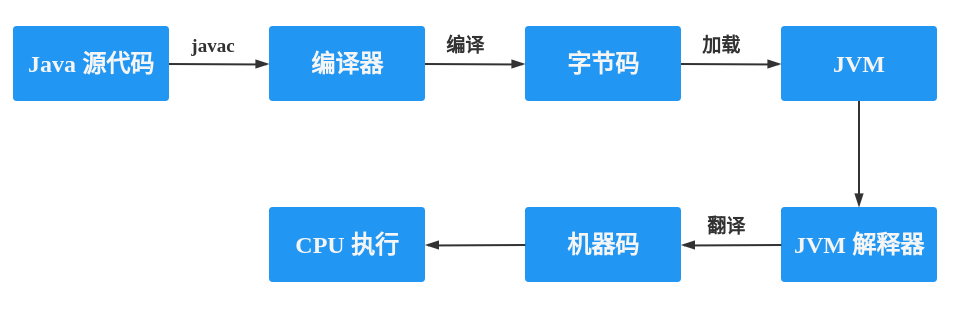

# Java 面试相关的题

### 常见的缩写

JIT：Java-In-Time Compilation，即 java 实时编译器, 在 java 程序运行的时候进行编译,用于将字节码编译成机器码。它根据二八定律：20% 的代码完成 80% 的请求，JIT 要做的就是编译那 20% 的代码

AOT: Ahead Of Time Compilation, 即提前编译器，在 JDK9 中引入。直接将代码编译成机器码，

### jdk 和 jre 的区别

* jdk: 是 java 开发工具包，它不仅提供了 java 程序运行所需要的 jre， 还提供了一系列的开发工具(toot.jar)：如编译器 javac 和调试器 jdb 等
* jre: 提供 java 的运行环境，其中最核心的就是 JVM，除了 JVM 外 jre 还提供了 java 的核心类库(rt.jar)和支持文件

#### 总结 

* JDK 是整个 Java 的核心，包括了 Java 运行环境(JRE)，一堆 Java 工具 tools.jar
* 如果你需要运行 java 程序，只需安装 JRE 就可以了。如果你需要编写 java 程序，需要安装JDK。

### javac 和 java 命令

* javac：用于将 java 文件编译成 JVM 运行的 class 文件
* java: 运行 class 文件

java 命令通常用的 jre 里面的 java，即：jre/bin/java，而不是 jdk 里面的 java，即：jdk/bin/java，为什么是这样的呢?

由于有了 jre 就可以直接运行编译好的程序，对于哪些不需要开发的用户来说，他们只需要一个运行环境就可以了，不需要多余的开发工具。如果只是需要一个运行环境的用户都需要去配置环境变量，显得有些繁琐了，因此在安装 jre 的时候，安装程序自动的将 jre/bin/java 程序添加到环境变量中，所以我们即使不配置 jre 的环境变量，也是可以运行程序的。

#### jdk 中为什么还要带一个 jre？

jdk 中提供了一些工具，这些工具很多都是用 java 语言写的，这些命令依赖一些核心类库，如果要运行这些命令，需要 jre 的支持

### java 程序执行的流程



### 解释，JIT 编译和 AOT 编译的分析

解释执行：编译器不介入工作，每执行一句字节码的时候通过解释器将字节码翻译成机器码并执行。

即时编译(JIT)：在运行时，虚拟机将“热点代码(二八定律中的二)”编译成本地机器码，并以各种手段尽可能地进行代码优化。需要预热以后，才能达到较高的性能

提前编译(AOT)：将程序代码编译成机器码。

#### 三种执行方式的对比

解释执行：优点是启动效率快、占用内存少，缺点是整体的执行速度较慢、占用程序运行时间和运算资源。

即时编译：相比于解释器，即时编译将部分“热点代码”编译成本地代码，并进行优化，提高了执行效率。相比于提前编译，内存占用小（大部分应用仅20%的功能常用，80%可以不编译）、可优化及编译动态加载的 Class 文件、可进行激进预测性优化（失败后可退回到低级编译器甚至解释器上执行）、可获得热点代码集中优化和分配更好的资源。

提前编译：改善启动时间，快速达到最高性能，缺点在即时编译对比中可看出。

#### 三种方式配合使用

当程序需要迅速启动和执行的时候，解释器可以首先发挥作用，省去编译的时间，立即运行。当程序启动后，随着时间的推移，编译器逐渐发挥作用，把越来越多的代码编译成本地代码，这样可以减少解释器的中间损耗，获得更高的执行效率。当程序运行环境中内存资源限制较大，可以使用解释执行节约内存，反之可以使用编译执行来提升效率。同时，解释器还可以作为编译器激进优化时后备的“逃生门”，让编译器根据概率选择一些不能保证所有情况都正确，但大多数时候都能提升运行速度的优化手段，当激进优化的假设不成立，如加载了新类以后，类型继承结构出现变化、出现“罕见陷阱”时可以通过逆优化退回到解释状态继续执行，因此在整个 Java 机执行架构里，解释器与编译器经常是相辅相成地配合工作。

这种混合使用 AOT、解释、JIT 的策略的全部优点如下：

1）即使是大应用，安装时间也能缩短到几秒；

2）系统升级能更快地安装，因为不再需要优化这一步；

3）应用的内存占用更小，有些情况下可以降低 50%；

4）改善了性能；

5）更低的电池消耗。

#### 三种执行方式的细节

##### 解释执行

解释执行相对简单，略过。

##### 即时编译

即时编译涉及到的热点代码分为两部分来讲，一是什么是热点代码；二是如何判断哪些是热点代码。

热点代码主要分为两类：

1）__被多次调用的方法__，编译整个方法体，执行入口为方法起始位置，这个方法的调用入口地址就会被系统自动改写成该地址，下一次调用方法会从已编译版本地址开始执行；

2）__被多次执行的循环体__，编译整个方法体，执行入口为该方法为循环体起始位置，该循环体的调用入口地址就会被系统自动改写成该地址，下一次调用该循环体会从已编译版本地址开始执行，被称为“栈上替换”，方法栈帧还在栈上，方法就被替换了。

热点代码探测，两种方式：

1）__基于采样的热点探测__：周期性检查各个线程的调用栈顶，如果某个（或某些）方法经常出现在栈顶，就是“热点方法”。好处是实现简单高效，还可以很容易地获取方法调用关系（将调用堆栈展开即可），缺点是不够精确，容易因为受到线程阻塞或别的外界因素的影响。

2）__基于计数器的热点探测__：为每个方法（甚至是代码块）建立计数器，统计方法的执行次数，如果执行次数超过一定的阈值就认为它是“热点方法”。这种统计方法实现起来要麻烦一些，需要为每个方法建立并维护计数器，而且不能直接获取到方法的调用关系。但统计结果更精确。

下面我们介绍第二种，HotSpot 为每个方法准备了两类计数器：方法调用计数器和回边计数器（“回边”的意思就是指在循环边界往回跳转）。当虚拟机运行参数确定的前提下，这两个计数器都有一个明确的阈值，计数器阈值一旦溢出，就会触发即时编译。

当一个方法被调用时，虚拟机先检查该方法是否存在被即时编译过的版本，如果存在，则优先使用编译后的本地代码来执行。如果不存在已被编译过的版本，则将该方法的调用计数器值加一，然后 **判断方法调用计数器与回边计数器值之和** 是否超过方法调用计数器的阈值。一旦已超过阈值的话，将会向即时编译器提交一个该方法的代码编译请求。

执行引擎默认不会同步等待编译请求完成，而是继续进入解释器按照解释方式执行字节码。

在默认设置下，方法调用计数器不是绝对次数，而 **是一段时间之内方法被调用的次数**。当超过一定的时间限度，如果方法的调用次数仍然不足以让它提交给即时编译器编译，那该方法的调用计数器就会被 **减少一半**，这个过程被称为方法调用计数器热度的衰减，而这段时间就称为此方法统计的半衰周期，进行 **热度衰减的动作是在虚拟机进行垃圾收集时顺便进行的**.

当解释器遇到一条回边指令时，会先查找将要执行的代码片段是否有已经编译好的版本，如果有的话，它将会优先执行已编译的代码，否则就把回边计数器的值加一，然后判断方法调用计数器与回边计数器值之和是否超过回边计数器的阈值。当超过阈值的时候，将会提交一个 **栈上替换编译请求**，并且把回边计数器的值稍微降低一些，以便继续在解释器中执行循环，等待编译器输出编译结果。

__回边计数器没有计数热度衰减的过程__，因此这个计数器统计的就是该方法循环执行的绝对次数。当计数器溢出的时候，它还会把方法计数器的值也调整到溢出状态，这样下次再该方法的时候就会执行标准编译过程。

##### 提前编译

现在提前编译有 **两条分支**，一条分支是做与传统C、C++编译器类似的，在程序运行之前把程序代码编译成机器码的静态翻译工作；__另外一条分支是把原本即时编译器在运行时要做的编译工作提前做好并保存下来__，下次运行到这些代码（譬如公共库代码在被同一台机器其他 Java 进程使用）时直接把它加载进来使用。

第一种编译方式，直指即时编译的最大弱点：即时编译要占用程序运行时间和运算资源。优点是可以做在编译过程中最耗时的优化措施之一 “__过程间分析__”，获得诸如某个程序点上某个变量的值是否一定为常量、某段代码块是否永远不可能被使用、在某个点调用的某个虚方法是否只能有单一版本等的分析结论。

第二种方式，本质是给即时编译器做缓存加速，__去改善 Java 程序的启动时间，以及需要一段时间预热后才能到达最高性能的问题__。这种提前编译被称为动态提前编译（Dynamic AOT）或者即时编译缓存（JIT Caching）。各种 Java 应用最起码会用到 Java 的标准类库，如 java.base 等模块，如果能够将这个类库提前编译好，并进行比较高质量的优化，显然能够节约不少应用运行时的编译成本。

上述是提前编译的优势，比较于即时编译，提前编译不具备如下三点优势：

1）性能分析制导优化。在解释器或者客户端编译器运行过程中，会不断收集 **性能监控信息**，譬如某个程序点抽象类通常会是什么实际类型、条件判断通常会走哪条分支、方法调用通常会选择哪个版本、循环通常会进行多少次等，__这些数据一般在静态分析时是无法得到的__，或者不可能存在确定且唯一的解，最多只能依照一些启发性的条件去进行猜测。但在动态运行时却能看出它们具有非常明显的偏好性。如果一个条件分支的某一条路径执行特别频繁，而其他路径鲜有问津，那就可以把热的代码集中放到一起，集中优化和分配更好的资源（分支预测、寄存器、缓存等）给它。

2）激进预测性优化，__这也已经成为很多即时编译优化措施的基础__。对于提前编译，即时编译的策略就可以不必保守，如果性能监控信息能够支持它做出一些正确的可能性很大但无法保证绝对正确的预测判断，就已经可以 **大胆地按照高概率的假设进行优化** ，万一走到罕见分支上，可以 **退回** 到低级编译器甚至解释器上去执行，并不会出现无法挽救的后果。只要出错概率足够低，这样的优化往往能够大幅度降低目标程序的复杂度，输出运行速度非常高的代码。譬如在 Java 语言中，虚拟机会通过类继承关系分析等一系列激进的猜测去做去虚拟化，以保证绝大部分有内联价值的虚方法都可以顺利内联，而C、C++难以对虚方法做内联。

3）链接时优化，__Java 语言天生就是动态链接的__，一个个 Class 文件在运行期被加载到虚拟机内存当中，然后在即时编译器里产生优化后的本地代码。但如果类似的场景出现在使用提前编译的语言和程序上，譬如C、C++的程序要调用某个动态链接库的某个方法，就会出现很明显的 **边界隔阂**，还难以优化。这是因为主程序与动态链接库的代码在它们编译时是完全独立的，**两者各自编译、优化自己的代码**。

总之，每一种执行方式都有它的优缺点，应该根据具体场景来选择。

作者：she\_says
链接：<https://juejin.cn/post/6844904114564890631>

### java 解释与编译并存

java 程序程序的执行，首先需要将代码编译成 class 文件，当 jvm 加载 class 文件，需要逐条的执行字节码的指令来完成程序的功能，而 CPU 只认识机器码，此时就需要 java 的解释器将字节码指令翻译成机器码, 这样才能够让 CPU 运行指令, 因此说 java 是解释和编译并存的语言。

### 字符型常量和字符串常量的区别?

1. __形式__ : 字符常量是单引号引起的一个字符，字符串常量是双引号引起的 **0 个或若干个字符**
2. **含义** : 字符常量相当于一个整型值( ASCII 值), 可以参加表达式运算; 字符串常量代表一个地址值(该字符串在内存中存放位置)
3. __占内存大小__ ： 字符常量只占 2 个字节; 字符串常量占若干个字节 (__注意： `char` 在 Java 中占两个字节__)

### 可变长参数

可变长参数是指：在调用方法时，传入的参数个数是可变的, 但是可变长参数只能是函数参数列表的最后一个，它的前面可以有也可以没有其他的参数

在遇到方法重载时，会优先匹配固定参数的方法，固定参数的优先级较高

Java 的可变参数编译后实际会被转换成一个数组, 通过编译之后的字节码可以看出

编译之前：

```java
 public static void printVariable(String... args) {
        for (String s : args) {
            System.out.println(s);
        }
    }
```

编译之后：

```java
public static void printVariable(String... args) {
        String[] var1 = args;
        int var2 = args.length;

        for(int var3 = 0; var3 < var2; ++var3) {
            String s = var1[var3];
            System.out.println(s);
        }
    }
```

### Java 中的注释有三种：

1. 单行注释
2. 多行注释
3. 文档注释。

注释是我们程序员写给自己看的，注释是代码说明书，能够帮助看代码的人快速地理清代码之间的逻辑关系。因此，在写程序的时候随手加上注释是一个非常好的习惯。

代码的注释不是越详细越好。实际上好的代码本身就是注释，我们要尽量规范和美化自己的代码来减少不必要的注释。若编程语言足够有表达力，就不需要注释，尽量通过代码来阐述

### 标识符和关键字的区别是什么？

在我们编写程序的时候，需要大量地为程序、类、变量、方法等取名字，于是就有了标识符，简单来说，标识符就是一个名字。但是有一些标识符，Java 语言已经赋予了其特殊的含义，只能用于特定的地方，这些特殊的标识符就是关键字。因此，关键字是被赋予特殊含义的标识符。__比如，在我们的日常生活中，如果我们想要开一家店，则要给这个店起一个名字，起的这个“名字”就叫标识符。但是我们店的名字不能叫“警察局”，因为“警察局”这个名字已经被赋予了特殊的含义，而“警察局”就是我们日常生活中的关键字。__

default 这个关键字比较特殊，既属于程序控制，也属于类，方法和变量修饰符，还属于访问控制。

* 在程序控制中，当在 switch 中匹配不到任何情况时，可以使用 default 来编写默认匹配的情况。在类，方法和变量修饰符中，__从 JDK8 开始引入了默认方法__，可以使用 default 关键字来定义一个方法的默认实现。
* 在访问控制中符，如果一个方法前没有任何修饰，则默认会有一个修饰符 default，但是我们不能将这个修饰符加上，否则会就会报错。

### 自增和自减运算符

在写代码的过程中，经常需要对一个整型变量进行加一或者减一的操作，因此 java 提供了两种特殊的运算符，用于完成上述的操作。这两种运算符分别是：自增运算符(++)和自减运算符(--)

\++ 和 -- 既可以放在变量的前面，也可以放在变量的后面，如果放在变量的前面，但是这两写法的含义不一样，拿自增运算符来说：如果将 ++ 放在变量的前面，则是先将变量加一之后再将新得到的值赋值给其他的变量，如果是放在变量的后面，则先将变量的值赋值给其他的变量，然后在对当前的变量进行加一的操作，自减运算符的运算规则和其一样。

### continue、break 和 return 的区别是什么？

continue 和 break 主要是用于控制循环的执行。continue 的作用继续下一轮的循环，而 break 的作用是结束当前循环，跳出循环体，当循环形成嵌套时，一条 break 语句只能够跳出一层循环体。

return 语句主要用于函数的返回，它的作用就是结束方法的执行，如果需要返回方法执行的结果，也是通过 return 语句实现的

### 什么是方法的返回值,方法有哪些类型

方法的返回值是指某个方法执行之后得到的结果，然后通过 return 语句返回的值

四种：无参无返回值，无参有返回值，有参无返回值，有参有返回值

### 静态方法为什么不能够调用非静态成员

* 静态方法是属于类的，在类加载的时候就会 **分配内存**，可以通过类名直接访问。而非静态成员属于实例对象，__只有在对象实例化之后才存在__，需要通过类的实例对象去访问。
* 在类的非静态成员不存在的时候静态成员就已经存在了，此时调用在内存中还不存在的非静态成员，属于非法操作

### 类加载的顺序

静态属性 -> 静态代码块 -> 普通属性 -> 普通代码块 -> 构造方法 -> 普通方法

__注意__: 类被加载进内存中，构造方法不一定执行。

### 静态方法和实例方法有什么不同

1. 使用的方式不同，静态方法通过类名进行调用，实例方法通过实例对象进行调用, 也就是说静态方法不创建对象也能够进行调用。同时不建议使用 `对象.方法名` 的方式调用静态方法,因为静态方法属于类而不是属于类的某个对象
2. 访问类成员的限制也不同：静态方法只能够访问静态成员，而不能够访问实例成员。而实例方法则没有这方面的限制

### 重载和重写的区别

1. 重载是指使用同一个方法名而对不同的输入参数的不同实现。它发生在同一个类中（或者父类和子类之间），方法名必须相同，参数类型不同、个数不同、顺序不同，方法返回值和访问修饰符可以不同。在 `java 核心技术` 这本书中是这样介绍的：如果有多个方法，方法名相同而参数不同就产生了重载。综上：**重载就是同一个类中多个同名方法根据不同的传参来执行不同的逻辑处理**
2. 重写发生在运行期，是子类对父类的 **允许访问的方法** 的实现过程进行重新编写,有如下要求：

   * 方法名、参数列表必须相同，子类方法返回值类型应比父类方法 **返回值类型更小或相等**，抛出的异常范围小于等于父类，**访问修饰符范围大于等于父类**。
   * 如果父类方法访问修饰符为 `private/final/static` 则子类就不能重写该方法，但是被 `static` 修饰的方法能够被再次声明。
   * 构造方法无法被重写
   * 综上：**重写就是子类对父类方法的重新改造，外部样子不能改变，内部逻辑可以改变**

| 区别点     | 重载方法 | 重写方法                                                     |      |      |      |
| ---------- | -------- | ------------------------------------------------------------ | ---- | ---- | ---- |
| 发生范围   | 同一个类 | 子类                                                         |      |      |      |
| 参数列表   | 必须修改 | 一定不能修改                                                 |      |      |      |
| 返回类型   | 可修改   | 子类方法的返回值的范围要小于等于父类表示的范围,基本数据类型和 void 不能够进行修改 |      |      |      |
| 异常       | 可修改   | 子类抛出的异常的范围要小于等于父类抛出的异常的范围           |      |      |      |
| 访问修饰符 | 可修改   | 访问的权限应该大于等于父类的访问权限                         |      |      |      |
| 发生阶段   | 编译期   | 运行期                                                       |      |      |      |

### == 和 equals() 方法的区别

`==` 对于基本类型和引用类型的作用效果是不同的：

* 对于基本数据类型来说，`==` 比较的是值。
* 对于引用数据类型来说，`==` 比较的是对象的内存地址。

> 因为 Java 只有值传递，所以，对于 == 来说，不管是比较基本数据类型，还是引用数据类型的变量，其本质比较的都是值，只是引用类型变量存的值是对象的地址。

__`equals()`__ 不能用于判断基本数据类型的变量，只能用来判断两个对象是否相等。`equals()`方法存在于`Object`类中，而`Object`类是所有类的直接或间接父类。

`Object` 类 `equals()` 方法：

```java
public boolean equals(Object obj) {
     return (this == obj);
}
```

`equals()` 方法存在两种使用情况：

* __类没有覆盖  `equals()` 方法__ ：通过 `equals()` 比较该类的两个对象时，等价于通过 `==` 比较这两个对象，使用的默认是 `Object` 类 `equals()` 方法。
* __类覆盖了 `equals()`方法__ ：一般我们都覆盖 `equals()` 方法来比较两个对象中的属性是否相等；若它们的属性相等，则返回 true(即，认为这两个对象相等)。

### hashCode() 与 equals() 方法

#### hashCode() 有什么作用?

hashCode() 方法返回的是一个哈希值，这个哈希值可以确定当前对象在哈希表中的位置。

hashCode() 方法是定义在 Object 类中，因此所有的类都含有 hashCode 方法。

另外需要注意的是： `Object` 的 `hashCode()` 方法是本地方法(Native Method)，也就是用 C 语言或 C++ 实现的，__该方法通常用来将对象的内存地址转换为整数之后返回。__

散列表存储的是键值对(key-value)，它的特点是：__能根据“键”快速的检索出对应的“值”。这其中就利用到了散列码！__

哈希查找的步骤：

1. 首先 hash 函数会将被查找的键通过哈希函数转换成数组的索引，在理想的情况下，不同的键会被转换为不同的索引值，但是在有些情况下多个键被哈希到同一个索引值的情况。所以哈希查找的第二个步骤就是处理冲突
2. 处理 hash 冲突。常用的方法有：开放地址法，线性探查法，链地址法

hashCode() 规定，若 x.equals(y) 返回 true ，则 `x.hashCode() == y.hashCode()`

HashSet 插入流程：

> 当你把对象加入 `HashSet` 时，`HashSet` 会先计算对象的 `hashCode` 值来判断对象加入的位置，同时也会与其他已经加入的对象的 `hashCode` 值作比较，如果没有相符的 `hashCode`，`HashSet` 会假设对象没有重复出现。但是如果发现有相同 `hashCode` 值的对象，这时会调用 `equals()` 方法来检查 `hashCode` 相等的对象是否真的相同。如果两者相同，`HashSet` 就不会让其加入操作成功。如果不同的话，就会重新散列到其他位置。这样我们就大大减少了 `equals` 的次数，相应就大大提高了执行速度。

* 如果两个对象的 `hashCode` 值相等，那这两个对象不一定相等（哈希碰撞）。
* 如果两个对象的 `hashCode` 值相等并且 `equals()` 方法返回 `true`，我们才认为这两个对象相等。
* 如果两个对象的 `hashCode` 值不相等，我们就可以直接认为这两个对象不相等。

因为两个相等的对象的 `hashCode` 值必须是相等。也就是说如果 `equals` 方法判断两个对象是相等的，那这两个对象的 `hashCode` 值也要相等。

如果重写 `equals()` 时没有重写 `hashCode()` 方法的话就可能会导致 `equals` 方法判断是相等的两个对象，`hashCode` 值却不相等。

如果只重写了 equals 方法，而没有重写 hashCode 方法，此时将这个自定义对象作为 HashMap 的键时，会出现获取不到值的情况，比如创建两个相同的对象，然后使用一个对象放值，另一个对象取值。当取值的时候会发现取出来的值是 null;

### 基本数据类型

8 种基本数据类型:

* 整型：byte,short,int,long
* 浮点型：float，double
* 字符型：char
* 布尔型: boolean

| 基本类型    | 位数 | 字节 | 默认值     | 取值范围                                        |
| ------- | -- | -- | ------- | ------------------------------------------- |
| byte    | 8  | 1  | 0       | -128\~127                                   |
| short   | 16 | 2  | 0       | -32768 \~ 32767                             |
| int     | 32 | 4  | 0       | -2147483648 \~ 2147483647                   |
| long    | 64 | 8  | 0L      | -9223372036854775808 \~ 9223372036854775807 |
| char    | 16 | 2  | 'u0000' | 0\~65535                                    |
| float   | 32 | 4  | 0f      | 1.4E-45 \~ 3.4028235E38                     |
| double  | 64 | 8  | 0d      | 4.9E-324 \~ 1.7976931348623157E308          |
| boolean | 1  |    | false   | true,false                                  |

注意：

1. Java 里使用 `long` 类型的数据一定要在数值后面加上 __L__，否则将作为整型解析。
2. `char a = 'h'` char: 单引号，`String a = "hello"` :双引号。

这八种基本类型都有对应的包装类分别为：`Byte`、`Short`、`Integer`、`Long`、`Float`、`Double`、`Character`、`Boolean`。

包装类型不赋值就是 `null` ，而基本类型有默认值且不是 `null`。

另外，这个问题建议还可以先从 JVM 层面来分析。

**基本数据类型直接存放在 Java 虚拟机栈中的局部变量表中**，而包装类型属于对象类型，我们知道对象实例都存在于堆中。相比于对象类型，基本数据类型占用的空间非常小。

> 《深入理解 Java 虚拟机》 ：局部变量表主要存放了编译期可知的基本数据类型 __（boolean、byte、char、short、int、float、long、double）__、__对象引用__（reference 类型，它不同于对象本身，可能是一个指向对象起始地址的引用指针，也可能是指向一个代表对象的句柄或其他与此对象相关的位置）。

### 包装类型的常量池技术

Java 基本类型的包装类的大部分都实现了常量池技术。

`Byte`,`Short`,`Integer`,`Long` 这 4 种包装类默认创建了数值 **[-128，127]** 的相应类型的缓存数据，`Character` 创建了数值在 __\[0,127]__ 范围的缓存数据，`Boolean` 直接返回 `True` or `False`.

如果超过对应的范围就会去创建新的对象

两种浮点数类型的包装类 `Float`,`Double` 并没有实现常量池技术

在装箱或者是调用 valueOf() 方法时，可能会用到常量池中的对象,因为 `valueOf()` 方法首先会判断常量池中是否有相应的对象，有就直接返回引用，否则创建一个新的包装对象

### 自动装箱和自动拆箱

* __装箱__：将基本类型用它们对应的引用类型包装起来；
* __拆箱__：将包装类型转换为基本数据类型；

其中装箱方法使用的是 `valueOf()` 方法; 拆箱使用的是 `xxxValue()` 方法, 比如拆成 int 类型则调用 `Integer.intValue()`

```java
Integer a = 1;
Integer b = new Integer(1);
System.out.println(a == b) // false;
```

#### 自动装箱拆箱场景

* 进行 `=` 赋值操作（装箱或拆箱）
* 进行 `+，-，*，/` 混合运算 （拆箱）
* 进行 `>,<,==` 比较运算（拆箱）
* 调用 equals 进行比较（装箱）
* ArrayList,HashMap 等集合类添加基础类型数据时（装箱）

## 为什么匿名内部类和局部内部类都只能够访问局部 final 变量

```java
public class Test{
    public static void main(String[] args){
        
    }
    
    public void test(final int b){ // final 可以省略，java 8 的语法糖，会自动给我们添上
        final int a = 0; // 即时没有 final 关键字此时 a 变量也是不可修改的 
        new Thread(() -> {
            System.out.println(a);
            System.out.println(b);
        }).start();
    }
}

class OutClass{
    private int age = 18; // 可以不为 final，此时局部内部类中对 age 的修改对于外部类来说是可见的
    public void outPrint(final int x){ // 这个 final 可以省略，编译器会自动加上 final 修饰符
        class InClass{
            public void InPrint(){
                age = 10;
                System.out.println(x);
                System.out.println(age);
            }
        }
    }
    public void printAge(){
        System.out.println(age);
    }
}

@Test
public void test3(){
    OuterClass outerClass = new OuterClass();
    outerClass.outPrint(20); // 20, 10, 10
    outerClass.printAge();
}
```

首先需要知道一点的是：**外部类和内部类是同一级别的，内部类不会因为定义在方法的内部就随着方法执行的结束而死亡。**

因此这就产生了问题，**局部变量是随着方法的结束而销毁的**，但是此时内部类对象可能还存在(只有在没有人引用它时，才会消亡)。这里就出现一个矛盾，内部类对象访问一个不存在的变量，为了解决这个问题, 就将局部变量拷贝一份, 作为局部内部类的成员变量，这样当局部变量死亡后，内部类仍然可以使用它, 因此实际上访问的是局部变量的副本。这样就好像延长了局部变量的生命周期。

将局部变量拷贝到内部类的成员变量时，必须保证两个变量的值是一样的，也就是如果我们在内部类中修改了成员变量，方法中的局部变量也跟着改变，那这个问题如何解决呢？

将局部变量声明为 final，这样在初始化之后就禁止再修改他的值，这中实现方式其实是一种妥协, 使得局部变量与内部类中的副本保持一致。
