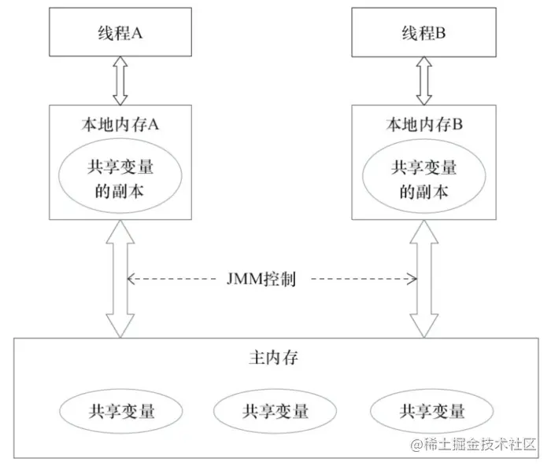
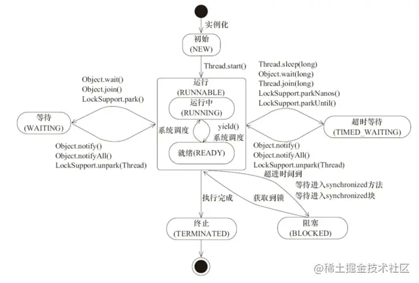
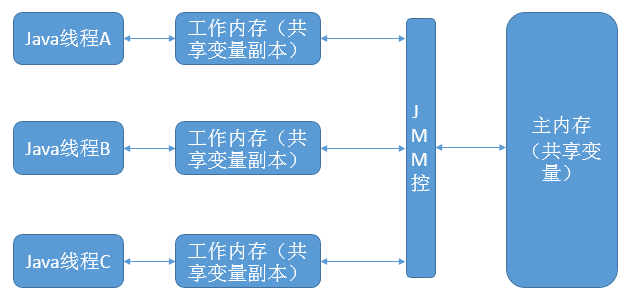
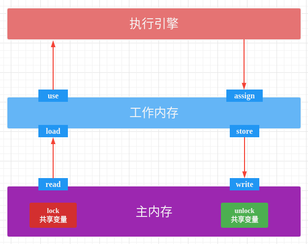

# 并发

**并发编程的形式可以将多核CPU的计算能力发挥到极致，性能得到提升**

## 并发编程

### 并发编程有哪些缺点

#### 1. 频繁的切换上下文

时间片是CPU分配给各个线程的时间，因为时间非常短，所以CPU不断通过切换线程，让我们觉得多个线程是同时执行的，时间片一般是几十毫秒。而每次切换时，需要保存当前的状态起来，以便能够进行恢复先前状态，而这个切换时非常损耗性能，过于频繁反而无法发挥出多线程编程的优势。通常减少上下文切换可以采用**无锁并发编程，CAS(Compute And Swap) 算法，使用最少的线程和使用协程**。

- 无锁并发编程：可以参照 concurrentHashMap 锁分段的思想，不同的线程处理不同段的数据，这样在多线程竞争的条件下，可以减少上下文切换的时间。

- CAS 算法，利用 Atomic 下使用 CAS 算法来更新数据，使用了**乐观锁**，可以有效的减少一部分不必要的锁竞争带来的上下文切换

- 使用最少线程：避免创建不需要的线程，比如任务很少，但是创建了很多的线程，这样会造成大量的线程都处于等待状态

- 协程：在单线程里实现多任务的调度，并在单线程里维持多个任务间的切换

由于上下文切换也是个相对比较耗时的操作，所以在 "java并发编程的艺术" 一书中有过一个实验，并发累加未必会比串行累加速度要快。

#### 2. 线程安全问题

多线程编程中最难以把握的就是 **临界区线程安全问题**，稍微不注意就会出现死锁的情况，一旦产生死锁就会造成系统功能不可用

那么，通常可以用如下方式避免死锁的情况：

1. 避免一个线程同时获得多个锁；
2. 避免一个线程在锁内部占有多个资源，尽量保证每个锁只占用一个资源；
3. 尝试使用定时锁，使用 lock.tryLock(timeOut)，当超时等待时当前线程不会阻塞；
4. 对于数据库锁，加锁和解锁必须在一个数据库连接里，否则会出现解锁失败的情况

### 并发编程的三个重要特性

1. **原子性** : 一次操作或者多次操作，要么所有的操作全部都得到执行并且不会受到任何因素的干扰而中断，要么都不执行。`synchronized` 可以保证代码片段的原子性。
2. **可见性** ：当一个线程对共享变量进行了修改，那么另外的线程都是立即可以看到修改后的最新值。`volatile` 关键字可以保证共享变量的可见性。
3. **有序性** ：代码在执行的过程中的先后顺序，Java 在编译器以及运行期间的优化，代码的执行顺序未必就是编写代码时候的顺序。`volatile` 关键字可以禁止指令进行重排序优化。

### 并发编程主要需要解决的问题

1. 线程间的通信
   - 通信是指线程之间以何种机制来交换信息，主要有两种：共享内存和消息传递。
   - java 内存模型是 **共享内存的并发模型**，线程之间主要通过读-写共享变量来完成隐式通信

2. 线程间的同步

#### 哪些是共享变量

在 java 程序中所有**实例域，静态域和数组元素**都是放在堆内存中（所有线程均可访问到，是可以共享的），而局部变量，方法定义的参数和异常处理器参数不会在线程间共享

### JMM 抽象模型

JMM(Java Memory Model) java 内存模型。我们知道 CPU 的处理速度和主存的读写速度不是一个量级的，为了平衡这种巨大的差距，每个 CPU 都会有缓存。因此，共享变量会先放在主存中，每个线程都有属于自己的工作内存，**并且会把位于主存中的共享变量拷贝到自己的工作内存**，之后的读写操作均使用位于工作内存的变量副本，并在某个时刻将工作内存的变量副本写回到主存中去。JMM 就从抽象层次定义了这种方式，并且 JMM 决定了一个线程对共享变量的写入何时对其他线程是可见的。



如图为 JMM 抽象示意图，线程 A 和线程 B 之间要完成通信的话，要经历如下两步：

1. 线程A从主内存中将共享变量读入线程A的工作内存后并进行操作，之后将数据重新写回到主内存中；
2. 线程 B 从主存中读取最新的共享变量

从横向去看看，线程 A 和线程 B 就好像通过共享变量在进行隐式通信。这其中有很有意思的问题，如果线程 A 更新后数据并没有及时写回到主存，而此时线程 B 读到的是过期的数据，这就出现了“脏读”现象。可以通过同步机制（控制不同线程间操作发生的相对顺序）来解决或者通过 volatile 关键字使得每次 volatile 变量都能够强制刷新到主存，从而对每个线程都是可见的。

## 常见的一些概念

### 同步和异步

同步和异步通常用来形容一次方法调用。同步方法调用一开始，调用者必须等待被调用的方法结束后，调用者后面的代码才能执行。而异步调用，指的是，调用者不用管被调用方法是否完成，都会继续执行后面的代码，当被调用的方法完成后会通知调用者。

### 并发与并行

- 并发：多个程序在单位时间内是交替执行的，即同一时刻是只有一个进程在执行
- 并发：多个程序在同一时刻同时执行

### 阻塞和非阻塞

阻塞和非阻塞通常用来形容多线程间的相互影响，比如一个线程占有了临界区资源，那么其他线程需要这个资源就必须进行等待该资源的释放，会导致等待的线程挂起，这种情况就是阻塞，而非阻塞就恰好相反，它强调没有一个线程可以阻塞其他线程，所有的线程都会尝试地往前运行。

### 临界区

临界区用来表示一种公共资源或者说是共享数据，可以被多个线程使用。但是每个线程使用时，一旦临界区资源被一个线程占有，那么其他线程必须等待。

### 进程和线程

进程是程序的一次执行过程，是系统运行程序的基本单位，因此进程是动态的。系统运行一个程序即是一个进程从创建，运行到消亡的过程。进程是操作系统资源分配的基本单位。

线程与进程相似，但线程是一个比进程更小的执行单位,是 CPU 调度的基本单位。一个进程在其执行的过程中可以产生多个线程。与进程不同的是同类的多个线程共享进程的 **堆** 和 **方法区** 资源，但每个线程有自己的**程序计数器**、**虚拟机栈 **和 **本地方法栈**，所以系统在产生一个线程，或是在各个线程之间作切换工作时，负担要比进程小得多，也正因为如此，线程也被称为轻量级进程。

Java 程序天生就是多线程程序，我们可以通过 JMX 来看一下一个普通的 Java 程序有哪些线程，代码如下。

```java
public class MultiThread {
	public static void main(String[] args) {
		// 获取 Java 线程管理 MXBean
	ThreadMXBean threadMXBean = ManagementFactory.getThreadMXBean();
		// 不需要获取同步的 monitor 和 synchronizer 信息，仅获取线程和线程堆栈信息
		ThreadInfo[] threadInfos = threadMXBean.dumpAllThreads(false, false);
		// 遍历线程信息，仅打印线程 ID 和线程名称信息
		for (ThreadInfo threadInfo : threadInfos) {
			System.out.println("[" + threadInfo.getThreadId() + "] " + threadInfo.getThreadName());
		}
	}
}
```

输出:

```java
[5] Attach Listener //添加事件
[4] Signal Dispatcher // 分发处理给 JVM 信号的线程
[3] Finalizer //调用对象 finalize 方法的线程
[2] Reference Handler //清除 reference 线程
[1] main //main 线程,程序入口
```

从上面的输出内容可以看出：**一个 Java 程序的运行是 main 线程和多个其他线程同时运行**。

### 进程间通信的方式

进程间通信主要包括：管道、命名管道、信号、消息队列、共享内存、内存映射、信号量、Socket。 

#### 管道

管道也叫无名（匿名）管道,它是是 UNIX 系统 IPC（进程间通信）的最古老形式,所有的 UNIX 系统都支持这种通信机制。**管道本质其实是内核中维护的一块内存缓冲区**, Linux 系统中通过 pipe() 函数创建管道, 会生成两个文件描述符,分别对应管道的读端和写端。**无名管道只能用于具有亲缘关系的进程间的通信**。

#### 命名管道

匿名管道,由于没有名字,只能用于亲缘关系的进程间通信。为了克服这个缺点,提出了有名管道（FIFO）,也叫命名管道、FIFO文件。有名管道（FIFO）不同于匿名管道之处在于它提供了一个路径名与之关联,以 FIFO 的文件形式存在于文件系统中,并且其打开方式与打开一个普通文件是一样的,这样即使与 FIFO 的创建进程不存在亲缘关系的进程,只要可以访问该路径,就能够彼此通过 FIFO 相互通信,因此,**通过 FIFO 不相关的进程也能交换数据**。 

#### 信号

信号是 Linux 进程间通信的最古老的方式之一,是事件发生时对进程的通知机制,有时也称之为软件中断,它是在软件层次上对中断机制的一种模拟,是一种异步通信的方式。**信号可以导致一个正在运行的进程被另一个正在运行的异步进程中断**,转而处理某一个突发事件。

#### 消息队列

消息队列就是一个消息的链表,可以把消息看作一个记录,具有特定的格式以及特定的优先级,对消息队列有写权限的进程可以向消息队列中按照一定的规则添加新消息,对消息队列有读权限的进程则可以从消息队列中读走消息,消息队列是随内核持续的。

#### 共享内存

共享内存允许两个或者多个进程共享物理内存的同一块区域（通常被称为段）。**由于一个共享内存段会称为一个进程用户空间的一部分,因此这种 IPC 机制无需内核介入**。所有需要做的就是让一个进程将数据复制进共享内存中,**并且这部分数据会对其他所有共享同一个段的进程可用**。与管道等要求发送进程将数据从用户空间的缓冲区复制进内核内存和接收进程将数据从内核内存复制进用户空间的缓冲区的做法相比,**这种 IPC 技术的速度更快**。 

#### 内存映射

内存映射（Memory-mapped I/O）是将磁盘文件的数据映射到内存,用户通过修改内存就能修改磁盘文件。 

#### 信号量

信号量主要用来解决进程和线程间并发执行时的同步问题,进程同步是并发进程为了完成共同任务采用某个条件来协调它们的活动。对信号量的操作分为 P 操作和 V 操作,P 操作是将信号量的值减 1,V 操作是将信号量的值加 1。当信号量的值小于等于 0 之后,再进行 P 操作时,当前进程或线程会被阻塞,直到另一个进程或线程执行了 V 操作将信号量的值增加到大于 0 之时。

#### Socket

套接字（Socket）,就是对网络中不同主机上的应用进程之间进行双向通信的端点的抽象。一个套接字就是网络上进程通信的一端,提供了应用层进程利用网络协议交换数据的机制。Socket 一般用于网络中不同主机上的进程之间的通信。

### 线程安全和同步

- 线程安全：经常用来描绘一段代码。指在并发的情况之下，该代码经过多线程使用，线程的调度顺序不影响任何结果。这个时候使用多线程，我们只需要关注系统的内存，cpu 是不是够用即可。反过来，线程不安全就意味着线程的调度顺序会影响最终结果。
- 在《深入理解Java虚拟机》中看到的定义。原文如下：当多个线程访问同一个对象时，如果不用考虑这些线程在运行时环境下的调度和交替运行，也不需要进行额外的同步，或者在调用方进行任何其他的协调操作，调用这个对象的行为都可以获取正确的结果，那这个对象是线程安全的。

- 同步：Java 中的同步指的是通过人为的控制和调度，保证共享资源的多线程访问成为线程安全，来保证结果的准确。如上面的代码简单加入 `@synchronized ` 关键字。在保证结果准确的同时，提高性能，才是优秀的程序。**线程安全的优先级高于性能。**

### 死锁

产生死锁的四个必要条件：

- 互斥：每次只允许一个线程对临界资源进行操作
- 持有并等待：一个进程持有临界资源时，同时又去请求其他的临界资源
- 不可剥夺：已经持有临界资源的线程在没有释放资源之前, 不可被强行剥夺
- 循环等待：若干个进程形成一个头尾相连的一个循环等待资源的关系

前三个条件是锁要符合的条件，因此要避免死锁，需要破坏第四个条件，从而不出现循环等待的情况。

在开发的过程中，要避免死锁的发生，需要注意如下几点：

1. 注意加锁的顺序,保证每个线程按同样的顺序进行加锁
2. 注意加锁的时限，可以针对锁设置加锁的时限
3. 注意死锁的检查，这是一种预防机制，确保发生死锁可以第一时间检查并做相应的处理


## 请简要描述线程与进程的关系,区别及优缺点？

一个进程中可以有多个线程，多个线程共享进程的**堆** 和 **方法区 (JDK1.8 之后的元空间)** 资源，但是每个线程有自己的 **程序计数器**、**虚拟机栈 ** 和 **本地方法栈**。

**总结：** **线程是进程划分成的更小的运行单位。线程和进程最大的不同在于基本上各进程是独立的，而各线程则不一定，因为同一进程中的线程极有可能会相互影响。线程执行开销小，但不利于资源的管理和保护；而进程正相反。**

## 本地方法栈和虚拟机栈

在 Java 出现之前，像 C/C++ 这样的编译型语言写出来的代码经过编译后，得到的是可直接在某平台（Windows或 Linux）上执行的机器码，即 machine code，machine code 其实就是 native code，它直接和操作系统交互。

对于内存，主要分三部分：

1）存储可执行代码（冯·诺依曼的存储程序的思想），即编译后的 machine code；

2）用来保存代码执行时用到的局部变量，即 stack；

3）代码执行时，动态找操作系统申请（最终要归还给操作系统）的 heap；

- **虚拟机栈：** 每个 Java 方法在执行的同时会创建一个栈帧用于存储局部变量表、操作数栈、常量池引用等信息。从方法调用直至执行完成的过程，就对应着一个栈帧在 Java 虚拟机栈中入栈和出栈的过程。
- **本地方法栈：** 和虚拟机栈所发挥的作用非常相似，区别是： **虚拟机栈为虚拟机执行 Java 方法 （也就是字节码）服务，而本地方法栈则为虚拟机使用到的 Native 方法服务。** 在 HotSpot 虚拟机中和 Java 虚拟机栈合二为一。

所以，为了**保证线程中的局部变量不被别的线程访问到**，虚拟机栈和本地方法栈是线程私有的。

堆和方法区是所有线程共享的资源，其中**堆是进程中最大的一块内存**，主要用于存放新创建的对象 (几乎所有对象都在这里分配内存)，方法区主要用于存放已被加载的类信息、常量、静态变量、即时编译器编译后的代码等数据。

## 线程

### 创建线程的三种方式

1. 通过继承 Thread 类，重写 run 方法；
2. 通过实现 Runable 接口；
3. 通过实现 Callable 接口这三种方式

```java
 public class CreateThreadDemo {
 
     public static void main(String[] args) {
         //1.继承Thread
         Thread thread = new Thread() {
             @Override
             public void run() {
                 System.out.println("继承Thread");
                 super.run();
             }
         };
         thread.start();
         
         //2.实现runable接口
         Thread thread1 = new Thread(new Runnable() {
             @Override
             public void run() {
                 System.out.println("实现runable接口");
             }
         });
         thread1.start();
         
         //3.实现callable接口
         ExecutorService service = Executors.newSingleThreadExecutor();
         Future<String> future = service.submit(new Callable() {
             @Override
             public String call() throws Exception {
                 return "通过实现Callable接口";
             }
         });
         try {
             String result = future.get();
             System.out.println(result);
         } catch (InterruptedException e) {
             e.printStackTrace();
         } catch (ExecutionException e) {
             e.printStackTrace();
         }
     }
 
 }
```

注意：

- 由于 java 不能多继承可以实现多个接口，因此，在创建线程的时候尽量多考虑采用实现接口的形式；

### Thread 类的最佳实践

写的时候最好要设置线程名称 `Thread.name`，并设置线程组 `ThreadGroup`，目的是方便管理。在出现问题的时候，打印线程栈 (`jstack -pid`) 一眼就可以看出是哪个线程出的问题，这个线程是干什么的。

### 常用的类

#### ThreadLocal 类

通常情况下，我们创建的变量是可以被任何一个线程访问并修改的。**如果想实现每一个线程都有自己的专属本地变量该如何解决呢？** JDK 中提供的 `ThreadLocal` 类正是为了解决这样的问题。 **`ThreadLocal` 类主要解决的就是让每个线程绑定自己的值，可以将 `ThreadLocal` 类形象的比喻成存放数据的盒子，盒子中可以存储每个线程的私有数据。**

**如果你创建了一个 `ThreadLocal` 变量，那么访问这个变量的每个线程都会有这个变量的本地副本，这也是`ThreadLocal`变量名的由来。他们可以使用 `get（）` 和 `set（）` 方法来获取默认值或将其值更改为当前线程所存的副本的值，从而避免了线程安全问题。**

一个 ThreadLocal 对象只能够共享一个对象，要想共享多个对象，需要创建多个 ThreadLocal 对象 

用处：保存线程的独立变量(线程的本地局部变量)。

当线程使用 ThreadLocal 维护变量时，ThreadLocal 为每个使用该变量的线程提供独立的变量副本，所以每一个线程都可以独立地改变自己的副本，而不会影响其它线程所对应的副本。常用于用户登录控制，如记录 session 信息。

实现：每个 Thread 都持有一个 `TreadLocalMap` 类型的变量（该类是一个轻量级的 Map，功能与 map 一样，区别是桶里放的是 entry 而不是 entry 的链表。功能还是一个 map。）以本身为 key，以目标为 value。
主要方法是 get() 和 set(T a)，set 之后在 map 里维护一个 `threadLocal` -> a，get 时将 a 返回。ThreadLocal 是一个特殊的容器。

#### 原子类（`AtomicInteger`、`AtomicBoolean……`）

### 线程状态的切换



此图来源于《JAVA并发编程的艺术》一书中，线程是会在不同的状态间进行转换的，java线程线程转换图如上图所示。线程创建之后调用 start() 方法开始运行。

- 当调用 wait(), join(), LockSupport.lock() 方法线程会进入到 **WAITING** 状态，而同样的 wait(long timeout)，sleep(long), join(long), LockSupport.parkNanos(), LockSupport.parkUtil() 增加了超时等待的功能，也就是调用这些方法后线程会进入 **TIMED_WAITING** 状态，当超时等待时间到达后，线程会切换到 Runable 的状态，
- 当线程处于 WAITING 和 TIMED_WAITING 状态时可以通过 Object.notify(), Object.notifyAll() 方法使线程转换到 Runable 状态。
- 当线程出现资源竞争时，即等待获取锁的时候，线程会进入到 **BLOCKED** 阻塞状态，当线程获取锁时，线程进入到 Runable 状态。线程运行结束后，线程进入到 **TERMINATED** 状态，状态转换可以说是线程的生命周期
- 当线程进入到 synchronized 方法或者 synchronized 代码块时，线程切换到的是 **BLOCKED** 状态，而使用 java.util.concurrent.locks 下 lock 进行加锁的时候线程切换的是 WAITING 或者 TIMED_WAITING 状态，因为 lock 会调用 LockSupport 的方法。

状态说明

| 状态        | 描述                                                         |
| ----------- | ------------------------------------------------------------ |
| New         | 初始状态，线程被构建，但是没有调用 start() 方法              |
| Runnable    | 运行状态，java 线程将操作系统中的就绪态(Ready)和运行态(Running)统称为“运行中” |
| Blocked     | 阻塞状态，表示线程阻塞于锁                                   |
| Waiting     | 等待状态，表示线程进入等待状态，进入该状态表示线程需要等待其他的线程作出一些特定动作如: notify/interrupted |
| TimeWaiting | 超时等待状态，该状态不同于 Waiting 状态，这个状态可以在等待指定的时间后自行返回 |
| Terminated  | 终止状态，表示当前线程已经执行完毕                           |

当线程执行 `wait()`方法之后，线程进入 **WAITING（等待）** 状态。进入等待状态的线程需要依靠其他线程的通知才能够返回到运行状态，而 **TIMED_WAITING(超时等待)** 状态相当于在等待状态的基础上增加了超时限制，比如通过 `sleep（long millis）`方法或 `wait（long millis）`方法可以将 Java 线程置于 TIMED_WAITING 状态。当超时时间到达后 Java 线程将会返回到 RUNNABLE 状态。当线程调用同步方法时，在没有获取到锁的情况下，线程将会进入到 **BLOCKED（阻塞）** 状态。线程在执行 Runnable 的`run()`方法之后将会进入到 **TERMINATED（终止）** 状态。

### sleep()、wait()、join()、yield()之间的的区别

锁池：所有需要竞争同步锁的线程都会放在锁池当中，⽐如当前对象的锁已经被其中⼀个线程得到，则其他线程需要在这个锁池进⾏等待，当前⾯的线程释放同步锁后锁池中的线程去竞争同步锁，当某个线程得到后会进⼊就绪队列进⾏等待 cpu 资源分配。
等待池：当我们调⽤ wait（）⽅法后，线程会放到等待池当中，等待池的线程是不会去竞争同步锁。只有调⽤了 notify（）或 notifyAll() 后等待池的线程才会开始去竞争锁，notify（）是随机从等待池选出⼀个线程放到锁池，⽽ notifyAll() 是将等待池的所有线程放到锁池当中

1. sleep 是 Thread 类的静态本地⽅法，wait 则是 Object 类的本地⽅法。

2. sleep⽅法不会释放lock，但是wait会释放，⽽且会加⼊到等待队列中。
3. sleep 就是把 cpu 的执⾏资格和执⾏权释放出去，不再运⾏此线程，当定时时间结束再取回cpu 资源，参与的调度，获取到 cpu 资源后就可以继续运⾏了。⽽如果 sleep 时该线程有锁，那么 sleep 不会释放这个锁，⽽是把锁带着进⼊了冻结状态，也就是说其他需要这个锁的线程根本不可能获取到这个锁,因此⽆法执⾏程序。如果在睡眠期间其他线程调⽤了这个线程interrupt ⽅法，那么这个线程也会抛出 interruptexception 异常返回，这点和 wait 是⼀样的。
4. sleep⽅法不依赖于同步器synchronized，但是 wait 需要依赖 synchronized 关键字。
5. sleep 不需要被唤醒（休眠之后退出 TimeWaiting），但是 wait 需要（不指定时间需要被别⼈中断）。
6. sleep ⼀般⽤于当前线程休眠，或者轮循暂停操作，wait 则多⽤于多线程之间的通信。
7. sleep 会让出 CPU 执⾏时间且强制上下⽂切换，⽽ wait 则不⼀定，wait 后可能还是有机会重新竞争到锁继续执⾏的。
8. yield（）执⾏后线程直接进⼊就绪状态，⻢上释放了 cpu 的执⾏权，但是依然保留了 cpu 的执⾏资格,所以有可能 cpu 下次进⾏线程调度还会让这个线程获取到执⾏权继续执⾏
9. join（）执⾏后线程进⼊ Waiting 状态(join 方法里面调用了 wait 方法)，例如在线程 B 中调⽤线程 A 的 join（），那线程 B 会进⼊到阻塞队列，直到线程 A 结束或中断线程

### 线程状态的基本操作

除了新建一个线程外，线程在生命周期内还需要基本操作，而这些操作会成为线程间通信的方式，比如使用中断（interrupted）方式实现线程间的交互等等，下面就将具体说说这些操作。

#### interrupted 

中断可以理解为线程的一个标志位，它表示了一个运行中的线程是否**被其他线程进行了中断操作**。中断好比其他线程对该线程打了一个招呼。其他线程可以调用该线程的 interrupt() 方法对其进行中断操作，同时该线程可以调用 isInterrupted() 来感知其他线程对其自身的中断操作，从而做出响应。另外，同样可以调用 Thread 的静态方法 interrupted() 对当前线程进行中断操作，**该方法会清除中断标志位**。**需要注意的是，当抛出InterruptedException 时候，会清除中断标志位，也就是说在调用 isInterrupted() 会返回 false。**

| 方法                                | 描述                               | 备注                                                         |
| ----------------------------------- | ---------------------------------- | ------------------------------------------------------------ |
| public void interrupt()             | 中断该线程对象,将标志位设置为 true | 如果该线程调用了 Object.wait()/Object.wait(long),或者被调用 sleep(long), join(), join(long) 方法时，会抛出 InterruptedException 并且将中断标志位清除。wait 等方法会去检测中断这个状态，所以会报错。 |
| public boolean isInterrupted()      | 测试该线程是否被中断               | 中断标志位不会被清除                                         |
| public static boolean interrupted() | 测试当前线程是否被中断             | 中断标志位会被清除                                           |

```java
@Test
public void test3(){
    final Thread sleepThread = new Thread() {
        @Override
        public void run() {
            try {
                Thread.sleep(1000);
            } catch (InterruptedException e) {
                e.printStackTrace();
            }
            super.run();
        }
    };

    Thread busyThread = new Thread(){
        @Override
        public void run() {
            while (true){

            }
        }
    };

    sleepThread.start();
    busyThread.start();

    System.out.println("sleepThread isInterrupted: " + sleepThread.isInterrupted());
    System.out.println("busyThread isInterrupted: " + busyThread.isInterrupted());
    sleepThread.interrupt();
    busyThread.interrupt();
    System.out.println("sleepThread isInterrupted: " + sleepThread.isInterrupted());
    System.out.println("busyThread isInterrupted: " + busyThread.isInterrupted());
}
```

输出：

```java
sleepThread isInterrupted: false
busyThread isInterrupted: false
sleepThread isInterrupted: true
busyThread isInterrupted: true
java.lang.InterruptedException: sleep interrupted
	at java.lang.Thread.sleep(Native Method)
	at ConcurrentTest$2.run(ConcurrentTest.java:45)

```

开启了两个线程分别为 sleepThread 和 BusyThread, sleepThread 睡眠 1s，BusyThread 执行死循环。然后分别对着两个线程进行中断操作，可以看出 sleepThread 抛出 InterruptedException 后清除标志位，而 busyThread 就不会清除标志位。

中断操作可以看做线程间一种简便的交互方式。一般在**结束线程时通过中断标志位或者标志位的方式可以有机会去清理资源，相对于武断而直接的结束线程，这种方式要优雅和安全。**

#### join 方法

join 方法可以看做是线程间协作的一种方式，很多时候，一个线程的输入可能非常依赖于另一个线程的输出，这就像两个好基友，一个基友先走在前面突然看见另一个基友落在后面了，这个时候他就会在原处等一等这个基友，等基友赶上来后，就两人携手并进。其实线程间的这种协作方式也符合现实生活。在软件开发的过程中，从客户那里获取需求后，需要经过需求分析师进行需求分解后，这个时候产品，开发才会继续跟进。

##### join 方法的作用：

如果一个线程实例 A 执行了 `threadB.join()`,其含义是：当前线程 A 会等待 `threadB` 线程终止后 `threadA` 才会继续执行。即当前线程要等待调用 join 方法的线程执行结束之后才会继续向下执行

```java
public final synchronized void join(long millis) throws InterruptedException {
    //...
}

public final synchronized void join(long millis, int nanos) throws InterruptedException {
    //...
}

public final void join() throws InterruptedException {
    join(0);
}
```

Thread 类除了提供 join() 方法外，另外还提供了超时等待的方法，如果线程 `threadB` 在等待的时间内还没有结束的话，`threadA` 会在超时之后继续执行。join 方法源码关键是：

```java
 while (isAlive()) {
    wait(0);
 }
```

例子

```java
public class JoinThread extends Thread{
    private Thread thread;
    public JoinThread(Thread thread){
        this.thread = thread;
    }

    @Override
    public void run() {
        try {
            thread.join();
        } catch (InterruptedException e) {
            e.printStackTrace();
        }
        System.out.println(thread.getName() + " terminated");
    }

    public static void main(String[] args) {
        Thread previousThread = Thread.currentThread();
        for(int i = 0; i < 10; i++){
            Thread thread = new JoinThread(previousThread);
            thread.start();
            previousThread = thread;
        }
    }
}
```

输出：

```text
main terminated
Thread-0 terminated
Thread-1 terminated
Thread-2 terminated
Thread-3 terminated
Thread-4 terminated
Thread-5 terminated
Thread-6 terminated
Thread-7 terminated
Thread-8 terminated
```

#### sleep 方法

```java
public static native void sleep(long millis){
    //....
}
```

它是原生的静态方法。它的作用是让当前线程按照指定的时间休眠，其休眠时间的精度取决于处理器的计时器和调度器。需要注意的是如果当前线程获得了锁，sleep 方法并不会失去锁。sleep 方法经常拿来与 Object.wait() 方法进行比较，这也是面试经常被问的地方。

##### sleep 方法和 wait() 方法的区别

- sleep()方法是 Thread 的静态方法，而 wait 是 Object 实例方法
- wait() 方法必须要在同步方法或者同步块中调用，也就是必须已经获得对象锁。而 sleep() 方法没有这个限制可以在任何地方种使用。
- wait() 方法会释放占有的对象锁，使得该线程进入等待池中，等待下一次获取资源。而 sleep() 方法只是会让出 CPU 并不会释放掉对象锁；
- sleep() 方法在休眠时间达到后如果再次获得 CPU 时间片就会继续执行，而 wait() 方法必须等待 `Object.notift/Object.notifyAll` 通知后，才会离开等待池，并且再次获得 CPU 时间片才会继续执行。
- 两者都可以暂停线程的执行。
- `wait()` 通常被用于线程间交互/通信，`sleep() ` 通常被用于暂停执行。
- `wait()` 方法被调用后，线程不会自动苏醒，需要别的线程调用同一个对象上的 `notify() ` 或者 `notifyAll()` 方法。`sleep() ` 方法执行完成后，线程会自动苏醒。或者可以使用 `wait(long timeout)` 超时后线程会自动苏醒。

#### yield

```java
public static native void yield(){
    //....
}
```

yield() 方法一旦执行，它会让当前线程让出 CPU，但是，需要注意的是，让出 CPU 并不是代表当前线程不再运行了，如果在下一次竞争中，又获得了 CPU 时间片当前线程依然会继续运行, 即调用 yield() 方法之后，当前线程进入就绪态。另外，让出的时间片只会分配 **给当前线程相同优先级** 的线程

### 线程优先级

现代操作系统基本采用时分的形式调度运行的线程，操作系统会分出一个个时间片，线程会分配到若干时间片，当前时间片用完后就会发生线程调度，并等待这下次分配。线程分配到的时间的多少也就决定了线程使用处理器资源的多少，而线程优先级就是决定线程需要或多或少分配一些处理器资源的线程属性。

在 Java 程序中，通过一个 **整型成员变量 Priority** 来控制优先级，优先级的范围从 1 ~ 10 .在构建线程的时候可以通过 `setPriority(int)` 方法进行设置，默认优先级为 5，优先级高的线程相较于优先级低的线程优先获得处理器时间片。需要注意的是在不同 JVM 以及操作系统上，线程规划存在差异，有些操作系统甚至会忽略线程优先级的设定。

另外需要注意的是，sleep() 和 yield() 方法，同样都是当前线程会交出处理器资源，而它们不同的是，sleep() 交出来的时间片其他线程都可以去竞争，也就是说都有机会获得当前线程让出的时间片。而 yield() 方法只允许与当前线程具有相同优先级的线程能够获得释放出来的 CPU 时间片。

### 守护线程 Daemon

守护线程：为所有⾮守护线程提供服务的线程；任何⼀个守护线程都是整个 JVM 中所有⾮守护线程的保姆；

守护线程类似于整个进程的⼀个默默⽆闻的⼩喽喽；它的⽣死⽆关重要，它却依赖整个进程⽽运⾏；哪天其他线程结束了，没有要执⾏的了，程序就结束了，理都没理守护线程，就把它中断了；

守护线程是一种特殊的线程，就和它的名字一样，它是系统的守护者，在后台默默地守护一些系统服务，比如垃圾回收线程，JIT 线程就可以理解守护线程。与之对应的就是用户线程，用户线程就可以认为是系统的工作线程，它会完成整个系统的业务操作。用户线程完全结束后就意味着整个系统的业务任务全部结束了，因此系统就没有对象需要守护的了，守护线程自然而然就会退。当一个 Java 应用，只有守护线程的时候，虚拟机就会自然退出。

注意： 由于守护线程的终⽌是⾃身⽆法控制的，因此千万不要把IO、File等重要操作逻辑分配给它；因为它不靠谱；

### 应用场景

应⽤场景：（1）来为其它线程提供服务⽀持的情况；（2） 或者在任何情况下，程序结束时，这个线程必须正常且⽴刻关闭，就可以作为守护线程来使⽤；反之，如果⼀个正在执⾏某个操作的线程必须要正确地关闭掉否则就会出现不好的后果的话，那么这个线程就不能是守护线程，⽽是⽤户线程。通常都是些关键的事务，⽐⽅说，数据库录⼊或者更新，这些操作都是不能中断的。

守护线程不能⽤于去访问固有资源，⽐如读写操作或者计算逻辑。因为它会在任何时候甚⾄在⼀个操作的中间发⽣中断。

Java ⾃带的多线程框架，⽐如 ExecutorService，会将守护线程转换为⽤户线程，所以如果要使⽤后台线程就不能⽤ Java 的线程池。

线程可以通过 `setDaemon(true)` 的方法将线程设置为守护线程。并且需要注意的是设置守护线程要先于 start()方法，否则会报如下的异常

```java
Exception in thread "main" java.lang.IllegalThreadStateException
	at java.lang.Thread.setDaemon(Thread.java:1365)
	at learn.DaemonDemo.main(DaemonDemo.java:19)
```

虽然会报异常但是该线程还是会执行，只不过会当做正常的用户线程执行。

```java
public class DaemonDemo {
    public static void main(String[] args) {
        Thread daemonThread = new Thread(new Runnable() {
            @Override
            public void run() {
                while (true) {
                    try {
                        System.out.println("i am alive");
                        Thread.sleep(500);
                    } catch (InterruptedException e) {
                        e.printStackTrace();
                    } finally {
                        System.out.println("finally block");
                    }
                }
            }
        });
        daemonThread.setDaemon(true);
        daemonThread.start();
        //确保main线程结束前能给daemonThread能够分到时间片
        try {
            Thread.sleep(800);
        } catch (InterruptedException e) {
            e.printStackTrace();
        }
    }
}

```

输出：

```text
i am alive
finally block
i am alive
```

从代码的输出来看，守护进程执行第二遍时，finally 代码块中代码并没执行，因此注意：**守护线程在退出的时候并不会执行 finally 块中的代码，所以不要将释放资源等操作放在 finally 块中执行，这种操作是不安全的**

### 线程池

**池化技术的思想主要是为了减少每次获取资源的消耗，提高对资源的利用率。**

**线程池**提供了一种限制和管理资源（包括执行一个任务）的方式。 每个**线程池**还维护一些基本统计信息，例如已完成任务的数量。

这里借用《Java 并发编程的艺术》提到的来说一下**使用线程池的好处**：

- **降低资源消耗**。通过重复利用已创建的线程降低线程创建和销毁造成的消耗。
- **提高响应速度**。当任务到达时，任务可以不需要等到线程创建就能立即执行。
- **提高线程的可管理性**。线程是稀缺资源，如果无限制的创建，不仅会消耗系统资源，还会降低系统的稳定性，使用线程池可以进行统一的分配，调优和监控。

参考文章：[Java线程池实现原理及其在美团业务中的实践](https://tech.meituan.com/2020/04/02/java-pooling-pratice-in-meituan.html)

## ReentrantLock中的公平锁和非公平锁的底层实现

⾸先不管是公平锁和⾮公平锁，它们的底层实现都会使⽤ AQS 来进⾏排队，它们的区别在于：线程在使⽤ lock() ⽅法加锁时:

- 如果是公平锁，会先检查 AQS 队列中是否存在线程在排队，如果有线程在排队，则当前线程也进⾏排队
- 如果是⾮公平锁，则不会去检查是否有线程在排队，⽽是直接竞争锁。

不管是公平锁还是⾮公平锁，⼀旦没竞争到锁，都会进⾏排队，当锁释放时，都是唤醒排在最前⾯的线程，所以⾮公平锁只是体现在了线程加锁阶段，⽽没有体现在线程被唤醒阶段。

非公平锁在调用 lock 后，首先就会调用 CAS 进行一次抢锁，如果这个时候恰巧锁没有被占用，那么直接就获取到锁返回了。

非公平锁在 CAS 失败后，和公平锁一样都会进入到 tryAcquire 方法，在 tryAcquire 方法中，如果发现锁这个时候被释放了（state == 0），非公平锁会直接 CAS 抢锁，但是公平锁会判断等待队列是否有线程处于等待状态，如果有则不去抢锁，乖乖排到后面。

### ReentrantLock中tryLock()和lock()⽅法的区别

1. tryLock() 表示尝试加锁，可能加到，也可能加不到，该⽅法不会阻塞线程，如果加到锁则返回
   true，没有加到则返回 false

2. lock() 表示阻塞加锁，线程会阻塞直到加到锁，⽅法也没有返回值

## CountDownLatch和Semaphore的区别和底层原理

CountDownLatch 表示计数器，可以给 CountDownLatch 设置⼀个数字，⼀个线程调⽤CountDownLatch 的 await() 将会阻塞，其他线程可以调⽤ CountDownLatch 的countDown() ⽅法来对 CountDownLatch 中的数字减⼀，当数字被减成 0 后，所有 await 的线程都将被唤醒。对应的底层原理就是，调⽤await()⽅法的线程会利⽤AQS排队，⼀旦数字被减为0，则会将AQS中排队的线程依次唤醒。

Semaphore 表示信号量，可以设置许可的个数，表示同时允许最多多少个线程使⽤该信号量，通
过 acquire() 来获取许可，如果没有许可可⽤则线程阻塞，并通过 AQS 来排队，可以通过release() ⽅法来释放许可，当某个线程释放了某个许可后，会从AQS中正在排队的第⼀个线程开始依次唤醒，直到没有空闲许可。

CountDownLatch 进入阻塞状态是主动的，而 Semaphore 线程进入阻塞状态是被动

## Callable 接口

### Callable 和 Future 出现的原因

创建线程的2种方式，一种是直接继承 Thread，另外一种就是实现 Runnable 接口。 这 2 种方式都有一个缺陷就是：**在执行完任务之后无法获取执行结果**。 如果需要获取执行结果，就必须通过共享变量或者使用线程通信的方式来达到效果，这样使用起来就比较麻烦。 自从 Java 1.5 开始，就提供了 Callable 和 Future，通过它们可以在任务执行完毕之后得到任务执行结果。

### Callable 和 Future 介绍

Callable 接口代表一段可以调用并返回结果的代码;Future 接口表示异步任务，是还没有完成的任务给出的未来结果。所以说 Callable 用于产生结果，Future 用于获取结果。 Callable 接口使用泛型去定义它的返回类型。Executors 类提供了一些有用的方法在线程池中执行 Callable 内的任务。由于 Callable 任务是并行的（并行就是整体看上去是并行的，其实在某个时间点只有一个线程在执行），我们必须等待它返回的结果。 java.util.concurrent.Future 对象为我们解决了这个问题。在线程池提交 Callable 任务后返回了一个 Future 对象，使用它可以知道 Callable 任务的状态并得到 Callable 返回的执行结果。Future 提供了 get() 方法让我们可以等待 Callable 结束并获取它的执行结果。

### Callable 定义

```java
public interface Callable<V> {
    /**
     * Computes a result, or throws an exception if unable to do so.
     *
     * @return computed result
     * @throws Exception if unable to compute a result
     */
    V call() throws Exception;
}
```

### Callable的使用

一般情况下是配合 ExecutorService 来使用的，在 ExecutorService 接口中声明了若干个 submit 方法的重载版本。

```java
<T> Future<T> submit(Callable<T> task);
<T> Future<T> submit(Runnable task, T result);
Future<?> submit(Runnable task);
```

第一个 submit 方法里面的参数类型就是 Callable。

暂时只需要知道 Callable 一般是和 ExecutorService 配合来使用的，具体的使用方法讲在后面讲述。

一般情况下我们使用第一个 submit 方法和第三个 submit 方法，第二个 submit 方法很少使用。

## Future

Future类位于 java.util.concurrent 包下，它是一个接口：

Future 就是对于具体的 Runnable 或者 Callable 任务的执行结果进行取消、查询是否完成、获取结果。必要时可以通过 get 方法获取执行结果，该方法会阻塞直到任务返回结果。

```java
public interface Future<V> {
    boolean cancel(boolean mayInterruptIfRunning);
    boolean isCancelled();
    boolean isDone();
    V get() throws InterruptedException, ExecutionException;
    V get(long timeout, TimeUnit unit)
        throws InterruptedException, ExecutionException, TimeoutException;
}
```

- cancel 方法用来取消任务，如果取消任务成功则返回 true，如果取消任务失败则返回 false。参数 mayInterruptIfRunning 表示是否允许取消正在执行却没有执行完毕的任务，如果设置 true，则表示可以取消正在执行过程中的任务。如果任务已经完成，则无论 mayInterruptIfRunning 为 true 还是 false，此方法肯定返回 false，即如果取消已经完成的任务会返回 false；如果任务正在执行，若 mayInterruptIfRunning 设置为 true，则返回 true，若 mayInterruptIfRunning 设置为 false，则返回 false；如果任务还没有执行，则无论 mayInterruptIfRunning 为 true 还是 false，肯定返回true。

- isCancelled 方法表示任务是否被取消成功，如果在任务正常完成前被取消成功，则返回 true。

- isDone 方法表示任务是否已经完成，若任务完成，则返回 true；

- get() 方法用来获取执行结果，这个方法会产生阻塞，会一直等到任务执行完毕才返回；

- get(long timeout, TimeUnit unit)用来获取执行结果，如果在指定时间内，还没获取到结果，就直接返回null, 注意此方法是非阻塞的。

### Future提供了三种功能：

1. 判断任务是否完成；
2. 能够中断任务；
3. 能够获取任务执行结果。

因为 Future 只是一个接口，所以是无法直接用来创建对象使用的，因此就有了下面的 FutureTask。

### FutureTask

FutureTask 实现了 RunnableFuture 接口，这个接口的定义如下：

```java
public interface RunnableFuture<V> extends Runnable, Future<V> {  
    void run();  
}
```

可以看到这个接口实现了 Runnable 和 Future 接口，接口中的具体实现由 FutureTask 来实现。这个类的两个构造方法如下：

```java
public FutureTask(Callable<V> callable) {  
    if (callable == null)  
        throw new NullPointerException();  
    sync = new Sync(callable);  
}  
public FutureTask(Runnable runnable, V result) {  
    sync = new Sync(Executors.callable(runnable, result));  
}
```

如上提供了两个构造函数，一个以 Callable 为参数，另外一个以 Runnable 为参数。这些类之间的关联对于任务建模的办法非常灵活，允许你基于 FutureTask 的 Runnable 特性（因为它实现了 Runnable 接口），把任务写成 Callable，然后封装进一个由执行者调度并在必要时可以取消的 FutureTask。

FutureTask 可以由执行者调度，这一点很关键。它对外提供的方法基本上就是 Future 和 Runnable 接口的组合：get()、cancel()、isDone()、isCancelled() 和 run()，而 run() 方法通常都是由执行者调用，我们基本上不需要直接调用它。

### FutureTask 的使用

```java
public class MyCallable implements Callable<String> {  
    private long waitTime;   
    public MyCallable(int timeInMillis){   
        this.waitTime=timeInMillis;  
    }  
    @Override  
    public String call() throws Exception {  
        Thread.sleep(waitTime);  
        //return the thread name executing this callable task  
        return Thread.currentThread().getName();  
    }  

}
```

```java
public class FutureTaskExample {  
     public static void main(String[] args) {  
        MyCallable callable1 = new MyCallable(1000);                       // 要执行的任务  
        MyCallable callable2 = new MyCallable(2000);  

        FutureTask<String> futureTask1 = new FutureTask<String>(callable1);// 将Callable写的任务封装到一个由执行者调度的FutureTask对象  
        FutureTask<String> futureTask2 = new FutureTask<String>(callable2);  

        ExecutorService executor = Executors.newFixedThreadPool(2);        // 创建线程池并返回ExecutorService实例  
        executor.execute(futureTask1);  // 执行任务  
        executor.execute(futureTask2);    

        while (true) {  
            try {  
                if(futureTask1.isDone() && futureTask2.isDone()){//  两个任务都完成  
                    System.out.println("Done");  
                    executor.shutdown();                          // 关闭线程池和服务   
                    return;  
                }  

                if(!futureTask1.isDone()){ // 任务 1 没有完成，会等待，直到任务完成  
                    System.out.println("FutureTask1 output=" + futureTask1.get());  
                }  

                System.out.println("Waiting for FutureTask2 to complete");  
                String s = futureTask2.get(200L, TimeUnit.MILLISECONDS);  
                if(s !=null){  
                    System.out.println("FutureTask2 output="+s);  
                }  
            } catch (InterruptedException | ExecutionException e) {  
                e.printStackTrace();  
            }catch(TimeoutException e){  
                //do nothing  
            }  
        }  
    }  
}
```

## monitor 监视器

**Java 中的每个对象都有一个监视器**，来监测并发代码的重入。在非多线程编码时该监视器不发挥作用，反之如果在 synchronized 范围内，监视器发挥作用。

wait/notify 必须存在于 synchronized 块中。并且，这三个关键字针对的是同一个监视器（某对象的监视器）。这意味着 wait 之后，其他线程可以进入同步块执行。

当某代码并不持有监视器的使用权时（如图中5的状态，即脱离同步块）去调用 wait 或 notify 方法，会抛出 java.lang.IllegalMonitorStateException。也包括在 synchronized 块中去调用另一个对象的 wait/notify，因为不同对象的监视器不同，同样会抛出此异常。

再进入到 synchronized 同步块中，需要通过 `monitorenter` 指令获取到对象的 monitor（也通常称之为对象锁）后才能往下进行执行，在处理完对应的方法内部逻辑之后通过 `monitorexit` 指令来释放所持有的 `monitor`，以供其他并发实体进行获取。

从字节码指令分析可以看出在使用 synchronized 是具备隐式加锁和释放锁的操作便利性的，并且针对异常情况也做了释放锁的处理。

### synchronized 的使用

1) 在代码块中使用

```java
public class Thread1 implements Runnable {
    Object lock;
    public void run() {  
        synchronized(lock){
          //..do something
        }
    }
}
```

在多线程环境下，synchronized 块中的方法获取了 lock 实例的 monitor，如果实例相同，那么只有一个线程能执行该块内容

2. 直接作用在方法上

```java
public class Thread1 implements Runnable {
        public synchronized void run() {  
             //..do something
        }
}
```

相当于上面代码中用 lock 来锁定的效果，实际获取的是 `Thread1` 类的 monitor。更进一步，如果修饰的是static 方法，则锁定该类所有实例(锁定这个类的所有对象)。

**总结：**

- `synchronized` 关键字加到 `static` 静态方法和 `synchronized(class)` 代码块上都是是给 Class 类上锁。
- `synchronized` 关键字加到实例方法上是给对象实例上锁。
- 尽量不要使用 `synchronized(String a)` 因为 JVM 中，字符串常量池具有缓存功能！

jdk.16 之前是重量级锁，会导致线程阻塞，线程调度，内核态和用户态的切换

#### 作用范围

| 位置         | 描述                                                         |
| ------------ | ------------------------------------------------------------ |
| 修饰实例方法 | 需要获取当期实例对象的 monitor                               |
| 修饰静态方法 | 需要获取当前类的 Class 对象的锁                              |
| 修饰代码块   | 需要指定获取锁的对象，如果指定 `类.class` 则表示获取当前类的锁，此时会锁住所有的实例 |

#### 双重校验锁实现对象单例（线程安全）

```java
public class Singleton {
    private volatile static Singleton singleton;

    public Singleton(){}

    public Singleton getSingleton(){
        // 最外层的判空是为了防止重复获取锁，释放锁
        // 对象创建的步骤：分配内存空间 -> 初始化 -> 将 singleton 指向分配的内存地址
        // 但是存在一个问题就是：指令重排可能会导致 singleton 引用不为空，但是没有初始化
        // 指令重排的问题可以使用 volatile 关键字进行解决。该关键字会禁止 JVM 进行指令重排
        if(singleton == null){
            synchronized (Singleton.class){
                // 获取到锁且没有初始化时才进行初始化
                if(singleton == null)
                    singleton = new Singleton();
            }
        }
        return singleton;
    }
}
```

另外，需要注意 `uniqueInstance` 采用 `volatile` 关键字修饰也是很有必要。

`uniqueInstance` 采用 `volatile` 关键字修饰也是很有必要的， `uniqueInstance = new Singleton();` 这段代码其实是分为三步执行：

1. 为 `uniqueInstance` 分配内存空间
2. 初始化 `uniqueInstance`
3. 将 `uniqueInstance` 指向分配的内存地址

但是由于 JVM 具有指令重排的特性，执行顺序有可能变成 1->3->2。指令重排在单线程环境下不会出现问题，但是在多线程环境下会导致一个线程获得还没有初始化的实例。例如，线程 `T1` 执行了 1 和 3，此时 `T2` 调用 `getUniqueInstance`() 后发现 `uniqueInstance` 不为空，因此返回 `uniqueInstance`，但此时 `uniqueInstance` 还未被初始化。

使用 `volatile` 可以禁止 JVM 的指令重排，保证在多线程环境下也能正常运行。

### Sychronized 的偏向锁、轻量级锁、重量级锁

1. 偏向锁：在锁对象的对象头中记录⼀下当前获取到该锁的线程ID，该线程下次如果⼜来获取该锁就
   可以直接获取到了

2. 轻量级锁：由偏向锁升级⽽来，当⼀个线程获取到锁后，此时这把锁是偏向锁，此时如果有第⼆个
    线程来竞争锁，偏向锁就会升级为轻量级锁，之所以叫轻量级锁，是为了和重量级锁区分开来，轻
    量级锁底层是通过⾃旋来实现的，并不会阻塞线程
3. 如果⾃旋次数过多仍然没有获取到锁，则会升级为重量级锁，重量级锁会导致线程阻塞
4. ⾃旋锁：⾃旋锁就是线程在获取锁的过程中，不会去阻塞线程，也就⽆所谓唤醒线程，阻塞和唤醒
    这两个步骤都是需要操作系统去进⾏的，⽐较消耗时间，⾃旋锁是线程通过 CAS 获取预期的⼀个标记，如果没有获取到，则继续循环获取，如果获取到了则表示获取到了锁，这个过程线程⼀直在运⾏中，相对⽽⾔没有使⽤太多的操作系统资源，⽐较轻量。

### 偏向锁

HotSpot 的作者经过研究发现，大多数情况下，锁不仅不存在多线程竞争，而且总是由同一线程多次获得，为了让线程获得锁的代价更低而引入了偏向锁。

偏向锁是针对于一个线程而言的，线程获得锁之后就不会再有解锁等操作了，这样可以省略很多开销。假如有两个线程来竞争该锁话，那么偏向锁就失效了，进而升级成轻量级锁了。

#### 偏向锁的获取

对象头


当一个线程访问同步块并获取锁时，会在**对象头**和**栈帧中的锁记录**里存储偏向锁的线程 ID，以后该线程在进入和退出同步块时不需要进行 CAS 操作来加锁和解锁，只需简单地测试一下对象头的 Mark Word 里是否存储着指向当前线程的偏向锁。如果测试成功，表示线程已经获得了锁。如果测试失败，则需要再测试一下 Mark Word 中偏向锁的标识是否设置成 1（表示当前是偏向锁）：如果没有设置，则使用 CAS 竞争锁；如果设置了，则尝试使用 CAS 将对象头的偏向锁指向当前线程

1. 偏向锁标志是未偏向状态，使用 CAS 将 MarkWord 中的线程 ID 设置为自己的线程ID，
   1. 如果成功，则获取偏向锁成功。
   2. 如果失败，则进行锁升级。
2. 偏向锁标志是已偏向状态
   1. MarkWord 中的线程 ID 是自己的线程 ID，成功获取锁
   2. MarkWord 中的线程 ID 不是自己的线程 ID，需要进行锁升级

#### 偏向锁的撤销

偏向锁使用了一种 **等到竞争出现才释放锁** 的机制，所以当其他线程尝试竞争偏向锁时，持有偏向锁的线程才会释放锁。

### Sychronized 和 ReentrantLock 的区别

sychronized 是⼀个关键字，ReentrantLock 是⼀个类

2. sychronized 会⾃动的加锁与释放锁，ReentrantLock 需要程序员⼿动加锁与释放锁
3. sychronized 的底层是JVM层⾯的锁，ReentrantLock 是 API 层⾯的锁
4. sychronized 是⾮公平锁，ReentrantLock 可以选择公平锁或⾮公平锁
5. sychronized 锁的是对象，锁信息保存在对象头中，ReentrantLock 通过代码中 int 类型的 state 标识来标识锁的状态
6. sychronized 底层有⼀个锁升级的过程

### 谈谈你对AQS的理解，AQS如何实现可重⼊锁？

1. AQS是⼀个JAVA线程同步的框架。是JDK中很多锁⼯具的核⼼实现框架。

2. 在AQS中，维护了⼀个信号量state和⼀个线程组成的双向链表队列。其中，这个线程队列，就是⽤
   来给线程排队的，⽽state就像是⼀个红绿灯，⽤来控制线程排队或者放⾏的。 在不同的场景下，
   有不⽤的意义。
3. 在可重⼊锁这个场景下，state 就⽤来表示加锁的次数。0 标识⽆锁，每加⼀次锁，state 就加 1。释放锁 state 就减 1。

## volatile

### 工作内存和主内存

工作内存：java 虚拟机栈

主内存：方法区 + 堆



JMM 控制



### 工作内存与主内存的交互操作

- lock（锁定）：作用于主内存的变量，把一个变量标识为一条线程独占状态。
- unlock（解锁）：作用于主内存变量，把一个处于锁定状态的变量释放出来，释放后的变量才可以被其他线程锁定。
- read（读取）：作用于主内存变量，把一个变量值从主内存传输到线程的工作内存中，以便随后的load动作使用。
- load（载入）：作用于工作内存的变量，它把通过 read 操作从主内存中得到的变量值放入工作内存的变量副本中。
- use（使用）：作用于工作内存的变量，把工作内存中的一个变量值传递给执行引擎，每当虚拟机遇到一个需要使用变量的值的字节码指令时将会执行这个操作。
- assign（赋值）：作用于工作内存的变量，它把一个从执行引擎接收到的值赋值给工作内存的变量，每当虚拟机遇到一个给变量赋值的字节码指令时执行这个操作。
- store（存储）：作用于工作内存的变量，把工作内存中的一个变量的值传送到主内存中，以便随后的write的操作使用。
- write（写入）：作用于主内存的变量，它把通过store操作从工作内存中得到的变量的值放入主内存的变量中。


volatile 关键词的作用：每次针对该变量的操作都激发一次 load and save。

要求：对 volatile 变量的写要在任意后续执行对 volatile 变量读操作之前执行

### 不加 volatile 关键字和加 volatile 关键字执行的操作

不加 volatile 关键字：

- 读：read -> load -> use

- 写：read -> load -> use -> assign

加 volatile 关键字：

- 读: read -> load -> use
- 写: read -> load -> use -> assign -> store -> write

多线程的内存模型：main memory（主存 heap）、working memory（线程栈），在处理数据时，线程会把值从主存 load 到本地栈，完成操作后再 save 回去

针对多线程使用的变量如果不是 volatile 或者 final 修饰的，很有可能产生不可预知的结果

java 的内存模型告诉我们：各个线程会将共享变量从主内存中拷贝到工作内存，然后执行引擎会基于工作内存中的数据进行操作处理。线程在工作内存进行操作后何时会写到主内存中？这个时机对普通变量是没有规定的，而针对 volatile 修饰的变量给 java 虚拟机做了特殊的约定，**线程对 volatile 变量的修改会立刻被其他线程所感知，即不会出现数据脏读的现象，从而保证数据的“可见性”**。注意由于 volatile 只能够保证变量的可见性，不能够保证数据的原子性，因此如果多个线程同时对该变量进行修改，会造成线程不安全的问题。

**被 volatile 修饰的变量能够保证每个线程能够获取该变量的最新值，从而避免出现数据脏读的现象。**

**`volatile` 关键字 除了防止 JVM 的指令重排 ，还有一个重要的作用就是保证变量的可见性。**

在 JDK1.2 之前，Java 的内存模型实现总是从**主存**（即共享内存）读取变量，是不需要进行特别的注意的。而在当前的 Java 内存模型下，线程可以把变量保存**本地内存**（比如机器的寄存器）中，而不是直接在主存中进行读写。这就可能造成一个线程在主存中修改了一个变量的值，而另外一个线程还继续使用它在寄存器中的变量值的拷贝，造成**数据的不一致**。要解决这个问题，就需要把变量声明为 **`volatile`** ，这就**指示 JVM，这个变量是共享且不稳定的，每次使用它都到主存中进行读取。**

> - **主内存** ：所有线程创建的实例对象都存放在主内存中，不管该实例对象是成员变量还是方法中的本地变量(也称局部变量)
> - **本地内存** ：每个线程都有一个私有的本地内存来存储共享变量的副本，并且，每个线程只能访问自己的本地内存，无法访问其他线程的本地内存。本地内存是 JMM 抽象出来的一个概念，存储了主内存中的共享变量副本。


### volatile 实现原理

在生成汇编代码时会在 volatile 修饰的共享变量进行 **写操作的时候会多出 Lock 前缀的指令**, lock 指令锁住的是地址总线，该指令于如下的作用：

1. 将当前处理器缓存行的数据写回系统内存；
2. 这个写回内存的操作会使得其他 CPU 里缓存了该内存地址的数据无效
3. lock 前缀指令保证同一时刻只有一个核心能够操作内存，触发 MESI(缓存一致性协议)

为了提高处理速度，处理器不直接和内存进行通信，而是先将系统内存的数据读到内部缓存（`L1`，`L2` 或其他）后再进行操作，但操作完不知道何时会写到内存。如果对声明了 volatile 的变量进行写操作，JVM 就会向处理器发送一条 Lock 前缀的指令，将这个变量所在缓存行的数据写回到系统内存。但是，就算写回到内存，如果其他处理器缓存的值还是旧的，再执行计算操作就会有问题。所以，在多处理器下，为了保证各个处理器的缓存是一致的，就会实现 **缓存一致性** 协议，**每个处理器通过嗅探在总线上传播的数据来检查自己缓存的值是不是过期**了，当处理器发现自己缓存行对应的内存地址单元中的值被修改，就会将当前处理器的缓存行设置成 **无效状态**，当处理器对这个数据进行修改操作的时候，会重新从系统内存中把数据读到处理器缓存里。因此，经过分析我们可以得出如下结论：

1. Lock 前缀的指令会引起处理器缓存写回内存；
2. 一个处理器的缓存回写到内存会导致其他处理器的缓存失效；
3. 当处理器发现本地缓存失效后，就会从内存中重读该变量数据，即可以获取当前最新值。

## 锁

### 请你说说乐观锁和悲观锁

#### 乐观锁

乐观锁总是假设最好的情况,每次去拿数据的时候都认为别人不会修改,所以不会上锁,但是在更新的时候会判断一下在此期间别人有没有去更新这个数据,可以使用版本号机制和 CAS 算法实现。**乐观锁适用于多读的应用类型,这样可以提高吞吐量**,像数据库提供的类似于 write_condition 机制,其实都是提供的乐观锁。

#### 悲观锁

悲观锁总是假设最坏的情况,每次去拿数据的时候都认为别人会修改,所以每次在拿数据的时候都会上锁,这样别人想拿这个数据就会阻塞直到它拿到锁（共享资源每次只给一个线程使用,其它线程阻塞,用完后再把资源转让给其它线程）。传统的关系型数据库里边就用到了很多这种锁机制,比如行锁,表锁等,读锁,写锁等, 都是在做操作之前先上锁。 

### 使用场景

乐观锁：GIT,SVN,CVS 等代码版本控制管理器,就是一个乐观锁使用很好的场景,例如：A、B 程序员,同时从 SVN 服务器上下载了 code.html 文件,当 A 完成提交后,此时 B 再提交,那么会报版本冲突,此时需要 B 进行版本处理合并后,再提交到服务器。这其实就是乐观锁的实现全过程。如果此时使用的是悲观锁,那么意味者所有程序员都必须一个一个等待操作提交完,才能访问文件,这是难以接受的。

悲观锁：悲观锁的好处在于可以减少并发,但是当并发量非常大的时候,由于锁消耗资源、锁定时间过长等原因,很容易导致系统性能下降,资源消耗严重。因此一般我们可以在并发量不是很大,并且出现并发情况导致的异常用户和系统都很难以接受的情况下,会选择悲观锁进行。

## 常问的问题

### 为什么我们调用 start() 方法时会执行 run() 方法，为什么我们不能直接调用 run() 方法？

new 一个 Thread，线程进入了新建状态。调用 `start() ` 方法，会启动一个线程并使线程进入了就绪状态，当分配到时间片后就可以开始运行了。 `start()` 会执行线程的相应准备工作，然后自动执行 `run()` 方法的内容，这是真正的多线程工作。 但是，直接执行 `run()` 方法，会把 `run()` 方法当成一个 main 线程下的普通方法去执行，并不会在某个线程中执行它，所以这并不是多线程工作。

**总结： 调用 `start()` 方法方可启动线程并使线程进入就绪状态，直接执行 `run()` 方法的话不会以多线程的方式执行。**

### 说一说自己对于 synchronized 关键字的了解

**`synchronized` 关键字解决的是多个线程之间访问资源的同步性，`synchronized` 关键字可以保证被它修饰的方法或者代码块在任意时刻只能有一个线程执行。**

另外，在 Java 早期版本中，`synchronized` 属于 **重量级锁**，效率低下。

**为什么呢？**

因为监视器锁（monitor）是依赖于底层的操作系统的 `Mutex Lock` 来实现的，Java 的线程是映射到操作系统的原生线程之上的。如果要挂起或者唤醒一个线程，都需要操作系统帮忙完成，而操作系统实现线程之间的切换时需要从用户态转换到内核态，这个状态之间的转换需要相对比较长的时间，时间成本相对较高。

庆幸的是在 Java 6 之后 Java 官方从 JVM 层面对 `synchronized` 较大优化，所以现在的 `synchronized` 锁效率也优化得很不错了。JDK1.6 对锁的实现引入了大量的优化，如自旋锁、适应性自旋锁、锁消除、锁粗化、偏向锁、轻量级锁等技术来减少锁操作的开销。

所以，你会发现目前的话，不论是各种开源框架还是 JDK 源码都大量使用了 `synchronized` 关键字。

#### 构造方法可以使用 synchronized 关键字修饰么？

先说结论：**构造方法不能使用 synchronized 关键字修饰。**

构造方法本身就属于线程安全的，不存在同步的构造方法一说。

### Synchronized 底层实现原理

`synchronized` 同步语句块的实现使用的是 `monitorenter` 和 `monitorexit` 指令，其中 `monitorenter` 指令指向同步代码块的开始位置，`monitorexit` 指令则指明同步代码块的结束位置。

`synchronized` 修饰的方法并没有 `monitorenter` 指令和 `monitorexit` 指令，取得代之的是 `ACC_SYNCHRONIZED` 标识，该标识指明了该方法是一个同步方法。

**不过两者的本质都是对对象监视器 monitor 的获取。**

### 说说 JDK1.6 之后的 synchronized 关键字底层做了哪些优化，可以详细介绍一下这些优化吗

JDK1.6 对锁的实现引入了大量的优化，如偏向锁、轻量级锁、自旋锁、适应性自旋锁、锁消除、锁粗化等技术来减少锁操作的开销。

锁主要存在四种状态，依次是：无锁状态、偏向锁状态、轻量级锁状态、重量级锁状态，他们会随着竞争的激烈而逐渐升级。注意锁可以升级不可降级，这种策略是为了提高获得锁和释放锁的效率

### 谈谈 synchronized 和 ReentrantLock 的区别

#### 两者都是可重入锁

可重入就是说某个线程已经获得某个锁，可以再次获取当前锁而不会出现死锁。可重入锁会关联一个 **获取计数器和一个所有者线程**。当计数器大于零时，表示当前的锁被某个线程多次调用，等于零表示当前的锁没有被获取，所有线程共同竞争锁。

实现的原理：

加锁时，需要判断锁是否已经被获取。如果已经被获取，则判断获取锁的线程是否是当前线程。如果是当前线程，则给获取次数加 1。如果不是当前线程，则需要等待。

释放锁时，需要给锁的获取次数减 1，然后判断，次数是否为 0 了。如果次数为 0 了，则需要调用锁的唤醒方法，让锁上阻塞的其他线程得到执行的机会。

#### synchronized 依赖于 JVM 而 ReentrantLock 依赖于 API

`synchronized` 是依赖于 JVM 实现的，前面我们也讲到了虚拟机团队在 JDK1.6 为 `synchronized` 关键字进行了很多优化，但是这些优化都是在虚拟机层面实现的，并没有直接暴露给我们。`ReentrantLock` 是 JDK 层面实现的（也就是 API 层面，需要 lock() 和 unlock() 方法配合 try/finally 语句块来完成），所以我们可以通过查看它的源代码，来看它是如何实现的。

#### ReentrantLock 比 synchronized 增加了一些高级功能

相比`synchronized`，`ReentrantLock` 增加了一些高级功能。主要来说主要有三点：

- **等待可中断** : `ReentrantLock` 提供了一种能够中断等待锁的线程的机制，通过 `lock.lockInterruptibly()` 来实现这个机制。也就是说正在等待的线程可以选择放弃等待，改为处理其他事情。
- **可实现公平锁** : `ReentrantLock` 可以指定是公平锁还是非公平锁。而 `synchronized` 只能是非公平锁。所谓的公平锁就是先等待的线程先获得锁。`ReentrantLock` 默认情况是非公平的，可以通过 `ReentrantLock` 类的`ReentrantLock(boolean fair)`构造方法来制定是否是公平的。
- **可实现选择性通知（锁可以绑定多个条件）**: `synchronized` 关键字与 `wait() ` 和 `notify()`/`notifyAll()` 方法相结合可以实现等待/通知机制。`ReentrantLock ` 类当然也可以实现，但是需要借助于 `Condition` 接口与 `newCondition() ` 方法。

|            | ReentryLock                          | Synchronized     |
| ---------- | ------------------------------------ | ---------------- |
| 锁实现机制 | 依赖 AQS(AbastractQueueSynchronizer) | 监视器模式       |
| 灵活性     | 支持响应中断、超时、尝试获取锁       | 不灵活           |
| 释放形式   | 必须显示调用 unlock() 释放锁         | 自动释放监视器   |
| 锁类型     | 公平锁 && 非公平锁                   | 非公平锁         |
| 条件队列   | 可关联多个条件队列                   | 关联一个条件队列 |
| 可重入性   | 可重入                               | 可重入           |

### 说说 synchronized 关键字和 volatile 关键字的区别

`synchronized` 关键字和 `volatile` 关键字是两个互补的存在，而不是对立的存在！

- **`volatile` 关键字**是线程同步的**轻量级实现**，所以 **`volatile ` 性能肯定比 `synchronized` 关键字要好** 。但是 **`volatile` 关键字只能用于变量而 `synchronized` 关键字可以修饰方法以及代码块** 。
- **`volatile` 关键字能保证数据的可见性，但不能保证数据的原子性。`synchronized` 关键字两者都能保证。**
- **`volatile`关键字主要用于解决变量在多个线程之间的可见性，而 `synchronized` 关键字解决的是多个线程之间访问资源的同步性。**

### 实现 Runnable 接口和 Callable 接口的区别

`Runnable`自 Java 1.0 以来一直存在，但 `Callable` 仅在 Java 1.5 中引入,目的就是为了来处理 `Runnable` 不支持的用例。**`Runnable` 接口** 不会返回结果或抛出检查异常，但是 **`Callable` 接口** 可以。所以，如果任务不需要返回结果或抛出异常推荐使用 **`Runnable` 接口** ，这样代码看起来会更加简洁。

工具类 `Executors` 可以实现将 `Runnable` 对象转换成 `Callable` 对象。（`Executors.callable(Runnable task)` 或 `Executors.callable(Runnable task, Object result)`）

### 执行 execute() 方法和 submit() 方法的区别是什么呢？

1. **`execute()` 方法用于提交不需要返回值的任务，所以无法判断任务是否被线程池执行成功与否；**
2. **`submit()` 方法用于提交需要返回值的任务。线程池会返回一个 `Future` 类型的对象，通过这个 `Future` 对象可以判断任务是否执行成功**，并且可以通过 `Future` 的 `get()`方法来获取返回值，`get()`方法会阻塞当前线程直到任务完成，而使用 `get(long timeout，TimeUnit unit)`方法则会阻塞当前线程一段时间后立即返回，这时候有可能任务没有执行完。

### 如何创建线程池

#### 使用线程池的好处

> 使用线程池的好处是减少在创建和销毁线程上所消耗的时间以及系统资源开销，解决资源不足的问题。如果不使用线程池，有可能会造成系统创建大量同类线程而导致消耗完内存或者“过度切换”的问题

《阿里巴巴 Java 开发手册》中强制线程池不允许使用 Executors 去创建，而是通过 `ThreadPoolExecutor` 的方式，这样的处理方式让写的同学更加明确线程池的运行规则，规避资源耗尽的风险

> Executors 返回线程池对象的弊端如下：
>
> - **`FixedThreadPool` 和 `SingleThreadExecutor`** ： 允许请求的队列长度为 `Integer.MAX_VALUE` ，可能堆积大量的请求，从而导致 OOM。
> - **`CachedThreadPool` 和 `ScheduledThreadPool`** ： 允许创建的线程数量为 `Integer.MAX_VALUE` ，可能会创建大量线程，从而导致 OOM。

`Executors` 也提供了一些方法，可以直接创建 `ExecutorService` 线程池，如 `newSingleThreadExecutor()`、`newCachedThreadPool()`、`newFixedThreadPool()`、`newScheduledThreadPool()`，相比于`ThreadPoolExecutor` 提供的构造函数，`Executors ` 提供的方法只用传 2 个参数甚至更少，但`new ThreadPoolExecutor()`则要传一堆参数。那么我们为什么还要用`new ThreadPoolExecutor()`这种方式呢？

答案很简单，为了不让程序出现 OOM 。如果你看过 `Executors` 构造线程池相关方法的源码就会发现，它内部也是用 `new ThreadPoolExecutor()` 方式创建的线程池。但有一个参数它传的是`Integer.MAX_VALUE`。这个参数是什么意思呢？即线程池中允许出现的线程最大数量。如果线程池中真的创建了`Integer.MAX_VALUE`的线程数，程序肯定会OOM的。

1. 通过构造方法创建

```java
public ThreadPoolExecutor(int corePoolSize,int maximumPoolSize,long keepAliveTime,
                          TimeUnit unit,
                          BlockingQueue<Runnable> workQueue) {

}


public ThreadPoolExecutor(int corePoolSize,int maximumPoolSize,long keepAliveTime,
                          TimeUnit unit,
                          BlockingQueue<Runnable> workQueue,
                          ThreadFactory threadFactory) {
}

public ThreadPoolExecutor(int corePoolSize,int maximumPoolSize,long keepAliveTime,
                          TimeUnit unit,
                          BlockingQueue<Runnable> workQueue,
                          RejectedExecutionHandler handler) {
}

public ThreadPoolExecutor(int corePoolSize,int maximumPoolSize,long keepAliveTime,
                          TimeUnit unit,
                          BlockingQueue<Runnable> workQueue,
                          ThreadFactory threadFactory,
                          RejectedExecutionHandler handler) {
}
```

2. 通过 Executor 框架的工具类 Executors 来实现

我们可以创建三种类型的 `ThreadPoolExecutor`：

- **`FixedThreadPool`** ： 该方法返回一个固定线程数量的线程池。该线程池中的线程数量始终不变。当有一个新的任务提交时，线程池中若有空闲线程，则立即执行。若没有，则新的任务会被暂存在一个任务队列中，待有线程空闲时，便处理在任务队列中的任务。
- **`SingleThreadExecutor`：** 方法返回一个只有一个线程的线程池。若多余一个任务被提交到该线程池，任务会被保存在一个任务队列中，待线程空闲，按先入先出的顺序执行队列中的任务。
- **`CachedThreadPool`：** 该方法返回一个可根据实际情况调整线程数量的线程池。线程池的线程数量不确定，但若有空闲线程可以复用，则会优先使用可复用的线程。若所有线程均在工作，又有新的任务提交，则会创建新的线程处理任务。所有线程在当前任务执行完毕后，将返回线程池进行复用。

#### `ThreadPoolExecutor` 构造函数重要参数分析

**`ThreadPoolExecutor` 3 个最重要的参数：**

- **`corePoolSize` :** 核心线程数定义了最小可以同时运行的线程数量。
- **`maximumPoolSize` :** 当队列中存放的任务达到队列容量的时候，当前可以同时运行的线程数量变为最大线程数。
- **`workQueue`:** 当新任务来的时候会先判断当前运行的线程数量是否达到核心线程数，如果达到的话，新任务就会被存放在队列中。

`ThreadPoolExecutor` 其他常见参数:

1. **`keepAliveTime`**:当线程池中的线程数量大于 `corePoolSize` 的时候，如果这时没有新的任务提交，核心线程外的线程不会立即销毁，而是会等待，直到等待的时间超过了 `keepAliveTime` 才会被回收销毁；
2. **`unit`** : `keepAliveTime` 参数的时间单位。
3. **`threadFactory`** : executor 创建新线程的时候会用到。
4. **`handler`**: 饱和策略。关于饱和策略下面单独介绍一下

#### 线程池处理的策略

- 先使用核心线程
- 核心线程数满了之后，进入等待队列
- 队列满了后，使用非核心线程
- 最大线程数和队列都满了，执行拒绝策略

其中比较重要的拒绝策略就是 `CallerRunsPolicy`。

#### CallerRunsPolicy 拒绝策略

这个拒绝策略的运行机制如下：在提交任务时，如果发现存放任务的队列已经满了并且拒绝策略是 CallerRunsPolicy 的话，就会使用提交任务的这个线程去执行对应的任务，这个线程会停下当期的工作，然后去执行对应的任务。通常我们提交任务的线程是主线程，此时如果还有任务没有提交，它也不会去提交了，而是去执行当前提交的任务。这也是为什么说：这个策略“提供了一个简单的反馈控制机制，将降低新任务提交的速度”

#### 线程池的状态

```java
// runState is stored in the high-order bits
// 线程池状态
// 正常执行状态，可以接受新任务，也能处理阻塞队列中的任务
private static final int RUNNING    = -1 << COUNT_BITS;
// 不接受新提交的任务，但是能处理阻塞队列中的任务
private static final int SHUTDOWN   =  0 << COUNT_BITS;
// 不接爱新任务，也不处理队列中的任务，中断正在处理任务的线程
private static final int STOP       =  1 << COUNT_BITS;
// 如果全部的任务都已终止，也没有有效线程了
private static final int TIDYING    =  2 << COUNT_BITS;
// 线程池停止
private static final int TERMINATED =  3 << COUNT_BITS;
```

### CountDownLatch  和 CyclicBarrier 

- `CountDownLatch` 等待指定的任务结束才可以开始, 但是不知道正在等待执行的线程有多少，且等待的线程也不知道什么时候才可以开始。可以类比于起跑。一个或者多个线程，等待其他多个线程完成某件事情之后才能执行；
- `CyclicBarrier` 表示的是等待指定数量的线程到达同一个地点之后，执行相应的操作。等待的线程知道还需要等多久。比如将一个计算任务拆分成多份交给不同的线程去计算，计算完的线程需要等待其他线程执行完。当所有的线程都执行完之后才可以继续向下执行。多个线程互相等待，直到到达同一个同步点，再继续一起执行

`CountDownLatch` 类比于有着严格先后顺序的关系。只有前一个步骤执行完，下一个步骤才能够开始。前一个步骤不知道有多少人在等待它的完成，当前面的步骤都执行完之后，后面的步骤在各自行动。就像起跑一样，运动员需要等待信号枪发出信号，当发出信号之后就是各自跑了。 (类似于河流分流)

`CyclicBarrier` 更像是多个不同地方的人约好了在指定的地点见面，先到的人等其他的人的到来，全部到齐之后在一起行动。(类似于河流汇总)

对于 `CountDownLatch` 来说，重点是“一个线程（多个线程）等待”，而其他的 N 个线程在完成“某件事情”之后，可以终止，也可以等待。而对于 `CyclicBarrier`，重点是多个线程，在任意一个线程没有完成，所有的线程都必须等待。

`CountDownLatch` 是计数器，线程完成一个记录一个，只不过计数不是递增而是递减，而 `CyclicBarrier` 更像是一个阀门，需要所有线程都到达，阀门才能打开，然后继续执行。

## 参考文献

- [Java 并发常见知识点&面试题总结（基础篇）](https://javaguide.cn/java/concurrent/java-concurrent-questions-01.html)
- [本地方法栈、JVM栈、本地内存和JVM Heap的区别与关系](https://juejin.cn/post/6992764972031967246)
- [Java中的多线程你只要看这一篇就够了](https://www.jianshu.com/p/40d4c7aebd66)
- [并发编程的优缺点](https://juejin.cn/post/6844903600301293582)
- [Java多线程-Callable和Future](https://juejin.cn/post/6844903774985650183)
- [线程的状态转换以及基本操作](https://juejin.cn/post/6844903600309846023)
- [Java内存模型以及happens-before规则](https://juejin.cn/post/6844903600318054413)
- [彻底理解synchronized](https://juejin.cn/post/6844903600334831629)
- [彻底理解volatile](https://juejin.cn/post/6844903601064640525)
- [4W字从源码上分析JUC线程池ThreadPoolExecutor的实现原理](https://www.throwx.cn/2020/08/23/java-concurrency-thread-pool-executor/)