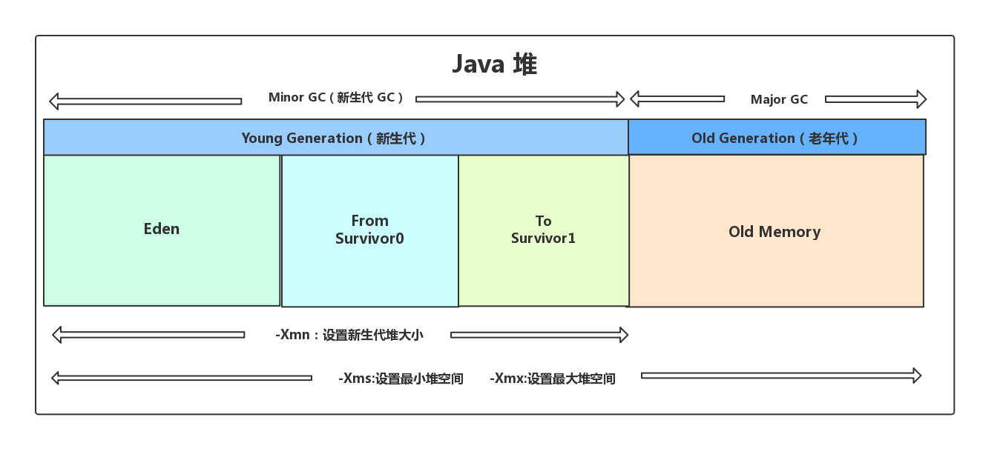
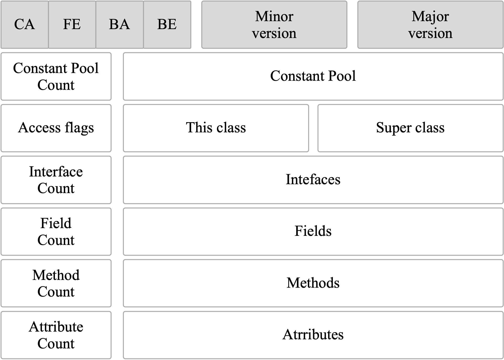
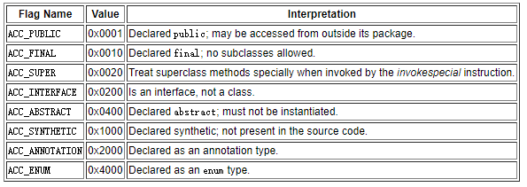

# JVM 内存结构


JVM 内存结构图如上，分为五个部分：方法区(里面包含有运行时常量池)，堆，java 栈， 本地方法区，程序技术器

其中方法区和堆是所有线程共享的。其他的如 java 栈，本地方法区，程序计数器是每个线程独有的

一个方法对应一个栈帧

## 程序计数器

每个线程独有，用于记录每个线程下一条执行的指令,即当前线程执行到的位置。

程序计数器是唯一一个不会出现 `OutOfMemoryError` 的内存区域，它的生命周期随着线程的创建而创建，随着线程的结束而死亡。

## java 栈

描述的是 Java 方法执行的内存模型，每次方法调用的数据都是通过栈传递的。实际上，Java 虚拟机栈是由一个个栈帧组成，而每个栈帧中都拥有：**局部变量表、操作数栈、动态链接、方法出口信息**。


局部变量表主要存放了编译期可知的各种数据类型（boolean、byte、char、short、int、float、long、double）、对象引用（reference 类型，它不同于对象本身，可能是一个指向对象起始地址的引用指针，也可能是指向一个代表对象的句柄或其他与此对象相关的位置）。

**Java 虚拟机栈会出现两种错误：`StackOverFlowError` 和 `OutOfMemoryError`。**

- **`StackOverFlowError`：** 若 Java 虚拟机栈的内存大小不允许动态扩展，那么当线程请求栈的深度超过当前 Java 虚拟机栈的最大深度的时候，就抛出 `StackOverFlowError` 错误。
- **`OutOfMemoryError`：** Java 虚拟机栈的内存大小可以动态扩展， 如果虚拟机在动态扩展栈时无法申请到足够的内存空间，则抛出 `OutOfMemoryError` 异常。

Java 栈中保存的主要内容是栈帧，每一次函数调用都会有一个对应的栈帧被压入 Java 栈，每一个函数调用结束后，都会有一个栈帧被弹出。

Java 方法有两种返回方式：

1. return 语句。
2. 抛出异常。

不管哪种返回方式都会导致栈帧被弹出。

## 本地方法栈

和虚拟机栈所发挥的作用非常相似，区别是： 虚拟机栈为虚拟机执行 Java 方法 （也就是字节码）服务，而本地方法栈则为虚拟机使用到的 Native 方法服务。 在 HotSpot 虚拟机中和 Java 虚拟机栈合二为一。

本地方法被执行的时候，在本地方法栈也会创建一个栈帧，用于存放该本地方法的局部变量表、操作数栈、动态链接、出口信息。

方法执行完毕后相应的栈帧也会出栈并释放内存空间，也会出现 `StackOverFlowError` 和 `OutOfMemoryError` 两种错误。

## 堆

JVM 内存会划分为堆内存和非堆内存，堆内存中也会划分为**年轻代**和**老年代**，而非堆内存则为**永久代**。年轻代又会分为 **Eden** 和 **Survivor** 区。Survivor 也会分为 **FromPlace** 和 **ToPlace**，toPlace 的 survivor 区域是空的。Eden，FromPlace 和 ToPlace 的默认占比为 **8:1:1**。当然这个东西其实也可以通过一个 `-XX:+UsePSAdaptiveSurvivorSizePolicy` 参数来根据生成对象的速率动态调整

Java 虚拟机所管理的内存中最大的一块，Java 堆是所有线程共享的一块内存区域，在虚拟机启动时创建。**此内存区域的唯一目的就是存放对象实例，几乎所有的对象实例以及数组都在这里分配内存。**

Java 世界中“几乎”所有的对象都在堆中分配，但是，随着 JIT 编译器的发展与逃逸分析技术逐渐成熟，栈上分配、标量替换优化技术将会导致一些微妙的变化，所有的对象都分配到堆上也渐渐变得不那么“绝对”了。从 JDK 1.7 开始已经默认开启逃逸分析，如果某些方法中的对象引用没有被返回或者未被外面使用（也就是未逃逸出去），那么对象可以直接在栈上分配内存。

Java 堆是垃圾收集器管理的主要区域，因此也被称作 **GC 堆（Garbage Collected Heap）**。从垃圾回收的角度，由于现在收集器基本都采用分代垃圾收集算法，所以 Java 堆还可以细分为：新生代和老年代；再细致一点有：Eden、Survivor、Old 等空间。**进一步划分的目的是更好地回收内存，或者更快地分配内存。**

在 JDK 7 版本及 JDK 7 版本之前，堆内存被通常分为下面三部分：

1. 新生代内存(Young Generation)
2. 老生代(Old Generation)
3. 永久代(Permanent Generation)

下图所示的 Eden 区、两个 Survivor 区 `S0` 和 `S1` 都属于新生代，中间一层属于老年代，最下面一层属于永久代。


**JDK 8 版本之后 `PermGen` 已被 `Metaspace`(元空间) 取代，元空间使用的是直接内存。**

大部分情况，对象都会首先在 Eden 区域分配，在一次新生代垃圾回收后，如果对象还存活，则会进入 `S0` 或者 `S1`，并且对象的年龄还会加 1(Eden 区 -> Survivor 区后对象的初始年龄变为 1)，当它的年龄增加到一定程度（默认为 15 岁），就会被晋升到老年代中。对象晋升到老年代的年龄阈值，可以通过参数 `-XX:MaxTenuringThreshold` 来设置。

> “`Hotspot` 遍历所有对象时，按照年龄从小到大对其所占用的大小进行累积，当累积的某个年龄大小超过了 survivor 区的一半时，取这个年龄和 `MaxTenuringThreshold` 中更小的一个值，作为新的晋升年龄阈值”。

堆这里最容易出现的就是 `OutOfMemoryError` 错误，并且出现这种错误之后的表现形式还会有几种，比如：

1. **`java.lang.OutOfMemoryError: GC Overhead Limit Exceeded`** ： 当 JVM 花太多时间执行垃圾回收并且只能回收很少的堆空间时，就会发生此错误。
2. **`java.lang.OutOfMemoryError: Java heap space`** :假如在创建新的对象时, 堆内存中的空间不足以存放新创建的对象, 就会引发此错误。(和配置的最大堆内存有关，且受制于物理内存大小。最大堆内存可通过`-Xmx`参数配置，若没有特别配置，将会使用默认值，详见：[Default Java 8 max heap size](https://stackoverflow.com/questions/28272923/default-xmxsize-in-java-8-max-heap-size))

## 方法区

方法区与 Java 堆一样，是各个线程共享的内存区域，它用于存储已被虚拟机加载的类信息、常量、静态变量、即时编译器编译后的代码等数据。虽然 **Java 虚拟机规范把方法区描述为堆的一个逻辑部分**，但是它却有一个别名叫做 **Non-Heap（非堆）**，目的应该是与 Java 堆区分开来。

方法区也被称为永久代。很多人都会分不清方法区和永久代的关系

### 方法区和永久代的关系

> 《Java 虚拟机规范》只是规定了有方法区这么个概念和它的作用，并没有规定如何去实现它。那么，在不同的 JVM 上方法区的实现肯定是不同的了。 **方法区和永久代的关系很像 Java 中接口和类的关系，类实现了接口，而永久代就是 HotSpot 虚拟机对虚拟机规范中方法区的一种实现方式。** 也就是说，永久代是 HotSpot 的概念，方法区是 Java 虚拟机规范中的定义，是一种规范，而永久代是一种实现，一个是标准一个是实现，其他的虚拟机实现并没有永久代这一说法。

JDK 1.8 之前永久代还没被彻底移除的时候通常通过下面这些参数来调节方法区大小

```java
-XX:PermSize=N //方法区 (永久代) 初始大小
-XX:MaxPermSize=N //方法区 (永久代) 最大大小,超过这个值将会抛出 OutOfMemoryError 异常:java.lang.OutOfMemoryError: PermGen
```

相对而言，垃圾收集行为在这个区域是比较少出现的，但并非数据进入方法区后就“永久存在”了。

JDK 1.8 的时候，方法区（HotSpot 的永久代）被彻底移除了（JDK 1.7 就已经开始了），取而代之是元空间，**元空间使用的是直接内存**。

下面是一些常用参数：

```java
-XX:MetaspaceSize=N //设置 Metaspace 的初始（和最小大小）
-XX:MaxMetaspaceSize=N //设置 Metaspace 的最大大小
```

与永久代很大的不同就是，如果不指定大小的话，随着更多类的创建，虚拟机会耗尽所有可用的系统内存。

1. 整个永久代有一个 JVM 本身设置的固定大小上限，无法进行调整，而元空间使用的是直接内存，受本机可用内存的限制，虽然元空间仍旧可能溢出，但是比原来出现的几率会更小。

   > 当元空间溢出时会得到如下错误： `java.lang.OutOfMemoryError: MetaSpace`

你可以使用 `-XX：MaxMetaspaceSize` 标志设置最大元空间大小，默认值为 unlimited，这意味着它只受系统内存的限制。`-XX：MetaspaceSize` 调整标志定义元空间的初始大小如果未指定此标志，则 Metaspace 将根据运行时的应用程序需求动态地重新调整大小。

1. 元空间里面存放的是类的元数据，这样加载多少类的元数据就不由 `MaxPermSize` 控制了, 而由系统的实际可用空间来控制，这样能加载的类就更多了。
2. 在 JDK 8，合并 HotSpot 和 `JRockit` 的代码时, `JRockit` 从来没有一个叫永久代的东西, 合并之后就没有必要额外的设置这么一个永久代的地方了。

### 运行时常量池

运行时常量池是方法区的一部分。Class 文件中除了有类的版本、字段、方法、接口等描述信息外，还有常量池表（用于存放编译期生成的各种字面量和符号引用）

既然运行时常量池是方法区的一部分，自然受到方法区内存的限制，当常量池无法再申请到内存时会抛出 `OutOfMemoryError` 错误。

> 1. JDK 1.7 之前运行时常量池逻辑包含字符串常量池存放在方法区, 此时 hotspot 虚拟机对方法区的实现为永久代
> 2. JDK 1.7 字符串常量池被从方法区拿到了堆中, 这里没有提到运行时常量池,也就是说字符串常量池被单独拿到堆,运行时常量池剩下的东西还在方法区, 也就是 hotspot 中的永久代 。
> 3. JDK 1.8 hotspot 移除了永久代用元空间(Metaspace)取而代之, 这时候字符串常量池还在堆, 运行时常量池还在方法区, 只不过方法区的实现从永久代变成了元空间(Metaspace)

## 直接内存

直接内存并不是虚拟机运行时数据区的一部分，也不是虚拟机规范中定义的内存区域，但是这部分内存也被频繁地使用。而且也可能导致 `OutOfMemoryError` 错误出现。

JDK 1.4 中新加入的 `NIO`(New Input/Output) 类，引入了一种基于通道（Channel）与缓存区（Buffer）的 I/O 方式，它可以直接使用 Native 函数库直接分配堆外内存，然后通过一个存储在 Java 堆中的 `DirectByteBuffer` 对象作为这块内存的引用进行操作。这样就能在一些场景中显著提高性能，因为避免了在 Java 堆和 Native 堆之间来回复制数据。

本机直接内存的分配不会受到 Java 堆的限制，但是，既然是内存就会受到本机总内存大小以及处理器寻址空间的限制。

#  HotSpot 虚拟机对象探秘

## 对象的创建


### 1. 类加载检查

虚拟机遇到一条 new 指令时，首先将去检查这个指令的参数是否能在常量池中定位到这个类的符号引用，并且检查这个符号引用代表的类是否已被加载过、解析和初始化过。如果没有，那必须先执行相应的类加载过程。

### 2. 分配内存

在类加载检查通过后，接下来虚拟机将为新生对象分配内存。对象所需的内存大小在类加载完成后便可确定，为对象分配空间的任务等同于把一块确定大小的内存从 Java 堆中划分出来。分配方式有 “指针碰撞” 和 “空闲列表” 两种，选择哪种分配方式由 Java 堆是否规整决定，而 Java 堆是否规整又由所采用的垃圾收集器是否带有压缩整理功能决定。

**内存分配的两种方式：（补充内容，需要掌握）**

选择以上两种方式中的哪一种，取决于 Java 堆内存是否规整。而 Java 堆内存是否规整，取决于 GC 收集器的算法是"标记-清除"，还是"标记-整理"（也称作"标记-压缩"），值得注意的是，复制算法内存也是规整的


**内存分配并发问题（补充内容，需要掌握）**

在创建对象的时候有一个很重要的问题，就是线程安全，因为在实际开发过程中，创建对象是很频繁的事情，作为虚拟机来说，必须要保证线程是安全的，通常来讲，虚拟机采用两种方式来保证线程安全：

- CAS + 失败重试： CAS 是乐观锁的一种实现方式。所谓乐观锁就是，每次不加锁而是假设没有冲突而去完成某项操作，如果因为冲突失败就重试，直到成功为止。虚拟机采用 CAS 配上失败重试的方式保证更新操作的原子性。
- TLAB： 为每一个线程预先在 Eden 区分配一块儿内存，JVM 在给线程中的对象分配内存时，首先在 TLAB 分配，当对象大于 TLAB 中的剩余内存或 TLAB 的内存已用尽时，再采用上述的 CAS 进行内存分配

### 3. 初始化零值

内存分配完成后，虚拟机需要将分配到的内存空间都初始化为零值（不包括对象头），这一步操作保证了对象的实例字段在 Java 代码中可以不赋初始值就直接使用，程序能访问到这些字段的数据类型所对应的零值。

### 4. 设置对象头

初始化零值完成之后，**虚拟机要对对象进行必要的设置**，例如这个对象是哪个类的实例、如何才能找到类的元数据信息、对象的哈希码、对象的 GC 分代年龄等信息。 **这些信息存放在对象头中。** 另外，根据虚拟机当前运行状态的不同，如是否启用偏向锁等，对象头会有不同的设置方式。

### 5. 执行 init 方法

在上面工作都完成之后，从虚拟机的视角来看，一个新的对象已经产生了，但从 Java 程序的视角来看，对象创建才刚开始，`<init>` 方法还没有执行，所有的字段都还为零。所以一般来说，执行 new 指令之后会接着执行 `<init>` 方法，把对象按照程序员的意愿进行初始化，这样一个真正可用的对象才算完全产生出来。

## 对象的内存布局

在 Hotspot 虚拟机中，对象在内存中的布局可以分为 3 块区域：**对象头、实例数据和对齐填充**。

Hotspot 虚拟机的对象头包括两部分信息，第一部分用于存储对象自身的运行时数据（哈希码、GC 分代年龄、锁状态标志等等），另一部分是类型指针，即对象指向它的类元数据的指针，虚拟机通过这个指针来确定这个对象是哪个类的实例。

实例数据部分是对象真正存储的有效信息，也是在程序中所定义的各种类型的字段内容。

对齐填充部分不是必然存在的，也没有什么特别的含义，仅仅起占位作用。 因为 Hotspot 虚拟机的自动内存管理系统要求对象起始地址必须是 8 字节的整数倍，换句话说就是对象的大小必须是 8 字节的整数倍。而对象头部分正好是 8 字节的倍数（1 倍或 2 倍），因此，当对象实例数据部分没有对齐时，就需要通过对齐填充来补全。

## 对象的访问定位

建立对象就是为了使用对象，我们的 Java 程序通过栈上的 reference 数据来操作堆上的具体对象。对象的访问方式由虚拟机实现而定，目前主流的访问方式有 **①使用句柄** 和 **②直接指针**两种：

1. **句柄：**如果使用句柄的话，那么 Java 堆中将会划分出一块内存来作为句柄池，reference 中存储的就是对象的句柄地址，而句柄中包含了对象实例数据与类型数据各自的具体地址信息；

   

2. **直接指针：** 如果使用直接指针访问，那么 Java 堆对象的布局中就必须考虑如何放置访问类型数据的相关信息，而 reference 中存储的直接就是对象的地址。


**这两种对象访问方式各有优势。使用句柄来访问的最大好处是 reference 中存储的是稳定的句柄地址，在对象被移动时只会改变句柄中的实例数据指针，而 reference 本身不需要修改。使用直接指针访问方式最大的好处就是速度快，它节省了一次指针定位的时间开销**

# 字符串常量池

```java
String str1 = "str";
String str2 = "ing";
String str3 = "str" + "ing";//常量池中的对象
String str4 = str1 + str2; //在堆上创建的新的对象
String str5 = "string";//常量池中的对象
System.out.println(str3 == str4);//false
System.out.println(str3 == str5);//true
System.out.println(str4 == str5);//false
```

对于编译期可以确定值的字符串，也就是常量字符串 ，jvm 会将其存入字符串常量池。并且，字符串常量拼接得到的字符串常量在编译阶段就已经被存放字符串常量池，这个得益于编译器的优化。

**字符串常量池** 是 JVM 为了提升性能和减少内存消耗针对字符串（String 类）专门开辟的一块区域，主要目的是为了避免字符串的重复创建。

JDK 1.7 之前运行时常量池逻辑包含字符串常量池存放在方法区。JDK 1.7 的时候，字符串常量池被从方法区拿到了堆中。

在编译过程中，javac 编译器（下文中统称为编译器）会进行一个叫做 **常量折叠(Constant Folding)** 的代码优化。

常量折叠会把常量表达式的值求出来作为常量嵌在最终生成的代码中，这是 Javac 编译器会对源代码做的极少量优化措施之一(代码优化几乎都在即时编译器中进行)。

对于 `String str3 = "str" + "ing";` 编译器会给你优化成 `String str3 = "string";` 。

并不是所有的常量都会进行折叠，只有编译器在程序编译期就可以确定值的常量才可以：

1. 基本数据类型(byte、boolean、short、char、int、float、long、double)以及字符串常量
2. `final` 修饰的基本数据类型和字符串变量
3. 字符串通过 “+” 拼接得到的字符串、基本数据类型之间算数运算（加减乘除）、基本数据类型的位运算（<<、>>、>>> ）

因此，`str1` 、 `str2` 、 `str3` 都属于字符串常量池中的对象。

引用的值在程序编译期是无法确定的，编译器无法对其进行优化。

对象引用和 “+” 的字符串拼接方式，实际上是通过 `StringBuilder` 调用 `append()` 方法实现的，拼接完成之后调用 `toString()` 得到一个 `String` 对象 。

```java
String str4 = new StringBuilder().append(str1).append(str2).toString();
```

因此，`str4` 并不是字符串常量池中存在的对象，属于堆上的新对象。

不过，字符串使用 `final` 关键字声明之后，可以让编译器当做常量来处理。

```java
final String str1 = "str";
final String str2 = "ing";
// 下面两个表达式其实是等价的
String c = "str" + "ing";// 常量池中的对象
String d = str1 + str2; // 常量池中的对象
System.out.println(c == d);// true
```

被 `final` 关键字修改之后的 `String` 会被编译器当做常量来处理，编译器在程序编译期就可以确定它的值，其效果就想到于访问常量。

如果，编译器在运行时才能知道其确切值的话，就无法对其优化。

**字符串常量池比较特殊，它的主要使用方法有两种：**

1. 直接使用双引号声明出来的 `String` 对象会直接存储在常量池中。
2. 如果不是用双引号声明的 `String` 对象，使用 `String` 提供的 `intern()` 方法也有同样的效果。`String.intern()` 是一个 Native 方法，它的作用是：如果字符串常量池中已经包含一个等于此 String 对象内容的字符串，则返回常量池中该字符串的引用；如果没有，JDK 1.7 之前（不包含 1.7）的处理方式是在常量池中创建与此 `String` 内容相同的字符串，并返回常量池中创建的字符串的引用，JDK 1.7 以及之后，字符串常量池被从方法区拿到了堆中，jvm 不会在常量池中创建该对象，而是将堆中这个对象的引用直接放到常量池中，减少不必要的内存开销。

```java
String s1 = "Javatpoint";
String s2 = s1.intern();
String s3 = new String("Javatpoint");
String s4 = s3.intern();
System.out.println(s1==s2); // True
System.out.println(s1==s3); // False
System.out.println(s1==s4); // True
System.out.println(s2==s3); // False
System.out.println(s2==s4); // True
System.out.println(s3==s4); // False
```

**总结** ：

1. 对于基本数据类型来说，比较的是值。对于引用数据类型来说，比较的是对象的内存地址。
2. 在编译过程中，Javac 编译器（下文中统称为编译器）会进行一个叫做 **常量折叠(Constant Folding)** 的代码优化。常量折叠会把常量表达式的值求出来作为常量嵌在最终生成的代码中，这是 Javac 编译器会对源代码做的极少量优化措施之一(代码优化几乎都在即时编译器中进行)。
3. 一般来说，我们要尽量避免通过 new 的方式创建字符串。使用双引号声明的 `String` 对象（ `String s1 = "java"` ）更利于让编译器有机会优化我们的代码，同时也更易于阅读。
4. 被 `final` 关键字修改之后的 `String` 会被编译器当做常量来处理，编译器程序编译期就可以确定它的值，其效果就想到于访问常量。

**Integer 比较更丰富的一个例子:**

```java
Integer i1 = 40;
Integer i2 = 40;
Integer i3 = 0;
Integer i4 = new Integer(40);
Integer i5 = new Integer(40);
Integer i6 = new Integer(0);

System.out.println(i1 == i2);// true
System.out.println(i1 == i2 + i3);//true
System.out.println(i1 == i4);// false
System.out.println(i4 == i5);// false
System.out.println(i4 == i5 + i6);// true
System.out.println(40 == i5 + i6);// true
```

`i1` , `i2 `, `i3` 都是常量池中的对象，`i4` , `i5` , `i6` 是堆中的对象。

注意：

`i4 == i5 + i6`  为什么是 true 呢？因为， `i5` 和 `i6` 会进行自动拆箱操作，进行数值相加，即 `i4 == 40` 。 `Integer` 对象无法与数值进行直接比较，所以 `i4` 自动拆箱转为 int 值 40，最终这条语句转为 `40 == 40` 进行数值比较。

# JVM 垃圾回收

Java 的自动内存管理主要是针对对象内存的回收和对象内存的分配。同时，Java 自动内存管理最核心的功能是 **堆** 内存中对象的分配与回收。

同时，Java 自动内存管理最核心的功能是 **堆** 内存中对象的分配与回收。从垃圾回收的角度，由于现在收集器基本都采用分代垃圾收集算法，所以 Java 堆还可以细分为：新生代和老年代：再细致一点有：Eden 空间、From Survivor、To Survivor 空间等。**进一步划分的目的是更好地回收内存，或者更快地分配内存。**

堆空间的基本结构：



大部分情况，对象都会首先在 Eden 区域分配，在一次新生代垃圾回收后，如果对象还存活，则会进入 `s0` 或者 `s1`，并且对象的年龄还会加 1(Eden 区 -> Survivor 区后对象的初始年龄变为 1)，当它的年龄增加到一定程度（默认为大于 15 岁），就会被晋升到老年代中。对象晋升到老年代的年龄阈值，可以通过参数 `-XX:MaxTenuringThreshold` 来设置默认值，这个值会在虚拟机运行过程中进行调整，可以通过`-XX:+PrintTenuringDistribution` 来打印出当次 GC 后的 Threshold。

> Hotspot 遍历所有对象时，按照年龄从小到大对其所占用的大小进行累积，当累积的某个年龄大小超过了 survivor 区的一半时，取这个年龄和 `MaxTenuringThreshold` 中更小的一个值，作为新的晋升年龄阈值”。

经过这次 GC 后，Eden 区和 "From" 区已经被清空。这个时候，"From" 和 "To" 会交换他们的角色，也就是新的 "To" 就是上次 GC 前的“From”，新的"From"就是上次 GC 前的"To"。**不管怎样，都会保证名为 To 的 Survivor 区域是空的**。Minor GC 会一直重复这样的过程，在这个过程中，有可能当次 Minor GC 后，Survivor 的"From"区域空间不够用，有一些还达不到进入老年代条件的实例放不下，则 **放不下的部分会提前进入老年代。**

大多数情况下，对象在新生代中 eden 区分配。当 eden 区没有足够空间进行分配时，虚拟机将发起一次 Minor GC.

## 大对象直接进入老年代

大对象就是需要大量连续内存空间的对象（比如：字符串、数组）。这样做是为了避免为大对象分配内存时由于分配担保机制带来的复制而降低效率。

## 长期存活的对象将进入老年代

既然虚拟机采用了分代收集的思想来管理内存，那么内存回收时就必须能识别哪些对象应放在新生代，哪些对象应放在老年代中。为了做到这一点，虚拟机给每个对象一个对象年龄（Age）计数器。

如果对象在 Eden 出生并经过第一次 Minor GC 后仍然能够存活，并且能被 Survivor 容纳的话，将被移动到 Survivor 空间中，并将对象年龄设为 1.对象在 Survivor 中每熬过一次 `MinorGC`, 年龄就增加 1 岁，当它的年龄增加到一定程度（默认为 15 岁），就会被晋升到老年代中。对象晋升到老年代的年龄阈值，可以通过参数 `-XX:MaxTenuringThreshold` 来设置。

## 动态年龄判定

Hotspot 遍历所有对象时，按照年龄从小到大对其所占用的大小进行累积，当累积的某个年龄大小超过了 survivor 区的 50% 时（默认值是 50%，可以通过 `-XX:TargetSurvivorRatio=percent` 来设置，取这个年龄和 `MaxTenuringThreshold` 中更小的一个值，作为新的晋升年龄阈值。

> **关于默认的晋升年龄是 15，这个说法的来源大部分都是《深入理解 Java 虚拟机》这本书。** 如果你去 Oracle 的官网阅读[相关的虚拟机参数](https://docs.oracle.com/javase/8/docs/technotes/tools/unix/java.html)，你会发现`-XX:MaxTenuringThreshold=threshold`这里有个说明
>
> **Sets the maximum `tenuring` threshold for use in adaptive GC sizing. The largest value is 15. The default value is 15 for the parallel (throughput) collector, and 6 for the `CMS` collector.默认晋升年龄并不都是 15，这个是要区分垃圾收集器的，`CMS` 就是 6.**

## 主要 GC 的区域

针对 `HotSpot VM` 的实现，它里面的 GC 其实准确分类只有两大种：

部分收集 (Partial GC)：

- 新生代收集（Minor GC / Young GC）：只对新生代进行垃圾收集；
- 老年代收集（Major GC / Old GC）：只对老年代进行垃圾收集。需要注意的是 Major GC 在有的语境中也用于指代整堆收集；
- 混合收集（Mixed GC）：对整个新生代和部分老年代进行垃圾收集。

- 整堆收集 (Full GC)：收集整个 Java 堆和方法区。

要避免 Full GC 可以设置 JVM 年轻代对应的比例，使其少进入老年代，在年轻代就直接将对象回收。

## 空间分配担保

空间分配担保是为了确保在 Minor GC 之前老年代本身还有容纳新生代所有对象的剩余空间。

> JDK 6 Update 24 之前，在发生 Minor GC 之前，虚拟机必须先检查老年代最大可用的连续空间是否大于新生代所有对象总空间，如果这个条件成立，那这一次 Minor GC 可以确保是安全的。如果不成立，则虚拟机会先查看 `-XX:HandlePromotionFailure` 参数的设置值是否允许担保失败(Handle Promotion Failure);如果允许，那会继续检查老年代最大可用的连续空间是否大于历次晋升到老年代对象的平均大小，如果大于，将尝试进行一次 Minor GC，尽管这次 Minor GC 是有风险的;如果小于，或者 `-XX: HandlePromotionFailure` 设置不允许冒险，那这时就要改为进行一次 Full GC。
> 
> JDK 6 Update 24 之后的规则变为只要老年代的连续空间大于新生代对象总大小或者历次晋升的平均大小，就会进行 Minor GC，否则将进行 Full GC。

## 判断对象死亡

判断一个对象的死亡至少需要两次标记

1. 如果对象进行可达性分析之后没发现与 GC Roots 相连的引用链，那它将会第一次标记并且进行一次筛选。判断的条件是决定这个对象是否有必要执行 finalize() 方法。如果对象有必要执行 finalize() 方法，则被放入 F-Queue 队列中。
2. GC 对 F-Queue 队列中的对象进行二次标记。如果对象在 finalize() 方法中重新与引用链上的任何一个对象建立了关联，那么二次标记时则会将它移出“即将回收”集合。如果此时对象还没成功逃脱，那么只能被回收了。

### 引用计数法

给对象中添加一个引用计数器，每当有一个地方引用它，计数器就加 1；当引用失效，计数器就减 1；任何时候计数器为 0 的对象就是不可能再被使用的。

**这个方法实现简单，效率高，但是目前主流的虚拟机中并没有选择这个算法来管理内存，其最主要的原因是它很难解决对象之间相互循环引用的问题。** 所谓对象之间的相互引用问题，如下面代码所示：除了对象 objA 和 objB 相互引用着对方之外，这两个对象之间再无任何引用。但是他们因为互相引用对方，导致它们的引用计数器都不为 0，于是引用计数算法无法通知 GC 回收器回收他们。

```java
public class ReferenceCountingGc {
    Object instance = null;
	public static void main(String[] args) {
		ReferenceCountingGc objA = new ReferenceCountingGc();
		ReferenceCountingGc objB = new ReferenceCountingGc();
		objA.instance = objB;
		objB.instance = objA;
		objA = null;
		objB = null;
	}
}
```

### 可达性分析算法


这个算法的基本思想就是通过一系列的称为 **“GC Roots”** 的对象作为起点，从这些节点开始向下搜索，节点所走过的路径称为引用链，当一个对象到 GC Roots 没有任何引用链相连的话，则证明此对象是不可用的，需要被回收。

下图中的 `Object 6 ~ Object 10` 之间虽有引用关系，但它们到 GC Roots 不可达，因此为需要被回收的对象。


**哪些对象可以作为 GC Roots 呢？**

- 虚拟机栈(栈帧中的本地变量表)中引用的对象
- 本地方法栈(Native 方法)中引用的对象
- 方法区中类静态属性引用的对象
- 方法区中常量引用的对象
- 所有被同步锁持有的对象

**对象可以被回收，就代表一定会被回收吗？**

即使在可达性分析法中不可达的对象，也并非是“非死不可”的，这时候它们暂时处于“缓刑阶段”，要真正宣告一个对象死亡，**至少要经历两次标记过程**；可达性分析法中不可达的对象被第一次标记并且进行一次筛选，筛选的条件是此对象是否有必要执行 `finalize` 方法。当对象没有覆盖 `finalize` 方法，或 `finalize` 方法已经被虚拟机调用过时，虚拟机将这两种情况视为没有必要执行。

被判定为需要执行的对象将会被放在一个队列中进行第二次标记，除非这个对象与引用链上的任意一个对象建立关联，否则就会被真的回收。

> `Object` 类中的 `finalize` 方法一直被认为是一个糟糕的设计，成为了 Java 语言的负担，影响了 Java 语言的安全和 GC 的性能。JDK 9 版本及后续版本中各个类中的 `finalize` 方法会被逐渐弃用移除。忘掉它的存在吧！

## 判断废弃常量

运行时常量池主要回收的是废弃的常量。那么，我们如何判断一个常量是废弃常量呢？

> 1. **JDK 1.7 之前运行时常量池逻辑包含字符串常量池存放在方法区, 此时 hotspot 虚拟机对方法区的实现为永久代**
> 2. **JDK 1.7 字符串常量池被从方法区拿到了堆中, 这里没有提到运行时常量池,也就是说字符串常量池被单独拿到堆,运行时常量池剩下的东西还在方法区, 也就是 hotspot 中的永久代** 。
> 3. **JDK 1.8 hotspot 移除了永久代用元空间(Metaspace)取而代之, 这时候字符串常量池还在堆, 运行时常量池还在方法区, 只不过方法区的实现从永久代变成了元空间(Metaspace)**

假如在字符串常量池中存在字符串 `"abc"`，如果当前没有任何 String 对象引用该字符串常量的话，就说明常量 `"abc"` 就是废弃常量，如果这时发生内存回收且有必要的话，`"abc"` 就会被系统清理出常量池了。

## 判断无用的类

方法区主要回收的是无用的类，那么如何判断一个类是无用的类的呢？

判定一个常量是否是“废弃常量”比较简单，而要判定一个类是否是“无用的类”的条件则相对苛刻许多。类需要同时满足下面 3 个条件才能算是 **“无用的类”** ：

- 该类所有的实例都已经被回收，也就是 Java 堆中不存在该类的任何实例。
- 加载该类的 `ClassLoader` 已经被回收。
- 该类对应的 `java.lang.Class` 对象没有在任何地方被引用，无法在任何地方通过反射访问该类的方法。

虚拟机可以对满足上述 3 个条件的无用类进行回收，这里说的仅仅是“可以”，而并不是和对象一样不使用了就必然会被回收。

## 垃圾收集算法

### 标记-清除算法

该算法分为“标记”和“清除”阶段：首先标记出所有不需要回收的对象，在标记完成后统一回收掉所有没有被标记的对象。它是最基础的收集算法，后续的算法都是对其不足进行改进得到。这种垃圾收集算法会带来两个明显的问题：

1. **效率问题**
2. **空间问题（标记清除后会产生大量不连续的碎片）**


### 标记-复制算法

为了解决效率问题，“标记-复制”收集算法出现了。它可以将内存分为大小相同的两块，每次使用其中的一块。当这一块的内存使用完后，就将还存活的对象复制到另一块去，然后再把使用的空间一次清理掉。这样就使每次的内存回收都是对内存区间的一半进行回收。


### 标记-整理算法

根据老年代的特点提出的一种标记算法，标记过程仍然与“标记-清除”算法一样，但后续步骤不是直接对可回收对象回收，而是让所有存活的对象向一端移动，然后直接清理掉端边界以外的内存。


### 为什么标记复制比标记整理快

从头开始遍历并不是从堆内存里面按顺序遍历，而是从多个 GCROOT 开始进行可达性遍历。标记整理需要，标记完全部存活对象后，才能向一端移动。如果遇到存活的对象就移动到头的位置，可能会覆盖掉某些 GCROOT 还没遍历到。复制算法是从 gc roots 开始，遇到活对象就复制走了。gc roots 找可达对象的过程结束就复制完了。

###  分代收集算法

当前虚拟机的垃圾收集都采用分代收集算法，这种算法没有什么新的思想，只是根据对象存活周期的不同将内存分为几块。一般将 java 堆分为新生代和老年代，这样我们就可以根据各个年代的特点选择合适的垃圾收集算法。

**比如在新生代中，每次收集都会有大量对象死去，所以可以选择”标记-复制“算法，只需要付出少量对象的复制成本就可以完成每次垃圾收集。而老年代的对象存活几率是比较高的，而且没有额外的空间对它进行分配担保，所以我们必须选择“标记-清除”或“标记-整理”算法进行垃圾收集。**

## 垃圾收集器

**如果说收集算法是内存回收的方法论，那么垃圾收集器就是内存回收的具体实现。**

虽然我们对各个收集器进行比较，但并非要挑选出一个最好的收集器。因为直到现在为止还没有最好的垃圾收集器出现，更加没有万能的垃圾收集器，**我们能做的就是根据具体应用场景选择适合自己的垃圾收集器**。试想一下：如果有一种四海之内、任何场景下都适用的完美收集器存在，那么我们的 HotSpot 虚拟机就不会实现那么多不同的垃圾收集器了。

### Serial 收集器

Serial（串行）收集器是最基本、历史最悠久的垃圾收集器了。大家看名字就知道这个收集器是一个单线程收集器了。它的 **“单线程”** 的意义不仅仅意味着它只会使用一条垃圾收集线程去完成垃圾收集工作，更重要的是它在**进行垃圾收集工作的时候必须暂停其他所有的工作线程**（ **"Stop The World"** ），直到它收集结束。

**新生代采用标记-复制算法，老年代采用标记-整理算法。**


虚拟机的设计者们当然知道 Stop The World 带来的不良用户体验，所以在后续的垃圾收集器设计中停顿时间在不断缩短（仍然还有停顿，寻找最优秀的垃圾收集器的过程仍然在继续）。

但是 Serial 收集器有没有优于其他垃圾收集器的地方呢？当然有，它**简单而高效（与其他收集器的单线程相比）**。Serial 收集器由于没有线程交互的开销，自然可以获得很高的单线程收集效率。Serial 收集器对于运行在 Client 模式下的虚拟机来说是个不错的选择。

### `ParNew` 收集器

**`ParNew` 收集器其实就是 Serial 收集器的多线程版本，除了使用多线程进行垃圾收集外，其余行为（控制参数、收集算法、回收策略等等）和 Serial 收集器完全一样。**

**新生代采用标记-复制算法，老年代采用标记-整理算法。**


它是许多运行在 Server 模式下的虚拟机的首要选择，除了 Serial 收集器外，只有它能与 `CMS` 收集器（真正意义上的并发收集器，后面会介绍到）配合工作。

**并行和并发概念补充：**

- **并行（Parallel）** ：指多条垃圾收集线程并行工作，但此时用户线程仍然处于等待状态。
- **并发（Concurrent）**：指用户线程与垃圾收集线程同时执行（但不一定是并行，可能会交替执行），用户程序在继续运行，而垃圾收集器运行在另一个 CPU 上。

### Parallel Scavenge 收集器

Parallel Scavenge 收集器也是使用标记-复制算法的多线程收集器，它看上去几乎和 `ParNew` 都一样。 **那么它有什么特别之处呢？**

```text
-XX:+UseParallelGC
    使用 Parallel 收集器 + 老年代串行

-XX:+UseParallelOldGC
    使用 Parallel 收集器 + 老年代并行
```

**Parallel Scavenge 收集器关注点是吞吐量（高效率的利用 CPU）。`CMS` 等垃圾收集器的关注点更多的是用户线程的停顿时间（提高用户体验）。所谓吞吐量就是 CPU 中用于运行用户代码的时间与 CPU 总消耗时间的比值。** Parallel Scavenge 收集器提供了很多参数供用户找到最合适的停顿时间或最大吞吐量，如果对于收集器运作不太了解，手工优化存在困难的时候，使用 Parallel Scavenge 收集器配合自适应调节策略，把内存管理优化交给虚拟机去完成也是一个不错的选择。

**新生代采用标记-复制算法，老年代采用标记-整理算法。**

**这是 JDK 1.8 默认收集器**

使用 `java -XX:+PrintCommandLineFlags -version` 命令查看

```text
-XX:InitialHeapSize=262921408 -XX:MaxHeapSize=4206742528 -XX:+PrintCommandLineFlags -XX:+UseCompressedClassPointers -XX:+UseCompressedOops -XX:+UseParallelGC
java version "1.8.0_211"
Java(TM) SE Runtime Environment (build 1.8.0_211-b12)
Java HotSpot(TM) 64-Bit Server VM (build 25.211-b12, mixed mode)
```

JDK 1.8 默认使用的是 Parallel Scavenge + Parallel Old，如果指定了 `-XX:+UseParallelGC` 参数，则默认指定了 `-XX:+UseParallelOldGC` ，可以使用 `-XX:-UseParallelOldGC` 来禁用该功能

### Serial Old 收集器

**Serial 收集器的老年代版本**，它同样是一个单线程收集器。它主要有两大用途：一种用途是在 JDK 1.5 以及之前的版本中与 Parallel Scavenge 收集器搭配使用，另一种用途是作为 `CMS` 收集器的后备方案。

### Parallel Old 收集器

**Parallel Scavenge 收集器的老年代版本**。使用多线程和“标记-整理”算法。在注重吞吐量以及 CPU 资源的场合，都可以优先考虑 Parallel Scavenge 收集器和 Parallel Old 收集器。

### CMS 收集器

**CMS（Concurrent Mark Sweep 并发标记清除）收集器是一种以获取最短回收停顿时间为目标的收集器。它非常符合在注重用户体验的应用上使用。**

**CMS（Concurrent Mark Sweep）收集器是 HotSpot 虚拟机第一款真正意义上的并发收集器，它第一次实现了让垃圾收集线程与用户线程（基本上）同时工作。**

从名字中的 **Mark Sweep** 这两个词可以看出，CMS 收集器是一种 **“标记-清除”算法** 实现的，它的运作过程相比于前面几种垃圾收集器来说更加复杂一些。整个过程分为四个步骤：

- **初始标记：** 暂停所有的其他线程，并记录下直接与 root 相连的对象，速度很快 ；
- **并发标记：** 同时开启 GC 和用户线程，用一个闭包结构去记录可达对象。但在这个阶段结束，这个闭包结构并不能保证包含当前所有的可达对象。因为用户线程可能会不断的更新引用域，所以 GC 线程无法保证可达性分析的实时性。所以这个算法里会跟踪记录这些发生引用更新的地方。
- **重新标记：** 重新标记阶段就是为了修正并发标记期间因为用户程序继续运行而导致标记产生变动的那一部分对象的标记记录，这个阶段的停顿时间一般会比初始标记阶段的时间稍长，远远比并发标记阶段时间短
- **并发清除：** 开启用户线程，同时 GC 线程开始对未标记的区域做清扫。


从它的名字就可以看出它是一款优秀的垃圾收集器，主要优点：**并发收集、低停顿**。但是它有下面三个明显的缺点：

- **对 CPU 资源敏感；**
- **无法处理浮动垃圾；**
- **它使用的回收算法-“标记-清除”算法会导致收集结束时会有大量空间碎片产生。**

### G1 收集器

**G1 (Garbage-First) 是一款面向服务器的垃圾收集器,主要针对配备多颗处理器及大容量内存的机器. 以极高概率满足 GC 停顿时间要求的同时,还具备高吞吐量性能特征.**

被视为 JDK 1.7 中 HotSpot 虚拟机的一个重要进化特征。它具备以下特点：

- **并行与并发**：G1 能充分利用 CPU、多核环境下的硬件优势，使用多个 CPU（CPU 或者 CPU 核心）来缩短 Stop-The-World 停顿时间。部分其他收集器原本需要停顿 Java 线程执行的 GC 动作，G1 收集器仍然可以通过并发的方式让 java 程序继续执行。
- **分代收集**：虽然 G1 可以不需要其他收集器配合就能独立管理整个 GC 堆，但是还是保留了分代的概念。
- **空间整合**：与 CMS 的“标记-清理”算法不同，G1 从整体来看是基于“标记-整理”算法实现的收集器；从局部上来看是基于“标记-复制”算法实现的。
- **可预测的停顿**：这是 G1 相对于 CMS 的另一个大优势，降低停顿时间是 G1 和 CMS 共同的关注点，但 G1 除了追求低停顿外，还能 **建立可预测的停顿时间模型**，能让使用者明确指定在一个长度为 M 毫秒的时间片段内。

> 上面提到的垃圾收集器，收集的范围都是整个新生代或者老年代，而 G1 不再是这样。使用 G1 收集器时，Java 堆的内存布局与其他收集器有很大差别，它将整个 Java 堆划分为多个大小相等的独立区域（Region），虽然还保留有新生代和老年代的概念，但新生代和老年代不再是物理隔阂了，它们都是一部分（可以不连续）Region 的集合。

G1 收集器的运作大致分为以下几个步骤：

- **初始标记(Initial Marking)**: 标记一下 GC Roots 能够关联的对象，并且修改 TAMS 的值，需要暂停用户线程
- **并发标记(Concurrent Marking)**: 从 GC Roots 进行可达性分析，找出存活的对象，与用户线程并发执行
- **最终标记(Final Marking)**: 修正在并发标记阶段因为用户程序的并发执行导致变动的数据，需暂停用户线程
- **筛选回收(Live Data Counting And Evacation)**: 对各个 Region 的回收价值和成本进行排序，根据用户所期望的GC停顿时间制定回收计划

**G1 收集器在后台维护了一个优先列表，每次根据允许的收集时间，优先选择回收价值最大的 Region(这也就是它的名字 Garbage-First 的由来)** 。这种使用 Region 划分内存空间以及有优先级的区域回收方式，保证了 G1 收集器在有限时间内可以尽可能高的收集效率（把内存化整为零）。

### ZGC 收集器

与 CMS 中的 ParNew 和 G1 类似，ZGC 也采用标记-复制算法，不过 ZGC 对该算法做了重大改进。

在 ZGC 中出现 Stop The World 的情况会更少！

ZGC (The Z Garbage Collector）是JDK 11中推出的一款低延迟垃圾回收器，它的设计目标包括：

- 停顿时间不超过 10ms；
- 停顿时间不会随着堆的大小，或者活跃对象的大小而增加；
- 支持 8MB~4TB 级别的堆（未来支持 16TB）。

从设计目标来看，我们知道 ZGC 适用于大内存低延迟服务的内存管理和回收。本文主要介绍 ZGC 在低延时场景中的应用和卓越表现

### 总结

到 jdk8 为止，默认的垃圾收集器是 Parallel Scavenge 和 Parallel Old

从 jdk9 开始，G1 收集器成为默认的垃圾收集器 目前来看，G1 回收器停顿时间最短而且没有明显缺点，非常适合 Web 应用。在 jdk8 中测试 Web 应用，堆内存 6G，新生代 4.5G 的情况下，Parallel Scavenge 回收新生代停顿长达 1.5 秒。G1 回收器回收同样大小的新生代只停顿 0.2 秒。

新⽣代收集器：

- Serial
- ParNew
- Parallel Scavenge

⽼年代收集器：

- CMS
- Serial Old
- Parallel Old

整堆收集器：

- G1

### 垃圾收集器的分类

:one: 并发收集器[停顿时间优先]

- CMS
- G1

适用于对响应时间有一定要求的场景

:two: 并行收集器[吞吐量优先]

- Parallel Scanvent
- Parallel Old

适用于科学计算，后台处理等场景

:three: 串行收集器

- Serial
- Serial Old

适合内存小，嵌入式设备

## 垃圾收集器的选择

垃圾收集器的选择主要看两个关键指标，**停顿时间**和**吞吐量**。

- 停顿时间：垃圾收集器进行垃圾回收终端应用执行响应的时间
- 吞吐量：运行用户代码时间/(运行用户代码时间+垃圾收集时间）

> 停顿时间越短就越适合需要和用户交互的程序，良好的响应速度能提升用户体验；高吞吐量则可以高效地利用CPU时间，尽快完成程序的运算任务，主要适合在后台运算而不需要太多交互的任务。

# 类文件结构描述

在 Java 中，JVM 可以理解的代码就叫做`字节码`（即扩展名为 `.class` 的文件），它不面向任何特定的处理器，只面向虚拟机。 Java 语言通过字节码的方式，在一定程度上解决了传统解释型语言执行效率低的问题，同时又保留了解释型语言可移植的特点。所以 Java 程序运行时比较高效，而且，由于字节码并不针对一种特定的机器，因此，Java 程序无须重新编译便可在多种不同操作系统的计算机上运行。

## Class 文件结构总结

根据 Java 虚拟机规范，Class 文件通过 `ClassFile` 定义，有点类似 C 语言的结构体。

`ClassFile` 的结构如下：

```java
ClassFile {
    u4             magic; //Class 文件的标志
    u2             minor_version;//Class 的小版本号
    u2             major_version;//Class 的大版本号
    u2             constant_pool_count;//常量池的数量
    cp_info        constant_pool[constant_pool_count-1];//常量池
    u2             access_flags;//Class 的访问标记
    u2             this_class;//当前类
    u2             super_class;//父类
    u2             interfaces_count;//接口
    u2             interfaces[interfaces_count];//一个类可以实现多个接口
    u2             fields_count;//Class 文件的字段属性
    field_info     fields[fields_count];//一个类可以有多个字段
    u2             methods_count;//Class 文件的方法数量
    method_info    methods[methods_count];//一个类可以有个多个方法
    u2             attributes_count;//此类的属性表中的属性数
    attribute_info attributes[attributes_count];//属性表集合
}
```



### 魔数(Magic Number)

```java
u4 magic; // Class 文件的标志
```

每个 Class 文件的头 4 个字节称为魔数（Magic Number）,它的唯一作用是**确定这个文件是否为一个能被虚拟机接收的 Class 文件**。

程序设计者很多时候都喜欢用一些特殊的数字表示固定的文件类型或者其它特殊的含义。

### Class 文件版本号

```java
u2             minor_version;//Class 的小版本号
u2             major_version;//Class 的大版本号
```

紧接着魔数的四个字节存储的是 Class 文件的版本号：第 5 ~ 6 字节是**次版本号**，第 7 ~ 8 字节是**主版本号**。

每当 Java 发布大版本（比如 Java 8，Java 9）的时候，主版本号都会加 1。你可以使用 `javap -v` 命令来快速查看 Class 文件的版本号信息。

高版本的 Java 虚拟机可以执行低版本编译器生成的 Class 文件，但是低版本的 Java 虚拟机不能执行高版本编译器生成的 Class 文件。所以，我们在实际开发的时候要确保开发的的 JDK 版本和生产环境的 JDK 版本保持一致。

### 常量池

```java
u2             constant_pool_count;//常量池的数量
cp_info        constant_pool[constant_pool_count-1];//常量池
```

紧接着主次版本号之后的是常量池，常量池的数量是 `constant_pool_count - 1`（**常量池计数器是从 1 开始计数的，将第 0 项常量空出来是有特殊考虑的，索引值为 0 代表“不引用任何一个常量池项”**）。

常量池主要存放两大常量：字面量和符号引用。字面量比较接近于 Java 语言层面的的常量概念，如文本字符串、声明为 final 的常量值等。而符号引用则属于编译原理方面的概念。包括下面三类常量：

- 类和接口的全限定名
- 字段的名称和描述符
- 方法的名称和描述符

常量池中每一项常量都是一个表，这 14 种表有一个共同的特点：**开始的第一位是一个 u1 类型的标志位 -tag 来标识常量的类型，代表当前这个常量属于哪种常量类型．**

|               类型               | 标志（tag） |          描述          |
| :------------------------------: | :---------: | :--------------------: |
|        CONSTANT_utf8_info        |      1      |   UTF-8 编码的字符串   |
|      CONSTANT_Integer_info       |      3      |       整形字面量       |
|       CONSTANT_Float_info        |      4      |      浮点型字面量      |
|        CONSTANT_Long_info        |     ５      |      长整型字面量      |
|       CONSTANT_Double_info       |     ６      |   双精度浮点型字面量   |
|       CONSTANT_Class_info        |     ７      |   类或接口的符号引用   |
|       CONSTANT_String_info       |     ８      |    字符串类型字面量    |
|      CONSTANT_Fieldref_info      |     ９      |     字段的符号引用     |
|     CONSTANT_Methodref_info      |     10      |   类中方法的符号引用   |
| CONSTANT_InterfaceMethodref_info |     11      |  接口中方法的符号引用  |
|    CONSTANT_NameAndType_info     |     12      |  字段或方法的符号引用  |
|     CONSTANT_MothodType_info     |     16      |      标志方法类型      |
|    CONSTANT_MethodHandle_info    |     15      |      表示方法句柄      |
|   CONSTANT_InvokeDynamic_info    |     18      | 表示一个动态方法调用点 |

`.class` 文件可以通过 `javap -v class类名` 指令来看一下其常量池中的信息(`javap -v class类名-> temp.txt` ：将结果输出到 `temp.txt` 文件)。

### 访问标志

在常量池结束之后，紧接着的两个字节代表访问标志，这个标志用于识别一些类或者接口层次的访问信息，包括：这个 Class 是类还是接口，是否为 `public` 或者 `abstract` 类型，如果是类的话是否声明为 `final` 等等。



### 当前类（This Class）、父类（Super Class）、接口（Interfaces）索引集合

```java
u2             this_class; //当前类
u2             super_class; //父类
u2             interfaces_count; //接口
u2             interfaces[interfaces_count]; //一个类可以实现多个接口
```

类索引用于确定这个类的全限定名，父类索引用于确定这个类的父类的全限定名，由于 Java 语言的单继承，所以父类索引只有一个，除了 `java.lang.Object` 之外，所有的 java 类都有父类，因此除了 `java.lang.Object` 外，所有 Java 类的父类索引都不为 0。

接口索引集合用来描述这个类实现了那些接口，这些被实现的接口将按 `implements` (如果这个类本身是接口的话则是`extends`) 后的接口顺序从左到右排列在接口索引集合中。

### 字段表集合（Fields）

```java
u2             fields_count;//Class 文件的字段的个数
field_info     fields[fields_count];//一个类会可以有个字段
```

字段表（field info）用于描述接口或类中声明的变量。字段包括类级变量以及实例变量，但不包括在方法内部声明的局部变量。

**field info(字段表) 的结构:**


- **access_flags:** 字段的作用域（`public` ,`private`,`protected`修饰符），是实例变量还是类变量（`static`修饰符）,可否被序列化（transient 修饰符）,可变性（final）,可见性（volatile 修饰符，是否强制从主内存读写）。
- **name_index:** 对常量池的引用，表示的字段的名称；
- **descriptor_index:** 对常量池的引用，表示字段和方法的描述符；
- **attributes_count:** 一个字段还会拥有一些额外的属性，attributes_count 存放属性的个数；
- **attributes[attributes_count]:** 存放具体属性具体内容。

上述这些信息中，各个修饰符都是布尔值，要么有某个修饰符，要么没有，很适合使用标志位来表示。而字段叫什么名字、字段被定义为什么数据类型这些都是无法固定的，只能引用常量池中常量来描述。

**字段的 access_flag 的取值:**


### 方法表集合（Methods）

```java
u2             methods_count;//Class 文件的方法的数量
method_info    methods[methods_count];//一个类可以有个多个方法
```

methods_count 表示方法的数量，而 method_info 表示方法表。

Class 文件存储格式中对方法的描述与对字段的描述几乎采用了完全一致的方式。方法表的结构如同字段表一样，依次包括了访问标志、名称索引、描述符索引、属性表集合几项。

**method_info(方法表的) 结构:**


**方法表的 access_flag 取值：**


注意：因为 `volatile` 修饰符和 `transient` 修饰符不可以修饰方法，所以方法表的访问标志中没有这两个对应的标志，但是增加了 `synchronized`、`native`、`abstract` 等关键字修饰方法，所以也就多了这些关键字对应的标志。

### 属性表集合（Attributes）

```java
   u2             attributes_count; //此类的属性表中的属性数
   attribute_info attributes[attributes_count]; //属性表集合
```

在 Class 文件，字段表，方法表中都可以携带自己的属性表集合，以用于描述某些场景专有的信息。与 Class 文件中其它的数据项目要求的顺序、长度和内容不同，属性表集合的限制稍微宽松一些，不再要求各个属性表具有严格的顺序，并且只要不与已有的属性名重复，任何人实现的编译器都可以向属性表中写入自己定义的属性信息，Java 虚拟机运行时会忽略掉它不认识的属性。

# 类加载过程详解

## 类的完整生命过程


## 类加载过程

Class 文件需要加载到虚拟机中之后才能运行和使用，那么虚拟机是如何加载这些 Class 文件呢？

系统加载 Class 类型的文件主要三步：**加载->链接->初始化**。链接过程又可分为三步：**验证->准备->解析**。

### 加载

类加载过程的第一步，主要完成下面 3 件事情：

1. 通过全限定类名获取定义此类的二进制字节流(通过全限定类名找到类文件所处的位置)
2. 将字节流所代表的静态存储结构转换为方法区的运行时数据结构(将类文件的静态存储结构转换成方法区中的运行时结构)
3. 在内存中生成一个代表该类的 `Class` 对象，作为方法区这些数据的访问入口。**其中 Class 对象是存放在堆区的，不是方法区**

虚拟机规范上面这 3 点并不具体，因此是非常灵活的。比如："通过全类名获取定义此类的二进制字节流" 并没有指明具体从哪里获取、怎样获取。比如：比较常见的就是从 `ZIP` 包中读取（日后出现的 `JAR`、`EAR`、`WAR` 格式的基础）、其他文件生成（典型应用就是 `JSP`）等等。

**一个非数组类的加载阶段（加载阶段获取类的二进制字节流的动作）是可控性最强的阶段，这一步我们可以去完成还可以自定义类加载器去控制字节流的获取方式（重写一个类加载器的 `loadClass()` 方法）。数组类型不通过类加载器创建，它由 Java 虚拟机直接创建。**

类加载器、双亲委派模型也是非常重要的知识点，这部分内容会在后面的文章中单独介绍到。

加载阶段和链接阶段的部分内容是交叉进行的，加载阶段尚未结束，连接阶段可能就已经开始了。

### 验证


###  准备

**准备阶段是正式为类变量分配内存并设置类变量初始值的阶段**，这些内存都将在方法区中分配。对于该阶段有以下几点需要注意：

1. 这时候进行内存分配的仅包括类变量（ Class Variables ，即静态变量，被 `static` 关键字修饰的变量，只与类相关，因此被称为类变量），而不包括实例变量。实例变量会在对象实例化时随着对象一块分配在 Java 堆中。
2. 从概念上讲，类变量所使用的内存都应当在 **方法区** 中进行分配。不过有一点需要注意的是：JDK 7 之前，HotSpot 使用永久代来实现方法区的时候，实现是完全符合这种逻辑概念的。 而在 JDK 7 及之后，HotSpot 已经把原本放在永久代的 **字符串常量池、静态变量等移动到堆中(Class 对象的末尾)**，这个时候类变量则会随着 Class 对象一起存放在 Java 堆中。相关阅读：[《深入理解Java虚拟机（第3版）》勘误](https://github.com/fenixsoft/jvm_book/issues/75)
3. 这里所设置的初始值"通常情况"下是数据类型默认的零值（如 0、0L、null、false 等），比如我们定义了`public static int value = 111` ，那么 value 变量在准备阶段的初始值就是 0 而不是 111（初始化阶段才会赋值）。特殊情况：比如给 value 变量加上了 final 关键字 `public static final int value = 111` ，那么准备阶段 value 的值就被赋值为 111。

### 解析

我们知道，引用其实对应于内存地址。思考这样一个问题，在编写代码时，使用引用方法时，类知道这些引用方法的内存地址吗？显然是不知道的，因为类还未被加载到虚拟机中，你无法获得这些地址。举例来说，**对于一个方法的调用，编译器会生成一个包含目标方法所在的类、目标方法名、接收参数类型以及返回值类型的符号引用，来指代要调用的方法。**

如果符号引用指向一个未被加载的类，或者未被加载类的字段或方法，那么解析将触发这个类的加载（但未必会触发解析与初始化）。

**解析阶段是虚拟机将常量池内的符号引用替换为直接引用的过程**。解析动作主要针对类或接口、字段、类方法、接口方法、方法类型、方法句柄和调用限定符 7 类符号引用进行。

符号引用就是一组符号来描述目标，可以是任何字面量。**直接引用**就是直接指向目标的指针、相对偏移量或一个间接定位到目标的句柄。在程序实际运行时，只有符号引用是不够的，举个例子：在程序执行方法时，系统需要明确知道这个方法所在的位置。Java 虚拟机为每个类都准备了一张方法表来存放类中所有的方法。当需要调用一个类的方法的时候，只要知道这个方法在方法表中的偏移量就可以直接调用该方法了。**通过解析操作符号引用就可以直接转变为目标方法在类中方法表的位置，从而使得方法可以被调用。**

综上，**解析阶段是虚拟机将常量池内的符号引用替换为直接引用的过程，也就是得到类或者字段、方法在内存中的指针或者偏移量。**

### 初始化

初始化阶段是执行初始化方法 `<clinit> ()` 方法的过程，是类加载的最后一步，这一步 JVM 才开始真正执行类中定义的 Java 程序代码(字节码)。

> 说明： `<clinit> ()` 方法是编译之后自动生成的。
>
> - **如果类或者父类中都没有静态变量及方法，虚拟机不会为其生成 `<clinit>` 方法。**
> - 虚拟机会收集类及父类中的类变量及类方法组合为 `<clinit>` 方法，根据定义的顺序进行初始化。虚拟机会保证子类的 `<clinit>` 执行之前，父类的 `<clinit>` 方法先执行完毕。因此，虚拟机中第一个被执行完毕的 `<clinit>` 方法肯定是 java.lang.Object 方法。
> - **接口与类不同的是，执行接口的`＜clinit＞`方法不需要先执行父接口的`＜clinit＞`方法。 只有当父接口中定义的变量使用时，父接口才会初始化。 另外，接口的实现类在初始化时也一样不会执行接口的`＜clinit＞`方法。**
> - **虚拟机会保证一个类的 `<clinit>` 方法在多线程环境中被正确地加锁和同步，如果多个线程同时去初始化一个类，那么只有一个线程去执行这个类的`<clinit>`方法，其他线程都需要阻塞等待，直到活动线程执行`<clinit>`方法完毕。**
> - 字节码文件中初始化方法有两种，非静态资源初始化的 `<init>` 和静态资源初始化的 `<clinit>` ，类构造器方法 `<clinit>() ` 不同于类的构造器，这些方法都是字节码文件中只能给 JVM 识别的特殊方法。

对于 `<clinit> ()` 方法的调用，虚拟机会自己确保其在多线程环境中的安全性。因为 `<clinit> ()` 方法是带锁线程安全，所以在多线程环境下进行类初始化的话可能会引起多个进程阻塞，并且这种阻塞很难被发现。

对于初始化阶段，虚拟机严格规范了有且只有 5 种情况下，必须对类进行初始化(只有主动去使用类才会初始化类)：

1. 当遇到 `new` 、`getstatic`、`putstatic` 或 `invokestatic` 这 4 条直接码指令时，比如 `new` 一个类，读取一个静态字段(未被 final 修饰)、或调用一个类的静态方法时。

   - 当 jvm 执行 `new` 指令时会初始化类。即当程序创建一个类的实例对象。

   - 当 jvm 执行 `getstatic` 指令时会初始化类。即程序访问类的静态变量(不是静态常量，常量会被加载到运行时常量池)。

   - 当 jvm 执行 `putstatic` 指令时会初始化类。即程序给类的静态变量赋值。

   - 当 jvm 执行 `invokestatic` 指令时会初始化类。即程序调用类的静态方法。

2. 使用 `java.lang.reflect` 包的方法对类进行反射调用时如 `Class.forname("...")`, `newInstance()` 等等。如果类没初始化，需要触发其初始化。

3. 初始化一个类，如果其父类还未初始化，则先触发该父类的初始化。

4. 当虚拟机启动时，用户需要定义一个要执行的主类 (包含 `main` 方法的那个类)，虚拟机会先初始化这个类。

5. `MethodHandle` 和 `VarHandle` 可以看作是轻量级的反射调用机制，而要想使用这 2 个调用， 就必须先使用 `findStaticVarHandle` 来初始化要调用的类。

6. **补充，来自[issue745](https://github.com/Snailclimb/JavaGuide/issues/745)** 当一个接口中定义了 JDK 8 新加入的默认方法（被 default 关键字修饰的接口方法）时，如果有这个接口的实现类发生了初始化，那该接口要在其之前被初始化。

#### 初始化时机

- 当虚拟机启动时，初始化用户指定的主类；

- 当遇到用以新建目标类实例的 new 指令时，初始化 new 指令的目标类；

- 当遇到调用静态方法或者使用静态变量，初始化静态变量或方法所在的类；

- 子类初始化过程会触发父类初始化；

- 如果一个接口定义了 default 方法，那么直接实现或者间接实现该接口的类的初始化，会触发该接口初始化；

- 使用反射 API 对某个类进行反射调用时，初始化这个类；

- Class.forName() 会触发类的初始化

### 卸载

卸载类即该类的 Class 对象被 GC。

卸载类需要满足 3 个要求:

1. 该类的所有的实例对象都已被 GC，也就是说堆不存在该类的实例对象。
2. 该类没有在其他任何地方被引用
3. 该类的类加载器的实例已被 GC

所以，在 JVM 生命周期内，由 jvm 自带的类加载器加载的类是不会被卸载的。但是由我们自定义的类加载器加载的类是可能被卸载的。

只要想通一点就好了，JDK 自带的 `BootstrapClassLoader`, `ExtClassLoader`, `AppClassLoader` 负责加载 JDK 提供的类，所以它们(类加载器的实例)肯定不会被回收。而我们自定义的类加载器的实例是可以被回收的，所以使用我们自定义加载器加载的类是可以被卸载掉的。

# 类加载器

类加载器将 .class 文件加载进 JVM 时，会将 class 文件放入到方法区。

JVM 中内置了三个重要的 ClassLoader，除了 BootstrapClassLoader, 其他类加载器均由 Java 实现且全部继承自 `java.lang.ClassLoader`：

1. **BootstrapClassLoader(启动类加载器)** ：最顶层的加载类，由 C++ 实现，负责加载 `%JAVA_HOME%/lib`目录下的 jar 包和类或者被 `-Xbootclasspath` 参数指定的路径中的所有类。
2. **ExtensionClassLoader(扩展类加载器)** ：主要负责加载 `%JRE_HOME%/lib/ext` 目录下的 jar 包和类，或被 `java.ext.dirs` 系统变量所指定的路径下的 jar 包。
3. **AppClassLoader(应用程序类加载器)** ：面向我们用户的加载器，负责加载当前应用 classpath 下的所有 jar 包和类。

## 简单的一个例子

```java
public class Student{
    public String name;
    
    public Student(String name){
        this.name = name;
    }
    
    public void sayName(){
        System.out.println("Student's name is " + this.name);
    }
}
```

```java
public class App{
    public static void main(String[] args){
        Student student = new Student("AutMaple");
        student.sayName();
    }
}
```

执行main方法的步骤如下:

1. 编译好 App.java 后得到 App.class 后，执行 App.class，系统会启动一个 JVM 进程，从 classpath 路径中找到一个名为 App.class 的二进制文件，将 App 的类信息加载到运行时数据区的方法区内，这个过程叫做 App 类的加载
2. JVM 找到 App 的主程序入口，执行 main 方法
3. 这个 main 中的第一条语句为 Student student = new Student("AutMaple") ，就是让 JVM 创建一个 Student 对象，但是这个时候方法区中是没有 Student 类的信息的，所以 JVM 马上加载 Student 类，把 Student 类的信息放到方法区中
4. 加载完 Student 类后，JVM 在堆中为一个新的 Student 实例分配内存，然后调用构造函数初始化 Student 实例，这个 Student 实例持有 **指向方法区中的 Student 类的类型信息** 的引用
5. 执行 student.sayName(); 时，JVM 根据 student 的引用找到 student 对象，然后根据 student 对象持有的引用定位到方法区中 student 类的类型信息的方法表，获得 sayName() 的字节码地址。
6. 执行sayName()

ClassLoader 只负责 class 文件的加载，而是否能够运行则由 Execution Engine 来决定

## 双亲委派模型

每一个类都有一个对应它的类加载器。系统中的 ClassLoader 在协同工作的时候会默认使用 **双亲委派模型** 。即在类加载的时候，系统会首先判断当前类是否被加载过。已经被加载的类会直接返回，否则才会尝试加载。加载的时候，首先会把该请求委派给父类加载器的 `loadClass()` 处理，因此**所有的请求最终都应该传送到顶层的启动类加载器 `BootstrapClassLoader` 中**。当父类加载器无法处理时，才由自己来处理。当父类加载器为 null 时，会使用启动类加载器 `BootstrapClassLoader` 作为父类加载器。


每个类加载都有一个父类加载器，我们通过下面的程序来验证。

```java
public class ClassLoaderDemo {
    public static void main(String[] args) {
        System.out.println("ClassLodarDemo's ClassLoader is " + ClassLoaderDemo.class.getClassLoader());
        System.out.println("The Parent of ClassLodarDemo's ClassLoader is " + ClassLoaderDemo.class.getClassLoader().getParent());
        System.out.println("The GrandParent of ClassLodarDemo's ClassLoader is " + ClassLoaderDemo.class.getClassLoader().getParent().getParent());
    }
}
```

输出：

```text
ClassLodarDemo's ClassLoader is sun.misc.Launcher$AppClassLoader@18b4aac2
The Parent of ClassLodarDemo's ClassLoader is sun.misc.Launcher$ExtClassLoader@1b6d3586
The GrandParent of ClassLodarDemo's ClassLoader is null
```

`AppClassLoader` 的父类加载器为 `ExtClassLoader`， `ExtClassLoader `的父类加载器为 null，**null 并不代表`ExtClassLoader`没有父类加载器，而是 `BootstrapClassLoader`** 。

官方 API 文档描述：

> The Java platform uses a delegation model for loading classes. **The basic idea is that every class loader has a "parent" class loader.** When loading a class, a class loader first "delegates" the search for the class to its parent class loader before attempting to find the class itself.

## 双亲委派模型的好处

双亲委派模型保证了 Java 程序的稳定运行，可以避免类的重复加载（JVM 区分不同类的方式不仅仅根据类名，**相同的类文件被不同的类加载器加载产生的是两个不同的类**），也保证了 Java 的核心 API 不被篡改。如果没有使用双亲委派模型，而是每个类加载器加载自己的话就会出现一些问题，比如我们编写一个称为 `java.lang.Object` 类的话，那么程序运行的时候，系统就会出现多个不同的 `Object` 类

比如：加载位于 rt.jar 包中的类时不管是哪个加载器加载，最终都会委托到 BootStrapClassLoader 进行加载，这样保证了使用不同的类加载器得到的都是同一个结果。其实这个也是一个隔离的作用，避免了我们的代码影响了 JDK 的代码

相同的类不同的加载器加载，得到的是两个而不同的类，说明如下：

> At run time, a class or interface is determined not by its name alone, but by a pair: **its binary name (§4.2.1) and its defining class loader.** Each such class or interface belongs to a single run-time package. The run-time package of a class or interface is determined by the package name and defining class loader of the class or interface.

## 如果我们不想用双亲委派模型怎么办？

自定义加载器的话，需要继承 `ClassLoader` 。如果我们不想打破双亲委派模型，就重写 `ClassLoader` 类中的 `findClass()` 方法即可，无法被父类加载器加载的类最终会通过这个方法被加载。但是，如果想打破双亲委派模型则需要重写 `loadClass()` 方法

除了 `BootstrapClassLoader` 其他类加载器均由 Java 实现且全部继承自 `java.lang.ClassLoader`。如果我们要自定义自己的类加载器，很明显需要继承 `ClassLoader`。

# JVM 参数

JVM 参数⼤致可以分为三类：

1. 标注指令： `-` 开头，这些是所有的 HotSpot 都⽀持的参数。可以⽤ `java -help` 打印出来。
2. ⾮标准指令： `-X` 开头，这些指令通常是跟特定的 HotSpot 版本对应的。可以⽤ `java -X` 打印出来。
3. 不稳定参数： `-XX` 开头，这⼀类参数是跟特定 HotSpot 版本对应的，并且变化⾮常⼤。详细的⽂档资料⾮常少。在 JDK1.8 版本下，有⼏个常⽤的不稳定指令：
java -XX:+PrintCommandLineFlags ： 查看当前命令的不稳定指令。
java -XX:+PrintFlagsInitial ： 查看所有不稳定指令的默认值。
java -XX:+PrintFlagsFinal： 查看所有不稳定指令最终⽣效的实际值。

## 显式指定堆内存 `–Xms` 和 `-Xmx`

```text
-Xms<heap size>[unit] 
-Xmx<heap size>[unit]
```

- **heap size** 表示要初始化内存的具体大小。
- **unit** 表示要初始化内存的单位。单位为***“ g”*** (GB) 、***“ m”***（MB）、***“ k”***（KB）。

举个栗子，如果我们要为 JVM 分配最小 2 GB 和最大 5 GB 的堆内存大小，我们的参数应该这样来写：

```text
-Xms2G -Xmx5G
```

-Xmx –Xms：指定 java 堆最大值（默认值是物理内存的1/4(<1GB)）和初始java堆最小值（默认值是物理内存的1/64(<1GB))

默认(MinHeapFreeRatio参数可以调整)空余堆内存小于 40% 时，JVM 就会增大堆直到 -Xmx 的最大限制。默认(MaxHeapFreeRatio 参数可以调整)空余堆内存大于 70% 时，JVM 会减少堆直到 -Xms 的最小限制。简单点来说，你不停地往堆内存里面丢数据，等它剩余大小小于 40% 了，JVM 就会动态申请内存空间不过会小于 -Xmx，如果剩余大小大于 70%，又会动态缩小不过不会小于 –Xms。就这么简单

开发过程中，通常会将 -Xms 与 -Xmx两个参数配置成相同的值，其目的是为了能够在 java 垃圾回收机制清理完堆区后不需要重新分隔计算堆区的大小而浪费资源。

## 显式新生代内存(Young Generation)

根据 [Oracle官方文档](https://docs.oracle.com/javase/8/docs/technotes/guides/vm/gctuning/sizing.html)，在堆总可用内存配置完成之后，第二大影响因素是为 `Young Generation` 在堆内存所占的比例。默认情况下，YG 的最小大小为 1310 *MB*，最大大小为*无限制*。

一共有两种指定 新生代内存(Young Ceneration)大小的方法：

**1.通过`-XX:NewSize`和`-XX:MaxNewSize`指定**

```text
-XX:NewSize=<young size>[unit] 
-XX:MaxNewSize=<young size>[unit]
```

举个栗子，如果我们要为新生代分配最小 256m 的内存，最大 1024m 的内存我们的参数应该这样来写：

```text
-XX:NewSize=256m
-XX:MaxNewSize=1024m
```

**2.通过`-Xmn<young size>[unit] `指定**

举个栗子，如果我们要为新生代分配 256m 的内存（NewSize 与 MaxNewSize 设为一致），我们的参数应该这样来写：

```text
-Xmn256m 
```

GC 调优策略中很重要的一条经验总结是这样说的：

> 将新对象预留在新生代，由于 Full GC 的成本远高于 Minor GC，因此尽可能将对象分配在新生代是明智的做法，实际项目中根据 GC 日志分析新生代空间大小分配是否合理，适当通过 “-Xmn” 命令调节新生代大小，最大限度降低新对象直接进入老年代的情况。

另外，你还可以通过 **`-XX:NewRatio=<int>`** 来设置新生代和老年代内存的比值。

比如下面的参数就是设置新生代（包括 Eden 和两个 Survivor 区）与老年代的比值为 1。也就是说：新生代与老年代所占比值为 1:1 ，新生代占整个堆栈的 1/2。

```text
-XX:NewRatio=1
```

## 显式指定永久代/元空间的大小

**从 Java 8 开始，如果我们没有指定 Metaspace 的大小，随着更多类的创建，虚拟机会耗尽所有可用的系统内存（永久代并不会出现这种情况）。**

JDK 1.8 之前永久代还没被彻底移除的时候通常通过下面这些参数来调节方法区大小

```java
-XX:PermSize=N //方法区 (永久代) 初始大小
-XX:MaxPermSize=N //方法区 (永久代) 最大大小,超过这个值将会抛出 OutOfMemoryError 异常:java.lang.OutOfMemoryError: PermGen
```

相对而言，垃圾收集行为在这个区域是比较少出现的，但并非数据进入方法区后就“永久存在”了。

**JDK 1.8 的时候，方法区（HotSpot 的永久代）被彻底移除了（JDK 1.7 就已经开始了），取而代之是元空间，元空间使用的是本地内存。**

下面是一些常用参数：

```java
-XX:MetaspaceSize=N //设置 Metaspace 的初始（和最小大小）
-XX:MaxMetaspaceSize=N //设置 Metaspace 的最大大小，如果不指定大小的话，随着更多类的创建，虚拟机会耗尽所有可用的系统内存。
```

## 垃圾收集相关

### 垃圾回收器

为了提高应用程序的稳定性，选择正确的[垃圾收集](http://www.oracle.com/webfolder/technetwork/tutorials/obe/java/gc01/index.html)算法至关重要。

JVM具有四种类型的*GC*实现：

- 串行垃圾收集器
- 并行垃圾收集器
- CMS 垃圾收集器
- G1 垃圾收集器

可以使用以下参数声明这些实现：

```text
-XX:+UseSerialGC
-XX:+UseParallelGC
-XX:+UseParNewGC
-XX:+UseG1GC
```

有关*垃圾回收*实施的更多详细信息，请参见[此处](https://github.com/Snailclimb/JavaGuide/blob/master/docs/java/jvm/JVM垃圾回收.md)。

### GC记录

为了严格监控应用程序的运行状况，我们应该始终检查 JVM 的*垃圾回收*性能。最简单的方法是以人类可读的格式记录 *GC* 活动。

使用以下参数，我们可以记录 *GC* 活动：

```text
-XX:+UseGCLogFileRotation 
-XX:NumberOfGCLogFiles=< number of log files > 
-XX:GCLogFileSize=< file size >[ unit ]
-Xloggc:/path/to/gc.log
```

| 参数名称                   | 含义                                                       | 默认值               | 说明                                                         |
| -------------------------- | ---------------------------------------------------------- | -------------------- | ------------------------------------------------------------ |
| -Xms                       | 初始堆大小                                                 | 物理内存的1/64(<1GB) | 默认(MinHeapFreeRatio参数可以调整)空余堆内存小于 40% 时，JVM就会增大堆直到-Xmx的最大限制. |
| -Xmx                       | 最大堆大小                                                 | 物理内存的1/4(<1GB)  | 默认(MaxHeapFreeRatio参数可以调整)空余堆内存大于 70% 时，JVM会减少堆直到 -Xms的最小限制 |
| -Xmn                       | 年轻代大小(1.4or later)                                    |                      | 注意：此处的大小是（eden+ 2 survivor space).与 jmap -heap 中显示的 New gen 是不同的。整个堆大小=年轻代大小 + 老年代大小 + 持久代（永久代）大小.增大年轻代后,将会减小年老代大小.此值对系统性能影响较大,Sun官方推荐配置为整个堆的3/8 |
| -XX:NewSize                | 设置年轻代大小(for 1.3/1.4)                                |                      |                                                              |
| -XX:MaxNewSize             | 年轻代最大值(for 1.3/1.4)                                  |                      |                                                              |
| -XX:PermSize               | 设置持久代(perm gen)初始值                                 | 物理内存的1/64       |                                                              |
| -XX:MaxPermSize            | 设置持久代最大值                                           | 物理内存的1/4        |                                                              |
| -Xss                       | 每个线程的堆栈大小                                         |                      | JDK 5.0 以后每个线程堆栈大小为1M,以前每个线程堆栈大小为256K.根据应用的线程所需内存大小进行 调整.在相同物理内存下,减小这个值能生成更多的线程.但是操作系统对一个进程内的线程数还是有限制的,不能无限生成,经验值在3000~5000左右一般小的应用， 如果栈不是很深， 应该是128k够用的 大的应用建议使用256k。这个选项对性能影响比较大，需要严格的测试。（校长）和threadstacksize选项解释很类似,官方文档似乎没有解释,在论坛中有这样一句话:-Xss is translated in a VM flag named ThreadStackSize”一般设置这个值就可以了 |
| -XX:NewRatio               | 年轻代(包括Eden和两个Survivor区)与年老代的比值(除去持久代) |                      | -XX:NewRatio=4表示年轻代与年老代所占比值为1:4,年轻代占整个堆栈的 1/5。在 Xms=Xmx 并且设置了 Xmn 的情况下，该参数不需要进行设置。 |
| -XX:SurvivorRatio          | Eden 区与Survivor 区的大小比值                             |                      | 设置为 8,则两个 Survivor 区与一个 Eden 区的比值为 2:8 ,一个Survivor 区占整个年轻代的 1/10 |
| -XX:+DisableExplicitGC     | 关闭System.gc()                                            |                      | 这个参数需要严格的测试                                       |
| -XX:PretenureSizeThreshold | 对象超过多大是直接在老年代分配                             | 0                    | 单位字节 新生代采用 Parallel ScavengeGC 时无效<br />另一种直接在旧生代分配的情况是大的数组对象,且数组中无外部引用对象. |
| -XX:ParallelGCThreads      | 并行收集器的线程数                                         |                      | 此值最好配置与处理器数目相等 同样适用于 CMS                  |
| -XX:MaxGCPauseMillis       | 每次年轻代垃圾回收的最长时间(最大暂停时间)                 |                      | 如果无法满足此时间,JVM 会自动调整年轻代大小,以满足此值.      |

# JVM 选项优先级

如果在启动 JVM 时，同时设置了多个控制相同参数的选项，那么这些选项优先级是怎么样的呢？

以设置年轻代的堆内存大小为例，可以设置年轻代大小的选项如下：

- -XX:NewSize
- -XX:MaxNewSize
- -Xmn
- -XX:NewRatio

这几个 JVM 的优先级如下：

1. -XX:NewSize, -XX:MaxNewSize
2. -Xmn
3. -XX:NewRatio

`-Xmn=100` 与 `-XX:NewSize=100, -XX:MaxNewSize=100` 选项设置等价

# 排查 JVM 问题

对于还在正常运⾏的系统：
1. 可以使⽤ jmap 来查看 JVM 中各个区域的使⽤情况
2. 可以通过 jstack 来查看线程的运⾏情况，⽐如哪些线程阻塞、是否出现了死锁
3. 可以通过 jstat 命令来查看垃圾回收的情况，特别是 fullgc，如果发现 fullgc ⽐较频繁，那么就得进⾏调优了
4. 通过各个命令的结果，或者 jvisualvm 等⼯具来进⾏分析
5. ⾸先，初步猜测频繁发送 fullgc 的原因，如果频繁发⽣ fullgc 但是⼜⼀直没有出现内存溢出，那么表示 fullgc 实际上是回收了很多对象了，所以这些对象最好能在 younggc 过程中就直接回收掉，避免这些对象进⼊到⽼年代，对于这种情况，就要考虑这些存活时间不⻓的对象是不是⽐较⼤，导致年轻代放不下，直接进⼊到了⽼年代，尝试加⼤年轻代的⼤⼩，如果改完之后，fullgc 减少，则证明修改有效
6. 同时，还可以找到占⽤ CPU 最多的线程，定位到具体的⽅法，优化这个⽅法的执⾏，看是否能避免某些对象的创建，从⽽节省内存

对于已经发⽣了 OOM 的系统：
1. ⼀般⽣产系统中都会设置当系统发⽣了 OOM 时，⽣成当时的 dump ⽂件（-XX:+HeapDumpOnOutOfMemoryError -XX:HeapDumpPath=/usr/local/base）
2. 我们可以利⽤ jvisualvm 等⼯具来分析 dump ⽂件
2. 根据 dump ⽂件找到异常的实例对象，和异常的线程（占⽤ CPU ⾼），定位到具体的代码
3. 然后再进⾏详细的分析和调试

总之，调优不是⼀蹴⽽就的，需要分析、推理、实践、总结、再分析，最终定位到具体的问题
