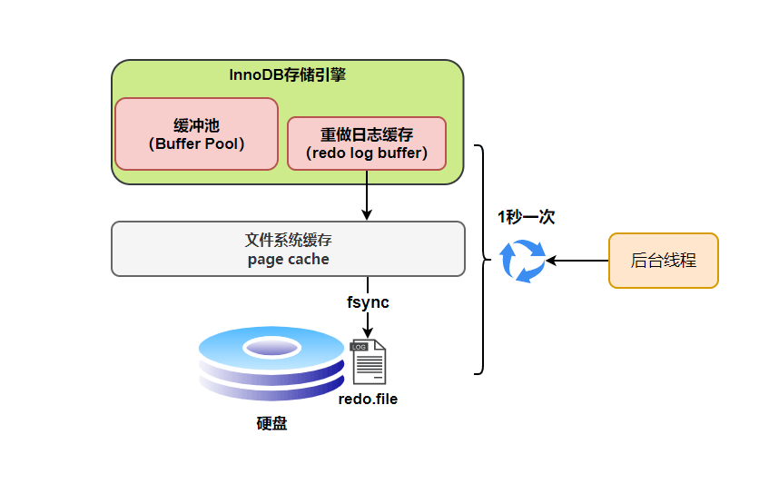
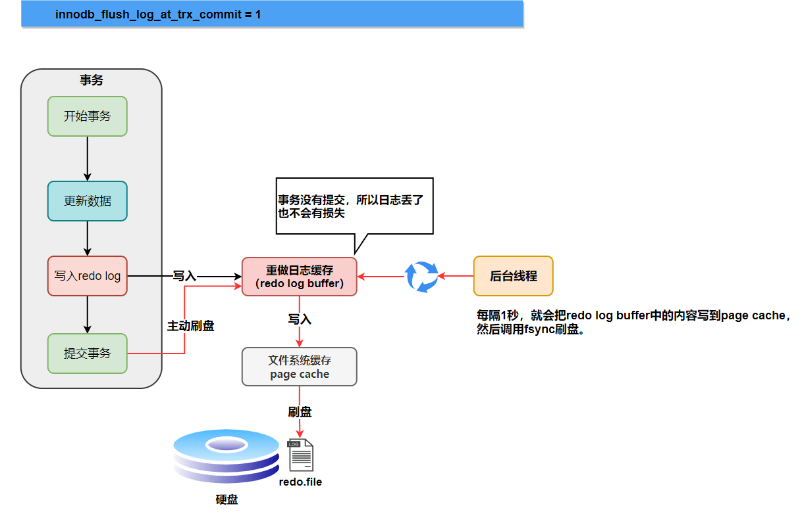
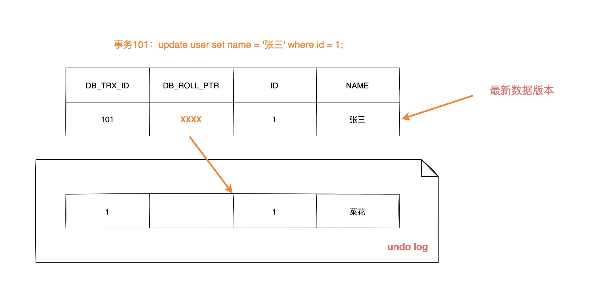
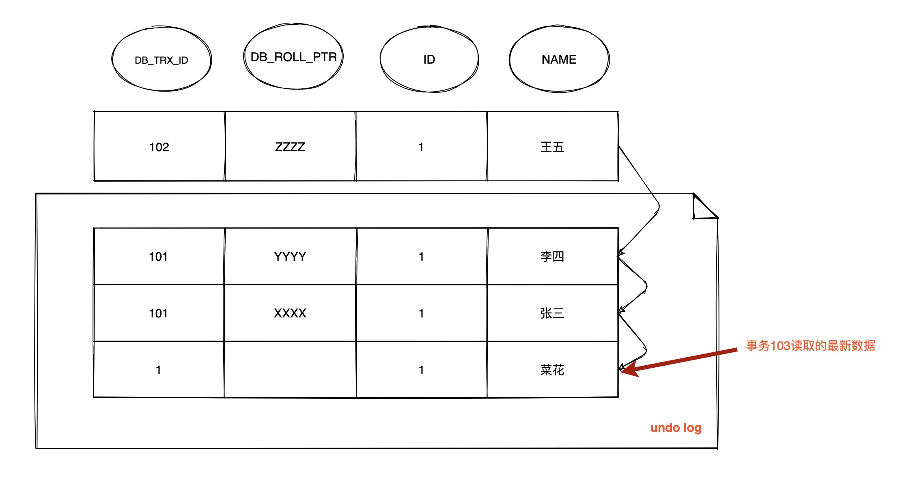
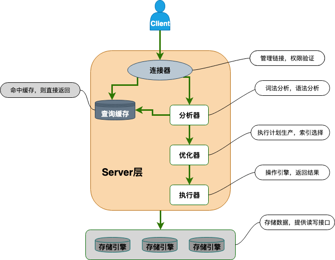

# 索引

索引是一种用于快速查询和检索数据的数据结构。常见的索引结构有: B 树， B+ 树和 Hash。

## 索引的优缺点

**优点** ：

- 使用索引可以大大加快 数据的检索速度（大大减少检索的数据量）, 这也是创建索引的最主要的原因。
- 通过创建唯一性索引，可以保证数据库表中每一行数据的唯一性。

**缺点** ：

- 创建索引和维护索引需要耗费许多时间。当对表中的数据进行增删改的时候，如果数据有索引，那么索引也需要动态的修改，会降低 SQL 执行效率。
- 索引需要使用物理文件存储，也会耗费一定空间。

但是，**使用索引一定能提高查询性能吗?**

大多数情况下，索引查询都是比全表扫描要快的。但是如果数据库的数据量不大，那么使用索引也不一定能够带来很大提升。

## 为什么 Mysql 没有使用 hash 作为其存储结构

**1.Hash 冲突问题** ：我们上面也提到过 Hash 冲突了，不过对于数据库来说这还不算最大的缺点。

**2.Hash 索引不支持顺序和范围查询(Hash 索引不支持顺序和范围查询是它最大的缺点：** 假如我们要对表中的数据进行排序或者进行范围查询，那 Hash 索引可就不行了。

试想一种情况:

```java
SELECT * FROM tb1 WHERE id < 500;
```

在这种范围查询中，B+ 树和优势非常大，直接遍历比 500 小的叶子节点就够了。而 Hash 索引是根据 hash 算法来定位的，难不成还要把 1 - 499 的数据，每个都进行一次 hash 计算来定位吗?这就是 Hash 最大的缺点了。

## B 树和 B+ 树

B 树也称 B-树,全称为 **多路平衡查找树** ，B+ 树是 B 树的一种变体。B 树和 B+树中的 B 是 `Balanced` （平衡）的意思。

目前大部分数据库系统及文件系统都采用 B-Tree 或其变种 B+Tree 作为索引结构。

### B 树 & B+树两者有何异同呢？

- B 树的所有节点既存放键(key) 也存放 数据(data)，而 B+ 树只有叶子节点存放 key 和 data，其他内节点只存放 key。
- B 树的叶子节点都是独立的;B+树的叶子节点有一条引用链指向与它相邻的叶子节点。
- B 树的检索的过程相当于对范围内的每个节点的关键字做二分查找，可能还没有到达叶子节点，检索就结束了。而 B+ 树的检索效率就很稳定了，任何查找都是从根节点到叶子节点的过程，叶子节点的顺序检索很明显。


在 MySQL 中，MyISAM 引擎和 InnoDB 引擎都是使用 B+ Tree 作为索引结构，但是，两者的实现方式不太一样。（下面的内容整理自《Java 工程师修炼之道》）

MyISAM 引擎中，B+ Tree 叶节点的 data 域存放的是**数据记录的地址**。在索引检索的时候，首先按照 B+Tree 搜索算法搜索索引，如果指定的 Key 存在，则取出其 data 域的值，然后以 data 域的值为地址读取相应的数据记录。这被称为“非聚簇索引”。

InnoDB 引擎中，**其数据文件本身就是索引文件**。相比 MyISAM，索引文件和数据文件是分离的，其表数据文件本身就是按 B+Tree 组织的一个索引结构，树的叶节点 data 域保存了完整的数据记录。这个索引的 key 是数据表的主键，因此 InnoDB 表数据文件本身就是主索引。这被称为“聚簇索引（或聚集索引）”，而其余的索引都作为辅助索引，**辅助索引的 data 域存储相应记录主键的值而不是地址**，这也是和 MyISAM 不同的地方。在根据主索引搜索时，直接找到 key 所在的节点即可取出数据；**在根据辅助索引查找时，则需要先取出主键的值，再走一遍主索引。** 因此，在设计表的时候，不建议使用过长的字段作为主键，也不建议使用非单调的字段作为主键，这样会造成主索引频繁分裂。

### 总结

|                    | MyISAM                                                       | InnoDB                                                       |
| ------------------ | ------------------------------------------------------------ | ------------------------------------------------------------ |
| 数据文件和索引文件 | 数据文件和索引文件单独存储                                   | 数据文件本身是按照索引结构进行存储的                         |
| 节点中存储的值     | 节点中存储的 data 域是对应记录在数据文件中的地址             | 结点中的 data 域是对应记录的主键                             |
| 查找过程           | 首先找到对应数据的 data 域，然后根据 data 域中地址查找出数据, 时间复杂度：$\log N$ | 首先找到对应数据中 data 域，根据里面的主键再次进行查找，时间复杂度：$\log N$ |

## 索引类型

### 主键索引

数据表的主键列使用的就是主键索引。

一张数据表有只能有一个主键，并且主键不能为 null，不能重复。

在 MySQL 的 InnoDB 的表中，当没有显示的指定表的主键时，InnoDB 会自动先检查表中是否有唯一索引且不允许存在null值的字段，如果有，则选择该字段为默认的主键，否则 InnoDB 将会自动创建一个 6 Byte 的自增主键。

### 二级索引(辅助索引)

**二级索引又称为辅助索引，是因为二级索引的叶子节点存储的数据是主键。也就是说，通过二级索引，可以定位主键的位置。**

唯一索引，普通索引，前缀索引等索引属于二级索引。

**PS:不懂的同学可以暂存疑，慢慢往下看，后面会有答案的，也可以自行搜索。**

1. **唯一索引(Unique Key)** ：唯一索引也是一种约束。**唯一索引的属性列不能出现重复的数据，但是允许数据为 NULL，一张表允许创建多个唯一索引。** 建立唯一索引的目的大部分时候都是为了该属性列的数据的唯一性，而不是为了查询效率。
2. **普通索引(Index)** ：**普通索引的唯一作用就是为了快速查询数据，一张表允许创建多个普通索引，并允许数据重复和 NULL。**
3. **前缀索引(Prefix)** ：前缀索引只适用于字符串类型的数据。前缀索引是对文本的前几个字符创建索引，相比普通索引建立的数据更小， 因为只取前几个字符。
4. **全文索引(Full Text)** ：全文索引主要是为了检索大文本数据中的关键字的信息，是目前搜索引擎数据库使用的一种技术。Mysql5.6 之前只有 MYISAM 引擎支持全文索引，5.6 之后 InnoDB 也支持了全文索引


## 聚集索引与非聚集索引

### 聚集索引

**聚集索引即索引结构和数据一起存放的索引。主键索引属于聚集索引。**

在 Mysql 中，InnoDB 引擎的表的 `.ibd` 文件就包含了该表的索引和数据，对于 InnoDB 引擎表来说，该表的索引(B+树)的每个非叶子节点存储索引，叶子节点存储索引和索引对应的数据。

#### 聚集索引的优点

聚集索引的查询速度非常的快，因为整个 B+ 树本身就是一颗多叉平衡树，叶子节点也都是有序的，定位到索引的节点，就相当于定位到了数据。

#### 聚集索引的缺点

1. **依赖于有序的数据** ：因为 B+ 树是多路平衡树，如果索引的数据不是有序的，那么就需要在插入时排序，如果数据是整型还好，否则类似于字符串或 UUID 这种又长又难比较的数据，插入或查找的速度肯定比较慢。
2. **更新代价大** ： 如果对索引列的数据被修改时，那么对应的索引也将会被修改，而且聚集索引的叶子节点还存放着数据，修改代价肯定是较大的，所以对于主键索引来说，主键一般都是不可被修改的。

### 非聚集索引

**非聚集索引即索引结构和数据分开存放的索引。**

**二级索引属于非聚集索引。**

> MYISAM 引擎的表的.MYI 文件包含了表的索引， 该表的索引(B+树)的每个叶子非叶子节点存储索引， 叶子节点存储索引和索引对应数据的指针，指向.MYD 文件的数据。
>
> **非聚集索引的叶子节点并不一定存放数据的指针， 因为二级索引的叶子节点就存放的是主键，根据主键再回表查数据。**

#### 非聚集索引的优点

**更新代价比聚集索引要小** 。非聚集索引的更新代价就没有聚集索引那么大了，非聚集索引的叶子节点是不存放数据的

#### 非聚集索引的缺点

1. 跟聚集索引一样，非聚集索引也依赖于有序的数据
2. **可能会二次查询(回表)** :这应该是非聚集索引最大的缺点了。 当查到索引对应的指针或主键后，可能还需要根据指针或主键再到数据文件或表中查询。

这是 MySQL 的表的文件截图:


聚集索引和非聚集索引:


### 非聚集索引一定回表查询吗(覆盖索引)?

**非聚集索引不一定回表查询。**

> 试想一种情况，用户准备使用 SQL 查询用户名，而用户名字段正好建立了索引。

```sql
 SELECT name FROM table WHERE name='guang19';
```

> 那么这个索引的 key 本身就是 name，查到对应的 name 直接返回就行了，无需回表查询。

**即使是 MYISAM 也是这样，虽然 MYISAM 的主键索引确实需要回表， 因为它的主键索引的叶子节点存放的是指针。但是如果 SQL 查的就是主键呢?**

```text
SELECT id FROM table WHERE id=1;
```

主键索引本身的 key 就是主键，查到返回就行了。这种情况就称之为覆盖索引了。即：查询的字段是构建索引的字段时，不需要回表查询

## 覆盖索引

**如果一个索引包含（或者说覆盖）所有需要查询的字段的值，我们就称之为“覆盖索引”。**我们知道在 InnoDB 存储引擎中，如果不是主键索引，叶子节点存储的是 `列值+主键`。最终还是要“回表”，也就是要通过主键再查找一次。这样就会比较慢，覆盖索引就是把要查询出的列和索引是对应的，不做回表操作！

**覆盖索引即需要查询的字段正好是索引的字段，那么直接根据该索引，就可以查到数据了， 而无需回表查询。**

> 如主键索引，如果一条 SQL 需要查询主键，那么正好根据主键索引就可以查到主键。
>
> 再如普通索引，如果一条 SQL 需要查询 name，name 字段正好有索引， 那么直接根据这个索引就可以查到数据，也无需回表。

覆盖索引:


## 创建索引的注意事项

**1.选择合适的字段创建索引：**

- **不为 NULL 的字段** ：索引字段的数据应该尽量不为 NULL，因为对于数据为 NULL 的字段，数据库较难优化。如果字段频繁被查询，但又避免不了为 NULL，建议使用 0,1,true,false 这样语义较为清晰的短值或短字符作为替代。
- **被频繁查询的字段** ：我们创建索引的字段应该是查询操作非常频繁的字段。
- **被作为条件查询的字段** ：被作为 WHERE 条件查询的字段，应该被考虑建立索引。
- **频繁需要排序的字段** ：索引已经排序，这样查询可以利用索引的排序，加快排序查询时间。
- **被经常频繁用于连接的字段** ：经常用于连接的字段可能是一些外键列，对于外键列并不一定要建立外键，只是说该列涉及到表与表的关系。对于频繁被连接查询的字段，可以考虑建立索引，提高多表连接查询的效率。

**2.被频繁更新的字段应该慎重建立索引。**

虽然索引能带来查询上的效率，但是维护索引的成本也是不小的。 如果一个字段不被经常查询，反而被经常修改，那么就更不应该在这种字段上建立索引了。

**3.尽可能的考虑建立联合索引而不是单列索引。**

因为索引是需要占用磁盘空间的，可以简单理解为每个索引都对应着一颗 B+ 树。如果一个表的字段过多，索引过多，那么当这个表的数据达到一个体量后，索引占用的空间也是很多的，且修改索引时，耗费的时间也是较多的。如果是联合索引，多个字段在一个索引上，那么将会节约很大磁盘空间，且修改数据的操作效率也会提升。

**4.注意避免冗余索引** 。

冗余索引指的是索引的功能相同，能够命中索引(a, b)就肯定能命中索引(a) ，那么索引(a)就是冗余索引。如（name,city）和（name）这两个索引就是冗余索引，能够命中前者的查询肯定是能够命中后者的,**在大多数情况下，都应该尽量扩展已有的索引而不是创建新索引。**

**5.考虑在字符串类型的字段上使用前缀索引代替普通索引。**

前缀索引仅限于字符串类型，较普通索引会占用更小的空间，所以可以考虑使用前缀索引带替普通索引。

## 使用索引的一些建议

- 对于中到大型表，索引都是非常有效的，但是特大型表的话维护开销会很大，不适合建索引
- 避免 where 子句中对字段施加函数，这会造成无法命中索引。
- 在使用 InnoDB 时使用与业务无关的自增主键作为主键，即使用逻辑主键，而不要使用业务主键。
- 删除长期未使用的索引，不用的索引的存在会造成不必要的性能损耗 MySQL 5.7 可以通过查询 sys 库的 schema_unused_indexes 视图来查询哪些索引从未被使用
- 在使用 limit offset 查询缓慢时，可以借助索引来提高性能

## MySQL 如何为表字段添加索引？

1.添加 PRIMARY KEY（主键索引）

```sql
ALTER TABLE `table_name` ADD PRIMARY KEY ( `column` )
```

2.添加 UNIQUE(唯一索引)

```sqlite
ALTER TABLE `table_name` ADD UNIQUE ( `column` )
```

3.添加 INDEX(普通索引)

```sql
ALTER TABLE `table_name` ADD INDEX index_name ( `column` )
```

4.添加 FULLTEXT(全文索引)

```sql
ALTER TABLE `table_name` ADD FULLTEXT ( `column`)
```

5.添加多列索引 

```sql
ALTER TABLE `table_name` ADD INDEX index_name ( `column1`, `column2`, `column3` )
```

# Mysql 三大日志

`MySQL` 日志 主要包括错误日志、查询日志、慢查询日志、事务日志、二进制日志几大类。其中，比较重要的还要属二进制日志 `binlog`（归档日志）和事务日志 `redo log`（重做日志）和 `undo log`（回滚日志）。


今天就来聊聊 `redo log`（重做日志）、`bin log`（归档日志）、两阶段提交、`undo log` （回滚日志）。

## redo log(重做日志)

`redo log`（重做日志）是 `InnoDB` 存储引擎独有的，它让 `MySQL` 拥有了崩溃恢复能力。

比如 `MySQL` 实例挂了或宕机了，重启时，`InnoDB` 存储引擎会使用 `redo log` 恢复数据，保证数据的持久性与完整性。


`MySQL` 中数据是以页为单位，你查询一条记录，会从硬盘把一页的数据加载出来，加载出来的数据叫数据页，会放入到 `Buffer Pool` 中。

后续的查询都是先从 `Buffer Pool` 中找，没有命中再去硬盘加载，减少硬盘 `IO` 开销，提升性能。

更新表数据的时候，也是如此，发现 `Buffer Pool` 里存在要更新的数据，就直接在 `Buffer Pool` 里更新。

然后会把“在某个数据页上做了什么修改”记录到重做日志缓存（`redo log buffer`）里，接着刷盘到 `redo log` 文件里。


理想情况，事务一提交就会进行刷盘操作，但实际上，刷盘的时机是根据策略来进行的。

> 每条 redo 记录由“表空间号+数据页号+偏移量+修改数据长度+具体修改的数据”组成

### 刷盘时机

`InnoDB` 存储引擎为 `redo log` 的刷盘策略提供了 `innodb_flush_log_at_trx_commit` 参数，它支持三种策略：

- **0** ：设置为 0 的时候，表示每次事务提交时不进行刷盘操作
- **1** ：设置为 1 的时候，表示每次事务提交时都将进行刷盘操作（默认值）
- **2** ：设置为 2 的时候，表示每次事务提交时都只把 redo log buffer 内容写入 page cache

`innodb_flush_log_at_trx_commit` 参数默认为 1 ，也就是说当事务提交时会调用 `fsync` 对 redo log 进行刷盘

另外，`InnoDB` 存储引擎有一个后台线程，每隔 `1` 秒，就会把 `redo log buffer` 中的内容写到文件系统缓存（`page cache`），然后调用 `fsync` 刷盘。



也就是说，一个没有提交事务的 `redo log` 记录，也可能会刷盘。

**为什么呢？**

因为在事务执行过程 `redo log` 记录是会写入 `redo log buffer` 中，这些 `redo log` 记录会被后台线程刷盘。


除了后台线程每秒 `1` 次的轮询操作，还有一种情况，当 `redo log buffer` 占用的空间即将达到 `innodb_log_buffer_size` 一半的时候，后台线程会主动刷盘。

#### innodb_flush_log_at_trx_commit=0


为 `0` 时，如果 `MySQL` 挂了或宕机可能会有 `1` 秒数据的丢失。

#### innodb_flush_log_at_trx_commit=1



为 `1` 时， 只要事务提交成功，`redo log` 记录就一定在硬盘里，不会有任何数据丢失。

如果事务执行期间 `MySQL` 挂了或宕机，这部分日志丢了，但是事务并没有提交，所以日志丢了也不会有损失。

#### innodb_flush_log_at_trx_commit=2


为 `2` 时，只要事务提交成功，`redo log buffer` 中的内容只写入文件系统缓存（`page cache`）。

如果仅仅只是 `MySQL` 挂了不会有任何数据丢失，但是宕机可能会有 `1` 秒数据的丢失。

硬盘上存储的 `redo log` 日志文件不只一个，而是以一个**日志文件组**的形式出现的，每个的`redo`日志文件大小都是一样的。

### 日志文件组

比如可以配置为一组 `4` 个文件，每个文件的大小是 `1GB`，整个 `redo log` 日志文件组可以记录`4G`的内容。

它采用的是环形数组形式，从头开始写，写到末尾又回到头循环写，如下图所示。


在个**日志文件组**中还有两个重要的属性，分别是 `write pos、checkpoint`

- **write pos** 是当前记录的位置，一边写一边后移
- **checkpoint** 是当前要擦除的位置，也是往后推移

每次刷盘 `redo log` 记录到**日志文件组**中，`write pos` 位置就会后移更新。

每次 `MySQL` 加载**日志文件组**恢复数据时，会清空加载过的 `redo log` 记录，并把 `checkpoint` 后移更新。

`write pos` 和 `checkpoint` 之间的还空着的部分可以用来写入新的 `redo log` 记录。


如果 `write pos` 追上 `checkpoint` ，表示**日志文件组**满了，这时候不能再写入新的 `redo log` 记录，`MySQL` 得停下来，清空一些记录，把 `checkpoint` 推进一下。


### redo log 小结

相信大家都知道 `redo log` 的作用和它的刷盘时机、存储形式。

现在我们来思考一个问题： **只要每次把修改后的数据页直接刷盘不就好了，还有 `redo log` 什么事？**

它们不都是刷盘么？差别在哪里？

```java
1 Byte = 8bit
1 KB = 1024 Byte
1 MB = 1024 KB
1 GB = 1024 MB
1 TB = 1024 GB
```

实际上，数据页大小是 `16KB`，刷盘比较耗时，可能就修改了数据页里的几 `Byte` 数据，有必要把完整的数据页刷盘吗？

而且数据页刷盘是随机写，因为一个数据页对应的位置可能在硬盘文件的随机位置，所以性能是很差。

如果是写 `redo log`，一行记录可能就占几十 `Byte`，只包含表空间号、数据页号、磁盘文件偏移 量、更新值，再加上是顺序写，所以刷盘速度很快。

所以用 `redo log` 形式记录修改内容，性能会远远超过刷数据页的方式，这也让数据库的并发能力更强。

> 其实内存的数据页在一定时机也会刷盘，我们把这称为页合并，讲 `Buffer Pool` 的时候会对这块细说

## binlog(归档日志)

`redo log` 它是物理日志，记录内容是“在某个数据页上做了什么修改”，属于 `InnoDB` 存储引擎。

而 `binlog` 是逻辑日志，记录内容是语句的原始逻辑，类似于“给 ID=2 这一行的 c 字段加 1”，属于 `MySQL Server` 层。

不管用什么存储引擎，只要发生了表数据更新，都会产生 `binlog` 日志。

那 `binlog` 到底是用来干嘛的？

可以说 `MySQL` 数据库的**数据备份、主备、主主、主从**都离不开 `binlog`，需要依靠`binlog`来同步数据，保证数据一致性。


`binlog`会记录所有涉及更新数据的逻辑操作，并且是顺序写。

### 记录格式

`binlog` 日志有三种格式，可以通过 `binlog_format` 参数指定。

- **statement**
- **row**
- **mixed**

指定 `statement`，记录的内容是 `SQL` 语句原文，比如执行一条 `update T set update_time=now() where id=1`，记录的内容如下。


同步数据时，会记录执行的 `SQL` 语句，但是有个问题，`update_time=now()` 这里会获取当前系统时间，直接执行会导致与原库的数据不一致。

为了解决这种问题，我们需要指定格式为 `row`，记录的内容不再是简单的 `SQL` 语句了，还包含操作的具体数据，记录内容如下。


`row` 格式记录的内容看不到详细信息，要通过 `mysqlbinlog` 工具解析出来。

`update_time=now()`变成了具体的时间`update_time=1627112756247`，条件后面的@1、@2、@3 都是该行数据第 1 个~3 个字段的原始值（**假设这张表只有 3 个字段**）。

这样就能保证同步数据的一致性，通常情况下都是指定为`row`，这样可以为数据库的恢复与同步带来更好的可靠性。

但是这种格式，需要更大的容量来记录，比较占用空间，恢复与同步时会更消耗`IO`资源，影响执行速度。

所以就有了一种折中的方案，指定为 `mixed`，记录的内容是前两者的混合。

`MySQL`会判断这条 `SQL` 语句是否可能引起数据不一致，如果是，就用 `row` 格式，否则就用 `statement` 格式。

### 写入机制

`binlog`的写入时机也非常简单，事务执行过程中，先把日志写到 `binlog cache`，事务提交的时候，再把 `binlog cache`写到 `binlog` 文件中。

**因为一个事务的 `binlog` 不能被拆开，无论这个事务多大，也要确保一次性写入，所以系统会给每个线程分配一个块内存作为`binlog cache`。**

我们可以通过`binlog_cache_size`参数控制单个线程 `binlog cache` 大小，如果存储内容超过了这个参数，就要暂存到磁盘（`Swap`）。

`binlog`日志刷盘流程如下


- **上图的 write，是指把日志写入到文件系统的 page cache，并没有把数据持久化到磁盘，所以速度比较快**
- **上图的 fsync，才是将数据持久化到磁盘的操作**

`write` 和 `fsync` 的时机，可以由参数 `sync_binlog` 控制，默认是 `0`。

为 `0` 的时候，表示每次提交事务都只`write`，由系统自行判断什么时候执行`fsync`。


虽然性能得到提升，但是机器宕机，`page cache` 里面的 binlog 会丢失。

为了安全起见，可以设置为 `1`，表示每次提交事务都会执行 `fsync`，就如同 **redo log 日志刷盘流程** 一样。

最后还有一种折中方式，可以设置为 `N(N>1)`，表示每次提交事务都 `write`，但累积 `N` 个事务后才 `fsync`。


在出现 `IO` 瓶颈的场景里，将 `sync_binlog` 设置成一个比较大的值，可以提升性能。

同样的，如果机器宕机，会丢失最近 `N` 个事务的 `binlog` 日志。

## 两阶段提交

`redo log`（重做日志）让 `InnoDB` 存储引擎拥有了崩溃恢复能力。

`binlog`（归档日志）保证了 `MySQL` 集群架构的数据一致性。

虽然它们都属于持久化的保证，但是侧重点不同。

在执行更新语句过程，会记录 `redo log` 与 `binlog` 两块日志，**以基本的事务为单位**，`redo log` 在事务执行过程中可以不断写入，而 `binlog` 只有在提交事务时才写入，所以 `redo log` 与 `binlog` 的写入时机不一样。


回到正题，`redo log` 与 `binlog` 两份日志之间的逻辑不一致，会出现什么问题？

我们以 `update` 语句为例，假设 `id=2` 的记录，字段 `c` 值是 `0`，把字段 `c` 值更新成 `1`，`SQL` 语句为 `update T set c=1 where id=2`。

假设执行过程中写完 `redo log` 日志后，`binlog` 日志写期间发生了异常，会出现什么情况呢？


由于 `binlog` 没写完就异常，这时候 `binlog` 里面没有对应的修改记录。因此，之后用 `binlog` 日志恢复数据时，就会少这一次更新，恢复出来的这一行 `c` 值是 `0`，而原库因为 `redo log` 日志恢复，这一行 `c` 值是 `1`，最终数据不一致。


为了解决两份日志之间的逻辑一致问题，`InnoDB` 存储引擎使用**两阶段提交**方案。

原理很简单，将 `redo log` 的写入拆成了两个步骤 `prepare` 和 `commit`，这就是**两阶段提交**。


使用**两阶段提交**后，写入 `binlog` 时发生异常也不会有影响，因为 `MySQL` 根据 `redo log` 日志恢复数据时，发现 `redo log` 还处于 `prepare` 阶段，并且没有对应 `binlog` 日志，就会回滚该事务。


再看一个场景，`redo log` 设置 `commit` 阶段发生异常，那会不会回滚事务呢？


并不会回滚事务，它会执行上图框住的逻辑，虽然 `redo log` 是处于 `prepare` 阶段，但是能通过事务 `id` 找到对应的 `binlog` 日志，所以 `MySQL` 认为是完整的，就会提交事务恢复数据。

```ad-info
title: 总结
提交事务时，首先写 redo log, 将其设置为 prepare 阶段；然后写 binlog；最后将 redo log 置为 commit 阶段。

根据两阶段提交的逻辑，只要写入 binlog 成功，那么就不用管 redo log 是否处于 commit 阶段了。一切以 binlog 为准。
```

## undo log(回滚日志)

我们知道如果想要保证事务的原子性，就需要在异常发生时，对已经执行的操作进行**回滚**，在 MySQL 中，恢复机制是通过 **回滚日志（undo log）** 实现的，**所有事务进行的修改都会先记录到这个回滚日志中，然后再执行相关的操作**。如果执行过程中遇到异常的话，我们直接利用 **回滚日志** 中的信息将数据回滚到修改之前的样子即可！并且，**回滚日志会先于数据持久化到磁盘上**。这样就保证了即使遇到数据库突然宕机等情况，当用户再次启动数据库的时候，数据库还能够通过查询回滚日志来回滚将之前未完成的事务。

另外，`MVCC` 的实现依赖于：**隐藏字段、Read View、undo log**。在内部实现中，`InnoDB` 通过数据行的 `DB_TRX_ID` 和 `Read View` 来判断数据的可见性，如不可见，则通过数据行的 `DB_ROLL_PTR` 找到 `undo log` 中的历史版本。每个事务读到的数据版本可能是不一样的，**在同一个事务中，用户只能看到该事务创建 `Read View` 之前已经提交的修改和该事务本身做的修改**

## 总结

MySQL InnoDB 引擎使用 **redo log(重做日志)** 保证事务的**持久性**，使用 **undo log(回滚日志)** 来保证事务的**原子性**。

`MySQL`数据库的**数据备份、主备、主主、主从**都离不开 `binlog`，需要依靠 `binlog` 来同步数据，保证数据一致性。

# 事务

### 事务的特性(ACID)


1. **原子性：** 事务是最小的执行单位，不允许分割。事务的原子性确保动作要么全部完成，要么完全不起作用；
2. **一致性：** 执行事务前后，数据保持一致，例如转账业务中，无论事务是否成功，转账者和收款人的总额应该是不变的；
3. **隔离性：** 并发访问数据库时，一个用户的事务不被其他事务所干扰，各并发事务之间数据库是独立的；
4. **持久性：** 一个事务被提交之后。它对数据库中数据的改变是持久的，即使数据库发生故障也不应该对其有任何影响。

原子性，隔离性和持久性都是为了保证数据的一致性。

### 并发事务带来的问题

在典型的应用程序中，多个事务并发运行，经常会操作相同的数据来完成各自的任务（多个用户对统一数据进行操作）。并发虽然是必须的，但可能会导致以下的问题。

- **脏读（Dirty read）:** 当一个事务正在访问数据并且对数据进行了修改，而这种修改还没有提交到数据库中，这时另外一个事务也访问了这个数据，然后使用了这个数据。因为这个数据是还没有提交的数据，那么另外一个事务读到的这个数据是“脏数据”，依据“脏数据”所做的操作可能是不正确的。**简单的说就是一个事务读取到了另一个未提交事务中的数据**
- **丢失修改（Lost to modify）:** 指在一个事务读取一个数据时，另外一个事务也访问了该数据，那么在第一个事务中修改了这个数据后，第二个事务也修改了这个数据。这样第一个事务内的修改结果就被丢失，因此称为丢失修改。 例如：事务1读取某表中的数据A=20，事务2也读取A=20，事务1修改A=A-1，事务2也修改A=A-1，最终结果A=19，事务1的修改被丢失。
- **不可重复读（Unrepeatableread）:** 指在一个事务内多次读同一数据。在这个事务还没有结束时，另一个事务也访问该数据。那么，在第一个事务中的两次读数据之间，由于第二个事务的修改导致第一个事务两次读取的数据可能不太一样。这就发生了在一个事务内两次读到的数据是不一样的情况，因此称为不可重复读。
- **幻读（Phantom read）:** 幻读与不可重复读类似。它发生在一个事务（T1）读取了几行数据，接着另一个并发事务（T2）插入了一些数据时。在随后的查询中，第一个事务（T1）就会发现多了一些原本不存在的记录，就好像发生了幻觉一样，所以称为幻读。

**不可重复度和幻读区别：**

不可重复读的重点是修改，幻读的重点在于新增或者删除。

例1（同样的条件, 你读取过的数据, 再次读取出来发现值不一样了 ）：事务1中的 A 先生读取自己的工资为 1000 的操作还没完成，事务 2 中的 B 先生就修改了 A 的工资为 2000，导致 A 再读自己的工资时工资变为 2000；这就是不可重复读。

例2（同样的条件, 第 1 次和第 2 次读出来的记录数不一样 ）：假某工资单表中工资大于 3000 的有 4 人，事务 1 读取了所有工资大于 3000 的人，共查到 4 条记录，这时事务 2 又插入了一条工资大于 3000 的记录，事务 1 再次读取时查到的记录就变为了 5 条，这样就导致了幻读。

### 事务隔离级别

**SQL 标准定义了四个隔离级别：**

- **READ-UNCOMMITTED(读取未提交)：** 最低的隔离级别，允许读取尚未提交的数据变更，**可能会导致脏读、幻读或不可重复读**。
- **READ-COMMITTED(读取已提交)：** 允许读取并发事务已经提交的数据，**可以阻止脏读，但是幻读或不可重复读仍有可能发生**。
- **REPEATABLE-READ(可重复读)：** 对同一字段的多次读取结果都是一致的，除非数据是被本身事务自己所修改，**可以阻止脏读和不可重复读，但幻读仍有可能发生**。
- **SERIALIZABLE(可串行化)：** 最高的隔离级别，完全服从 ACID 的隔离级别。所有的事务依次逐个执行，这样事务之间就完全不可能产生干扰，也就是说，**该级别可以防止脏读、不可重复读以及幻读**。

------

|     隔离级别     | 脏读 | 不可重复读 | 幻影读 |
| :--------------: | :--: | :--------: | :----: |
| READ-UNCOMMITTED |  √   |     √      |   √    |
|  READ-COMMITTED  |  ×   |     √      |   √    |
| REPEATABLE-READ  |  ×   |     ×      |   √    |
|   SERIALIZABLE   |  ×   |     ×      |   ×    |

MySQL InnoDB 存储引擎的默认支持的隔离级别是 **REPEATABLE-READ（可重读）**。我们可以通过 `SELECT @@tx_isolation;` 命令来查看，MySQL 8.0 该命令改为 `SELECT @@transaction_isolation;`

**MySQL InnoDB 的 REPEATABLE-READ（可重读）并不保证避免幻读，需要应用使用加锁读来保证。而这个加锁读使用到的机制就是 Next-Key Locks。**

因为隔离级别越低，事务请求的锁越少，所以大部分数据库系统的隔离级别都是 **READ-COMMITTED(读取提交内容)** ，但是你要知道的是 InnoDB 存储引擎默认使用 **REPEATABLE-READ（可重读）** 并不会有任何性能损失。

InnoDB 存储引擎在 **分布式事务** 的情况下一般会用到 **SERIALIZABLE(可串行化)** 隔离级别。

> InnoDB 存储引擎提供了对 XA 事务的支持，并通过 XA 事务来支持分布式事务的实现。分布式事务指的是允许多个独立的事务资源（transactional resources）参与到一个全局的事务中。事务资源通常是关系型数据库系统，但也可以是其他类型的资源。全局事务要求在其中的所有参与的事务要么都提交，要么都回滚，这对于事务原有的 ACID 要求又有了提高。另外，在使用分布式事务时，InnoDB 存储引擎的事务隔离级别必须设置为 SERIALIZABLE。

幻读和不可重复读有些相似之处，但是不可重复读的重点是修改，幻读的重点在于新增或者删除。

# InnoDB 存储引擎对 MVCC 的实现

## MVCC 的作用

MVCC 主要是为了提高数据库并发性能，用更好的方式去处理读写冲突，做到即使有读写冲突时，也能做到不加锁，**非阻塞并发读**。

## InnoDB 中的锁

- Record Lock: 行锁。只锁住某一行数据
- Gap Lock: 间隙锁。锁住一定的范围，但不包括记录本身
- Next-key Lock: record + Gap。锁住一定的范围包括记录本身,该锁的目的是为了解决可重复读隔离级别下的幻读的问题。其实还是不能够完全解决，例如：在事务 A 中使用 update 语句更新 id = 5 的记录，而事务 B 在 update 语句之前插入一条 id = 5 的语句并提交，此时事务 A 再执行 select 语句就会出现幻读的现象，避免幻读最好的方式就是在事务开始时就使用当前读的 sql 语句，开启间隙锁，从而避免因其他事务插入或者删除记录导致的幻读现象

InnoDB 对于行的查询使用 Next-key Lock，当查询的索引具有唯一属性时，Next-Key Lock 降级为 Record Lock

#### 行锁的实现方式

在 MySQL 中，行级锁并不是直接锁记录，而是锁索引。索引分为主键索引和非主键索引两种，如果一条 SQL 语句操作了主键索引，MySQL 就会锁定这条主键索引；如果一条语句操作了非主键索引，MySQL 会先锁定该非主键索引，再锁定相关的主键索引。在 UPDATE、DELETE 操作时，MySQL 不仅锁定 WHERE 条件扫描过的所有索引记录，而且会锁定相邻的键值，即所谓的next-key locking。

## 一致性非锁定读和锁定读

### 一致性非锁定读

对于 [一致性非锁定读（Consistent Nonlocking Reads)](https://dev.mysql.com/doc/refman/5.7/en/innodb-consistent-read.html) 的实现，通常做法是加一个版本号或者时间戳字段，在更新数据的同时版本号 + 1 或者更新时间戳。查询时，将当前可见的版本号与对应记录的版本号进行比对，如果记录的版本小于可见版本，则表示该记录可见

在 `InnoDB` 存储引擎中，[多版本控制 (multi versioning)](https://dev.mysql.com/doc/refman/5.7/en/innodb-multi-versioning.html) 就是对非锁定读的实现。如果读取的行正在执行 `DELETE` 或 `UPDATE` 操作，这时读取操作不会去等待行上锁的释放。相反地，`InnoDB` 存储引擎会去读取行的一个快照数据，对于这种读取历史数据的方式，我们叫它快照读 (snapshot read)

在 `Repeatable Read` 和 `Read Committed` 两个隔离级别下，如果是执行普通的 `select` 语句（不包括 `select ... lock in share mode` ,`select ... for update`）则会使用 `一致性非锁定读（MVCC）`。并且在 `Repeatable Read` 下 `MVCC` 实现了可重复读和防止部分幻读

### 锁定读

如果执行的是下列语句，就是 [锁定读（Locking Reads)](https://dev.mysql.com/doc/refman/5.7/en/innodb-locking-reads.html)

- `select ... lock in share mode`
- `select ... for update`
- `insert`、`update`、`delete` 操作

在锁定读下，读取的是数据的最新版本，这种读也被称为 `当前读（current read）`。锁定读会对读取到的记录加锁：

- `select ... lock in share mode`：对记录加 `S` 锁，其它事务也可以加 `S` 锁，如果加 `x` 锁则会被阻塞
- `select ... for update`、`insert`、`update`、`delete`：对记录加 `X` 锁，且其它事务不能加任何锁

在一致性非锁定读下，即使读取的记录已被其它事务加上 `X` 锁，这时记录也是可以被读取的，即读取的快照数据。上面说了，在 `Repeatable Read` 下 `MVCC` 防止了部分幻读，这边的 “部分” 是指在 `一致性非锁定读` 情况下，**只能读取到第一次查询之前所插入的数据**（根据 Read View 判断数据可见性，Read View 在第一次查询时生成）。但是！如果是 `当前读` ，每次读取的都是最新数据，这时如果两次查询中间有其它事务插入数据，就会产生幻读。所以， **`InnoDB` 在实现 `Repeatable Read` 时，如果执行的是当前读，则会对读取的记录使用 `Next-key Lock` ，来防止其它事务在间隙间插入数据**

## 快照读

即不加锁的非阻塞读，快照读的前提是隔离级别不是串行级别，串行级别下的快照读会退化成当前读。快照读的实现是基于多版本并发控制，即 MVCC, **可以认为 MVCC 是行锁的一个变种**，但它在很多情况下，避免了加锁操作，降低了开销；既然是基于多版本，即快照读可能读到的并不一定是数据的最新版本，而有可能是之前的历史版本

## InnoDB 对 MVCC 的实现

`MVCC` 的实现依赖于：**隐藏字段、Read View、undo log**。在内部实现中，`InnoDB` 通过数据行的 `DB_TRX_ID` 和 `Read View` 来判断数据的可见性，如不可见，则通过数据行的 `DB_ROLL_PTR` 找到 `undo log` 中的历史版本。每个事务读到的数据版本可能是不一样的，在同一个事务中，用户只能看到该事务创建 `Read View` 之前已经提交的修改和该事务本身做的修改

**MVCC 可以保证并发的读，但是不保证读取的数据是最新的数据，因此如果要并发的对同一个数据行进行更新操作，需要进行额外的控制，如在表中加上一个版本字段, 版本号只增不减。**

### 事务 ID

trx_id 是 Innodb 中标识一个事务的 id，是一个 6 字节长度的整数。这个 id 的值来源于 Innodb 维护的 max_trx_id, 当需要申请一个新的 trx_id 值时，就获取 max_trx_id 的最新值，然后将 max_trx_id 值加 1。

max_trx_id 和 row_id 类似，存储时使用数据类型是 8 字节，但是只使用其后 6 字节数据，当 max_trx_id 超过了 2 的 48 次方时，max_trx_id 的值，又会从 0 开始循环

#### 什么时候获取 trx_id?

事务启动的时机通常是在执行读取或者更新表操作的时候启动:

```sql
begin;
select trx_id from information_schema.INNODB_TRX; # 查不到 trx_id，值为空
select * from code_column_config;
select trx_id from information_schema.INNODB_TRX; # trx_id: 283345115223744
insert into code_column_config values(null)
select trx_id from information_schema.INNODB_TRX; # trx_id: 48245
```

这里有一个奇怪的现象，一个事务有两个不同的 trx_id， 而且第一个是一个比较大的值，第二个是一个相对较小的值？出现这个现象的原因，主要是因为 Innodb 的一个优化：max_trx_id 只会给更新事务分配 trx_id。

最开始的查询操作，事务中没有涉及到更新操作，此时的事务只是一个只读事务，因为只读事务不会对数据产生任何影响，事务 id 也没有太大的意义。所以对于只读事务 id 的分配，不会使用 max_trx_id 的值，也不会使 max_trx_id 的值自增。而这个很大的trx_id，是 Innodb 使用当前事务的 trx 变量的地址转换成整数，然后在加上 2 的 48 次方计算得来的。这种计算方式，计算出来的 trx_id 值会比较大，刚好可以和更新事务做区分，同时不同的事务 trx 变量的地址值也是不同的，所以只读事务 trx_id 一般情况下，也是不会相同。这种优化方案，可以减少 trx_id 申请的次数，所以 max_trx_id 增加的速度也就变慢了，同时也减少了 trx_id 申请过程中锁冲突的几率。

### 隐藏字段

在内部，`InnoDB` 存储引擎为每行数据添加了三个 [隐藏字段](https://dev.mysql.com/doc/refman/5.7/en/innodb-multi-versioning.html)：

- `DB_TRX_ID（6字节）`：表示最后一次插入或更新该行的事务 id。此外，`delete` 操作在内部被视为更新，只不过会在记录头 `Record header` 中的 `deleted_flag` 字段将其标记为已删除。**只要在事务执行的过程中插入或者更新了该行数据，那么该字段立马更新，不会等到事务结束之后在更新。**
- `DB_ROLL_PTR（7字节）` 回滚指针，指向该行的 `undo log`。如果该行未被更新，则为空
- `DB_ROW_ID（6字节）`：如果没有设置主键且该表没有唯一非空索引时，`InnoDB` 会使用该 id 来生成聚簇索引

### ReadView

```c++
class ReadView {
  /* ... */
private: // id 都是对同一行修改的事务 ID，创建快照后，ID 的值就不会变了
  trx_id_t m_low_limit_id;      /* 大于等于这个 ID 的事务均不可见 */

  trx_id_t m_up_limit_id;       /* 小于这个 ID 的事务均可见 */

  trx_id_t m_creator_trx_id;    /* 创建该 Read View 的事务ID */

  trx_id_t m_low_limit_no;      /* 事务 Number, 小于该 Number 的 Undo Logs 均可以被 Purge */

  ids_t m_ids;                  /* 创建 Read View 时的活跃事务列表 */

  m_closed;                     /* 标记 Read View 是否 close */
}
```

[`Read View`](https://github.com/facebook/mysql-8.0/blob/8.0/storage/innobase/include/read0types.h#L298) 主要是用来做可见性判断，里面保存了 “当前对本事务不可见的其他活跃事务”

主要有以下字段：

- `m_low_limit_id`：目前出现过的最大的事务 ID+1，即下一个将被分配的事务 ID。大于等于这个 ID 的数据版本均不可见
- `m_up_limit_id`：活跃事务列表 `m_ids` 中最小的事务 ID，如果 `m_ids` 为空，则 `m_up_limit_id` 为 `m_low_limit_id`。小于这个 ID 的数据版本均可见
- `m_ids`：`Read View` 创建时其他未提交的活跃事务 ID 列表。创建 `Read View` 时，将当前未提交事务 ID 记录下来，后续即使它们修改了记录行的值，对于当前事务也是不可见的。`m_ids` 不包括当前事务自己和已提交的事务（正在内存中）
- `m_creator_trx_id`：创建该 `Read View` 的事务 ID

**事务可见性示意图**（[图源](https://leviathan.vip/2019/03/20/InnoDB的事务分析-MVCC/#MVCC-1)）：


### undo-log

`undo log` 主要有两个作用：

- 当事务回滚时用于将数据恢复到修改前的样子
- 另一个作用是 `MVCC` ，当读取记录时，若该记录被其他事务占用或当前版本对该事务不可见，则可以通过 `undo log` 读取之前的版本数据，以此实现非锁定读

**在 `InnoDB` 存储引擎中 `undo log` 分为两种： `insert undo log` 和 `update undo log`：**

1. **`insert undo log`** ：指在 `insert` 操作中产生的 `undo log`。因为 `insert` 操作的记录只对事务本身可见，对其他事务不可见，故该 `undo log` 可以在事务提交后直接删除。不需要进行 `purge` 操作

**`insert` 时的数据初始状态：**


1. **`update undo log`** ：`update` 或 `delete` 操作中产生的 `undo log`。该 `undo log` 可能需要提供 `MVCC` 机制，因此不能在事务提交时就进行删除。提交时放入 `undo log` 链表，等待 `purge 线程` 进行最后的删除

**数据第一次被修改时：**



**数据第二次被修改时：**


不同事务或者相同事务的对同一记录行的修改，会使该记录行的 `undo log` 成为一条链表，链首就是最新的记录，链尾就是最早的旧记录。

### 数据可见性算法

在 `InnoDB` 存储引擎中，创建一个新事务后，执行每个 `select` 语句前，都会创建一个快照（Read View），**快照中保存了当前数据库系统中正处于活跃（没有 commit）的事务的 ID 号**。其实简单的说保存的是系统中当前不应该被本事务看到的其他事务 ID 列表（即 m_ids）。当用户在这个事务中要读取某个记录行的时候，`InnoDB` 会将该记录行的 `DB_TRX_ID` 与 `Read View` 中的一些变量及当前事务 ID 进行比较，判断是否满足可见性条件

[具体的比较算法](https://github.com/facebook/mysql-8.0/blob/8.0/storage/innobase/include/read0types.h#L161)如下：[图源](https://leviathan.vip/2019/03/20/InnoDB的事务分析-MVCC/#MVCC-1)


1. 如果记录 DB_TRX_ID < m_up_limit_id，那么表明最新修改该行的事务（DB_TRX_ID）在当前事务创建快照之前就提交了，所以该记录行的值对当前事务是可见的
2. 如果 DB_TRX_ID >= m_low_limit_id，那么表明最新修改该行的事务（DB_TRX_ID）在当前事务创建快照(Read View)之后才修改该行，所以该记录行的值对当前事务不可见。跳到步骤 5
3. m_ids 为空，则表明在当前事务创建快照之前，修改该行的事务就已经提交了，所以该记录行的值对当前事务是可见的
4. 如果 m_up_limit_id <= DB_TRX_ID < m_low_limit_id，表明最新修改该行的事务（DB_TRX_ID）在当前事务创建快照的时候可能处于“活动状态”或者“已提交状态”；所以就要对活跃事务列表 m_ids 进行查找（源码中是用的二分查找，因为是有序的）
   - 如果在活跃事务列表 m_ids 中能找到 DB_TRX_ID，表明：① 在当前事务创建快照前，该记录行的值被事务 ID 为 DB_TRX_ID 的事务修改了，但没有提交；或者 ② 在当前事务创建快照后，该记录行的值被事务 ID 为 DB_TRX_ID 的事务修改了。这些情况下，这个记录行的值对当前事务都是不可见的(用于实现可重复读)。跳到步骤 5
   - 在活跃事务列表中找不到，则表明“id 为 trx_id 的事务”在修改“该记录行的值”后，在“当前事务”创建快照前就已经提交了，所以记录行对当前事务可见
5. 在该记录行的 DB_ROLL_PTR 指针所指向的 `undo log` 取出快照记录，用快照记录的 DB_TRX_ID 跳到步骤 1 重新开始判断，直到找到满足的快照版本或返回空

## RC 和 RR 隔离级别下 MVCC 的差异

在事务隔离级别 `RC` 和 `RR` （InnoDB 存储引擎的默认事务隔离级别）下，`InnoDB` 存储引擎使用 `MVCC`（非锁定一致性读），但它们生成 `Read View` 的时机却不同

- 在 RC 隔离级别下的 **`每次select`** 查询前都生成一个 `Read View` (m_ids 列表)
- 在 RR 隔离级别下只在事务开始后 **`第一次select`** 数据前生成一个 `Read View`（m_ids 列表）

## MVCC 解决不可重复读问题

虽然 RC 和 RR 都通过 `MVCC` 来读取快照数据，但由于 **生成 Read View 时机不同**，从而在 RR 级别下实现可重复读

举个例子：


### 在 RC 下 ReadView 生成情况

1. **`假设时间线来到 T4 ，那么此时数据行 id = 1 的版本链为`：**

   

由于 RC 级别下每次查询都会生成 `Read View` ，并且事务 101、102 并未提交，此时 `103` 事务生成的 `Read View` 中活跃的事务 **`m_ids` 为：[101,102]** ，`m_low_limit_id`为：104，`m_up_limit_id` 为：101，`m_creator_trx_id` 为：103

- 此时最新记录的 `DB_TRX_ID` 为 101，m_up_limit_id <= 101 < m_low_limit_id，所以要在 `m_ids` 列表中查找，发现 `DB_TRX_ID` 存在列表中，那么这个记录不可见
- 根据 `DB_ROLL_PTR` 找到 `undo log` 中的上一版本记录，上一条记录的 `DB_TRX_ID` 还是 101，不可见
- 继续找上一条 `DB_TRX_ID`为 1，满足 1 < m_up_limit_id，可见，所以事务 103 查询到数据为 `name = 菜花`

1. **`时间线来到 T6 ，数据的版本链为`：**

   

因为在 RC 级别下，重新生成 `Read View`，这时事务 101 已经提交，102 并未提交，所以此时 `Read View` 中活跃的事务 **`m_ids`：[102]** ，`m_low_limit_id`为：104，`m_up_limit_id`为：102，`m_creator_trx_id`为：103

- 此时最新记录的 `DB_TRX_ID` 为 102，m_up_limit_id <= 102 < m_low_limit_id，所以要在 `m_ids` 列表中查找，发现 `DB_TRX_ID` 存在列表中，那么这个记录不可见
- 根据 `DB_ROLL_PTR` 找到 `undo log` 中的上一版本记录，上一条记录的 `DB_TRX_ID` 为 101，满足 101 < m_up_limit_id，记录可见，所以在 `T6` 时间点查询到数据为 `name = 李四`，与时间 T4 查询到的结果不一致，不可重复读！

1. **`时间线来到 T9 ，数据的版本链为`：**


重新生成 `Read View`， 这时事务 101 和 102 都已经提交，所以 **m_ids** 为空，则 m_up_limit_id = m_low_limit_id = 104，最新版本事务 ID 为 102，满足 102 < m_low_limit_id，可见，查询结果为 `name = 赵六`

> **总结：** **在 RC 隔离级别下，事务在每次查询开始时都会生成并设置新的 Read View，所以导致不可重复读**

### 在 RR 下 ReadView 生成情况

**在可重复读级别下，只会在事务开始后第一次读取数据时生成一个 Read View（m_ids 列表）**

1. **`在 T4 情况下的版本链为`：**


在当前执行 `select` 语句时生成一个 `Read View`，此时 **`m_ids`：[101,102]** ，`m_low_limit_id`为：104，`m_up_limit_id`为：101，`m_creator_trx_id` 为：103

此时和 RC 级别下一样：

- 最新记录的 `DB_TRX_ID` 为 101，m_up_limit_id <= 101 < m_low_limit_id，所以要在 `m_ids` 列表中查找，发现 `DB_TRX_ID` 存在列表中，那么这个记录不可见
- 根据 `DB_ROLL_PTR` 找到 `undo log` 中的上一版本记录，上一条记录的 `DB_TRX_ID` 还是 101，不可见
- 继续找上一条 `DB_TRX_ID`为 1，满足 1 < m_up_limit_id，可见，所以事务 103 查询到数据为 `name = 菜花`

1. **`时间点 T6 情况下`：**

   

   在 RR 级别下只会生成一次 `Read View`，所以此时依然沿用 **`m_ids` ：[101,102]** ，`m_low_limit_id` 为：104，`m_up_limit_id`为：101，`m_creator_trx_id` 为：103

- 最新记录的 `DB_TRX_ID` 为 102，m_up_limit_id <= 102 < m_low_limit_id，所以要在 `m_ids` 列表中查找，发现 `DB_TRX_ID` 存在列表中，那么这个记录不可见
- 根据 `DB_ROLL_PTR` 找到 `undo log` 中的上一版本记录，上一条记录的 `DB_TRX_ID` 为 101，不可见
- 继续根据 `DB_ROLL_PTR` 找到 `undo log` 中的上一版本记录，上一条记录的 `DB_TRX_ID` 还是 101，不可见
- 继续找上一条 `DB_TRX_ID`为 1，满足 1 < m_up_limit_id，可见，所以事务 103 查询到数据为 `name = 菜花`

1. **时间点 T9 情况下：**


此时情况跟 T6 完全一样，由于已经生成了 `Read View`，此时依然沿用 **`m_ids` ：[101,102]** ，所以查询结果依然是 `name = 菜花`

## MVCC + Next-key-Lock 防止幻读

`InnoDB` 存储引擎在 RR 级别下通过 `MVCC` 和 `Next-key Lock` 来解决幻读问题：

**1、执行普通 `select`，此时会以 `MVCC` 快照读的方式读取数据**

在快照读的情况下，RR 隔离级别只会在事务开启后的第一次查询生成 `Read View` ，并使用至事务提交。所以在生成 `Read View` 之后其它事务所做的更新、插入记录版本对当前事务并不可见，实现了可重复读和防止快照读下的 “幻读”

**2、执行 select...for update/lock in share mode、insert、update、delete 等当前读**

在当前读下，读取的都是最新的数据，如果其它事务有插入新的记录，并且刚好在当前事务查询范围内，就会产生幻读！`InnoDB` 使用 [Next-key Lock](https://dev.mysql.com/doc/refman/5.7/en/innodb-locking.html#innodb-next-key-locks) 来防止这种情况。当执行当前读时，在锁定读取到的记录的同时，锁定它们的间隙，防止其它事务在查询范围内插入数据。只要我不让你插入，就不会发生幻读

# Sql 语句的执行过程

## Mysql 基础架构分析

### MySQL 基本架构概览

下图是 MySQL 的一个简要架构图，从下图你可以很清晰的看到用户的 SQL 语句在 MySQL 内部是如何执行的。

先简单介绍一下下图涉及的一些组件的基本作用帮助大家理解这幅图，在 1.2 节中会详细介绍到这些组件的作用。

- **连接器：**身份认证和权限相关(登录 MySQL 的时候)。
- **查询缓存：**执行查询语句的时候，会先查询缓存（MySQL 8.0 版本后移除，因为这个功能不太实用）。
- **分析器：**没有命中缓存的话，SQL 语句就会经过分析器，分析器说白了就是要先看你的 SQL 语句要干嘛，再检查你的 SQL 语句语法是否正确。
- **优化器：**按照 MySQL 认为最优的方案去执行。



简单来说 MySQL 主要分为 Server 层和存储引擎层：

- **Server 层**：主要包括连接器、查询缓存、分析器、优化器、执行器等，所有跨存储引擎的功能都在这一层实现，比如存储过程、触发器、视图，函数等，还有一个通用的日志模块 binlog 日志模块。
- **存储引擎**： 主要负责数据的存储和读取，采用可以替换的插件式架构，支持 InnoDB、MyISAM、Memory 等多个存储引擎，其中 InnoDB 引擎有自有的日志模块 redolog 模块。**现在最常用的存储引擎是 InnoDB，它从 MySQL 5.5.5 版本开始就被当做默认存储引擎了。**

### Server 层基本组件介绍

#### 1) 连接器

连接器主要和身份认证和权限相关的功能相关，就好比一个级别很高的门卫一样。

主要负责用户登录数据库，进行用户的身份认证，包括校验账户密码，权限等操作，如果用户账户密码已通过，连接器会到权限表中查询该用户的所有权限，之后在这个连接里的权限逻辑判断都是会依赖此时读取到的权限数据，也就是说，**后续只要这个连接不断开，即使管理员修改了该用户的权限，该用户也是不受影响的**。

#### 2) 查询缓存(MySQL 8.0 版本后移除)

查询缓存主要用来缓存我们所执行的 SELECT 语句以及该语句的结果集。

连接建立后，执行查询语句的时候，会先查询缓存，MySQL 会先校验这个 sql 是否执行过，以 Key-Value 的形式缓存在内存中，Key 是查询预计，Value 是结果集。如果缓存 key 被命中，就会直接返回给客户端，如果没有命中，就会执行后续的操作，完成后也会把结果缓存起来，方便下一次调用。当然在真正执行缓存查询的时候还是会校验用户的权限，是否有该表的查询条件。

MySQL 查询不建议使用缓存，因为查询缓存失效在实际业务场景中可能会非常频繁，假如你对一个表更新的话，这个表上的所有的查询缓存都会被清空。对于不经常更新的数据来说，使用缓存还是可以的。

所以，一般在大多数情况下我们都是不推荐去使用查询缓存的。

MySQL 8.0 版本后删除了缓存的功能，官方也是认为该功能在实际的应用场景比较少，所以干脆直接删掉了。

#### 3) 分析器

MySQL 没有命中缓存，那么就会进入分析器，分析器主要是用来分析 SQL 语句是来干嘛的，分析器也会分为几步：

**第一步，词法分析**，一条 SQL 语句有多个字符串组成，首先要提取关键字，比如 select，提出查询的表，提出字段名，提出查询条件等等。做完这些操作后，就会进入第二步。

**第二步，语法分析**，主要就是判断你输入的 sql 是否正确，是否符合 MySQL 的语法。

完成这 2 步之后，MySQL 就准备开始执行了，但是如何执行，怎么执行是最好的结果呢？这个时候就需要优化器上场了。

#### 4) 优化器

优化器的作用就是它认为的最优的执行方案去执行（有时候可能也不是最优，这篇文章涉及对这部分知识的深入讲解），比如多个索引的时候该如何选择索引，多表查询的时候如何选择关联顺序等。

可以说，经过了优化器之后可以说这个语句具体该如何执行就已经定下来。

#### 5) 执行器

当选择了执行方案后，MySQL 就准备开始执行了，首先执行前会校验该用户有没有权限，如果没有权限，就会返回错误信息，如果有权限，就会去调用引擎的接口，返回接口执行的结果。

## 语句分析

### 查询语句

说了以上这么多，那么究竟一条 sql 语句是如何执行的呢？其实我们的 sql 可以分为两种，一种是查询，一种是更新（增加，更新，删除）。我们先分析下查询语句，语句如下：

```sql
select * from tb_student  A where A.age='18' and A.name=' 张三 ';
```

结合上面的说明，我们分析下这个语句的执行流程：

- 先检查该语句是否有权限，如果没有权限，直接返回错误信息，如果有权限，在 MySQL8.0 版本以前，会先查询缓存，以这条 sql 语句为 key 在内存中查询是否有结果，如果有直接缓存，如果没有，执行下一步。

- 通过分析器进行词法分析，提取 sql 语句的关键元素，比如提取上面这个语句是查询 select，提取需要查询的表名为 tb_student，需要查询所有的列，查询条件是这个表的 id='1'。然后判断这个 sql 语句是否有语法错误，比如关键词是否正确等等，如果检查没问题就执行下一步。

- 接下来就是优化器进行确定执行方案，上面的 sql 语句，可以有两种执行方案：

  ```
    a.先查询学生表中姓名为“张三”的学生，然后判断是否年龄是 18。
    b.先找出学生中年龄 18 岁的学生，然后再查询姓名为“张三”的学生。
  ```

  那么优化器根据自己的优化算法进行选择执行效率最好的一个方案（优化器认为，有时候不一定最好）。那么确认了执行计划后就准备开始执行了。

- 进行权限校验，如果没有权限就会返回错误信息，**如果有权限就会调用数据库引擎接口，返回引擎的执行结果**。

### 更新语句

以上就是一条查询 sql 的执行流程，那么接下来我们看看一条更新语句如何执行的呢？sql 语句如下：

```sql
update tb_student A set A.age='19' where A.name=' 张三 ';
```

我们来给张三修改下年龄，在实际数据库肯定不会设置年龄这个字段的，不然要被技术负责人打的。其实这条语句也基本上会沿着上一个查询的流程走，只不过执行更新的时候肯定要记录日志啦，这就会引入日志模块了，MySQL 自带的日志模块是 **binlog（归档日志）** ，所有的存储引擎都可以使用，我们常用的 InnoDB 引擎还自带了一个日志模块 **redo log（重做日志）**，我们就以 InnoDB 模式下来探讨这个语句的执行流程。流程如下：

- 先查询到张三这一条数据，如果有缓存，也是会用到缓存。
- 然后拿到查询的语句，把 age 改为 19，然后调用引擎 API 接口，写入这一行数据，InnoDB 引擎把数据保存在内存中，同时记录 redo log，此时 redo log 进入 prepare 状态，然后告诉执行器，执行完成了，随时可以提交。
- 执行器收到通知后记录 binlog，然后调用引擎接口，提交 redo log 为提交状态。
- 更新完成。

**这里肯定有同学会问，为什么要用两个日志模块，用一个日志模块不行吗?**

这是因为最开始 MySQL 并没有 InnoDB 引擎（InnoDB 引擎是其他公司以插件形式插入 MySQL 的），MySQL 自带的引擎是 MyISAM，但是我们知道 redo log 是 InnoDB 引擎特有的，其他存储引擎都没有，这就导致会没有 crash-safe 的能力(crash-safe 的能力即使数据库发生异常重启，之前提交的记录都不会丢失)，binlog 日志只能用来归档。

并不是说只用一个日志模块不可以，只是 InnoDB 引擎就是通过 redo log 来支持事务的。那么，又会有同学问，我用两个日志模块，但是不要这么复杂行不行，为什么 redo log 要引入 prepare 预提交状态？这里我们用反证法来说明下为什么要这么做？

- **先写 redo log 直接提交，然后写 binlog**，假设写完 redo log 后，机器挂了，binlog 日志没有被写入，那么机器重启后，这台机器会通过 redo log 恢复数据，但是这个时候 binlog 并没有记录该数据，后续进行机器备份的时候，就会丢失这一条数据，同时主从同步也会丢失这一条数据。
- **先写 binlog，然后写 redo log**，假设写完了 binlog，机器异常重启了，由于没有 redo log，本机是无法恢复这一条记录的，但是 binlog 又有记录，那么和上面同样的道理，就会产生数据不一致的情况。

如果采用 redo log 两阶段提交的方式就不一样了，写完 binlog 后，然后再提交 redo log 就会防止出现上述的问题，从而保证了数据的一致性。那么问题来了，有没有一个极端的情况呢？假设 redo log 处于预提交状态，binlog 也已经写完了，这个时候发生了异常重启会怎么样呢？ 这个就要依赖于 MySQL 的处理机制了，MySQL 的处理过程如下：

- 判断 redo log 是否完整，如果判断是完整的，就立即提交。
- 如果 redo log 只是预提交但不是 commit 状态，这个时候就会去判断 binlog 是否完整，如果完整就提交 redo log, 不完整就回滚事务。

这样就解决了数据一致性的问题。

## 总结

- MySQL 主要分为 Server 层和引擎层，Server 层主要包括连接器、查询缓存、分析器、优化器、执行器，同时还有一个日志模块（binlog），这个日志模块所有执行引擎都可以共用，**redolog 只有 InnoDB 有**。
- 引擎层是插件式的，目前主要包括，MyISAM,InnoDB,Memory 等。
- 查询语句的执行流程如下：权限校验（如果命中缓存）--->查询缓存--->分析器--->优化器--->权限校验--->执行器--->引擎
- 更新语句执行流程如下：分析器---->权限校验---->执行器--->引擎---redo log(prepare 状态)--->binlog--->redo log(commit状态)

# 数据库中存储时间的一点思考

### 切记不要用字符串存储日期

主要会有下面两个问题：

1. 字符串占用的空间更大！
2. 字符串存储的日期效率比较低（逐个字符进行比对），无法用日期相关的 API 进行计算和比较。

### Datetime 和 Timestamp 之间抉择

Datetime 和 Timestamp 是 MySQL 提供的两种比较相似的保存时间的数据类型。他们两者究竟该如何选择呢？

**通常我们都会首选 Timestamp。** 下面说一下为什么这样做!

#### DateTime 类型没有时区信息

**DateTime 类型是没有时区信息的（时区无关）**，DateTime 类型保存的时间都是当前会话所设置的时区对应的时间。这样就会有什么问题呢？当你的时区更换之后，比如你的服务器更换地址或者更换客户端连接时区设置的话，就会导致你从数据库中读出的时间错误。不要小看这个问题，很多系统就是因为这个问题闹出了很多笑话。

**Timestamp 和时区有关**。Timestamp 类型字段的值会随着服务器时区的变化而变化，自动换算成相应的时间，说简单点就是在不同时区，查询到同一个条记录此字段的值会不一样。

下面实际演示一下！

建表 SQL 语句：

```sql
CREATE TABLE `time_zone_test` (
  `id` bigint(20) NOT NULL AUTO_INCREMENT,
  `date_time` datetime DEFAULT NULL,
  `time_stamp` timestamp NOT NULL DEFAULT CURRENT_TIMESTAMP ON UPDATE CURRENT_TIMESTAMP,
  PRIMARY KEY (`id`)
) ENGINE=InnoDB DEFAULT CHARSET=utf8;
```

插入数据：

```sql
INSERT INTO time_zone_test(date_time,time_stamp) VALUES(NOW(),NOW());
```

查看数据：

```sql
select date_time,time_stamp from time_zone_test;
```

结果：

```text
+---------------------+---------------------+
| date_time           | time_stamp          |
+---------------------+---------------------+
| 2020-01-11 09:53:32 | 2020-01-11 09:53:32 |
+---------------------+---------------------+
```

现在我们运行

修改当前会话的时区:

```sql
set time_zone='+8:00';
```

再次查看数据：

```text
+---------------------+---------------------+
| date_time           | time_stamp          |
+---------------------+---------------------+
| 2020-01-11 09:53:32 | 2020-01-11 17:53:32 |
+---------------------+---------------------+
```

**扩展：一些关于 MySQL 时区设置的一个常用 sql 命令**

```sql
# 查看当前会话时区
SELECT @@session.time_zone;
# 设置当前会话时区
SET time_zone = 'Europe/Helsinki';
SET time_zone = "+00:00";
# 数据库全局时区设置
SELECT @@global.time_zone;
# 设置全局时区
SET GLOBAL time_zone = '+8:00';
SET GLOBAL time_zone = 'Europe/Helsinki';
```

#### DateTime 类型耗费空间更大

Timestamp 只需要使用 4 个字节的存储空间，但是 DateTime 需要耗费 8 个字节的存储空间。但是，这样同样造成了一个问题，Timestamp 表示的时间范围更小。

- DateTime ：1000-01-01 00:00:00 ~ 9999-12-31 23:59:59
- Timestamp： 1970-01-01 00:00:01 ~ 2037-12-31 23:59:59

> Timestamp 在不同版本的 MySQL 中有细微差别。

### 再看 MySQL 日期类型存储空间

下图是 MySQL 5.6 版本中日期类型所占的存储空间：


可以看出 5.6.4 之后的 MySQL 多出了一个需要 0 ～ 3 字节的小数位。DateTime 和 Timestamp 会有几种不同的存储空间占用。

为了方便，本文我们还是默认 Timestamp 只需要使用 4 个字节的存储空间，但是 DateTime 需要耗费 8 个字节的存储空间。

### 数值型时间戳是更好的选择吗？

很多时候，我们也会使用 int 或者 bigint 类型的数值也就是时间戳来表示时间。

这种存储方式的具有 Timestamp 类型的所具有一些优点，并且使用它的进行日期排序以及对比等操作的效率会更高，跨系统也很方便，毕竟只是存放的数值。缺点也很明显，就是数据的可读性太差了，你无法直观的看到具体时间。

时间戳的定义如下：

> 时间戳的定义是从一个基准时间开始算起，这个基准时间是「1970-1-1 00:00:00 +0:00」，从这个时间开始，用整数表示，以秒计时，随着时间的流逝这个时间整数不断增加。这样一来，我只需要一个数值，就可以完美地表示时间了，而且这个数值是一个绝对数值，即无论的身处地球的任何角落，这个表示时间的时间戳，都是一样的，生成的数值都是一样的，并且没有时区的概念，所以在系统的中时间的传输中，都不需要进行额外的转换了，只有在显示给用户的时候，才转换为字符串格式的本地时间。

数据库中实际操作：

```sql
mysql> select UNIX_TIMESTAMP('2020-01-11 09:53:32');
+---------------------------------------+
| UNIX_TIMESTAMP('2020-01-11 09:53:32') |
+---------------------------------------+
|                            1578707612 |
+---------------------------------------+
1 row in set (0.00 sec)

mysql> select FROM_UNIXTIME(1578707612);
+---------------------------+
| FROM_UNIXTIME(1578707612) |
+---------------------------+
| 2020-01-11 09:53:32       |
+---------------------------+
1 row in set (0.01 sec)
```

### 总结

MySQL 中时间到底怎么存储才好？Datetime?Timestamp? 数值保存的时间戳？

好像并没有一个银弹，很多程序员会觉得数值型时间戳是真的好，效率又高还各种兼容，但是很多人又觉得它表现的不够直观。这里插一嘴，《高性能 MySQL 》这本神书的作者就是推荐 Timestamp，原因是数值表示时间不够直观。下面是原文：


每种方式都有各自的优势，根据实际场景才是王道。下面再对这三种方式做一个简单的对比，以供大家实际开发中选择正确的存放时间的数据类型：


