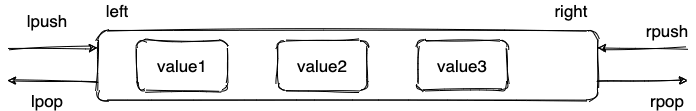

# Redis 数据库

**Redis 就是一个使用 C 语言开发的数据库**，不过与传统数据库不同的是 **Redis 的数据是存在内存中的** ，也就是它是内存数据库，所以读写速度非常快，因此 Redis 被广泛应用于缓存方向。

另外，**Redis 除了做缓存之外，也经常用来做分布式锁，甚至是消息队列。**

**Redis 提供了多种数据类型来支持不同的业务场景。Redis 还支持事务 、持久化、Lua 脚本、多种集群方案。**

## 分布式缓存常见的技术选型方案有哪些？

分布式缓存的话，使用的比较多的主要是 **Memcached** 和 **Redis**。不过，现在基本没有看过还有项目使用 **Memcached** 来做缓存，都是直接用 **Redis**。

Memcached 是分布式缓存最开始兴起的那会，比较常用的。后来，随着 Redis 的发展，大家慢慢都转而使用更加强大的 Redis 了。

分布式缓存主要解决的是单机缓存的容量受服务器限制并且无法保存通用信息的问题。因为，本地缓存只在当前服务里有效，比如如果你部署了两个相同的服务，他们两者之间的缓存数据是无法共同的。

## 说一下 Redis 和 Memcached 的区别和共同点

现在公司一般都是用 Redis 来实现缓存，而且 Redis 自身也越来越强大了！不过，了解 Redis 和 Memcached 的区别和共同点，有助于我们在做相应的技术选型的时候，能够做到有理有据！

**共同点** ：

1. 都是基于内存的数据库，一般都用来当做缓存使用。
2. 都有过期策略。
3. 两者的性能都非常高。

**区别** ：

1. **Redis 支持更丰富的数据类型（支持更复杂的应用场景）**。Redis 不仅仅支持简单的 k/v 类型的数据，同时还提供 list，set，zset，hash 等数据结构的存储。Memcached 只支持最简单的 k/v 数据类型。
2. **Redis 支持数据的持久化，可以将内存中的数据保持在磁盘中，重启的时候可以再次加载进行使用,而 Memcached 把数据全部存在内存之中。**
3. **Redis 有灾难恢复机制。** 因为可以把缓存中的数据持久化到磁盘上。
4. **Redis 在服务器内存使用完之后，可以将不用的数据放到磁盘上。但是，Memcached 在服务器内存使用完之后，就会直接报异常。**
5. **Memcached 没有原生的集群模式，需要依靠客户端来实现往集群中分片写入数据；但是 Redis 目前是原生支持 cluster 模式的。**
6. **Memcached 是多线程，非阻塞 IO 复用的网络模型；Redis 使用单线程的多路 IO 复用模型。** （Redis 6.0 引入了多线程 IO ）
7. **Redis 支持发布订阅模型、Lua 脚本、事务等功能，而 Memcached 不支持。并且，Redis 支持更多的编程语言。**
8. **Memcached 过期数据的删除策略只用了惰性删除，而 Redis 同时使用了惰性删除与定期删除。**

相信看了上面的对比之后，我们已经没有什么理由可以选择使用 Memcached 来作为自己项目的分布式缓存了。

## 缓存数据的处理流程是怎样的？

简单来说就是:

1. 如果用户请求的数据在缓存中就直接返回。
2. 缓存中不存在的话就看数据库中是否存在。
3. 数据库中存在的话就更新缓存中的数据。
4. 数据库中不存在的话就返回空数据。

## 为什么要用 Redis/为什么要用缓存？

简单来说使用缓存主要是为了提升用户体验以及应对更多的用户。

### 高性能 

我们设想这样的场景：

假如用户第一次访问数据库中的某些数据的话，这个过程是比较慢，毕竟是从硬盘中读取的。但是，如果说，用户访问的数据属于高频数据并且不会经常改变的话，那么我们就可以很放心地将该用户访问的数据存在缓存中。

**这样有什么好处呢？** 那就是保证用户下一次再访问这些数据的时候就可以直接从缓存中获取了。操作缓存就是直接操作内存，所以速度相当快。

不过，要保持数据库和缓存中的数据的一致性。 如果数据库中的对应数据改变的之后，同步改变缓存中相应的数据即可！

### 高并发

一般像 MySQL 这类的数据库的 QPS 大概都在 1w 左右（4 核 8g） ，但是使用 Redis 缓存之后很容易达到 10w+，甚至最高能达到 30w+（就单机 redis 的情况，redis 集群的话会更高）。

> QPS（Query Per Second）：服务器每秒可以执行的查询次数；

由此可见，直接操作缓存能够承受的数据库请求数量是远远大于直接访问数据库的，所以我们可以考虑把数据库中的部分数据转移到缓存中去，这样用户的一部分请求会直接到缓存这里而不用经过数据库。进而，我们也就提高了系统整体的并发。

## Redis 除了做缓存，还能做什么？

- **分布式锁** ： 通过 Redis 来做分布式锁是一种比较常见的方式。通常情况下，我们都是基于 Redisson 来实现分布式锁。相关阅读：[《分布式锁中的王者方案 - Redisson》](https://mp.weixin.qq.com/s/CbnPRfvq4m1sqo2uKI6qQw)。
- **限流** ：一般是通过 Redis + Lua 脚本的方式来实现限流。相关阅读：[《我司用了 6 年的 Redis 分布式限流器，可以说是非常厉害了！》](https://mp.weixin.qq.com/s/kyFAWH3mVNJvurQDt4vchA)。
- **消息队列** ：Redis 自带的 list 数据结构可以作为一个简单的队列使用。Redis5.0 中增加的 Stream 类型的数据结构更加适合用来做消息队列。它比较类似于 Kafka，有主题和消费组的概念，支持消息持久化以及 ACK 机制。
- **复杂业务场景** ：通过 Redis 以及 Redis 扩展（比如 Redisson）提供的数据结构，我们可以很方便地完成很多复杂的业务场景比如通过 bitmap 统计活跃用户、通过 sorted set 维护排行榜。

## Redis 常见数据结构以及使用场景分析

### string

1. **介绍** ：string 数据结构是简单的 key-value 类型。虽然 Redis 是用 C 语言写的，但是 Redis 并没有使用 C 的字符串表示，而是自己构建了一种 **简单动态字符串**（simple dynamic string，**SDS**）。相比于 C 的原生字符串，Redis 的 SDS 不光可以保存文本数据还可以保存二进制数据，并且获取字符串长度复杂度为 O(1)（C 字符串为 O(N)）,除此之外，Redis 的 SDS API 是安全的，不会造成缓冲区溢出。
2. **常用命令：** `set,get,strlen,exists,decr,incr,setex` 等等。
3. **应用场景：** 一般常用在需要计数的场景，比如用户的访问次数、热点文章的点赞转发数量等等。

下面我们简单看看它的使用！

普通字符串的基本操作：

```bash
127.0.0.1:6379> set key value #设置 key-value 类型的值
OK
127.0.0.1:6379> get key # 根据 key 获得对应的 value
"value"
127.0.0.1:6379> exists key  # 判断某个 key 是否存在
(integer) 1
127.0.0.1:6379> strlen key # 返回 key 所储存的字符串值的长度。
(integer) 5
127.0.0.1:6379> del key # 删除某个 key 对应的值
(integer) 1
127.0.0.1:6379> get key
(nil)
```

批量设置 :

```bash
127.0.0.1:6379> mset key1 value1 key2 value2 # 批量设置 key-value 类型的值
OK
127.0.0.1:6379> mget key1 key2 # 批量获取多个 key 对应的 value
1) "value1"
2) "value2"
```

计数器（字符串的内容为整数的时候可以使用）：

```bash
127.0.0.1:6379> set number 1
OK
127.0.0.1:6379> incr number # 将 key 中储存的数字值增一
(integer) 2
127.0.0.1:6379> get number
"2"
127.0.0.1:6379> decr number # 将 key 中储存的数字值减一
(integer) 1
127.0.0.1:6379> get number
"1"
```

过期（默认为永不过期）：

```bash
127.0.0.1:6379> expire key  60 # 数据在 60s 后过期
(integer) 1
127.0.0.1:6379> setex key 60 value # 数据在 60s 后过期 (setex:[set] + [ex]pire)
OK
127.0.0.1:6379> ttl key # 查看数据还有多久过期
(integer) 56
```

### list

1. **介绍** ：**list** 即是 **链表**。链表是一种非常常见的数据结构，特点是易于数据元素的插入和删除并且可以灵活调整链表长度，但是链表的随机访问困难。许多高级编程语言都内置了链表的实现比如 Java 中的 **LinkedList**，但是 C 语言并没有实现链表，所以 Redis 实现了自己的链表数据结构。Redis 的 list 的实现为一个 **双向链表**，即可以支持反向查找和遍历，更方便操作，不过带来了部分额外的内存开销。
2. **常用命令:** `rpush,lpop,lpush,rpop,lrange,llen`等。
3. **应用场景:** 发布与订阅或者说消息队列、慢查询。

下面我们简单看看它的使用！

通过 `rpush/lpop` 实现队列：

```bash
127.0.0.1:6379> rpush myList value1 # 向 list 的头部（右边）添加元素
(integer) 1
127.0.0.1:6379> rpush myList value2 value3 # 向list的头部（最右边）添加多个元素
(integer) 3
127.0.0.1:6379> lpop myList # 将 list的尾部(最左边)元素取出
"value1"
127.0.0.1:6379> lrange myList 0 1 # 查看对应下标的list列表， 0 为 start,1为 end
1) "value2"
2) "value3"
127.0.0.1:6379> lrange myList 0 -1 # 查看列表中的所有元素，-1表示倒数第一
1) "value2"
2) "value3"
```

通过 `rpush/rpop` 实现栈：

```bash
127.0.0.1:6379> rpush myList2 value1 value2 value3
(integer) 3
127.0.0.1:6379> rpop myList2 # 将 list的头部(最右边)元素取出
"value3"
```

我专门画了一个图方便小伙伴们来理解：



通过 `lrange` 查看对应下标范围的列表元素：

```bash
127.0.0.1:6379> rpush myList value1 value2 value3
(integer) 3
127.0.0.1:6379> lrange myList 0 1 # 查看对应下标的list列表， 0 为 start,1为 end
1) "value1"
2) "value2"
127.0.0.1:6379> lrange myList 0 -1 # 查看列表中的所有元素，-1表示倒数第一
1) "value1"
2) "value2"
3) "value3"
```

通过 `lrange` 命令，你可以基于 list 实现分页查询，性能非常高！

**通过 `llen` 查看链表长度：**

```bash
127.0.0.1:6379> llen myList
(integer) 3
```

### hash

1. **介绍** ：hash 类似于 JDK1.8 前的 HashMap，内部实现也差不多(数组 + 链表)。不过，Redis 的 hash 做了更多优化。另外，hash 是一个 string 类型的 field 和 value 的映射表，**特别适合用于存储对象**，后续操作的时候，你可以直接仅仅修改这个对象中的某个字段的值。 比如我们可以 hash 数据结构来存储用户信息，商品信息等等。
2. **常用命令：** `hset,hmset,hexists,hget,hgetall,hkeys,hvals` 等。
3. **应用场景:** 系统中对象数据的存储。

下面我们简单看看它的使用！

```bash
127.0.0.1:6379> hmset userInfoKey name "guide" description "dev" age "24"
OK
127.0.0.1:6379> hexists userInfoKey name # 查看 key 对应的 value中指定的字段是否存在。
(integer) 1
127.0.0.1:6379> hget userInfoKey name # 获取存储在哈希表中指定字段的值。
"guide"
127.0.0.1:6379> hget userInfoKey age
"24"
127.0.0.1:6379> hgetall userInfoKey # 获取在哈希表中指定 key 的所有字段和值
1) "name"
2) "guide"
3) "description"
4) "dev"
5) "age"
6) "24"
127.0.0.1:6379> hkeys userInfoKey # 获取 key 列表
1) "name"
2) "description"
3) "age"
127.0.0.1:6379> hvals userInfoKey # 获取 value 列表
1) "guide"
2) "dev"
3) "24"
127.0.0.1:6379> hset userInfoKey name "GuideGeGe" # 修改某个字段对应的值
127.0.0.1:6379> hget userInfoKey name
"GuideGeGe"
```

### set

1. **介绍 ：** set 类似于 Java 中的 `HashSet` 。Redis 中的 set 类型是一种无序集合，集合中的元素没有先后顺序。当你需要存储一个列表数据，又不希望出现重复数据时，set 是一个很好的选择，并且 set 提供了判断某个成员是否在一个 set 集合内的重要接口，这个也是 list 所不能提供的。可以基于 set 轻易实现交集、并集、差集的操作。比如：你可以将一个用户所有的关注人存在一个集合中，将其所有粉丝存在一个集合。Redis 可以非常方便的实现如共同关注、共同粉丝、共同喜好等功能。这个过程也就是求交集的过程。
2. **常用命令：** `sadd,spop,smembers,sismember,scard,sinterstore,sunion` 等。
3. **应用场景:** 需要存放的数据不能重复以及需要获取多个数据源交集和并集等场景

下面我们简单看看它的使用！

```bash
127.0.0.1:6379> sadd mySet value1 value2 # 添加元素进去
(integer) 2
127.0.0.1:6379> sadd mySet value1 # 不允许有重复元素
(integer) 0
127.0.0.1:6379> smembers mySet # 查看 set 中所有的元素
1) "value1"
2) "value2"
127.0.0.1:6379> scard mySet # 查看 set 的长度
(integer) 2
127.0.0.1:6379> sismember mySet value1 # 检查某个元素是否存在set 中，只能接收单个元素
(integer) 1
127.0.0.1:6379> sadd mySet2 value2 value3
(integer) 2
127.0.0.1:6379> sinterstore mySet3 mySet mySet2 # 获取 mySet 和 mySet2 的交集并存放在 mySet3 中
(integer) 1
127.0.0.1:6379> smembers mySet3
1) "value2"
```

### sorted set

1. **介绍：**和 set 相比，sorted set 增加了一个权重参数 score，使得集合中的元素能够按 score 进行有序排列，还可以通过 score 的范围来获取元素的列表。有点像是 Java 中 HashMap 和 TreeSet 的结合体。
2. **常用命令：** `zadd,zcard,zscore,zrange,zrevrange,zrem` 等。
3. **应用场景：** 需要对数据根据某个权重进行排序的场景。比如在直播系统中，实时排行信息包含直播间在线用户列表，各种礼物排行榜，弹幕消息（可以理解为按消息维度的消息排行榜）等信息。

```bash
127.0.0.1:6379> zadd myZset 3.0 value1 # 添加元素到 sorted set 中 3.0 为权重
(integer) 1
127.0.0.1:6379> zadd myZset 2.0 value2 1.0 value3 # 一次添加多个元素
(integer) 2
127.0.0.1:6379> zcard myZset # 查看 sorted set 中的元素数量
(integer) 3
127.0.0.1:6379> zscore myZset value1 # 查看某个 value 的权重
"3"
127.0.0.1:6379> zrange  myZset 0 -1 # 顺序输出某个范围区间的元素，0 -1 表示输出所有元素
1) "value3"
2) "value2"
3) "value1"
127.0.0.1:6379> zrange  myZset 0 1 # 顺序输出某个范围区间的元素，0 为 start  1 为 stop
1) "value3"
2) "value2"
127.0.0.1:6379> zrevrange  myZset 0 1 # 逆序输出某个范围区间的元素，0 为 start  1 为 stop
1) "value1"
2) "value2"
```

### bitmap

1. **介绍：** bitmap 存储的是连续的二进制数字（0 和 1），通过 bitmap, 只需要一个 bit 位来表示某个元素对应的值或者状态，key 就是对应元素本身 。我们知道 8 个 bit 可以组成一个 byte，所以 bitmap 本身会极大的节省储存空间。
2. **常用命令：** `setbit` 、`getbit` 、`bitcount`、`bitop`
3. **应用场景：** 适合需要保存状态信息（比如是否签到、是否登录...）并需要进一步对这些信息进行分析的场景。比如用户签到情况、活跃用户情况、用户行为统计（比如是否点赞过某个视频）。

```bash
# SETBIT 会返回之前位的值（默认是 0）这里会生成 7 个位
127.0.0.1:6379> setbit mykey 7 1
(integer) 0
127.0.0.1:6379> setbit mykey 7 0
(integer) 1
127.0.0.1:6379> getbit mykey 7
(integer) 0
127.0.0.1:6379> setbit mykey 6 1
(integer) 0
127.0.0.1:6379> setbit mykey 8 1
(integer) 0
# 通过 bitcount 统计被被设置为 1 的位的数量。
127.0.0.1:6379> bitcount mykey
(integer) 2
```

针对上面提到的一些场景，这里进行进一步说明。

**使用场景一：用户行为分析** 很多网站为了分析你的喜好，需要研究你点赞过的内容。

```bash
# 记录你喜欢过 001 号小姐姐
127.0.0.1:6379> setbit beauty_girl_001 uid 1
```

**使用场景二：统计活跃用户**

使用时间作为 key，然后用户 ID 为 offset，如果当日活跃过就设置为 1

那么我该如何计算某几天/月/年的活跃用户呢(暂且约定，统计时间内只要有一天在线就称为活跃)，有请下一个 redis 的命令

```bash
# 对一个或多个保存二进制位的字符串 key 进行位元操作，并将结果保存到 destkey 上。
# BITOP 命令支持 AND 、 OR 、 NOT 、 XOR 这四种操作中的任意一种参数
BITOP operation destkey key [key ...]
```

初始化数据：

```bash
127.0.0.1:6379> setbit 20210308 1 1
(integer) 0
127.0.0.1:6379> setbit 20210308 2 1
(integer) 0
127.0.0.1:6379> setbit 20210309 1 1
(integer) 0
```

统计 20210308~20210309 总活跃用户数: 1

```bash
127.0.0.1:6379> bitop and desk1 20210308 20210309
(integer) 1
127.0.0.1:6379> bitcount desk1
(integer) 1
```

统计 20210308~20210309 在线活跃用户数: 2

```bash
127.0.0.1:6379> bitop or desk2 20210308 20210309
(integer) 1
127.0.0.1:6379> bitcount desk2
(integer) 2
```

**使用场景三：用户在线状态**

对于获取或者统计用户在线状态，使用 bitmap 是一个节约空间且效率又高的一种方法。

只需要一个 key，然后用户 ID 为 offset，如果在线就设置为 1，不在线就设置为 0。

### Redis 单线程模型详解

**Redis 基于 Reactor 模式来设计开发了自己的一套高效的事件处理模型** （Netty 的线程模型也基于 Reactor 模式，Reactor 模式不愧是高性能 IO 的基石），这套事件处理模型对应的是 Redis 中的文件事件处理器（file event handler）。由于文件事件处理器（file event handler）是单线程方式运行的，所以我们一般都说 Redis 是单线程模型。

**既然是单线程，那怎么监听大量的客户端连接呢？**

Redis 通过**IO 多路复用程序** 来监听来自客户端的大量连接（或者说是监听多个 socket），它会将感兴趣的事件及类型（读、写）注册到内核中并监听每个事件是否发生。

这样的好处非常明显： **I/O 多路复用技术的使用让 Redis 不需要额外创建多余的线程来监听客户端的大量连接，降低了资源的消耗**（和 NIO 中的 `Selector` 组件很像）。

另外， Redis 服务器是一个事件驱动程序，服务器需要处理两类事件：1. 文件事件; 2. 时间事件。

时间事件不需要多花时间了解，我们接触最多的还是 **文件事件**（客户端进行读取写入等操作，涉及一系列网络通信）。

《Redis 设计与实现》有一段话是如是介绍文件事件的，我觉得写得挺不错。

> Redis 基于 Reactor 模式开发了自己的网络事件处理器：这个处理器被称为文件事件处理器（file event handler）。文件事件处理器使用 I/O 多路复用（multiplexing）程序来同时监听多个套接字，并根据套接字目前执行的任务来为套接字关联不同的事件处理器。
>
> 当被监听的套接字准备好执行连接应答（accept）、读取（read）、写入（write）、关 闭（close）等操作时，与操作相对应的文件事件就会产生，这时文件事件处理器就会调用套接字之前关联好的事件处理器来处理这些事件。
>
> **虽然文件事件处理器以单线程方式运行，但通过使用 I/O 多路复用程序来监听多个套接字**，文件事件处理器既实现了高性能的网络通信模型，又可以很好地与 Redis 服务器中其他同样以单线程方式运行的模块进行对接，这保持了 Redis 内部单线程设计的简单性。

可以看出，文件事件处理器（file event handler）主要是包含 4 个部分：

- 多个 socket（客户端连接）
- IO 多路复用程序（支持多个客户端连接的关键）
- 文件事件分派器（将 socket 关联到相应的事件处理器）
- 事件处理器（连接应答处理器、命令请求处理器、命令回复处理器）


## 缓存穿透

**缓存穿透**：指查询一个一定不存在的数据，由于缓存是不命中时需要从数据库查询，查不到数据则不写入缓存，这将导致这个不存在的数据每次请求都要到数据库去查询，进而给数据库带来压力。

> 通俗点说，读请求访问时，缓存和数据库都没有某个值，这样就会导致每次对这个值的查询请求都会穿透到数据库，这就是缓存穿透。

缓存穿透一般都是这几种情况产生的：

- **业务不合理的设计**，比如大多数用户都没开守护，但是你的每个请求都去缓存，查询某个userid查询有没有守护。
- **业务/运维/开发失误的操作**，比如缓存和数据库的数据都被误删除了。
- **黑客非法请求攻击**，比如黑客故意捏造大量非法请求，以读取不存在的业务数据。

**如何避免缓存穿透呢？** 一般有三种方法。

- 1.如果是非法请求，我们在 API 入口，对参数进行校验，过滤非法值。
- 2.如果查询数据库为空，我们可以给缓存设置个空值，或者默认值。但是如有有写请求进来的话，需要更新缓存哈，以保证缓存一致性，同时，最后给缓存设置适当的过期时间。（业务上比较常用，简单有效）
- 3.使用布隆过滤器快速判断数据是否存在。即一个查询请求过来时，先通过布隆过滤器判断值是否存在，存在才继续往下查。

> 布隆过滤器原理：它由初始值为0的位图数组和N个哈希函数组成。一个对一个key进行N个hash算法获取N个值，在比特数组中将这N个值散列后设定为1，然后查的时候如果特定的这几个位置都为1，那么布隆过滤器判断该key存在。

## 缓存雪奔

**缓存雪奔：**指缓存中存在大批量过期的数据，同时查询请求量又非常大，请求都直接访问数据库，引起数据库压力过大甚至宕机。

- 缓存雪奔一般是由于大量数据**同时过期**造成的，对于这个原因，可通过均匀设置过期时间解决，即让过期时间相对离散一点。如采用一个较大固定值+一个较小的随机值，5 小时 +0 到 1800 秒酱紫。
- Redis 故障宕机也可能引起缓存雪奔。这就需要构造 Redis 高可用集群啦。

## 缓存击穿

**缓存击穿：**指热点 key 在某个时间点过期的时候，而恰好在这个时间点对这个 Key 有大量的并发请求过来，从而大量的请求打到 db。

缓存击穿看着有点像缓存雪崩，其实它两区别是，缓存雪奔是指数据库压力过大甚至 down 机，缓存击穿只是大量并发请求到了 DB 数据库层面。可以认为击穿是缓存雪奔的一个子集吧。有些文章认为它俩区别，是区别在于击穿针对某一热点 key 缓存，雪奔则是很多 key。

解决方案就有两种：

- **1.使用互斥锁方案**。缓存失效时，不是立即去加载 db 数据，而是先使用某些带成功返回的原子操作命令，如(Redis 的 setnx）去操作，成功的时候，再去加载 db 数据库数据和设置缓存。否则就去重试获取缓存。
- **2. “永不过期”**，是指没有设置过期时间，但是热点数据快要过期时，异步线程去更新和设置过期时间。

## 数据库和缓存一致性问题

- 写请求指更新数据库，不写入缓存，因为写入的数据有可能不是热点数据，但是读的数据大概率可以认为是热点数据

- 读请求才将数据写入缓存

### 缓存利用率

写入的缓存中的数据都设置失效时间，这样随着时间的推移，数据会被逐渐的淘汰掉，只留下热点数据，从而使缓存利用率最大化

### 一致性问题

发生更新操作时，需要两个步骤，即更新数据库和操作缓存。这两个步骤得同时成功，任何一个步骤失败都会导致一致性问题。操作缓存有两种：更新缓存和删除缓存。根据操作缓存的类型和数据，有如下四种策略：

1. 更新数据库、更新缓存：并发写会出现 ABBA 的问题，从而导致一致性问题

2. 更新缓存、更新数据库：并发写会出现 ABBA 的问题，从而导致一致性问题

3. 更新数据库、删除缓存：(推荐) 读写并发缓存中不存在的值时会出现 ABBA 问题，A 读，B 写，但是这种情况发生的概率非常的小，因为写数据库比读数据库慢，也就是说 A，B 同时执行时，执行写操作的 B 通常情况下会在 A 执行完成之后完成。但是在集群模式下仍然会出现一致性问题(主从复制延迟的问题)，解决的办法：延时删除或者两次删除，两次删除就是在更新完数据库，删除缓存之后，过一段事件之后在一次删除缓存。延时删除就是发送一个延时消息给消息中间件

4. 删除缓存、更新数据库: 读写并发会出现 ABAB 问题，A 写，B 读

上面的策略，无论哪个操作，只要第二步执行失败都会导致数据一致性的问题，因此如何保证第二步能够成功执行时关键。在先更新数据库在删除缓存的情况下，如何保证删除缓存能够正确执行是关键。

通常的做法是将删除缓存的操作交给消息中间件进行处理，消息中间件的好处就是：

- **消息队列保证消息的可靠性**：写到消息队列中的消息在成功消费之前不会丢失
- **消息队列保证消息能够被成功消费**：下游从队列中拉取消息，成功消费之后才会删除消息，否则还会继续投递给消费者

另外一种方式是订阅数据库的变更日志，然后根据对应的变更日志操作缓存

在读写分离 + 主从复制 + 更新数据库 + 删除缓存的的模式下，依然会出现一致性问题：

1. 线程 A 更新主库 X = 2（原值 X = 1）
2. 线程 A 删除缓存
3. 线程 B 查询缓存，没有命中，查询从库得到旧值（从库 X = 1）
4. 从库同步完成（主从库 X = 2）
5. 线程 B 将旧值写入缓存（X = 1）

解决方法：**缓存延迟双删策略**

#### 参考文章

- [缓存和数据库一致性问题，看这篇就够了](http://kaito-kidd.com/2021/09/08/how-to-keep-cache-and-consistency-of-db/) --> 推荐阅读