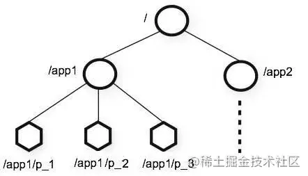
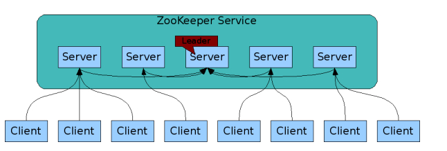
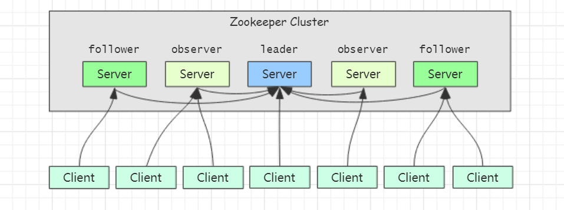
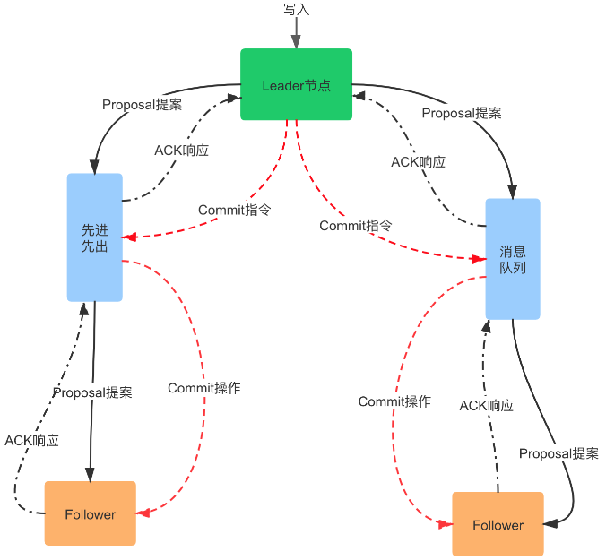

# 集群和分布式

集群：多台机器提供相同的服务

分布式：将一个服务拆分成多个子服务部署在不同的机器上，子服务间协同合作，从而提供一个完整服务

# 什么是 ZooKeeper

ZooKeeper 是一个开源的分布式协调服务。ZooKeeper 的设计目标是将那些复杂且容易出错的分布式一致性服务封装起来，构成一个高效可靠的原语集，并以一系列简单易用的接口提供给用户使用。

ZooKeeper 是一个典型的 __分布式数据一致性解决方案__，分布式应用程序可以基于 ZooKeeper 实现诸如数据发布/订阅、负载均衡、命名服务、分布式协调/通知、集群管理、Master 选举、分布式锁和分布式队列等功能。

ZooKeeper 一个最常用的使用场景就是用于担任服务生产者和服务消费者的注册中心。


# ZooKeeper 的一些重要概念

* ZooKeeper  本身就是一个分布式程序（只要半数以上节点存活，ZooKeeper  就能正常服务）。

* 为了保证高可用，最好是以集群形态来部署 ZooKeeper，这样只要集群中大部分机器是可用的（能够容忍一定的机器故障），那么 ZooKeeper 本身仍然是可用的。

* ZooKeeper  将数据保存在内存中，这也就保证了 高吞吐量和低延迟（但是内存限制了能够存储的容量不太大，此限制也是保持 ZNode 中存储的数据量较小的进一步原因）。

* ZooKeeper 是高性能的。 在“读”多于“写”的应用程序中尤其地高性能，因为“写”会导致所有的服务器间同步状态。（“读”多于“写”是协调服务的典型场景。）

* ZooKeeper 有临时节点的概念。 当创建临时节点的客户端会话一直保持活动，瞬时节点就一直存在。而当会话终结时，瞬时节点被删除。持久节点是指一旦这个 ZNode 被创建了，除非主动进行 ZNode 的移除操作，否则这个ZNode 将一直保存在 ZooKeeper 上。

<!---->

* Zookeeper 实现的是 CAP 理论中的 CP，即：分区容忍性和一致性

ZooKeeper 底层其实只提供了两个功能：

1. __管理（存储、读取）用户程序提交的数据__
2. __为用户程序提交数据节点监听服务。__

## Session 会话

Session 指的是 ZooKeeper  服务器与客户端会话。__在 ZooKeeper 中，一个客户端连接是指客户端和服务器之间的一个 TCP 长连接__。客户端启动的时候，首先会与服务器建立一个 TCP 连接，从第一次连接建立开始，客户端会话的生命周期也开始了。__通过这个连接，客户端能够通过 心跳检测 与服务器保持有效的会话，也能够向ZooKeeper 服务器发送请求并接受响应，同时还能够通过该连接接收来自服务器的 Watch 事件通知。__ Session的 `sessionTimeout` 值用来设置一个客户端会话的超时时间。当由于服务器压力太大、网络故障或是客户端主动断开连接等各种原因导致客户端连接断开时，__只要在 `sessionTimeout` 规定的时间内能够重新连接上集群中任意一台服务器，那么之前创建的会话仍然有效。__

在为客户端创建会话之前，服务端首先会为每个客户端都分配一个 sessionID。由于 sessionID 是 Zookeeper 会话的一个重要标识，许多与会话相关的运行机制都是基于这个 sessionID 的，因此，__无论是哪台服务器为客户端分配的 sessionID，都务必保证全局唯一__。

## ZNode 节点

在 ZooKeeper 中，“节点"分为两类:

* 第一类同样是指构成集群的机器，我们称之为 __机器节点__；
* 第二类则是指数据模型中的数据单元，我们称之为 __数据节点__ 一一 ZNode。

所谓的 ZNode 节点其实是将内存划分为大小不超过 1M 的块，每一个块就是一个 ZNode

ZNode 默认能够存储的最大数据容量是： 1 MB, 由于存储的数据量非常小，因此 ZooKeeper 只适合存储配置信息，不适合存储海量的数据

ZooKeeper 将所有数据存储在内存中，数据模型是一棵树（ZNode Tree)，由斜杠 `/` 进行分割的路径，就是一个ZNode，例如 `/foo/path1`, 表示存在两个数据节点：`foo` 和 `path1`，但是 `path1` 节点是 `foo` 节点的子节点。每个节点上都会保存自己的数据内容，同时还会保存一系列属性信息。

在 ZooKeeper 中，node 可以分为 __持久节点和临时节点两类__。所谓持久节点是指一旦这个 ZNode 被创建了，除非主动进行 ZNode 的移除操作，否则这个 ZNode 将一直保存在 ZooKeeper 上。而临时节点就不一样了，它的 __生命周期和客户端会话绑定__，一旦客户端会话失效，那么这个客户端创建的所有临时节点都会被移除。另外，ZooKeeper 还允许用户为每个节点添加一个特殊的属性：__SEQUENTIAL__. 一旦节点被标记上这个属性，那么在这个节点被创建的时候，ZooKeeper 会自动在其节点名后面追加上一个整型数字，这个整型数字是一个由父节点维护的自增数字。

## Stat 版本

ZooKeeper 的每个 ZNode 上都会存储数据，对应于每个 ZNode，ZooKeeper 都会为其维护一个叫作 __Stat__ 的数据结构，Stat 中记录了这个 ZNode 的三个数据版本:

* dataVersion: 当前 ZNode 的版本,每次进行 set 操作版本都会 `+1`
* cversion: 当前 ZNode 子节点的版本，当子节点有变化时 `+1`
* aclVersion: 当前 ZNode 的 ACL(Access Control List 访问控制列表) 版本。

版本信息主要用于进行分布式数据的一致性, 使用版本号来阻止并行操作的不一致性

## Watcher

Watcher（事件监听器），是 ZooKeeper 中的一个很重要的特性。ZooKeeper 允许用户在指定节点上注册一些Watcher，并且在一些特定事件触发的时候，ZooKeeper 服务端会将事件通知到感兴趣的客户端上去，该机制是ZooKeeper 实现分布式协调服务的重要特性。

## ZooKeeper 角色

* leader：为客户端提供写服务，负责进行投票的发起和决议，更新系统状态，事务请求的唯一调度和处理者
* follower：为客户端提供读服务，参与投票，包括 事务提议请求：proposal 投票和 leader 选举投票，接收客户端请求，为客户端返回结果
* observer：为客户端提供读服务，不参与任何投票，包括事务提议请求：proposal 投票和 leader 选举投票，同步 leader 的状态，加快读写速度

## ACL

ZooKeeper 采用 ACL（Access Control Lists）策略来进行权限控制，类似于 UNIX 文件系统的权限控制。ZooKeeper 定义了如下5种权限:

* create: 创建子节点的权限
* read: 获取节点数据和子节点列表的权限
* write: 更新节点数据的权限
* delete: 删除子节点的权限
* admin: 设置节点 ACL 的权限

# ZooKeeper 特点

* 顺序一致性：从同一客户端发起的事务请求，最终将会严格地按照顺序被应用到 ZooKeeper 中去。

* 原子性：所有事务请求的处理结果在整个集群中所有机器上的应用情况是一致的，也就是说，要么整个集群中所有的机器都成功应用了某一个事务，要么都没有应用。

* 单一系统映像：无论客户端连到哪一个 ZooKeeper 服务器上，其看到的服务端数据模型都是一致的。

* 可靠性：一旦一次更改请求被应用，更改的结果就会被持久化，直到被下一次更改覆盖

# ZooKeeper 设计目标

## 简单的数据模型

ZooKeeper 允许分布式进程通过共享的 __层次结构命名空间__ 进行相互协调，这与标准文件系统类似。 名称空间由 ZooKeeper 中的数据寄存器组成 - 称为 ZNode，这些类似于文件和目录。 与为存储设计的典型文件系统不同，ZooKeeper __数据保存在内存中__，这意味着 ZooKeeper 可以实现高吞吐量和低延迟。



## 可构建集群

为了保证高可用，最好是以集群形态来部署 ZooKeeper，这样只要集群中大部分机器是可用的（能够容忍一定的机器故障），那么 ZooKeeper 本身仍然是可用的。 客户端在使用 ZooKeeper 时，需要知道集群机器列表，通过与集群中的某一台机器建立 TCP 连接来使用服务，客户端使用这个 TCP 链接来发送请求、获取结果、获取监听事件以及发送心跳包。如果这个连接异常断开了，客户端可以连接到另外的机器上。

__ZooKeeper 官方提供的架构图：__



上图中每一个 Server 代表一个安装 ZooKeeper 服务的服务器。组成 ZooKeeper 服务的服务器都会在内存中维护当前的服务器状态，并且每台服务器之间都互相保持着通信。__集群间通过 ZAB 协议（ZooKeeper Atomic Broadcast）来保持数据的一致性。__

## 顺序访问

对于来自客户端的每个更新请求，ZooKeeper 都会分配一个全局唯一的递增编号，这个编号反应了所有事务操作的先后顺序，应用程序可以使用 ZooKeeper 这个特性来实现更高层次的同步原语。 这个编号也叫做时间戳 —— `zxid`（ZooKeeper Transaction Id）

## 高性能

ZooKeeper 是高性能的。 在“读”多于“写”的应用程序中尤其地高性能，因为“写”会导致所有的服务器间同步状态。（“读”多于“写”是协调服务的典型场景。）

# ZooKeeper 管理集群

__ZooKeeper 有这样一个特性：集群中只要有过半的机器是正常工作的，那么整个集群对外就是可用的__

通常 3 台服务器就可以构成一个  ZooKeeper  集群了。

## 为什么最好使用奇数台服务器构成 ZooKeeper 集群?

我们知道在 ZooKeeper 中 Leader 选举算法采用了 Zab 协议。Zab 核心思想是当多数 Server 写成功，则任务数据写成功。

所谓的 ZooKeeper 容错是指，当宕掉几个 ZooKeeper 服务器之后，剩下的个数必须大于宕掉的个数，也就是剩下的服务数必须大于 n/2 ，ZooKeeper 才可以继续使用，__无论奇偶数都可以选举 leader__ 。5 台机器最多宕掉 2 台，还可以继续使用，因为剩下 3 台大于 5/2 。说为什么最好为奇数个，是在以最大容错服务器个数的条件下，会节省资源，比如，最大容错为 2 的情况下，对应的 ZooKeeper 服务数，奇数为 5，而偶数为 6，也就是 6 个 ZooKeeper 服务的情况下最多能宕掉 2 个服务，所以从节约资源的角度看，没必要部署 6（偶数）个ZooKeeper 服务。

1. 如果有 3 个 Server，则最多允许 1 个 Server 挂掉。

2. 如果有 4 个 Server，则同样最多允许 1 个 Server 挂掉。

既然 3 个或者 4 个 Server，同样最多允许 1 个 Server 挂掉，那么它们的可靠性是一样的，所以选择奇数个 ZooKeeper Server 即可，这里选择 3 个 Server。

## ZooKeeper 集群角色介绍

最典型集群模式： Master/Slave 模式（主备模式）。在这种模式中，通常 Master 服务器作为主服务器提供写服务，其他的 Slave 服务器从服务器通过异步复制的方式获取 Master 服务器最新的数据提供读服务。

但是，在 ZooKeeper 中没有选择传统的  Master/Slave 概念，而是引入了 Leader、Follower 和 Observer 三种角色



* ZooKeeper 集群中的所有机器通过一个 Leader 选举过程来选定一台称为 “Leader” 的机器，Leader 既可以为客户端提供写服务又能提供读服务。
* 除了 Leader 外，Follower 和  Observer 都只能提供读服务。
* Follower 和  Observer 唯一的区别在于 Observer 机器不参与 Leader 的选举过程，也不参与写操作的“过半写成功”策略，因此 Observer 机器可以在不影响写性能的情况下提升集群的读性能。

## ZAB 协议和 Paxos 协议

Paxos 算法应该可以说是 ZooKeeper 的灵魂了。但是，ZooKeeper 并没有完全采用 Paxos 算法 ，而是使用 ZAB 协议作为其保证数据一致性的核心算法。另外，在 ZooKeeper 的官方文档中也指出，ZAB 协议并不像 Paxos 算法那样是一种通用的分布式一致性算法，它是一种特别为 ZooKeeper 设计的崩溃可恢复的原子消息广播算法。

### ZAB 介绍

ZAB（ZooKeeper Atomic Broadcast 原子广播） 协议是为分布式协调服务 ZooKeeper 专门设计的一种支持崩溃恢复的原子广播协议。 在 ZooKeeper 中，主要依赖 ZAB 协议来实现分布式数据一致性，基于该协议，ZooKeeper 实现了一种主备模式的系统架构来保持集群中各个副本之间的数据一致性。

### ZAB 协议两种基本的模式：崩溃恢复和消息广播

ZAB 协议包括两种基本的模式，分别是 __崩溃恢复和消息广播__。

当整个服务框架在启动过程中，或是当 Leader 服务器出现网络中断、崩溃退出与重启等异常情况时，ZAB 协议就会进人恢复模式并选举产生新的 Leader 服务器。当选举产生了新的 Leader 服务器，同时集群中已经有过半的机器与该 Leader 服务器完成了状态同步之后，ZAB 协议就会退出恢复模式。其中，所谓的状态同步是指数据同步，用来保证集群中存在过半的机器能够和 Leader 服务器的数据状态保持一致。

当集群中已经有过半的 Follower 服务器完成了和 Leader 服务器的状态同步，那么整个服务框架就可以进人消息广播模式了。 当一台同样遵守 ZAB 协议的服务器启动后加人到集群中时，如果此时集群中已经存在一个 Leader 服务器在负责进行消息广播，那么新加人的服务器就会自觉地进人数据恢复模式：找到 Leader 所在的服务器，并与其进行数据同步，然后一起参与到消息广播流程中去。正如上文介绍中所说的，ZooKeeper 设计成只允许唯一的一个 Leader 服务器来进行事务请求的处理。Leader 服务器在接收到客户端的事务请求后，会生成对应的事务提案并发起一轮广播协议；而如果集群中的其他机器接收到客户端的事务请求，那么这些非 Leader 服务器会首先将这个事务请求转发给 Leader 服务器。

# ZooKeeper 工作流程



既然是集群模式，那集群中各个节点的数据一致性就成了问题，而 ZooKeeper 的工作原理恰好能保证了他集群内节点的数据一致性。具体流程如下：

1. 客户端一般有两种请求，读和写。follower 只处理读请求，leader 只处理写请求。follower 如果接收到写请求会转发给 leader。
2. leader 接收到写请求，把这个写请求当成一个事务，然后包装成一个提议（proposal），发送给所有的 follower 这个提议，说：“我要改数据了，你们怎么看”。
3. follower 接收到 leader 发送的提议，如果本身没问题，同意修改数据，那就发送给 leader 确认 ack：“我们没问题”。
4. leader 收到 __半数以上__ 的 follower 的确认 ack 后，就先提交自身的事务，然后给所有的 follower 发送 commit 消息告诉他们：“既然没问题我就提交事务了，你们也抓紧提交吧，才能保证数一致。”
5. follower 收到 commit 消息后，就执行并提交自身事务，保证数据一致，再回复一个 ack 给 leader 表示 事务执行 OK。

# ZooKeeper 应用场景

## 数据发布/订阅：

ZooKeeper 根据 Watcher 的使用来实现服务端和客户端之间的 push 和 pull。

ZooKeeper 采用的是 push 和 pull 相结合的⽅式：客户端向服务端注册自己需要关注的节点，⼀旦该节点的数据发生变更，那么服务端就会向相应的客户端发送 Watcher 事件通知，客户端接收到这个消息通知之后，需要主动到服务端获取最新的数据。

## 命名服务

给分布式中的实体命名，命名全局唯一，相当于一个唯一 ID，可以采用 ZooKeeper 的顺序节点来实现。用 create() 创建顺序节点会递增。

## 集群管理

包含集群监控和集群控制，比如一个日志采集系统，可以利用 ZooKeeper 的节点这种机制，一个节点当成收集器，节点下有很多个日志源节点待收集，Watcher 又能很好的监控。以此实现整体的日志节点的整体管控。

## Master选举

分布式系统中常见的 master 选举怎么实现呢，一是可以利用数据库的主键唯一性，多个机器去创建主键 id，只有一个能创建成功，创建成功就是 master。

二是使用 ZooKeeper 的特性，ZooKeeper 会保证客户端无法重复创建一个已经存在的节点，即 ZooKeeper 的强一致性，可以用多个客户端来创建，谁创建成功就是 master，其他没创建成功的在父节点上注册 watcher，一旦 master 挂掉就重新选举。

## 分布式锁

实现方式一般有三种：

1. 关系型数据库实现分布式锁，利用字段的唯一性约束，要锁住资源是，多个线程同时创建一条数据，用相同的字段名，只有一条会创建成功，就获得锁，处理完逻辑，释放锁时就删除数据库的这条记录。

2. 基于缓存实现分布式锁。

3. 基于 ZooKeeper 实现分布式锁。

   * ZooKeeper - 排他锁：所有客户端在一个节点下创建一个 lock 节点，名字相同，只有一个创建成功，即获得锁。

   * ZooKeeper - 共享锁：在 ZooKeeper 中实现共享锁的思路。

   * 羊群效应：如果客户端太多，ZooKeeper 在字节列表发生删除时，会发送大量通知给客户端，影响性能。

## 分布式队列

FIFO 队列：ZooKeeper 怎么实现先进先出队列呢？ 同一节点下创建顺序节点即可，客户端判断自己的顺序节点是不是当前最小的，是就执行。

Barrier 分布式屏障：即指定队列必须达到一定的数量后再统一安排进行，那 ZooKeeper 怎么实现呢？在一个节点的数据内容存在一个数量，多客户端在这个节点下创建子节点，根据 watcher 读取节点编号，当子节点的数量达到这个数量时才进行安排执行（ getData() 办法可以获取节点数据内容）。

## 负载均衡

ZooKeeper 也是可以实现负载均衡的：简直无所不能。

这里重点说一下 ZooKeeper 的负载均衡的 __实现思想__：

ZooKeeper 上面会注册有多个服务端，客户端获取 ZooKeeper 上的服务节点数量，本地记录一个 index 脚标变量，记录一下当前调用的是第几个序号发服务器，下次加一，进行调用即可实现最基本的 __轮询__ 的 __负载均衡__。

# Leader 选举机制

首先看目前集群中是否存在 leader，如果有就不进行选举，如果没有就在正常工作的机器中进行选举。其中涉及几个概念：

- SID： 服务器 ID。用来唯一标识一台集群中的服务器，每台机器不能重复，和 Myid 一致
- ZXID： 事务 ID。 ZXID 是一种事物 ID，用来标识一台服务器状态的变更。在某一时刻，集群中的每台服务器的 ZXID 不一定完全一致，这个 ZooKeeper 服务器对于客户端 “更新请求” 的处理逻辑有关
- Epoch： 每个 Leader 的任期的代号。没有 leader 时，同一轮投票过程中的逻辑时钟值是相同的。每投完一次票这个数据就会增加

比较的顺序是： Epoch --> ZXID --> SID, 数值大的胜出

# Znode 节点信息说明

```shell
cZxid = 0x100000002
ctime = Tue Apr 05 03:43:41 UTC 2022
mZxid = 0x100000002
mtime = Tue Apr 05 03:43:41 UTC 2022
pZxid = 0x100000002
cversion = 0
dataVersion = 0
aclVersion = 0
ephemeralOwner = 0x0
dataLength = 6
numChildren = 0
```

- cZxid: 创建该 ZNode节 点的事务 ID
- ctime：ZNode 节点被创建的时间，为从 1970 年开始毫秒数
- mZxid： Znode 最后更新的事务 Id
- mtime：ZNode 最后修改的时间，为从 1970 年开始的毫秒数
- pZxid：当前 ZNode 最后更新子节点的 Zxid
- cversion：子节点的变化号，当前 ZNode 子节点修改的次数 
- dataVersion：当前 Znode 的数据变化号
- aclVersion：ZNode 访问控制列表的变化号
- ephemeralOwner：如果是临时节点，那么就是连接当前 ZNode 节点的 Session ID， 如果不是临时节点就是 0 
- dataLength：ZNode 的数据长度
- numChildren：ZNode 子节点的数量

# ZooKeeper 可实现的功能

## 服务器的动态上下线

注意：在 ZooKeeper 上注册服务的服务器和 APP 客户端相对于 ZooKeeper 来说都是 ZooKeeper 的客户端，只不过是注册服务的服务器会在 ZooKeeper 上创建节点，而 APP 客户端是读取或者更新相关的节点

通常注册服务的服务器创建的是临时的节点，因为提供服务的服务器挂掉之后就需要自动的从 ZooKeeper 中删除

只需要在  ZooKeeper 创建相关的节点, 如：

`/servers/server1 `、`/servers/server2`... 客户端连接相关的节点如：`/servers/server1`  

## 分布式锁

1. 多个客户端在同一个节点下创建带序号的节点， 如：`/locks/....`，每个节点监听前一个节点
2. 判断自己是否是序号最小的节点，是的话就执行
3. 执行完之后删除对应的节点

# 参考文献

* [万字带你入门Zookeeper](https://juejin.cn/post/6844904045283377165#comment)(极力推荐，写的非常好)

* [可能是把 ZooKeeper 概念讲的最清楚的一篇文章](https://juejin.cn/post/6844903677367418893)

