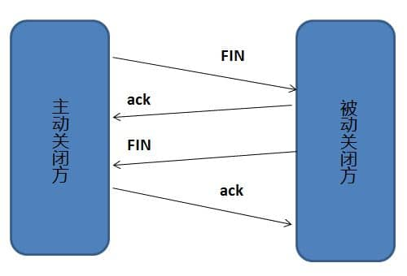

# TCP 三次握手和四次握挥手

## 为什么要三次握手

**三次握手的目的是建立可靠的通信信道，说到通讯，简单来说就是数据的发送与接收，而三次握手最主要的目的就是双方确认自己与对方的发送与接收是正常的。**

第一次握手：Client 什么都不能确认；Server 确认了对方发送正常，自己接收正常

第二次握手：Client 确认了：自己发送、接收正常，对方发送、接收正常；Server 确认了：对方发送正常，自己接收正常

第三次握手：Client 确认了：自己发送、接收正常，对方发送、接收正常；Server 确认了：自己发送、接收正常，对方发送、接收正常

所以三次握手就能确认双方收发功能都正常，缺一不可

### 第 2 次握手传回了 ACK，为什么还要传回 SYN？

接收端传回发送端所发送的 ACK 是为了告诉客户端，我接收到的信息确实就是你所发送的信号了，这表明从客户端到服务端的通信是正常的。而回传 SYN 则是为了建立并确认从服务端到客户端的通信。”

> SYN 同步序列编号(Synchronize Sequence Numbers) 是 TCP/IP 建立连接时使用的握手信号。在客户机和服务器之间建立正常的 TCP 网络连接时，客户机首先发出一个 SYN 消息，服务器使用 SYN-ACK 应答表示接收到了这个消息，最后客户机再以 ACK(Acknowledgement）消息响应。这样在客户机和服务器之间才能建立起可靠的 TCP 连接，数据才可以在客户机和服务器之间传递。

> 一句话，主要防止已经失效的连接请求报文突然又传送到了服务器，从而产生错误。
>
> 如果使用的是两次握手建立连接，假设有这样一种场景，客户端发送了第一个请求连接并且没有丢失，只是因为在网络结点中滞留的时间太长了，由于TCP的客户端迟迟没有收到确认报文，以为服务器没有收到，此时重新向服务器发送这条报文，此后客户端和服务器经过两次握手完成连接，传输数据，然后关闭连接。此时此前滞留的那一次请求连接，网络通畅了到达了服务器，这个报文本该是失效的，但是，两次握手的机制将会让客户端和服务器再次建立连接，这将导致不必要的错误和资源的浪费。
>
> 如果采用的是三次握手，就算是那一次失效的报文传送过来了，服务端接受到了那条失效报文并且回复了确认报文，但是客户端不会再次发出确认。由于服务器收不到确认，就知道客户端并没有请求连接。

## 为什么要四次挥手

断开一个 TCP 连接则需要“四次挥手”：

- 客户端-发送一个 FIN，用来关闭客户端到服务器的数据传送
- 服务器-收到这个 FIN，它发回一 个 ACK，确认序号为收到的序号加 1 。和 SYN 一样，一个 FIN 将占用一个序号
- 服务器-关闭与客户端的连接，发送一个 FIN 给客户端
- 客户端-发回 ACK 报文确认，并将确认序号设置为收到序号加 1

任何一方都可以在数据传送结束后发出连接释放的通知，待对方确认后进入半关闭状态。当另一方也没有数据再发送的时候，则发出连接释放通知，对方确认后就完全关闭了 TCP 连接。

举个例子：A 和 B 打电话，通话即将结束后，A 说“我没啥要说的了”，B 回答“我知道了”，但是 B 可能还会有要说的话，A 不能要求 B 跟着自己的节奏结束通话，于是 B 可能又巴拉巴拉说了一通，最后 B 说“我说完了”，A 回答“知道了”，这样通话才算结束。

### 为什么建立连接是三次握手，关闭连接确是四次挥手呢？

建立连接的时候，服务器在 LISTEN 状态下，收到建立连接请求的 SYN 报文后，把 ACK 和 SYN 放在一个报文里发送给客户端。而关闭连接时，服务器收到对方的 FIN 报文时，仅仅表示对方不再发送数据了但是还能接收数据，而自己也未必全部数据都发送给对方了，所以己方可以立即关闭，也可以发送一些数据给对方后，再发送FIN报文给对方来表示同意现在关闭连接，因此，己方 ACK 和 FIN 一般都会分开发送，从而导致多了一次。

### TCP 三次握手的目的是什么？为什么不用两次和四次？

TCP 三次握手的主要目的是防止失效的连接请求报文被服务端接受

如果只有两次握手，假设当客户端发送第一次连接请求由于网络拥塞的原因，迟迟未到服务端，客户端没接收到确认报文，认为服务端没有收到，于是重新发送请求报文并与服务端建立连接，等这次连接断开了，之前滞留的那个请求报文又到达了服务端，就会让服务端与客户端再次连接成功，这时服务端就会一直等待客户端发送请求，造成了资源的浪费。

**两次握手只能保证单向链路是可以通信的**，理论上来说，要保证双向链路可以通信需要四次握手，但实际上服务端给客户端的 SYN 和 ACK 数据包可以合为一次握手，所以实际上只需要三次握手即可。

### 加问：那挥手为什么需要四次呢？三次不行吗？

答：挥手阶段中服务端的 ACK 和 FIN 数据包不能合为一次。因为挥手阶段的流程为客户端发送 FIN 数据包表示自己发完了，服务端立即回复 ACK 数据包表示自己知道了，此时客户端到服务端的连接已经释放了，客户端不会再发送数据了，但服务端还可以继续向客户端发送数据，等到服务端也完成了数据发送，才会发送 FIN，这时客户端回复 ACK，就可以结束通信了。

### 加问：TCP 在四次挥手的过程中为什么客户端最后还要等待 2MSL(Maximum Segment Lifetime)？

答：因为客户端要保证他的 ACK 包顺利到达服务端，如果客户端的 ACK 数据包丢失，则服务端或重新发送 FIN 包到客户端，而这两个过程的最长时间为 1MSL，加起来为 2MSL，如果 2MSL 后客户端还没有收到服务端重发的 FIN 包，则说明 ACK 包顺利到达，可以关闭连接了。

### TCP 在握手阶段怎么管理客户端的连接？

TCP 在握手阶段服务端维护了两个队列：半连接队列和全连接队列

在客户端发起第一次握手时，服务端会把此请求放入半连接队列，并回复 SYN+ACK，在客户端回复 ACK，也就是第三次握手时，服务端将此连接加入到全连接队列，如果全连接队列满，则服务端的处理方式和 tcp_abort_on_overflow 参数的设置有关，如果该参数为 0，则丢弃该 ACK，如果为 1 则发送 RST 到客户端，直接放弃此次连接。此条是我在了解 DDOS 时发现的，并非常考点，SYN Flood 攻击时会造成服务端的半连接队列被占满，从而影响到服务。

### TCP 通过哪些方式来保证数据的可靠性？

TCP 保证数据可靠性的方式大致可以分为三类：

- 在数据包层面：校验和
- 在数据包传输层面：序列号、确认应答、超时重传

- 在流量控制层面：拥塞控制

#### 校验和

计算方式：在数据传输的过程中，将发送的数据段都当做一个 16 位的整数。将这些整数加起来。并且加上进位，最后取反，得到校验和。TCP 与 UDP 校验方式相同

#### 序列号、确认应答、超时重传

在数据包传输的过程中，每个数据包都有一个序列号，当数据到达接收方时，接收方会发出一个确认应答，表示收到该数据包，并会说明下一次需要接收到的数据包序列号(32 位确认序列号)。如果发送端在一段时间内(2RTT 没有收到确认应答，则说明可能是发送的数据包丢失或者确认应答包丢失，此时发送端会进行数据包重传。

但发送端并不是一定要等到接收到上一个数据包的确认应答再发送下一个数据包，TCP 会利用窗口控制来提高传输速度，在一个发送窗口大小内，不用一定要等到应答才能发送下一段数据，发送窗口大小就是无需等待确认而可以继续发送数据的最大值。而发送窗口的大小是由接收端的接受窗口的剩余大小和拥塞窗口来决定的。(TCP 会话的双方都各自维护一个发送窗口和一个接收窗口)

### 拥塞控制

发送端维持一个叫做拥塞窗口 cwnd（congestion window）的状态变量。拥塞窗口的大小取决于网络的拥塞程度，并且动态地在变化。发送端让自己的发送窗口等于拥塞窗口，另外考虑到接受方的接收能力，发送窗口可能小于拥塞窗口。

TCP 的拥塞控制主要是采用慢启动以及增性加，乘性减的机制，TCP 一开始将拥塞窗口设置的很小，在逐渐经过一段时间的指数增长后超过门限，进入增性加阶段，此时窗口大小的增长是线性的，比之前的指数增长要慢很多，而当发生网络拥塞时，拥塞窗口大小直接减半（乘性减）。

### TCP 长连接和短连接有什么区别？

TCP 短连接是指客户端与服务端连接后只进行一次读写就关闭连接，一般是客户端关闭。而长连接则是指在进行完一次读写后不关闭连接，直到服务端压力过大则选择关闭一些长时间未进行读写的连接。

TCP 短连接的优点在于管理简单，而且不会对服务端造成太大的压力，而缺点是每次读写都需要连接耗时较长。

TCP 长连接的优点是可以迅速进行多次读写，缺点是对服务端压力大，且容易被恶意连接影响服务。

长短连接的区别就在于客户端和服务端选择的关闭策略不同，具体需要根据应用场景来选择合适的策略。

### TCP 粘包、拆包及解决方法？

TCP 之所以会产生粘包和拆包拆包问题，是因为他本身就是一种字节流协议，TCP 本身就没有数据包的概念，需要发送和接受的数据是没有格式的，以字节流的形式传输，而在传输过程中会被分割为一段段数据块，也就是报文。TCP 要发送的数据会被先放置在数据缓冲区，接收数据也是从缓冲区获取，而缓冲区的大小即为最大报文长度，如果需要发送的数据长度大于缓冲区剩余的大小或者大于最大报文长度，则会出现拆包，如果是需要发送的数据很少，而短时间内又有其他数据包需要发送，就会出现粘包的现象。

解决方案有很多种，可以在数据包头加上数据包长度，或者把每个数据包封装为固定长度，不够则补 0，以及可以使用特定分割符号等等

我们在项目中也遇到过这种问题，因为我们在做流量检测的时候，有时候难以找到恶意软件的流量特征，会把数据包长度当做特征来使用，有些恶意软件内部无论会把这些数据包长度写死，这样恶意软件本身就不存在有无法解析粘包和拆包的情况，但对于我们来说，检测就会遇到障碍，尤其是攻击者可以设置 MSS 来使得数据包长度改变，对于这种攻击我们目前也没有很好的方案来解决。

# 状态码

| 状态码  | 描述                                                         |
| ------- | ------------------------------------------------------------ |
| 100-199 | 信息状态码                                                   |
| 200-299 | 请求成功状态码                                               |
| 300-399 | 重定向状态码                                                 |
| 400-499 | 客户端错误状态码，服务端无法处理客户端发送的请求(如请求的资源不存在) |
| 500-599 | 服务端错误状态码，服务器处理请求出错(资源存在但是处理过程中，服务器出错) |

# Cookie 的作用是什么? 和 Session 有什么区别？

Cookie 和 Session 都是用来跟踪浏览器用户身份的会话方式，但是两者的应用场景不太一样。

**Cookie 一般用来保存用户信息** 比如 ① 我们在 Cookie 中保存已经登录过的用户信息，下次访问网站的时候页面可以自动帮你把登录的一些基本信息给填了；② 一般的网站都会有保持登录，也就是说下次你再访问网站的时候就不需要重新登录了，这是因为用户登录的时候我们可以存放了一个 Token 在 Cookie 中，下次登录的时候只需要根据 Token 值来查找用户即可(为了安全考虑，重新登录一般要将 Token 重写)；③ 登录一次网站后访问网站其他页面不需要重新登录。**Session 的主要作用就是通过服务端记录用户的状态。** 典型的场景是购物车，当你要添加商品到购物车的时候，系统不知道是哪个用户操作的，因为 HTTP 协议是无状态的。服务端给特定的用户创建特定的 Session 之后就可以标识这个用户并且跟踪这个用户了。

Cookie 数据保存在客户端(浏览器端)，Session 数据保存在服务器端。

Cookie 存储在客户端中，而 Session 存储在服务器上，相对来说 Session 安全性更高。如果要在 Cookie 中存储一些敏感信息，不要直接写入 Cookie 中，最好能将 Cookie 信息加密，然后使用到的时候再去服务器端解密。

# URI 和 URL 的区别是什么?

- URI(Uniform Resource Identifier) 是统一资源标志符，可以唯一标识一个资源。
- URL(Uniform Resource Locator) 是统一资源定位符，可以提供该资源的路径。它是一种具体的 URI，即 URL 可以用来标识一个资源，而且还指明了如何 locate 这个资源。

URI 的作用像身份证号一样，URL 的作用更像家庭住址一样。URL 是一种具体的 URI，它不仅唯一标识资源，而且还提供了定位该资源的信息。

# 网址访问过程

### 全过程简要概述

当我们将网址输入到浏览器后，第一件事就是解析 url 得到域名，通过 DNS 协议 获取到该域名的 ip 地址，得到 ip 后浏览器会先与服务器通过 TCP 三次握手建立连接，然后构建 HTTP 请求，将 HTTP 的传输工作交给操作系统的协议栈，发送请求成功后，浏览器会从服务端拿到该页面的 HTML 以及资源文件，浏览器会 渲染页面，呈现出我们所看到的模样。

在这整个过程中，涉及到了 DNS 解析，http请求，TCP\IP 协议栈、页面渲染等知识，当然也可以继续扩展，比如从 HTTP 可以说到 HTTPS，可以说到对称加密与非对称加密，可以说到网络安全等等，主要目的就是让整个面试过程跟着你的技术栈走，而不被面试官带到你不会的地方。

在这里我将重点写一下我在面试中喜欢拓展的方向，并拟出一份答案。

### DNS 解析

浏览器在拿到 url 时，首先会对 url 进行解析，将域名与实际的文件路径分离，然后需要使用 DNS 协议，通过域名得到 IP 地址。

首先浏览器会查询浏览器缓存，如果有这个网址就可以直接获取到 IP，如果没有就进一步访问本机缓存，如果本机缓存也没有才会发起 DNS 请求。

而 DNS 的服务器是一个树状结构，对于域名来说是倒着进行解析的，根节点是根 DNS 服务器，他的子节点为 com、cn 这种顶级域 dns 服务器，然后进一步向下进行解析。

以 baidu.com 为例，当我们的电脑需要发起 DNS 请求的时候，会先对根 DNS 服务器发起请求，这个服务器的 IP 地址一般在每台电脑上都有，我们一般会设置为 8.8.8.8 或者 114.114.114.114，我们的电脑在访问根 DNS 服务器后，会得到 com 域 DNS 服务器的 IP，然后会继续访问 com 域 DNS 服务器，这时就能得到 baicu.com 的 IP 地址了。

### HTTP 请求

在解析 url 时，我们能获取到需要请求资源的资源路径、端口号、请求参数等信息，这些信息会被存储在 http 头中，通过 DNS 请求获取到ip后，浏览器会构建并发送 HTTP 请求或者 HTTPS 请求，HTTPS 就是在 HTTP 的基础上加了一个 TLS 协议来进行数据加密，这个我们待会说。

HTTP 请求有很多种，但对资源的操作离不开增删改查，也就对应着 POST、DELETE、PUT、GET 请求。最常用的是 GET 和 POST，其区别在于 GET 的参数是在 url 中的，而 POST 的参数是在请求的 body 中。

以 GET 为例，当需要发送 HTTP 请求的时候，同样也不是直接就发送了，需要先查询浏览器缓存。浏览器中的缓存分为强缓存和协商缓存，浏览器发起 HTTP 请求时首先会根据 http 头信息来判断是否存有强缓存，以及其是否过期，如果有强缓存且未过期则命中，不会发送请求到服务器了。如果强缓存没命中，则会向服务器发起请求，这个请求的 Header 头中会带有浏览器最后一次请求该资源的时间和一个资源校验码(使用资源修改时间、资源大小等信息生成)，服务器收到这个请求后会判断协商缓存是否过期，如果过期则返回新的资源信息，如果没过期则返回 304 状态码，表示资源未更新，可以使用缓存中的资源。

### TCP->网络层连接

TCP 这一块内容比较多，所以一般不会在这个问题中详细说明，这里只写一个过渡段，想要了解 TCP 相关问题解答的可以看我的另一篇博客：TCP详解

HTTP 请求发出后会将数据包交给下层协议栈处理，在传输层和网络层该数据包会被分别加上 TCP 头和 IP 头，并且被发送出去，沿路的网关会收到这个数据包并进行识别和转发，直到该数据包被服务器收到，通过相同的流程返回回复数据包。

### 页面渲染

由于我对前端不熟悉，就不展开讲，被问到的话就说是通过写爬虫来了解 DOM 树的(挪威组)，前端只会简单的 Vue 开发，底层原理不了解

一般来说，浏览器第一次从服务器请求的资源都是一个 HTML 文件，例如服务端默认的 index.html 等，浏览器获取到这个 HTML 文件就会对其进行解析，构建出一棵 DOM 树，并通过执行其中的 js 代码发起更多的请求，请求渲染页面需要的其他资源，CSS 或者一些外链的图片等，拿到 CSS 后将其与 DOM 树结合进行更进一步的渲染，我们就能看到页面了。

### HTTPS

由于 HTTP 是使用信息明文传播，所以会有窃听、篡改、冒充等风险，所以 HTTPS 在 HTTP 的基础上加上了 SSL 层，通过加密的方式来保证数据安全。

SSL 通过加密防止窃听，通过签名来防止篡改，通过证书来防止冒充。HTTPS 协议在客户端与服务端开始通信前，会进行密钥协商，通过一轮非对称加密，一般是 RSA 加密来传递后序通信过程使用的对称密钥，由于非对称加密较慢，后续通信过程中使用对称加密。在密钥协商的过程中，服务端会将自己的证书发送给客户端，客户端会到 CA 机构通过摘要值验证证书的合法性，从而防止中间人攻击。

补充提问：你对中间人攻击有哪些了解？

中间人攻击主要分为 SSL 劫持攻击、SSL 剥离攻击以及针对 SSL 算法的攻击

SSL 劫持攻击即 SSL 证书欺骗攻击，攻击者为了获得 HTTPS 传输的明文数据，需要先将自己接入到客户端和目标网站之间；在传输过程中伪造服务器的证书，将服务器的公钥替换成自己的公钥，这样中间人就可以解密客户端和服务端的数据传输内容。可以通过在网站前端加入证书校验来预防 SSL 劫持攻击。

SSL 剥离攻击，即将 HTTPS 连接降级到 HTTP 连接。假如客户端直接访问 HTTPS 的 URL，攻击者是没办法直接进行降级的，该攻击方式主要是利用用户并不会每次都直接在浏览器上输入 https 来访问网站或者有些网站并非全网 HTTPS，中间人攻击者在劫持了客户端与服务端的 HTTP 会话后，将 HTTP 页面里面所有的 https:// 超链接都换成 http://，用户在点击相应的链接时，是使用 HTTP 协议来进行访问。可以通过在网站前端检查 URL 是否被篡改来预防 SSL 剥离攻击。

针对 SSL 算法的攻击：低版本的 SSL 协议是存在漏洞的，这些漏洞可能会被公共者利用，及时升级服务端的 SSL 配置可以预防针对 SSL 算法的攻击。

### 最终答案

浏览器在拿到 url 时，首先会对 url 进行解析，将域名与实际的文件路径分离，然后需要使用 DNS 协议，通过域名得到 IP 地址。浏览器会查询浏览器缓存，如果有这个网址的缓存就可以直接获取到 IP，如果没有就进一步访问本机缓存，如果本机缓存也没有才会发起 DNS 请求。而 DNS 的服务器是一个树状结构，对于域名来说是倒着进行解析的，根节点是根 DNS 服务器，他的子节点为 com、cn 这种顶级域名 dns 服务器，然后进一步向下进行解析。

以 baidu.com 为例，当我们的电脑需要发起 DNS 请求的时候，会先对根 DNS 服务器发起请求，这个服务器的 IP 地址一般在每台电脑上都有，我们一般会设置为 8.8.8.8 或者 114.114.114.114，我们的电脑在访问根 DNS 服务器后，会得到 con 域 DNS 服务器的 IP，然后会继续访问 con 域 DNS 服务器，这时就能得到 baicu.com 的 IP 地址了。

得到 ip 后浏览器会先与服务器通过 TCP 三次握手建立连接，然后构建 HTTP 请求。在解析 url 时，我们能获取到需要请求资源的资源路径、端口号、请求参数等信息，这些信息会被存储在 http 头中，通过 DNS 请求获取到 ip 后，浏览器会构建并发送 HTTP 请求或者 HTTPS 请求，HTTPS 就是在 HTTP 的基础上加了一个 TLS 协议来进行数据加密，这个我们待会说。

HTTP 请求有很多种，但对资源的操作离不开增删改查，也就对应着 POST、DELETE、PUT、GET 请求。最常用的是 GET 和 POST，其区别在于 GET 的参数是在 url 中的，而 POST 的参数是在请求的 body 中。

以 GET 为例，当需要发送 HTTP 请求的时候，同样也不是直接就发送了，需要先查询浏览器缓存。浏览器中的缓存分为强缓存和协商缓存，浏览器发起 HTTP 请求时首先会根据 http 头信息来判断是存有强缓存，以及其是否过期，如果有强缓存且未过期则命中，不会发送请求到服务器了。如果强缓存没命中，则会向服务器发起请求，这个请求的 Header 头中会带有浏览器最后一次请求该资源的时间和一个资源校验码(使用资源修改时间、资源大小等信息生成)，服务器收到这个请求后会判断协商缓存是否过期，如果过期则返回新的资源信息，如果没过期则返回 304 状态码，表示资源未更新，可以使用缓存中的资源。

HTTP 请求发出后会将数据包交给下层协议栈处理，在传输层和网络层该数据包会被分别加上 TCP 头和 IP 头，并且被发送出去，沿路的网关会收到这个数据包并进行识别和转发，直到该数据包被服务器收到，通过相同的流程返回回复数据包。

一般来说，浏览器第一次从服务器请求的资源都是一个 HTML 文件，例如服务端默认的 index.html 等，浏览器获取到这个 HTML 文件就会对其进行解析，构建出一棵DOM树，并通过执行其中的 js 代码发起更多的请求，请求渲染页面需要的其他资源，CSS 或者一些外链的图片等，拿到 CSS 后将其与 DOM 树结合进行更进一步的渲染，我们就能看到页面了。

最后再补充一下 HTTPS，由于 HTTP 是使用信息明文传播，所以会有窃听、篡改、冒充等风险，所以 HTTPS 在 HTTP 的基础上加上了 SSL 层，通过加密的方式来保证数据安全。

SSL 通过加密防止窃听，通过签名来防止篡改，通过证书来防止冒充。

HTTPS 协议在客户端与服务端开始通信前，会进行密钥协商，通过一轮非对称加密，一般是 RSA 加密来传递后序通信过程使用的对称密钥，由于非对称加密较慢，后续通信过程中使用对称加密。在密钥协商的过程中，服务端会将自己的证书发送给客户端，客户端会到 CA 机构通过摘要值验证证书的合法性，从而防止中间人攻击。

## 参考文献

- [两张动图-彻底明白TCP的三次握手与四次挥手](https://blog.csdn.net/qzcsu/article/details/72861891)
- [面试问题详解 - TCP](https://leetcode.cn/circle/discuss/aqTOW4/)
- [网址访问过程](https://leetcode.cn/circle/discuss/UrcaDQ/)

